# 编辑器扩展系统

<cite>
**本文引用的文件**
- [packages/editor/src/index.ts](file://packages/editor/src/index.ts)
- [packages/editor/src/editor/index.tsx](file://packages/editor/src/editor/index.tsx)
- [packages/editor/src/editor/kit.tsx](file://packages/editor/src/editor/kit.tsx)
- [packages/editor/src/editor/use-extension.ts](file://packages/editor/src/editor/use-extension.ts)
- [packages/editor/src/editor/build-in-extension.ts](file://packages/editor/src/editor/build-in-extension.ts)
- [packages/editor/src/editor/collaboration.tsx](file://packages/editor/src/editor/collaboration.tsx)
- [packages/editor/src/editor/ToC.tsx](file://packages/editor/src/editor/ToC.tsx)
- [packages/editor/src/components/toc/index.tsx](file://packages/editor/src/components/toc/index.tsx)
- [packages/editor/src/components/toc/style/index.module.less](file://packages/editor/src/components/toc/style/index.module.less)
- [packages/editor/src/extensions/index.ts](file://packages/editor/src/extensions/index.ts)
- [packages/editor/src/extensions/bookmark/bookmark.ts](file://packages/editor/src/extensions/bookmark/bookmark.ts)
- [packages/editor/src/extensions/bookmark/bookmark-view.tsx](file://packages/editor/src/extensions/bookmark/bookmark-view.tsx)
- [packages/editor/src/extensions/bookmark/menu/menu.tsx](file://packages/editor/src/extensions/bookmark/menu/menu.tsx)
- [packages/editor/src/extensions/bookmark/index.tsx](file://packages/editor/src/extensions/bookmark/index.tsx)
- [packages/editor/src/extensions/bookmark/README.md](file://packages/editor/src/extensions/bookmark/README.md)
- [packages/editor/src/extensions/title/title.ts](file://packages/editor/src/extensions/title/title.ts)
- [packages/editor/src/extensions/title/title-view.tsx](file://packages/editor/src/extensions/title/title-view.tsx)
- [packages/editor/src/extensions/title/index.ts](file://packages/editor/src/extensions/title/index.ts)
- [packages/common/src/core/PluginManager.ts](file://packages/common/src/core/PluginManager.ts)
- [packages/plugin-main/docs/COLLABORATION_API.md](file://packages/plugin-main/docs/COLLABORATION_API.md)
- [packages/plugin-main/src/pages/InviteCollaboration/index.tsx](file://packages/plugin-main/src/pages/InviteCollaboration/index.tsx)
- [packages/editor/src/utilities/index.ts](file://packages/editor/src/utilities/index.ts)
- [packages/editor/src/utilities/node.ts](file://packages/editor/src/utilities/node.ts)
- [packages/editor/src/utilities/position.ts](file://packages/editor/src/utilities/position.ts)
- [packages/editor/src/components/bubble-menu.tsx](file://packages/editor/src/components/bubble-menu.tsx)
- [packages/editor/src/extensions/bold/bold.ts](file://packages/editor/src/extensions/bold/bold.ts)
- [packages/editor/src/extensions/link/link.ts](file://packages/editor/src/extensions/link/link.ts)
- [packages/editor/src/extensions/table/table-kit.ts](file://packages/editor/src/extensions/table/table-kit.ts)
- [packages/editor/src/extensions/table-of-content/table-of-content.ts](file://packages/editor/src/extensions/table-of-content/table-of-content.ts)
- [packages/editor/src/extensions/heading/heading.ts](file://packages/editor/src/extensions/heading/heading.ts)
- [packages/editor/src/extensions/unique-id/unique-id.ts](file://packages/editor/src/extensions/unique-id/unique-id.ts)
- [packages/editor/src/extensions/perf/perf.ts](file://packages/editor/src/extensions/perf/perf.ts)
- [packages/editor/src/extensions/focus/focus.ts](file://packages/editor/src/extensions/focus/focus.ts)
- [packages/editor/src/extensions/trailing-node/trailing-node.ts](file://packages/editor/src/extensions/trailing-node/trailing-node.ts)
- [packages/editor/src/extensions/undo-redo/history.ts](file://packages/editor/src/extensions/undo-redo/history.ts)
- [packages/editor/src/extensions/collaboration-cursor/collaboration-cursor.ts](file://packages/editor/src/extensions/collaboration-cursor/collaboration-cursor.ts)
- [packages/editor/src/extensions/collaboration-cursor/index.ts](file://packages/editor/src/extensions/collaboration-cursor/index.ts)
- [packages/editor/src/styles/editor.css](file://packages/editor/src/styles/editor.css)
- [packages/editor/src/extensions/selection/selection.ts](file://packages/editor/src/extensions/selection/selection.ts)
- [packages/editor/src/extensions/info-panel/constants.ts](file://packages/editor/src/extensions/info-panel/constants.ts)
- [packages/editor/src/extensions/info-panel/info-panel.ts](file://packages/editor/src/extensions/info-panel/info-panel.ts)
- [packages/editor/src/extensions/info-panel/info-panel-view.tsx](file://packages/editor/src/extensions/info-panel/info-panel-view.tsx)
- [packages/editor/src/extensions/info-panel/menu/bubble.tsx](file://packages/editor/src/extensions/info-panel/menu/bubble.tsx)
- [packages/editor/src/extensions/info-panel/menu/static.tsx](file://packages/editor/src/extensions/info-panel/menu/static.tsx)
- [packages/editor/src/extensions/info-panel/index.tsx](file://packages/editor/src/extensions/info-panel/index.tsx)
- [packages/plugin-drawnix/src/extension/drawnix.ts](file://packages/plugin-drawnix/src/extension/drawnix.ts)
- [packages/plugin-file-manager/src/services/FileServiceImpl.ts](file://packages/plugin-file-manager/src/services/FileServiceImpl.ts)
- [packages/core/src/services/file-service.ts](file://packages/core/src/services/file-service.ts)
- [packages/common/src/core/types.ts](file://packages/common/src/core/types.ts)
- [packages/common/src/utils/logger.ts](file://packages/common/src/utils/logger.ts)
- [packages/common/src/event/event.ts](file://packages/common/src/event/event.ts)
- [packages/plugin-main/src/utils/event.ts](file://packages/plugin-main/src/utils/event.ts)
- [packages/core/src/ai/utils/editor-effects.ts](file://packages/core/src/ai/utils/editor-effects.ts)
- [packages/core/src/ai/tools/columns-tools.ts](file://packages/core/src/ai/tools/columns-tools.ts)
- [packages/editor/src/extensions/columns/column.tsx](file://packages/editor/src/extensions/columns/column.tsx)
- [packages/editor/src/extensions/columns/columns.tsx](file://packages/editor/src/extensions/columns/columns.tsx)
- [packages/editor/src/extensions/columns/utilities.ts](file://packages/editor/src/extensions/columns/utilities.ts)
- [packages/editor/src/extensions/columns/style/index.css](file://packages/editor/src/extensions/columns/style/index.css)
- [packages/editor/src/extensions/resizable-columns/resizable-columns.ts](file://packages/editor/src/extensions/resizable-columns/resizable-columns.ts)
- [packages/editor/src/extensions/resizable-columns/resizable-column.ts](file://packages/editor/src/extensions/resizable-columns/resizable-column.ts)
- [packages/editor/src/extensions/dragable/dragable.ts](file://packages/editor/src/extensions/dragable/dragable.ts)
</cite>

## 更新摘要
**所做更改**
- 新增编辑器效果工具增强（editor-effects.ts），提供滚动定位和文本选择功能
- 新增改进的列管理功能，支持嵌套列、深度跟踪和父路径管理
- 新增AI列工具集（columns-tools.ts），提供完整的列操作API
- 新增拖拽到列功能，支持可视化的列布局创建
- 新增可调整列宽功能，提供专业的列布局编辑体验
- 优化列扩展的性能缓存机制，提升渲染效率
- 新增列拖拽指示器动画效果，改善用户体验

## 目录
1. [引言](#引言)
2. [项目结构](#项目结构)
3. [核心组件](#核心组件)
4. [架构总览](#架构总览)
5. [详细组件分析](#详细组件分析)
6. [协作扩展集成](#协作扩展集成)
7. [节点选择可视化扩展](#节点选择可视化扩展)
8. [Callout扩展系统重构](#callout扩展系统重构)
9. [Bookmark扩展系统](#bookmark扩展系统)
10. [Title扩展系统](#title扩展系统)
11. [ToC功能重大改进](#toc功能重大改进)
12. [编辑器效果工具增强](#编辑器效果工具增强)
13. [列管理功能改进](#列管理功能改进)
14. [拖拽到列功能](#拖拽到列功能)
15. [可调整列宽功能](#可调整列宽功能)
16. [AI列工具集](#ai列工具集)
17. [外部扩展参数支持](#外部扩展参数支持)
18. [扩展memoization优化](#扩展memoization优化)
19. [扩展清理机制](#扩展清理机制)
20. [日志管理系统](#日志管理系统)
21. [依赖关系分析](#依赖关系分析)
22. [性能考虑](#性能考虑)
23. [故障排查指南](#故障排查指南)
24. [结论](#结论)
25. [附录：自定义扩展开发指南](#附录自定义扩展开发指南)

## 引言
本技术文档面向编辑器扩展系统的开发者与维护者，系统性阐述编辑器扩展的架构设计、扩展注册与生命周期管理、依赖注入机制、扩展工具包的实现方式、钩子与状态管理、以及扩展工具函数（DOM 操作、位置计算、事件处理）的作用与实践。特别关注最新的协作扩展集成、节点选择可视化增强、Callout扩展的重大重构、Bookmark扩展系统的引入、Title扩展的封面图片功能、ToC功能的重大改进、编辑器效果工具增强、列管理功能改进、拖拽到列功能、可调整列宽功能、AI列工具集、扩展memoization优化、清理机制、日志管理系统和externalExtensions参数支持的重大增强，帮助快速实现文本格式化、特殊节点插入与交互功能。

## 项目结构
编辑器扩展系统主要由以下层次构成：
- 导出层：统一导出编辑器能力、工具函数、钩子与第三方依赖，便于上层应用按需引入。
- 编辑器内核与工具：提供扩展解析、构建内置扩展集合、生成运行时扩展集的能力；封装通用工具函数与 UI 组件。
- 扩展生态：以 TiPtap 扩展为核心，提供大量内置扩展与组合工具，支持插件化扩展装配。
- 协作扩展：集成实时协作功能，支持多用户编辑、光标同步和事务过滤，新增外部扩展同步机制和节点选择可视化。
- Callout扩展：全新的气泡信息面板扩展，提供七种类型的信息展示和丰富的自定义功能。
- Bookmark扩展：新增的书签扩展系统，提供富书签卡片功能，支持URL、标题、描述和预览图片。
- Title扩展：新增的标题扩展系统，提供封面图片功能，支持拖拽定位控制和文件服务集成。
- ToC功能：重大改进的目录功能，采用粘性定位、滑出动画和高亮闪烁效果。
- 编辑器效果工具：新增的滚动定位和文本选择工具，提供统一的编辑器操作接口。
- 列管理功能：改进的列布局系统，支持嵌套列、深度跟踪和父路径管理。
- 拖拽到列功能：可视化列布局创建，支持拖拽操作和智能指示器。
- 可调整列宽功能：专业的列宽调整工具，提供精确的布局控制。
- AI列工具集：完整的列操作API，支持AI代理的列管理需求。
- 清理机制：提供内存泄漏防护、资源释放和状态管理的完整生命周期。
- 日志管理：实施统一的日志管理系统，支持环境级别的日志级别控制，移除了生产环境中的调试输出。

```mermaid
graph TB
subgraph "导出层"
IDX["index.ts<br/>统一导出"]
END
subgraph "编辑器内核与工具"
KIT["kit.tsx<br/>扩展解析/构建"]
USEEXT["use-extension.ts<br/>编辑器扩展钩子"]
BUILTIN["build-in-extension.ts<br/>内置扩展集合"]
UTL_IDX["utilities/index.ts<br/>工具索引"]
UTL_NODE["utilities/node.ts<br/>节点工具"]
UTL_POS["utilities/position.ts<br/>位置计算"]
BMENU["components/bubble-menu.tsx<br/>气泡菜单"]
COLLAB["collaboration.tsx<br/>协作编辑器"]
CALLOUT["extensions/info-panel<br/>Callout扩展系统"]
BOOKMARK["extensions/bookmark<br/>书签扩展系统"]
TITLE["extensions/title<br/>标题扩展系统"]
TOC_NEW["editor/ToC.tsx<br/>改进的目录功能"]
LOGGER["utils/logger.ts<br/>统一日志管理"]
EFFECTS["ai/utils/editor-effects.ts<br/>编辑器效果工具"]
END
subgraph "扩展生态"
EXT_IDX["extensions/index.ts<br/>扩展索引"]
EXT_BOLD["extensions/bold/bold.ts<br/>加粗扩展"]
EXT_LINK["extensions/link/link.ts<br/>链接扩展"]
EXT_TABLE["extensions/table/table-kit.ts<br/>表格扩展组合"]
EXT_UID["extensions/unique-id/unique-id.ts<br/>唯一ID扩展"]
EXT_PERF["extensions/perf/perf.ts<br/>性能监控"]
EXT_NSC["extensions/collaboration-cursor/collaboration-cursor.ts<br/>节点选择光标扩展"]
EXT_COLUMNS["extensions/columns<br/>列管理扩展"]
EXT_DRAGABLE["extensions/dragable<br/>拖拽扩展"]
EXT_RESIZABLE["extensions/resizable-columns<br/>可调整列宽扩展"]
END
subgraph "清理机制"
EXT_FOCUS["extensions/focus/focus.ts<br/>焦点管理"]
EXT_TAIL["extensions/trailing-node/trailing-node.ts<br/>尾部节点"]
HISTORY["extensions/undo-redo/history.ts<br/>历史记录"]
END
subgraph "插件管理"
PM["common/PluginManager.ts<br/>插件管理器"]
PM_EXT["loadExternalPluginExtensions<br/>外部插件扩展加载"]
END
subgraph "协作API"
COLLAB_API["COLLABORATION_API.md<br/>协作邀请API"]
INVITE_PAGE["InviteCollaboration/index.tsx<br/>邀请页面实现"]
END
subgraph "文件服务集成"
FILE_SERVICE["plugin-file-manager<br/>文件服务实现"]
CORE_FILE_SERVICE["core/services/file-service.ts<br/>文件服务钩子"]
COMMON_TYPES["common/core/types.ts<br/>文件服务类型定义"]
END
subgraph "样式系统"
EDITOR_CSS["styles/editor.css<br/>编辑器样式"]
SELECTION_CSS["selection/selection.ts<br/>选择样式"]
COLUMN_CSS["extensions/columns/style/index.css<br/>列样式"]
END
subgraph "日志系统"
LOGGER_UTIL["common/utils/logger.ts<br/>日志工具"]
EVENT_LOGGER["common/event/event.ts<br/>事件日志"]
MAIN_EVENT_LOGGER["plugin-main/utils/event.ts<br/>主应用事件日志"]
END
subgraph "AI工具集"
COLUMNS_TOOLS["ai/tools/columns-tools.ts<br/>AI列工具集"]
END
IDX --> KIT
IDX --> USEEXT
IDX --> UTL_IDX
IDX --> BMENU
IDX --> COLLAB
KIT --> BUILTIN
USEEXT --> BUILTIN
USEEXT --> PM
USEEXT --> PM_EXT
USEEXT --> EXT_UID
USEEXT --> EXT_PERF
USEEXT --> EXT_NSC
USEEXT --> CALLOUT
USEEXT --> BOOKMARK
USEEXT --> TITLE
USEEXT --> EFFECTS
USEEXT --> COLUMNS_TOOLS
COLLAB --> EXT_FOCUS
COLLAB --> EXT_TAIL
COLLAB --> PM_EXT
COLLAB --> EXT_NSC
COLLAB --> CALLOUT
COLLAB --> BOOKMARK
COLLAB --> TITLE
COLLAB --> TOC_NEW
COLLAB --> EXT_COLUMNS
COLLAB --> EXT_DRAGABLE
COLLAB --> EXT_RESIZABLE
COLLAB_API --> INVITE_PAGE
PM --> KIT
PM --> USEEXT
PM_EXT --> COLLAB
FILE_SERVICE --> CORE_FILE_SERVICE
FILE_SERVICE --> COMMON_TYPES
CALLOUT --> EDITOR_CSS
CALLOUT --> SELECTION_CSS
BOOKMARK --> EDITOR_CSS
BOOKMARK --> SELECTION_CSS
TITLE --> FILE_SERVICE
TITLE --> EDITOR_CSS
TITLE --> SELECTION_CSS
EXT_NSC --> EDITOR_CSS
EXT_NSC --> SELECTION_CSS
EXT_COLUMNS --> COLUMN_CSS
EXT_DRAGABLE --> COLUMN_CSS
EXT_RESIZABLE --> COLUMN_CSS
TOC_NEW --> EDITOR_CSS
LOGGER_UTIL --> LOGGER
EVENT_LOGGER --> LOGGER
MAIN_EVENT_LOGGER --> LOGGER
COLUMNS_TOOLS --> EFFECTS
```

**图表来源**
- [packages/editor/src/index.ts](file://packages/editor/src/index.ts#L1-L23)
- [packages/editor/src/editor/kit.tsx](file://packages/editor/src/editor/kit.tsx#L1-L87)
- [packages/editor/src/editor/use-extension.ts](file://packages/editor/src/editor/use-extension.ts#L1-L64)
- [packages/editor/src/editor/build-in-extension.ts](file://packages/editor/src/editor/build-in-extension.ts#L1-L57)
- [packages/editor/src/editor/collaboration.tsx](file://packages/editor/src/editor/collaboration.tsx#L1-L208)
- [packages/common/src/core/PluginManager.ts](file://packages/common/src/core/PluginManager.ts#L440-L484)
- [packages/plugin-main/docs/COLLABORATION_API.md](file://packages/plugin-main/docs/COLLABORATION_API.md#L1-L806)
- [packages/plugin-main/src/pages/InviteCollaboration/index.tsx](file://packages/plugin-main/src/pages/InviteCollaboration/index.tsx#L515-L532)
- [packages/editor/src/extensions/collaboration-cursor/collaboration-cursor.ts](file://packages/editor/src/extensions/collaboration-cursor/collaboration-cursor.ts#L1-L230)
- [packages/editor/src/styles/editor.css](file://packages/editor/src/styles/editor.css#L73-L87)
- [packages/editor/src/extensions/selection/selection.ts](file://packages/editor/src/extensions/selection/selection.ts#L49-L75)
- [packages/editor/src/extensions/info-panel/index.tsx](file://packages/editor/src/extensions/info-panel/index.tsx#L1-L96)
- [packages/editor/src/extensions/bookmark/index.tsx](file://packages/editor/src/extensions/bookmark/index.tsx#L1-L15)
- [packages/editor/src/extensions/title/index.ts](file://packages/editor/src/extensions/title/index.ts#L1-L10)
- [packages/editor/src/editor/ToC.tsx](file://packages/editor/src/editor/ToC.tsx#L1-L180)
- [packages/plugin-file-manager/src/services/FileServiceImpl.ts](file://packages/plugin-file-manager/src/services/FileServiceImpl.ts#L1-L148)
- [packages/core/src/services/file-service.ts](file://packages/core/src/services/file-service.ts#L1-L35)
- [packages/common/src/core/types.ts](file://packages/common/src/core/types.ts#L1-L66)
- [packages/common/src/utils/logger.ts](file://packages/common/src/utils/logger.ts#L1-L62)
- [packages/common/src/event/event.ts](file://packages/common/src/event/event.ts#L1-L44)
- [packages/plugin-main/src/utils/event.ts](file://packages/plugin-main/src/utils/event.ts#L1-L44)
- [packages/core/src/ai/utils/editor-effects.ts](file://packages/core/src/ai/utils/editor-effects.ts#L1-L12)
- [packages/core/src/ai/tools/columns-tools.ts](file://packages/core/src/ai/tools/columns-tools.ts#L1-L616)
- [packages/editor/src/extensions/columns/column.tsx](file://packages/editor/src/extensions/columns/column.tsx#L1-L133)
- [packages/editor/src/extensions/columns/columns.tsx](file://packages/editor/src/extensions/columns/columns.tsx#L1-L130)
- [packages/editor/src/extensions/columns/utilities.ts](file://packages/editor/src/extensions/columns/utilities.ts#L1-L242)
- [packages/editor/src/extensions/columns/style/index.css](file://packages/editor/src/extensions/columns/style/index.css#L1-L191)
- [packages/editor/src/extensions/resizable-columns/resizable-columns.ts](file://packages/editor/src/extensions/resizable-columns/resizable-columns.ts#L1-L16)
- [packages/editor/src/extensions/resizable-columns/resizable-column.ts](file://packages/editor/src/extensions/resizable-columns/resizable-column.ts#L1-L5)
- [packages/editor/src/extensions/dragable/dragable.ts](file://packages/editor/src/extensions/dragable/dragable.ts#L1-L632)

**章节来源**
- [packages/editor/src/index.ts](file://packages/editor/src/index.ts#L1-L23)
- [packages/editor/src/editor/index.tsx](file://packages/editor/src/editor/index.tsx#L1-L7)

## 核心组件
- 扩展解析与构建
  - 解析扩展包装器数组，生成运行时扩展列表；支持合并内置扩展与插件扩展；支持斜杠菜单项收集与注入。
- 编辑器扩展钩子
  - 提供 useEditorExtension 钩子，基于上下文中的插件管理器与内置扩展，组装运行时扩展集，并可按名称过滤特定扩展。**新增externalExtensions参数支持外部扩展注入**。
- 协作扩展集成
  - 集成实时协作功能，包括协作扩展、光标同步和事务过滤，防止协作回写冲突。**支持外部扩展同步，确保协作双方使用一致的编辑器功能**。
  - **增强协作光标功能，支持头像显示和节点选择状态同步**。
- 内置扩展集合
  - 定义编辑器默认启用的扩展清单，覆盖常用格式化、交互与可视化能力。
- Callout扩展系统
  - **全新的气泡信息面板扩展，支持七种类型（default、info、success、warning、error、tip、bookmark）和丰富的自定义功能**。
  - **提供静态菜单、气泡菜单和斜杠菜单支持，增强用户体验**。
  - **支持图标颜色、背景颜色、自定义表情符号的完全自定义**。
  - **新增9种预设颜色方案，提供丰富的色彩选择**。
- Bookmark扩展系统
  - **全新的书签扩展系统，提供富书签卡片功能，支持URL、标题、描述和预览图片**。
  - **支持可编辑书签属性、美丽的卡片式UI、悬停效果和点击打开功能**。
  - **提供工具栏按钮组件和键盘快捷键支持（⌘⇧K）**。
  - **移除atom属性，简化节点定义，可能影响与其他扩展的集成兼容性**。
- Title扩展系统
  - **全新的标题扩展系统，提供封面图片功能，支持拖拽定位控制和文件服务集成**。
  - **支持封面图片上传、下载和URL处理，提供拖拽重新定位功能**。
  - **集成文件服务，支持图片文件的上传和下载**。
  - **提供封面图片配置接口，包括URL和垂直位置百分比**。
- ToC功能重大改进
  - **采用粘性定位面板，顶部添加标题栏与徽章，使用滚动区域组件承载目录项**。
  - **实现高亮闪烁动画效果，提升目录导航体验**。
  - **支持工具栏集成和滑出动画，提供现代化的用户界面**。
- 编辑器效果工具增强
  - **新增scrollToPosition函数，提供统一的滚动定位和文本选择功能**。
  - **支持安全的位置计算和视口滚动，确保编辑器操作的可靠性**。
- 列管理功能改进
  - **支持嵌套列布局，提供深度跟踪和父路径管理**。
  - **实现完整的列操作API，包括插入、更新、删除和布局调整**。
  - **提供列内容检索和嵌套列标注功能**。
- 拖拽到列功能
  - **可视化列布局创建，支持拖拽操作和智能指示器**。
  - **提供左右分区指示器，支持精确的列插入位置控制**。
  - **实现拖拽延迟机制，避免误触发和提升用户体验**。
- 可调整列宽功能
  - **专业的列宽调整工具，提供精确的布局控制**。
  - **支持拖拽手柄和视觉反馈，提供流畅的交互体验**.
  - **实现列宽缓存机制，提升渲染性能**。
- AI列工具集
  - **完整的列操作API，支持AI代理的列管理需求**。
  - **提供插入、查询、更新、删除等列操作工具**。
  - **支持嵌套列布局和复杂列结构管理**。
- 性能监控扩展
  - 提供性能分析和渲染测量功能，支持扩展级别的性能监控。
- 节点选择可视化扩展
  - **新增NodeSelectionCursor扩展，提供协作场景下的节点选择可视化功能**。
  - **支持节点装饰样式，包括轮廓边框、半透明背景和颜色主题**。
- 工具函数与组件
  - 节点工具：判断当前激活节点类型、是否在特定节点内、按 blockId 查找节点等。
  - 位置计算：根据选区计算 DOM 位置，安全位置修正。
  - 气泡菜单：增强版气泡菜单，支持节点级显示策略与定位回调。
- 插件管理器
  - 支持本地与远程插件加载、服务合并、菜单与路由聚合、编辑器扩展解析与动态安装/卸载。**新增loadExternalPluginExtensions方法，支持协作场景下的外部插件扩展加载**。
- 协作邀请API
  - 提供完整的协作邀请流程，包括插件同步机制，确保邀请方和受邀方使用相同的编辑器扩展。
- 文件服务集成
  - **提供统一的文件服务接口，支持文件上传、下载、删除和管理**。
  - **集成文件服务到插件管理系统，支持插件访问统一的文件操作API**。
  - **支持封面图片的上传和下载，提供安全的文件URL处理机制**。
- 日志管理系统
  - **实施统一的日志管理系统，支持DEBUG、INFO、WARN、ERROR四个级别**。
  - **生产环境默认为WARN级别，开发环境为DEBUG级别**。
  - **移除了生产环境中的console.log调试输出**。
  - **提供了EventEmitter的统一日志处理机制**。

**章节来源**
- [packages/editor/src/editor/kit.tsx](file://packages/editor/src/editor/kit.tsx#L1-L87)
- [packages/editor/src/editor/use-extension.ts](file://packages/editor/src/editor/use-extension.ts#L1-L64)
- [packages/editor/src/editor/build-in-extension.ts](file://packages/editor/src/editor/build-in-extension.ts#L1-L57)
- [packages/editor/src/editor/collaboration.tsx](file://packages/editor/src/editor/collaboration.tsx#L1-L208)
- [packages/common/src/core/PluginManager.ts](file://packages/common/src/core/PluginManager.ts#L440-L484)
- [packages/plugin-main/docs/COLLABORATION_API.md](file://packages/plugin-main/docs/COLLABORATION_API.md#L663-L731)
- [packages/editor/src/extensions/collaboration-cursor/collaboration-cursor.ts](file://packages/editor/src/extensions/collaboration-cursor/collaboration-cursor.ts#L1-L230)
- [packages/editor/src/extensions/info-panel/index.tsx](file://packages/editor/src/extensions/info-panel/index.tsx#L1-L96)
- [packages/editor/src/extensions/bookmark/index.tsx](file://packages/editor/src/extensions/bookmark/index.tsx#L1-L15)
- [packages/editor/src/extensions/title/index.ts](file://packages/editor/src/extensions/title/index.ts#L1-L10)
- [packages/editor/src/editor/ToC.tsx](file://packages/editor/src/editor/ToC.tsx#L1-L180)
- [packages/core/src/ai/utils/editor-effects.ts](file://packages/core/src/ai/utils/editor-effects.ts#L1-L12)
- [packages/core/src/ai/tools/columns-tools.ts](file://packages/core/src/ai/tools/columns-tools.ts#L1-L616)
- [packages/editor/src/extensions/columns/column.tsx](file://packages/editor/src/extensions/columns/column.tsx#L1-L133)
- [packages/editor/src/extensions/columns/columns.tsx](file://packages/editor/src/extensions/columns/columns.tsx#L1-L130)
- [packages/editor/src/extensions/columns/utilities.ts](file://packages/editor/src/extensions/columns/utilities.ts#L1-L242)
- [packages/editor/src/extensions/columns/style/index.css](file://packages/editor/src/extensions/columns/style/index.css#L1-L191)
- [packages/editor/src/extensions/resizable-columns/resizable-columns.ts](file://packages/editor/src/extensions/resizable-columns/resizable-columns.ts#L1-L16)
- [packages/editor/src/extensions/resizable-columns/resizable-column.ts](file://packages/editor/src/extensions/resizable-columns/resizable-column.ts#L1-L5)
- [packages/editor/src/extensions/dragable/dragable.ts](file://packages/editor/src/extensions/dragable/dragable.ts#L1-L632)
- [packages/plugin-file-manager/src/services/FileServiceImpl.ts](file://packages/plugin-file-manager/src/services/FileServiceImpl.ts#L1-L148)
- [packages/core/src/services/file-service.ts](file://packages/core/src/services/file-service.ts#L1-L35)
- [packages/common/src/core/types.ts](file://packages/common/src/core/types.ts#L1-L66)
- [packages/common/src/utils/logger.ts](file://packages/common/src/utils/logger.ts#L1-L62)
- [packages/common/src/event/event.ts](file://packages/common/src/event/event.ts#L1-L44)
- [packages/plugin-main/src/utils/event.ts](file://packages/plugin-main/src/utils/event.ts#L1-L44)

## 架构总览
编辑器扩展系统采用"插件化 + 内置扩展 + 协作扩展 + Callout扩展 + Bookmark扩展 + Title扩展 + ToC功能改进 + 编辑器效果工具 + 列管理功能 + 拖拽到列功能 + 可调整列宽功能 + AI列工具集 + 清理机制 + 外部扩展同步 + 节点选择可视化 + 文件服务集成 + 日志管理"的分层架构：
- 插件层：通过插件管理器聚合扩展配置，支持本地与远程脚本动态加载。
- 内置层：提供默认扩展清单，保证基础能力可用。
- 协作层：集成实时协作功能，支持多用户编辑和事务过滤，**新增外部扩展同步机制和节点选择可视化**。
- Callout层：全新的气泡信息面板扩展，提供七种类型的信息展示和自定义功能。
- Bookmark层：全新的书签扩展系统，提供富书签卡片功能和交互体验。
- Title层：全新的标题扩展系统，提供封面图片功能和文件服务集成。
- ToC层：重大改进的目录功能，采用粘性定位、滑出动画和高亮闪烁效果。
- 编辑器效果工具层：新增的滚动定位和文本选择工具，提供统一的编辑器操作接口。
- 列管理层：改进的列布局系统，支持嵌套列、深度跟踪和父路径管理。
- 拖拽到列功能层：可视化列布局创建，支持拖拽操作和智能指示器。
- 可调整列宽功能层：专业的列宽调整工具，提供精确的布局控制。
- AI列工具集层：完整的列操作API，支持AI代理的列管理需求。
- 清理层：提供内存泄漏防护和资源释放机制。
- 文件服务层：提供统一的文件操作接口，支持插件访问统一的文件服务。
- 工具层：提供节点与位置相关的工具函数，支撑扩展行为与 UI 交互。
- 集成层：通过扩展解析与钩子，将插件与内置扩展合并为运行时扩展集，注入编辑器。
- **外部扩展层**：支持协作场景下的外部插件扩展加载与同步。
- **节点选择可视化层**：提供协作场景下的节点选择状态同步和视觉反馈。
- **文件服务集成层**：提供统一的文件操作接口，支持封面图片等功能。
- **日志管理层**：实施统一的日志管理系统，支持环境级别的日志级别控制。

```mermaid
sequenceDiagram
participant App as "应用"
participant Hook as "useEditorExtension"
participant PM as "插件管理器"
participant ExtPM as "外部插件管理"
participant Kit as "扩展解析/构建"
participant Collab as "协作扩展"
participant NSC as "节点选择光标扩展"
participant Callout as "Callout扩展"
participant Bookmark as "Bookmark扩展"
participant Title as "Title扩展"
participant Effects as "编辑器效果工具"
participant Columns as "列管理扩展"
participant Dragable as "拖拽扩展"
participant Resizable as "可调整列宽扩展"
participant AI as "AI列工具集"
participant FileService as "文件服务"
participant ToC as "改进的ToC功能"
participant Logger as "日志管理"
participant Editor as "编辑器"
App->>Hook : 请求编辑器扩展(带externalExtensions)
Hook->>PM : 获取插件扩展包装器
Hook->>ExtPM : 加载外部插件扩展
ExtPM-->>Hook : 返回外部扩展包装器
PM-->>Hook : 返回扩展包装器数组
Hook->>Kit : 解析扩展包装器为扩展实例
Kit-->>Hook : 返回运行时扩展列表
Hook->>Collab : 配置协作扩展
Hook->>NSC : 配置节点选择光标扩展
Hook->>Callout : 配置Callout扩展
Hook->>Bookmark : 配置Bookmark扩展
Hook->>Title : 配置Title扩展
Hook->>Effects : 配置编辑器效果工具
Effects->>Editor : 提供滚动定位功能
Hook->>Columns : 配置列管理扩展
Hook->>Dragable : 配置拖拽扩展
Hook->>Resizable : 配置可调整列宽扩展
Hook->>AI : 配置AI列工具集
AI->>Effects : 使用滚动定位工具
Hook->>ToC : 配置改进的ToC功能
Hook->>Logger : 初始化日志管理
Collab-->>Hook : 返回协作扩展实例
NSC-->>Hook : 返回节点选择光标扩展实例
Callout-->>Hook : 返回Callout扩展实例
Bookmark-->>Hook : 返回Bookmark扩展实例
Title-->>Hook : 返回Title扩展实例
Effects-->>Hook : 返回编辑器效果工具实例
Columns-->>Hook : 返回列管理扩展实例
Dragable-->>Hook : 返回拖拽扩展实例
Resizable-->>Hook : 返回可调整列宽扩展实例
AI-->>Hook : 返回AI列工具集实例
ToC-->>Hook : 返回改进的ToC扩展实例
Logger-->>Hook : 返回日志管理实例
Hook-->>App : 返回扩展列表与包装器快照
App->>Editor : 注入扩展并启动
```

**图表来源**
- [packages/editor/src/editor/use-extension.ts](file://packages/editor/src/editor/use-extension.ts#L20-L64)
- [packages/common/src/core/PluginManager.ts](file://packages/common/src/core/PluginManager.ts#L440-L484)
- [packages/editor/src/editor/kit.tsx](file://packages/editor/src/editor/kit.tsx#L1-L87)
- [packages/editor/src/editor/collaboration.tsx](file://packages/editor/src/editor/collaboration.tsx#L1-L208)
- [packages/editor/src/extensions/collaboration-cursor/collaboration-cursor.ts](file://packages/editor/src/extensions/collaboration-cursor/collaboration-cursor.ts#L103-L227)
- [packages/editor/src/extensions/info-panel/index.tsx](file://packages/editor/src/extensions/info-panel/index.tsx#L14-L31)
- [packages/editor/src/extensions/bookmark/index.tsx](file://packages/editor/src/extensions/bookmark/index.tsx#L5-L12)
- [packages/editor/src/extensions/title/index.ts](file://packages/editor/src/extensions/title/index.ts#L7-L10)
- [packages/core/src/ai/utils/editor-effects.ts](file://packages/core/src/ai/utils/editor-effects.ts#L7-L11)
- [packages/core/src/ai/tools/columns-tools.ts](file://packages/core/src/ai/tools/columns-tools.ts#L91-L616)
- [packages/editor/src/extensions/columns/column.tsx](file://packages/editor/src/extensions/columns/column.tsx#L101-L131)
- [packages/editor/src/extensions/dragable/dragable.ts](file://packages/editor/src/extensions/dragable/dragable.ts#L25-L118)
- [packages/editor/src/editor/ToC.tsx](file://packages/editor/src/editor/ToC.tsx#L68-L72)
- [packages/common/src/utils/logger.ts](file://packages/common/src/utils/logger.ts#L1-L62)

## 详细组件分析

### 组件A：扩展解析与构建（resolveExtesions / resolveEditorKit / resloveSlash）
- 功能要点
  - 将扩展包装器数组扁平化为扩展实例数组。
  - 合并内置扩展、插件扩展与运行时扩展，形成最终扩展集。
  - 收集斜杠菜单项并生成斜杠扩展实例，注入编辑器。
- 关键流程

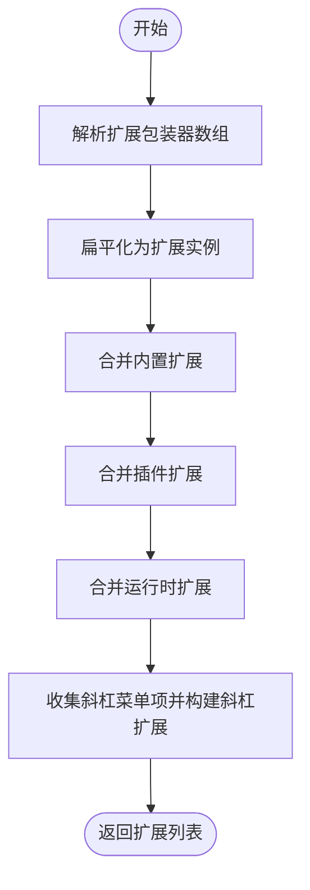
```mermaid
flowchart TD
Start(["开始"]) --> ParseWrap["解析扩展包装器数组"]
ParseWrap --> FlatExt["扁平化为扩展实例"]
FlatExt --> MergeBuiltin["合并内置扩展"]
MergeBuiltin --> MergePlugin["合并插件扩展"]
MergePlugin --> MergeRuntime["合并运行时扩展"]
MergeRuntime --> BuildSlash["收集斜杠菜单项并构建斜杠扩展"]
BuildSlash --> Out(["返回扩展列表"])
```

**图表来源**
- [packages/editor/src/editor/kit.tsx](file://packages/editor/src/editor/kit.tsx#L1-L87)
- [packages/editor/src/editor/build-in-extension.ts](file://packages/editor/src/editor/build-in-extension.ts#L1-L57)

**章节来源**
- [packages/editor/src/editor/kit.tsx](file://packages/editor/src/editor/kit.tsx#L1-L87)
- [packages/editor/src/editor/build-in-extension.ts](file://packages/editor/src/editor/build-in-extension.ts#L1-L57)

### 组件B：编辑器扩展钩子（useEditorExtension）
- 功能要点
  - 基于上下文中的插件管理器与内置扩展，组装运行时扩展集。
  - 可按名称过滤指定扩展，避免重复或冲突。
  - 注入唯一 ID 扩展，控制事务来源，避免协作回写冲突。
  - 使用 useMemo 进行性能优化，避免不必要的重新计算。
  - **新增externalExtensions参数，支持外部扩展注入**。
  - **集成NodeSelectionCursor扩展，提供节点选择可视化功能**。
  - **集成Callout扩展，提供气泡信息面板功能**。
  - **集成Bookmark扩展，提供书签卡片功能**。
  - **集成Title扩展，提供封面图片功能**。
  - **集成编辑器效果工具，提供滚动定位功能**。
  - **集成列管理扩展，提供列布局功能**。
  - **集成拖拽扩展，提供可视化列创建功能**。
  - **集成可调整列宽扩展，提供专业列宽控制功能**。
  - **集成AI列工具集，提供完整的列操作API**。
  - **集成改进的ToC功能，提供现代化目录导航**。
  - **集成统一日志管理，移除了生产环境中的调试输出**。
- 调用序列

```mermaid
sequenceDiagram
participant Caller as "调用方"
participant Hook as "useEditorExtension"
participant Ctx as "AppContext"
participant PM as "插件管理器"
participant ExtPM as "外部插件管理"
participant Kit as "扩展解析"
participant UID as "唯一ID扩展"
participant NSC as "节点选择光标扩展"
participant Callout as "Callout扩展"
participant Bookmark as "Bookmark扩展"
participant Title as "Title扩展"
participant Effects as "编辑器效果工具"
participant Columns as "列管理扩展"
participant Dragable as "拖拽扩展"
participant Resizable as "可调整列宽扩展"
participant AI as "AI列工具集"
participant ToC as "改进的ToC功能"
participant Logger as "日志管理"
participant Editor as "编辑器"
Caller->>Hook : 调用(use, withTitle, externalExtensions)
Hook->>Ctx : 获取插件管理器
Ctx-->>Hook : 返回插件管理器
Hook->>ExtPM : 加载外部插件扩展
ExtPM-->>Hook : 返回外部扩展包装器
Hook->>PM : resloveEditorExtension()
PM-->>Hook : 返回扩展包装器
Hook->>Kit : resolveExtesions()
Kit-->>Hook : 返回扩展实例
Hook->>UID : 配置唯一ID扩展
Hook->>NSC : 配置节点选择光标扩展
Hook->>Callout : 配置Callout扩展
Hook->>Bookmark : 配置Bookmark扩展
Hook->>Title : 配置Title扩展
Hook->>Effects : 配置编辑器效果工具
Effects->>Editor : 提供滚动定位功能
Hook->>Columns : 配置列管理扩展
Hook->>Dragable : 配置拖拽扩展
Hook->>Resizable : 配置可调整列宽扩展
Hook->>AI : 配置AI列工具集
AI->>Effects : 使用滚动定位工具
Hook->>ToC : 配置改进的ToC功能
Hook->>Logger : 初始化日志管理
UID-->>Hook : 返回配置后的扩展
NSC-->>Hook : 返回配置后的扩展
Callout-->>Hook : 返回配置后的扩展
Bookmark-->>Hook : 返回配置后的扩展
Title-->>Hook : 返回配置后的扩展
Effects-->>Hook : 返回配置后的扩展
Columns-->>Hook : 返回配置后的扩展
Dragable-->>Hook : 返回配置后的扩展
Resizable-->>Hook : 返回配置后的扩展
AI-->>Hook : 返回配置后的扩展
ToC-->>Hook : 返回配置后的扩展
Logger-->>Hook : 返回日志管理实例
Hook-->>Caller : 返回扩展列表与包装器快照
Editor-->>Caller : 注入扩展并启动
```

**图表来源**
- [packages/editor/src/editor/use-extension.ts](file://packages/editor/src/editor/use-extension.ts#L20-L64)
- [packages/common/src/core/PluginManager.ts](file://packages/common/src/core/PluginManager.ts#L440-L484)
- [packages/editor/src/editor/kit.tsx](file://packages/editor/src/editor/kit.tsx#L1-L87)
- [packages/editor/src/editor/collaboration.tsx](file://packages/editor/src/editor/collaboration.tsx#L1-L208)
- [packages/editor/src/extensions/collaboration-cursor/collaboration-cursor.ts](file://packages/editor/src/extensions/collaboration-cursor/collaboration-cursor.ts#L103-L227)
- [packages/editor/src/extensions/info-panel/index.tsx](file://packages/editor/src/extensions/info-panel/index.tsx#L14-L31)
- [packages/editor/src/extensions/bookmark/index.tsx](file://packages/editor/src/extensions/bookmark/index.tsx#L5-L12)
- [packages/editor/src/extensions/title/index.ts](file://packages/editor/src/extensions/title/index.ts#L7-L10)
- [packages/core/src/ai/utils/editor-effects.ts](file://packages/core/src/ai/utils/editor-effects.ts#L7-L11)
- [packages/core/src/ai/tools/columns-tools.ts](file://packages/core/src/ai/tools/columns-tools.ts#L91-L616)
- [packages/editor/src/editor/ToC.tsx](file://packages/editor/src/editor/ToC.tsx#L68-L72)
- [packages/common/src/utils/logger.ts](file://packages/common/src/utils/logger.ts#L1-L62)

**章节来源**
- [packages/editor/src/editor/use-extension.ts](file://packages/editor/src/editor/use-extension.ts#L1-L64)

### 组件C：内置扩展集合（buildInExtension）
- 功能要点
  - 定义编辑器默认启用的扩展清单，覆盖格式化、交互、可视化与协作相关能力。
  - 作为扩展解析的基础来源之一，确保最小可用体验。
  - **包含NodeSelectionCursor扩展，提供节点选择可视化功能**。
  - **包含Callout扩展，提供气泡信息面板功能**。
  - **包含Bookmark扩展，提供书签卡片功能**。
  - **包含Title扩展，提供封面图片功能**。
  - **包含列管理扩展，提供列布局功能**。
  - **包含拖拽扩展，提供可视化列创建功能**。
  - **包含可调整列宽扩展，提供专业列宽控制功能**。
- 结构示意

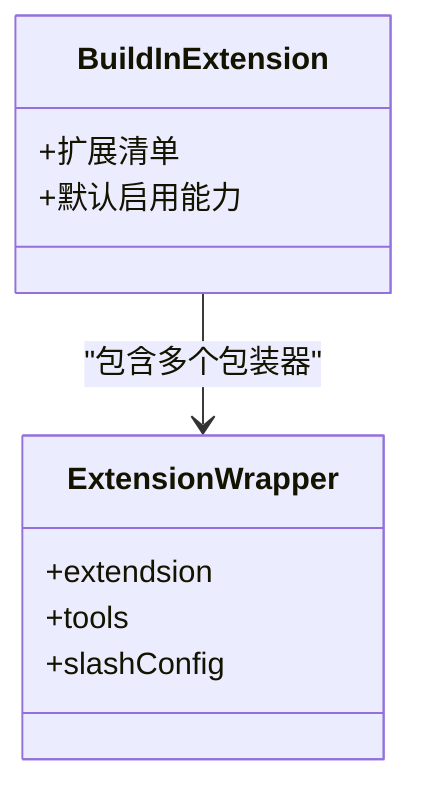
```mermaid
classDiagram
class BuildInExtension {
+扩展清单
+默认启用能力
}
class ExtensionWrapper {
+extendsion
+tools
+slashConfig
}
BuildInExtension --> ExtensionWrapper : "包含多个包装器"
```

**图表来源**
- [packages/editor/src/editor/build-in-extension.ts](file://packages/editor/src/editor/build-in-extension.ts#L1-L57)

**章节来源**
- [packages/editor/src/editor/build-in-extension.ts](file://packages/editor/src/editor/build-in-extension.ts#L1-L57)

### 组件D：插件管理器（PluginManager）
- 功能要点
  - 插件配置与装载：支持本地与远程插件，动态导入脚本并合并服务。
  - 扩展解析：聚合各插件的编辑器扩展包装器，形成统一扩展集。
  - 生命周期：提供安装、卸载、移除与初始化状态查询。
  - **新增loadExternalPluginExtensions方法：支持协作场景下的外部插件扩展加载**。
  - **新增文件服务集成：支持插件访问统一的文件操作API**。
  - **新增统一日志管理：支持环境级别的日志级别控制**。
- 类图

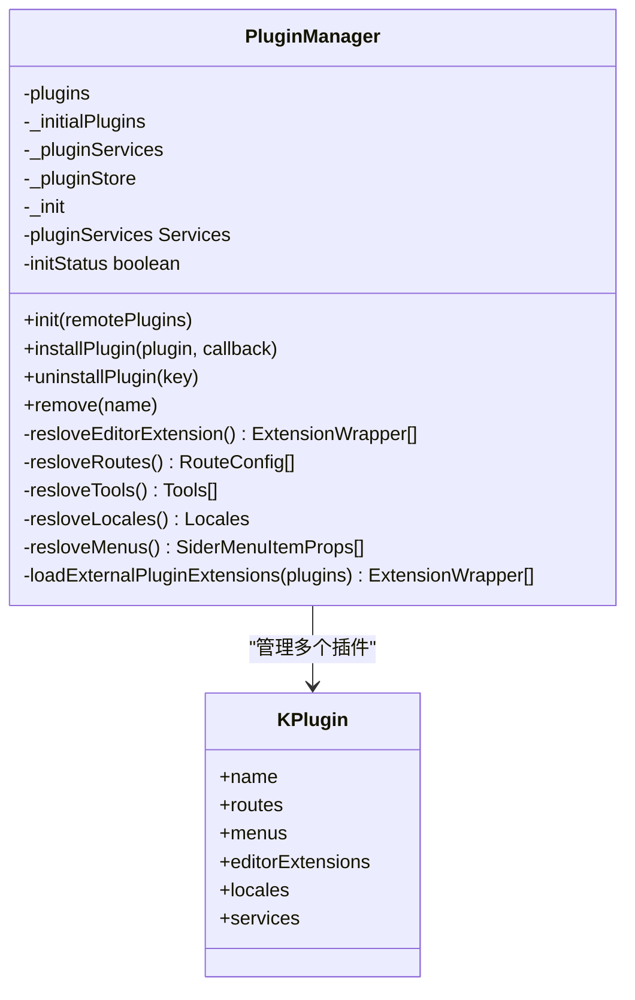
```mermaid
classDiagram
class PluginManager {
-plugins
-_initialPlugins
-_pluginServices
-_pluginStore
-_init
+init(remotePlugins)
+installPlugin(plugin, callback)
+uninstallPlugin(key)
+remove(name)
-resloveEditorExtension() ExtensionWrapper[]
-resloveRoutes() RouteConfig[]
-resloveTools() Tools[]
-resloveLocales() Locales
-resloveMenus() SiderMenuItemProps[]
-loadExternalPluginExtensions(plugins) ExtensionWrapper[]
-pluginServices Services
-initStatus boolean
}
class KPlugin {
+name
+routes
+menus
+editorExtensions
+locales
+services
}
PluginManager --> KPlugin : "管理多个插件"
```

**图表来源**
- [packages/common/src/core/PluginManager.ts](file://packages/common/src/core/PluginManager.ts#L1-L170)
- [packages/common/src/core/PluginManager.ts](file://packages/common/src/core/PluginManager.ts#L440-L484)

**章节来源**
- [packages/common/src/core/PluginManager.ts](file://packages/common/src/core/PluginManager.ts#L1-L170)
- [packages/common/src/core/PluginManager.ts](file://packages/common/src/core/PluginManager.ts#L440-L484)

### 组件E：扩展工具包与工具函数
- 节点工具（utilities/node.ts）
  - 当前节点获取、按位置获取节点、节点激活判断、是否在特定节点内、按 blockId 查找节点、列表激活状态判断等。
- 位置计算（utilities/position.ts）
  - 计算节点/文本位置，支持选区坐标到 DOM 坐标转换，提供安全位置修正。
- 气泡菜单（components/bubble-menu.tsx）
  - 增强版气泡菜单，支持节点级显示策略、定位回调与默认样式配置。
- 节点选择样式（extensions/selection/selection.ts）
  - **提供节点选择装饰样式，支持单节点选择和范围选择的视觉反馈**。
- 编辑器效果工具（ai/utils/editor-effects.ts）
  - **提供统一的滚动定位和文本选择功能**。
  - **支持安全的位置计算和视口滚动，确保编辑器操作的可靠性**。

**章节来源**
- [packages/editor/src/utilities/node.ts](file://packages/editor/src/utilities/node.ts#L1-L149)
- [packages/editor/src/utilities/position.ts](file://packages/editor/src/utilities/position.ts#L1-L69)
- [packages/editor/src/components/bubble-menu.tsx](file://packages/editor/src/components/bubble-menu.tsx#L1-L84)
- [packages/editor/src/extensions/selection/selection.ts](file://packages/editor/src/extensions/selection/selection.ts#L49-L75)
- [packages/core/src/ai/utils/editor-effects.ts](file://packages/core/src/ai/utils/editor-effects.ts#L1-L12)

### 组件F：扩展索引与典型扩展
- 扩展索引（extensions/index.ts）
  - 汇总导出各类扩展，包括格式化、列表、表格、颜色、数学、日期、表情、任务列表、目录、事件、选择、未知节点、高亮与详情等。
  - **导出NodeSelectionCursor扩展，支持节点选择可视化**。
  - **导出CalloutExtension扩展，提供气泡信息面板功能**。
  - **导出BookmarkExtension扩展，提供书签功能**。
  - **导出TitleExtension扩展，提供标题功能**。
  - **导出Column扩展，提供列布局功能**。
  - **导出Dragable扩展，提供拖拽功能**。
  - **导出ResizableColumns扩展，提供可调整列宽功能**。
- 典型扩展示例
  - 加粗扩展：基于 TiPtap 的 Bold 扩展。
  - 链接扩展：扩展输入规则与属性，支持 Markdown 语法与 URL 自动识别。
  - 表格扩展组合：将 Table、TableCell、TableHeader、TableRow 组合为 TableExtensions。
  - **节点选择光标扩展：提供协作场景下的节点选择状态同步**。
  - **Callout扩展：提供气泡信息面板功能，支持七种类型和自定义样式**。
  - **Bookmark扩展：提供书签卡片功能，支持URL、标题、描述和预览图片**。
  - **Title扩展：提供标题功能，支持封面图片和文件服务集成**。
  - **列扩展：提供列布局功能，支持嵌套列和深度跟踪**。
  - **拖拽扩展：提供可视化列创建功能，支持拖拽操作**。
  - **可调整列宽扩展：提供专业列宽控制功能**。

**章节来源**
- [packages/editor/src/extensions/index.ts](file://packages/editor/src/extensions/index.ts#L1-L66)
- [packages/editor/src/extensions/bold/bold.ts](file://packages/editor/src/extensions/bold/bold.ts#L1-L4)
- [packages/editor/src/extensions/link/link.ts](file://packages/editor/src/extensions/link/link.ts#L1-L66)
- [packages/editor/src/extensions/table/table-kit.ts](file://packages/editor/src/extensions/table/table-kit.ts#L1-L17)
- [packages/editor/src/extensions/collaboration-cursor/index.ts](file://packages/editor/src/extensions/collaboration-cursor/index.ts#L1-L2)
- [packages/editor/src/extensions/info-panel/index.tsx](file://packages/editor/src/extensions/info-panel/index.tsx#L10-L11)
- [packages/editor/src/extensions/bookmark/index.tsx](file://packages/editor/src/extensions/bookmark/index.tsx#L65)
- [packages/editor/src/extensions/title/index.ts](file://packages/editor/src/extensions/title/index.ts#L1-L10)
- [packages/editor/src/extensions/columns/column.tsx](file://packages/editor/src/extensions/columns/column.tsx#L1-L133)
- [packages/editor/src/extensions/dragable/dragable.ts](file://packages/editor/src/extensions/dragable/dragable.ts#L1-L632)
- [packages/editor/src/extensions/resizable-columns/resizable-columns.ts](file://packages/editor/src/extensions/resizable-columns/resizable-columns.ts#L1-L16)

### 组件G：目录功能（ToC）——重大改进
- 设计目标
  - **采用粘性定位面板，顶部添加标题栏与徽章，使用滚动区域组件承载目录项**。
  - **实现高亮闪烁动画效果，提升目录导航体验**。
  - **支持工具栏集成和滑出动画，提供现代化的用户界面**。
  - **活动部分高亮显示：滚动时自动识别当前可视区域内的标题，突出显示对应目录项**。
- 实现概览
  - 目录数据源：通过 TableOfContents 扩展收集文档标题层级与索引，实时更新 items。
  - 目录渲染：ToC 组件负责渲染目录项、层级缩进、活动状态高亮与点击跳转。
  - 协作集成：CollaborationEditor 将 ToC 与编辑器内容容器并排布局，启用粘性定位。
  - **样式体系：采用现代化的层级缩进、颜色分级、边框与阴影，提升可读性与对比度**。
  - **动画效果：实现toc-highlight-flash动画，提供视觉反馈**。
  - **移除了调试输出，优化了滚动监听性能**。
- 关键流程

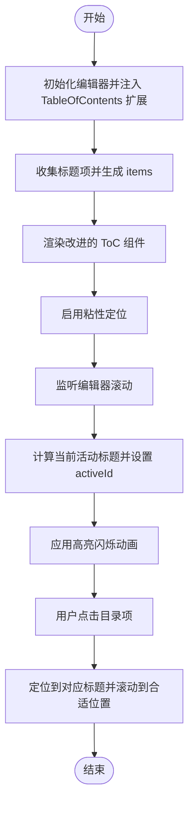
```mermaid
flowchart TD
Start(["开始"]) --> InitEditor["初始化编辑器并注入 TableOfContents 扩展"]
InitEditor --> Collect["收集标题项并生成 items"]
Collect --> Render["渲染改进的 ToC 组件"]
Render --> Sticky["启用粘性定位"]
Sticky --> Scroll["监听编辑器滚动"]
Scroll --> Active["计算当前活动标题并设置 activeId"]
Active --> Flash["应用高亮闪烁动画"]
Flash --> Click["用户点击目录项"]
Click --> Jump["定位到对应标题并滚动到合适位置"]
Jump --> End(["结束"])
```

**图表来源**
- [packages/editor/src/editor/collaboration.tsx](file://packages/editor/src/editor/collaboration.tsx#L116-L136)
- [packages/editor/src/editor/ToC.tsx](file://packages/editor/src/editor/ToC.tsx#L72-L161)
- [packages/editor/src/extensions/table-of-content/table-of-content.ts](file://packages/editor/src/extensions/table-of-content/table-of-content.ts#L1-L1)

**章节来源**
- [packages/editor/src/editor/collaboration.tsx](file://packages/editor/src/editor/collaboration.tsx#L116-L136)
- [packages/editor/src/editor/ToC.tsx](file://packages/editor/src/editor/ToC.tsx#L72-L161)
- [packages/editor/src/extensions/table-of-content/table-of-content.ts](file://packages/editor/src/extensions/table-of-content/table-of-content.ts#L1-L1)

### 组件H：目录样式与布局
- 旧版样式（固定定位与卡片容器）
  - 早期版本采用固定定位与卡片容器，提供基础的目录列表样式与空状态提示。
- **新版样式（粘性定位与现代化 UI）**
  - **新版本采用粘性定位，顶部添加标题栏与徽章，使用滚动区域组件承载目录项**。
  - **通过层级缩进与颜色分级，实现清晰的视觉层次**。
  - **采用现代化的层级缩进、颜色分级、边框与阴影，提升可读性与对比度**。
  - **实现toc-highlight-flash动画效果，提供视觉反馈**。
  - **通过 Tailwind 类名实现深浅色模式适配与过渡动画，提升交互体验**。
  - **移除了调试输出，优化了性能表现**。

**章节来源**
- [packages/editor/src/components/toc/index.tsx](file://packages/editor/src/components/toc/index.tsx#L1-L82)
- [packages/editor/src/components/toc/style/index.module.less](file://packages/editor/src/components/toc/style/index.module.less#L1-L47)
- [packages/editor/src/editor/ToC.tsx](file://packages/editor/src/editor/ToC.tsx#L154-L178)
- [packages/editor/src/styles/editor.css](file://packages/editor/src/styles/editor.css#L73-L87)

### 组件I：编辑器效果工具增强
- 设计目标
  - **提供统一的滚动定位和文本选择功能，确保编辑器操作的可靠性**。
  - **支持安全的位置计算，避免越界访问**。
  - **集成视口滚动功能，提供流畅的编辑器导航体验**。
- 核心功能
  - **scrollToPosition函数**：滚动编辑器视口到指定位置，设置文本选择以便光标作为视觉提示。
  - **安全位置计算**：确保位置在文档内容大小范围内。
  - **链式命令执行**：使用editor.chain()确保命令按顺序执行。
- 实现原理

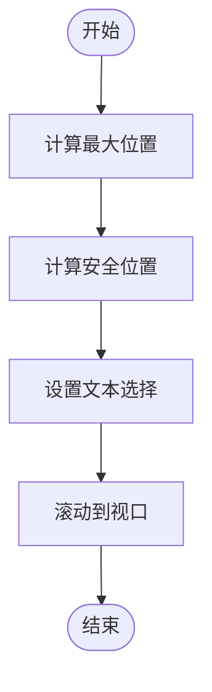
```mermaid
flowchart TD
Start(["开始"]) --> CalcMax["计算最大位置"]
CalcMax --> SafePos["计算安全位置"]
SafePos --> SetSelection["设置文本选择"]
SetSelection --> ScrollIntoView["滚动到视口"]
ScrollIntoView --> End(["结束"])
```

**图表来源**
- [packages/core/src/ai/utils/editor-effects.ts](file://packages/core/src/ai/utils/editor-effects.ts#L7-L11)

**章节来源**
- [packages/core/src/ai/utils/editor-effects.ts](file://packages/core/src/ai/utils/editor-effects.ts#L1-L12)

### 组件J：列管理功能改进
- 设计目标
  - **支持嵌套列布局，提供深度跟踪和父路径管理**。
  - **实现完整的列操作API，包括插入、更新、删除和布局调整**。
  - **提供列内容检索和嵌套列标注功能**。
- 核心功能
  - **嵌套列支持**：支持多层嵌套的列布局结构。
  - **深度跟踪**：记录列的嵌套深度，从0（顶层）开始递增。
  - **父路径管理**：维护父分栏的路径信息，支持复杂的层级关系。
  - **列内容检索**：提供列内容的文本提取和块级内容分析。
  - **嵌套列标注**：在列内容中标注嵌套列的存在和索引。
- 数据结构

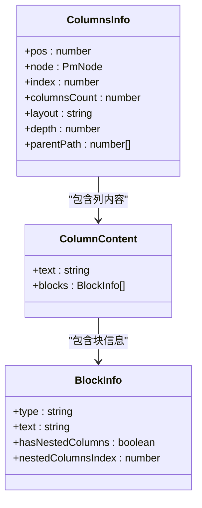
```mermaid
classDiagram
class ColumnsInfo {
+pos : number
+node : PmNode
+index : number
+columnsCount : number
+layout : string
+depth : number
+parentPath : number[]
}
class ColumnContent {
+text : string
+blocks : BlockInfo[]
}
class BlockInfo {
+type : string
+text : string
+hasNestedColumns : boolean
+nestedColumnsIndex : number
}
ColumnsInfo --> ColumnContent : "包含列内容"
ColumnContent --> BlockInfo : "包含块信息"
```

**图表来源**
- [packages/core/src/ai/tools/columns-tools.ts](file://packages/core/src/ai/tools/columns-tools.ts#L11-L19)
- [packages/core/src/ai/tools/columns-tools.ts](file://packages/core/src/ai/tools/columns-tools.ts#L60-L86)

**章节来源**
- [packages/core/src/ai/tools/columns-tools.ts](file://packages/core/src/ai/tools/columns-tools.ts#L1-L616)

### 组件K：拖拽到列功能
- 设计目标
  - **提供可视化的列布局创建，支持拖拽操作和智能指示器**。
  - **实现左右分区指示器，支持精确的列插入位置控制**。
  - **提供拖拽延迟机制，避免误触发和提升用户体验**。
- 核心功能
  - **拖拽手柄**：在节点周围显示拖拽手柄，支持拖拽操作。
  - **列拖拽指示器**：显示左右分区指示器，提供视觉反馈。
  - **拖拽延迟**：实现800ms延迟机制，避免误触发。
  - **侧边检测**：根据鼠标位置检测拖拽到左侧还是右侧。
  - **智能隐藏**：拖拽结束后自动隐藏指示器。
- 实现原理

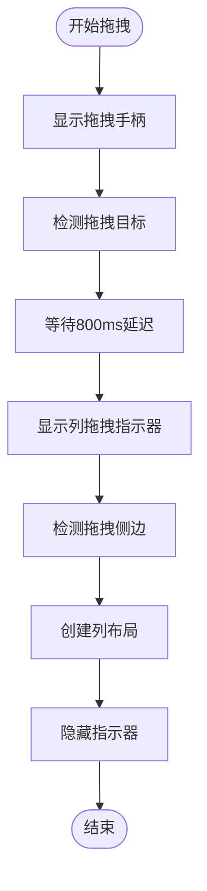
```mermaid
flowchart TD
Start(["开始拖拽"]) --> ShowHandle["显示拖拽手柄"]
ShowHandle --> Detect["检测拖拽目标"]
Detect --> Delay["等待800ms延迟"]
Delay --> ShowIndicator["显示列拖拽指示器"]
ShowIndicator --> SideDetect["检测拖拽侧边"]
SideDetect --> CreateColumns["创建列布局"]
CreateColumns --> HideIndicator["隐藏指示器"]
HideIndicator --> End(["结束"])
```

**图表来源**
- [packages/editor/src/extensions/dragable/dragable.ts](file://packages/editor/src/extensions/dragable/dragable.ts#L187-L372)

**章节来源**
- [packages/editor/src/extensions/dragable/dragable.ts](file://packages/editor/src/extensions/dragable/dragable.ts#L1-L632)

### 组件L：可调整列宽功能
- 设计目标
  - **提供专业的列宽调整工具，支持精确的布局控制**。
  - **实现拖拽手柄和视觉反馈，提供流畅的交互体验**。
  - **实现列宽缓存机制，提升渲染性能**。
- 核心功能
  - **拖拽手柄**：在列右侧显示拖拽手柄，支持列宽调整。
  - **视觉反馈**：提供拖拽过程中的视觉反馈和动画效果。
  - **列宽缓存**：使用Map缓存flex-basis计算结果，避免重复计算。
  - **布局类型支持**：支持left、none、right、center四种布局类型。
  - **动态计算**：根据列数和布局类型动态计算列宽。
- 性能优化
  - **getFlex函数缓存**：使用Map缓存flex-basis计算结果。
  - **装饰插件优化**：通过ProseMirror装饰系统优化列宽渲染。
  - **过渡动画**：使用CSS过渡动画提升用户体验。

**章节来源**
- [packages/editor/src/extensions/columns/column.tsx](file://packages/editor/src/extensions/columns/column.tsx#L1-L133)
- [packages/editor/src/extensions/columns/style/index.css](file://packages/editor/src/extensions/columns/style/index.css#L26-L78)

### 组件M：AI列工具集
- 设计目标
  - **提供完整的列操作API，支持AI代理的列管理需求**。
  - **支持嵌套列布局和复杂列结构管理**。
  - **提供类型安全的输入验证和错误处理**。
- 核心功能
  - **插入列布局**：支持指定列数和布局类型的列布局插入。
  - **获取列信息**：支持获取所有列布局信息和详细内容。
  - **更新列内容**：支持替换、追加、前置等多种更新模式。
  - **设置布局类型**：支持改变列布局的宽度比例。
  - **添加/删除列**：支持在现有布局中添加或删除列。
  - **删除列布局**：支持删除整个列布局。
  - **插入嵌套列**：支持在指定列内插入嵌套列布局。
- 工具函数
  - **findColumnsInDocument**：递归查找文档中的所有列布局，支持嵌套。
  - **getColumnContent**：获取列内容文本和块级信息，支持嵌套列标注。
  - **createColumnsFromNodes**：从两个节点创建列布局，支持拖拽功能。

**章节来源**
- [packages/core/src/ai/tools/columns-tools.ts](file://packages/core/src/ai/tools/columns-tools.ts#L1-L616)

## 协作扩展集成

### 协作编辑器架构
协作扩展系统通过集成 @tiptap/extension-collaboration 和 @tiptap/extension-collaboration-caret 实现实时协作编辑：

- **协作文档扩展**：基于 Yjs 文档实现，支持多用户并发编辑
- **协作光标扩展**：同步显示其他用户的编辑光标位置
- **用户状态管理**：管理用户信息、连接状态和协作感知
- **事务过滤机制**：防止协作回写导致的无限循环
- **外部扩展同步**：支持协作场景下的插件扩展同步
- **节点选择可视化**：**新增NodeSelectionCursor扩展，提供节点选择状态同步**。
- **Callout扩展集成**：**Callout扩展支持协作场景下的信息面板共享**。
- **Bookmark扩展集成**：**Bookmark扩展支持协作场景下的书签节点选择可视化**。
- **Title扩展集成**：**Title扩展支持协作场景下的标题节点选择可视化**。
- **列管理扩展集成**：**列管理扩展支持协作场景下的列布局同步**。
- **拖拽扩展集成**：**拖拽扩展支持协作场景下的可视化列创建**。
- **可调整列宽扩展集成**：**可调整列宽扩展支持协作场景下的列宽调整同步**。
- **AI列工具集集成**：**AI列工具集支持协作场景下的列操作同步**。
- **日志管理集成**：**统一的日志管理系统，支持环境级别的日志级别控制**。

### 协作扩展配置
协作扩展通过 CollaborationEditor 组件进行配置：

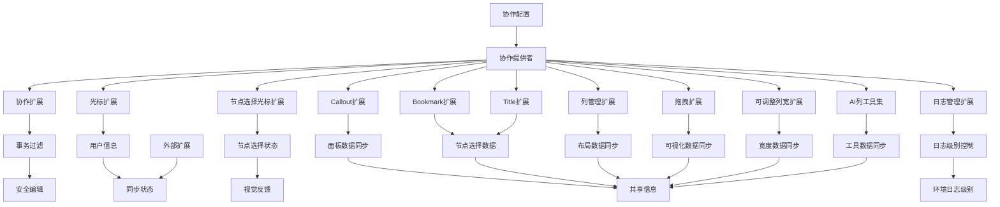
```mermaid
flowchart TD
Config["协作配置"] --> Provider["协作提供者"]
Provider --> CollabExt["协作扩展"]
Provider --> CursorExt["光标扩展"]
Provider --> NSCExt["节点选择光标扩展"]
Provider --> CalloutExt["Callout扩展"]
Provider --> BookmarkExt["Bookmark扩展"]
Provider --> TitleExt["Title扩展"]
Provider --> ColumnsExt["列管理扩展"]
Provider --> DragableExt["拖拽扩展"]
Provider --> ResizableExt["可调整列宽扩展"]
Provider --> AIExt["AI列工具集"]
Provider --> LoggerExt["日志管理扩展"]
CollabExt --> Filter["事务过滤"]
CursorExt --> User["用户信息"]
NSCExt --> NodeSel["节点选择状态"]
CalloutExt --> PanelData["面板数据同步"]
BookmarkExt --> NodeSelData["节点选择数据"]
TitleExt --> NodeSelData["节点选择数据"]
ColumnsExt --> LayoutSync["布局数据同步"]
DragableExt --> VisualSync["可视化数据同步"]
ResizableExt --> WidthSync["宽度数据同步"]
AIExt --> ToolSync["工具数据同步"]
Filter --> Safe["安全编辑"]
User --> Sync["同步状态"]
NodeSel --> Visual["视觉反馈"]
PanelData --> Shared["共享信息"]
NodeSelData --> Shared
LayoutSync --> Shared
VisualSync --> Shared
WidthSync --> Shared
ToolSync --> Shared
ExternalExt["外部扩展"] --> Sync
LoggerExt --> LogCtrl["日志级别控制"]
LogCtrl --> EnvLog["环境日志级别"]
```

**图表来源**
- [packages/editor/src/editor/collaboration.tsx](file://packages/editor/src/editor/collaboration.tsx#L56-L82)
- [packages/editor/src/extensions/collaboration-cursor/collaboration-cursor.ts](file://packages/editor/src/extensions/collaboration-cursor/collaboration-cursor.ts#L103-L227)
- [packages/editor/src/extensions/info-panel/index.tsx](file://packages/editor/src/extensions/info-panel/index.tsx#L14-L31)
- [packages/editor/src/extensions/bookmark/index.tsx](file://packages/editor/src/extensions/bookmark/index.tsx#L5-L12)
- [packages/editor/src/extensions/title/index.ts](file://packages/editor/src/extensions/title/index.ts#L7-L10)
- [packages/editor/src/extensions/columns/column.tsx](file://packages/editor/src/extensions/columns/column.tsx#L101-L131)
- [packages/editor/src/extensions/dragable/dragable.ts](file://packages/editor/src/extensions/dragable/dragable.ts#L25-L118)
- [packages/editor/src/editor/ToC.tsx](file://packages/editor/src/editor/ToC.tsx#L1-L180)
- [packages/common/src/utils/logger.ts](file://packages/common/src/utils/logger.ts#L1-L62)

### 用户引用优化
通过 React.useRef 和 React.useEffect 优化用户引用管理：

- **用户引用缓存**：使用 userRef 缓存用户信息，避免扩展重新创建
- **响应式更新**：当用户信息变化时自动更新引用
- **性能优化**：减少不必要的组件重渲染
- **头像支持**：**协作光标标签支持头像显示，增强用户识别**。
- **日志级别控制**：**统一的日志级别管理，移除了生产环境中的调试输出**。

**章节来源**
- [packages/editor/src/editor/collaboration.tsx](file://packages/editor/src/editor/collaboration.tsx#L50-L54)
- [packages/editor/src/editor/collaboration.tsx](file://packages/editor/src/editor/collaboration.tsx#L119-L123)

## 节点选择可视化扩展

### NodeSelectionCursor扩展概述
NodeSelectionCursor扩展是专门为协作场景设计的节点选择可视化解决方案：

- **设计目标**：在协作编辑中同步显示其他用户的节点选择状态
- **冲突避免**：使用独立的awareness字段避免与yCursorPlugin冲突
- **状态同步**：通过awareness协议同步节点选择信息
- **视觉反馈**：提供节点装饰样式，包括轮廓边框和半透明背景

### 核心功能实现

#### 节点选择检测
扩展能够准确识别不同类型的节点选择：

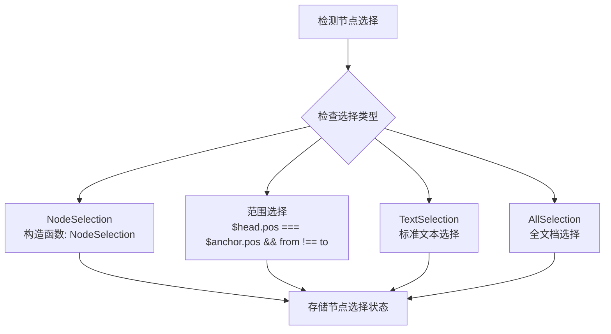
```mermaid
flowchart TD
Detect["检测节点选择"] --> CheckType{"检查选择类型"}
CheckType --> NodeSel["NodeSelection<br/>构造函数: NodeSelection"]
CheckType --> RangeSel["范围选择<br/>$head.pos === $anchor.pos && from !== to"]
CheckType --> TextSel["TextSelection<br/>标准文本选择"]
CheckType --> AllSel["AllSelection<br/>全文档选择"]
NodeSel --> Store["存储节点选择状态"]
RangeSel --> Store
TextSel --> Store
AllSel --> Store
```

**图表来源**
- [packages/editor/src/extensions/collaboration-cursor/collaboration-cursor.ts](file://packages/editor/src/extensions/collaboration-cursor/collaboration-cursor.ts#L182-L218)

#### 装饰样式系统
扩展提供完整的节点选择装饰样式：

- **轮廓边框**：使用CSS变量 `--collaboration-cursor-color` 控制颜色
- **半透明背景**：通过伪元素实现半透明覆盖效果
- **圆角设计**：提供更好的视觉体验
- **过渡动画**：颜色变化具有平滑过渡效果

#### Awareness状态管理
扩展使用独立的awareness字段存储节点选择状态：

- **字段命名**：`nodeSelection`（避免与`cursor`字段冲突）
- **状态结构**：
  ```typescript
  {
    isNodeSelection: boolean,
    from: number,
    to: number
  }
  ```
- **冲突解决**：通过分离的状态字段避免与yCursorPlugin的内部管理冲突

### 视觉样式实现

#### CSS样式定义
扩展依赖以下CSS类实现视觉效果：

- `.collaboration-cursor__node-selection`：主节点选择样式
- `.collaboration-cursor__node-selection::before`：半透明背景伪元素
- `.collaboration-cursor__node-selection-fallback`：降级样式

#### 颜色主题支持
样式系统支持动态颜色主题：

- **CSS变量**：`--collaboration-cursor-color` 控制颜色
- **用户颜色**：从awareness状态获取用户颜色
- **轮廓颜色**：`outline-color` 与主颜色保持一致

**章节来源**
- [packages/editor/src/extensions/collaboration-cursor/collaboration-cursor.ts](file://packages/editor/src/extensions/collaboration-cursor/collaboration-cursor.ts#L1-L230)
- [packages/editor/src/styles/editor.css](file://packages/editor/src/styles/editor.css#L142-L160)

## Callout扩展系统重构

### Callout扩展概述
Callout扩展是编辑器中的全新气泡信息面板扩展，提供七种类型的信息展示和丰富的自定义功能：

- **设计目标**：提供美观、可自定义的信息面板，支持七种类型和样式
- **扩展类型**：支持七种类型（default、info、success、warning、error、tip、bookmark）
- **自定义功能**：支持图标颜色、背景颜色、自定义表情符号的完全自定义
- **交互功能**：提供静态菜单、气泡菜单和斜杠菜单支持
- **颜色系统**：新增九种预设颜色方案，提供丰富的色彩选择
- **性能优化**：**移除了调试输出，优化了渲染性能**。

### 核心功能实现

#### 扩展定义与属性
Callout扩展基于TiPtap框架构建，支持丰富的属性配置：

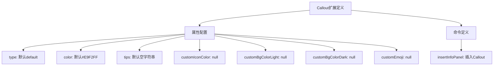
```mermaid
flowchart TD
Define["Callout扩展定义"] --> Attrs["属性配置"]
Attrs --> TypeAttr["type: 默认default"]
Attrs --> ColorAttr["color: 默认#E9F2FF"]
Attrs --> TipsAttr["tips: 默认空字符串"]
Attrs --> CustomIcon["customIconColor: null"]
Attrs --> CustomBgLight["customBgColorLight: null"]
Attrs --> CustomBgDark["customBgColorDark: null"]
Attrs --> CustomEmoji["customEmoji: null"]
Define --> Commands["命令定义"]
Commands --> InsertCmd["insertInfoPanel: 插入Callout"]
```

**图表来源**
- [packages/editor/src/extensions/info-panel/info-panel.ts](file://packages/editor/src/extensions/info-panel/info-panel.ts#L17-L84)

#### 类型系统与颜色方案
Callout扩展定义了完整的类型系统和颜色方案：

- **类型定义**：`'default' | 'info' | 'success' | 'warning' | 'error' | 'tip' | 'bookmark'`
- **颜色配置**：每种类型包含浅色和深色主题的颜色值
- **图标配置**：每种类型关联相应的图标组件
- **默认类型**：默认为'default'类型，提示文本默认为空字符串

#### 颜色预设系统
Callout扩展新增了完整的颜色预设系统：

- **预设颜色定义**：九种预设颜色方案（Gray、Blue、Green、Yellow、Red、Purple、Pink、Orange、Cyan）
- **颜色配置**：每种预设包含浅色和深色主题的颜色值
- **快速选择**：支持通过气泡菜单快速选择预设颜色
- **主题适配**：自动根据当前主题选择合适的颜色

#### 视图组件重构
CalloutView组件经过重构，提供高性能的渲染和丰富的交互功能：

- **性能优化**：使用useMemo和useCallback进行性能优化
- **主题适配**：支持浅色和深色主题的自动切换
- **自定义支持**：支持完全自定义的颜色和图标
- **响应式设计**：提供良好的移动端和桌面端体验
- **移除了调试输出**：**优化了渲染性能，移除了console.log调试输出**。

#### 气泡菜单扩展
Callout扩展提供完整的气泡菜单功能，支持多种自定义选项：

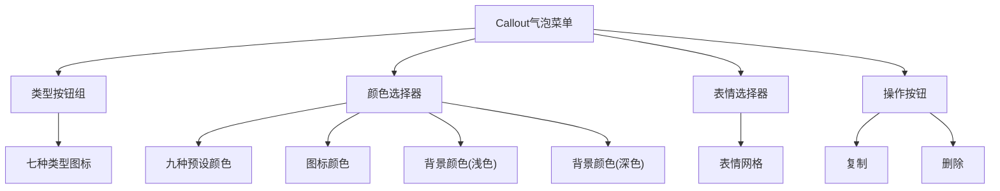
```mermaid
flowchart TD
BubbleMenu["Callout气泡菜单"] --> TypeBtns["类型按钮组"]
BubbleMenu --> ColorPicker["颜色选择器"]
BubbleMenu --> EmojiPicker["表情选择器"]
BubbleMenu --> Actions["操作按钮"]
TypeBtns --> TypeIcons["七种类型图标"]
ColorPicker --> PresetColors["九种预设颜色"]
ColorPicker --> IconColor["图标颜色"]
ColorPicker --> BgLight["背景颜色(浅色)"]
ColorPicker --> BgDark["背景颜色(深色)"]
EmojiPicker --> EmojiGrid["表情网格"]
Actions --> CopyBtn["复制"]
Actions --> DeleteBtn["删除"]
```

**图表来源**
- [packages/editor/src/extensions/info-panel/menu/bubble.tsx](file://packages/editor/src/extensions/info-panel/menu/bubble.tsx#L96-L190)

#### 自定义功能增强
Callout扩展提供强大的自定义功能：

- **图标颜色自定义**：支持完全自定义图标颜色
- **背景颜色自定义**：支持浅色和深色主题的独立背景颜色
- **表情符号自定义**：支持使用任意表情符号作为图标
- **类型切换**：支持在七种类型之间切换

### 视觉样式实现

#### 颜色主题系统
Callout扩展采用完整的颜色主题系统：

- **默认类型颜色**：
  - default: #f5f5f5 (浅灰) / #262626 (深灰)
- **信息类型颜色**：info: #eff6ff (浅蓝) / #1e3a5f (深蓝)
- **成功类型颜色**：success: #f0fdf4 (浅绿) / #14532d (深绿)
- **警告类型颜色**：warning: #fffbeb (浅黄) / #451a03 (深黄)
- **错误类型颜色**：error: #fef2f2 (浅红) / #450a0a (深红)
- **提示类型颜色**：tip: #f0fdf4 (浅绿) / #1c2a22 (深绿)
- **书签类型颜色**：bookmark: #faf5ff (浅紫) / #3b0764 (深紫)

#### 样式类与主题适配
Callout扩展使用Tailwind CSS类和主题适配：

- **基础样式**：圆角、阴影、内边距、边框
- **主题适配**：根据当前主题自动选择合适的颜色
- **悬停效果**：提供平滑的悬停动画效果
- **无障碍支持**：提供role="alert"和aria-live="polite"

**章节来源**
- [packages/editor/src/extensions/info-panel/info-panel.ts](file://packages/editor/src/extensions/info-panel/info-panel.ts#L1-L85)
- [packages/editor/src/extensions/info-panel/info-panel-view.tsx](file://packages/editor/src/extensions/info-panel/info-panel-view.tsx#L1-L110)
- [packages/editor/src/extensions/info-panel/menu/bubble.tsx](file://packages/editor/src/extensions/info-panel/menu/bubble.tsx#L1-L190)
- [packages/editor/src/extensions/info-panel/constants.ts](file://packages/editor/src/extensions/info-panel/constants.ts#L1-L102)
- [packages/editor/src/extensions/info-panel/index.tsx](file://packages/editor/src/extensions/info-panel/index.tsx#L1-L96)

## Bookmark扩展系统

### Bookmark扩展概述
Bookmark扩展是编辑器中的全新书签扩展系统，提供富书签卡片功能，支持URL、标题、描述和预览图片：

- **设计目标**：提供美观、可交互的书签卡片，支持URL自动元数据抓取
- **核心功能**：支持URL、标题、描述、favicon和预览图片属性
- **交互功能**：提供可编辑属性、悬停操作按钮、点击打开链接
- **工具栏集成**：支持工具栏按钮和键盘快捷键（⌘⇧K）
- **兼容性更新**：移除atom属性，简化节点定义，可能影响与其他扩展的集成兼容性
- **性能优化**：**移除了调试输出，优化了URL抓取性能**。

### 核心功能实现

#### 扩展定义与属性
Bookmark扩展基于TiPtap框架构建，支持完整的属性配置：

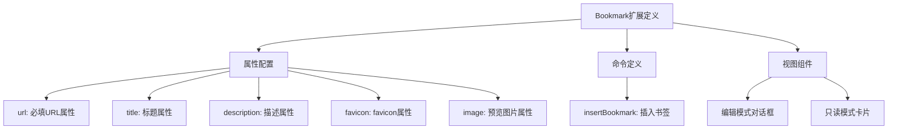
```mermaid
flowchart TD
Define["Bookmark扩展定义"] --> Attrs["属性配置"]
Attrs --> UrlAttr["url: 必填URL属性"]
Attrs --> TitleAttr["title: 标题属性"]
Attrs --> DescAttr["description: 描述属性"]
Attrs --> FaviconAttr["favicon: favicon属性"]
Attrs --> ImageAttr["image: 预览图片属性"]
Define --> Commands["命令定义"]
Commands --> InsertCmd["insertBookmark: 插入书签"]
Define --> View["视图组件"]
View --> EditMode["编辑模式对话框"]
View --> ReadMode["只读模式卡片"]
```

**图表来源**
- [packages/editor/src/extensions/bookmark/bookmark.ts](file://packages/editor/src/extensions/bookmark/bookmark.ts#L19-L131)

#### 视图组件实现
BookmarkView组件提供完整的交互体验：

- **编辑模式**：使用Dialog组件提供表单编辑功能
- **只读模式**：展示卡片式UI，支持悬停操作按钮
- **URL验证**：支持HTTP/HTTPS协议验证
- **元数据抓取**：自动抓取网页标题、描述、图片和favicon
- **响应式设计**：支持移动端和桌面端显示
- **移除了调试输出**：**优化了URL抓取和元数据解析性能**。

#### 工具栏集成
BookmarkStaticMenu组件提供工具栏按钮：

- **快捷键支持**：⌘⇧K 快捷键插入书签
- **Tooltip提示**：提供工具提示信息
- **按钮样式**：使用@kn/ui Button组件

### 视觉样式实现

#### 卡片式UI设计
Bookmark扩展采用现代化的卡片式设计：

- **悬停效果**：支持阴影和边框颜色变化
- **响应式布局**：支持不同屏幕尺寸
- **主题适配**：支持浅色和深色主题
- **图标系统**：使用@kn/icon提供图标支持

#### 动画与交互
- **加载动画**：URL验证时显示加载指示器
- **错误处理**：提供URL格式验证和错误提示
- **平滑过渡**：支持CSS过渡动画效果

### 兼容性影响分析

#### 移除atom属性的影响
**更新** 书签扩展已移除atom属性，这一变更对扩展兼容性产生以下影响：

- **节点定义简化**：移除atom属性使节点定义更加简洁，符合现代ProseMirror的节点设计模式
- **与其他扩展的集成**：可能影响与需要atom属性的扩展的集成，特别是那些依赖原子节点特性的扩展
- **渲染行为变化**：移除atom属性可能改变节点的渲染和编辑行为
- **协作扩展兼容性**：需要确保协作扩展能够正确处理非原子节点的选择和编辑

#### 与其他原子节点扩展的对比
**新增** 为了更好地理解书签扩展的兼容性影响，以下是与其它原子节点扩展的对比分析：

- **Drawnix扩展**：使用 `atom: true` 属性，定义为原子节点，具有独特的渲染和交互特性
- **书签扩展**：移除了atom属性，采用块级节点定义，简化了节点行为
- **兼容性考虑**：原子节点扩展通常具有特殊的渲染和编辑行为，移除atom属性的书签扩展可能无法与这些扩展完美集成

#### 集成兼容性建议
**新增** 针对书签扩展移除atom属性后的兼容性问题，建议：

- **扩展间协调**：在同时使用书签扩展和其他原子节点扩展时，需要特别注意节点间的交互行为
- **测试验证**：在集成新扩展时，应充分测试节点选择、编辑和渲染行为
- **文档更新**：更新相关扩展的集成文档，明确兼容性要求和注意事项

**章节来源**
- [packages/editor/src/extensions/bookmark/bookmark.ts](file://packages/editor/src/extensions/bookmark/bookmark.ts#L1-L132)
- [packages/editor/src/extensions/bookmark/bookmark-view.tsx](file://packages/editor/src/extensions/bookmark/bookmark-view.tsx#L1-L496)
- [packages/editor/src/extensions/bookmark/menu/menu.tsx](file://packages/editor/src/extensions/bookmark/menu/menu.tsx#L1-L32)
- [packages/editor/src/extensions/bookmark/index.tsx](file://packages/editor/src/extensions/bookmark/index.tsx#L1-L15)
- [packages/editor/src/extensions/bookmark/README.md](file://packages/editor/src/extensions/bookmark/README.md#L1-L88)
- [packages/plugin-drawnix/src/extension/drawnix.ts](file://packages/plugin-drawnix/src/extension/drawnix.ts#L183-L213)

## Title扩展系统

### Title扩展概述
Title扩展是编辑器中的全新标题扩展系统，提供封面图片功能，支持拖拽定位控制和文件服务集成：

- **设计目标**：提供美观、可交互的标题区域，支持封面图片展示和编辑
- **核心功能**：支持封面图片上传、拖拽定位控制、文件服务集成
- **交互功能**：提供封面图片的添加、修改、删除和重新定位功能
- **文件服务集成**：集成统一的文件服务，支持图片文件的上传和下载
- **拖拽定位**：支持封面图片的垂直位置拖拽重新定位
- **性能优化**：**移除了调试输出，优化了拖拽定位性能**。

### 核心功能实现

#### 扩展定义与属性
Title扩展基于TiPtap框架构建，支持完整的属性配置：

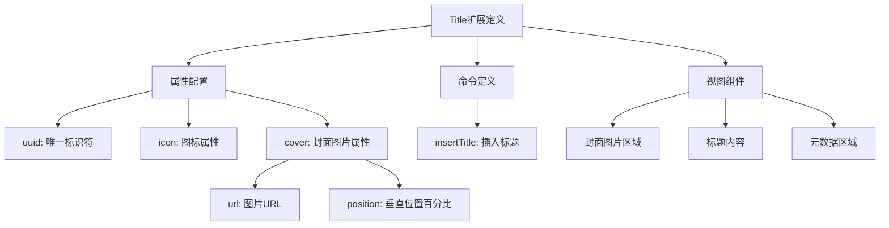
```mermaid
flowchart TD
Define["Title扩展定义"] --> Attrs["属性配置"]
Attrs --> UuidAttr["uuid: 唯一标识符"]
Attrs --> IconAttr["icon: 图标属性"]
Attrs --> CoverAttr["cover: 封面图片属性"]
CoverAttr --> CoverUrl["url: 图片URL"]
CoverAttr --> CoverPos["position: 垂直位置百分比"]
Define --> Commands["命令定义"]
Commands --> InsertCmd["insertTitle: 插入标题"]
Define --> View["视图组件"]
View --> CoverSection["封面图片区域"]
View --> TitleContent["标题内容"]
View --> MetaSection["元数据区域"]
```

**图表来源**
- [packages/editor/src/extensions/title/title.ts](file://packages/editor/src/extensions/title/title.ts#L14-L31)

#### 封面图片功能
TitleView组件提供完整的封面图片功能：

- **封面图片上传**：通过文件服务上传图片文件，支持拖拽和点击选择
- **封面图片显示**：支持本地文件URL、HTTP/HTTPS链接和data URI格式
- **拖拽定位控制**：支持鼠标拖拽重新定位封面图片的垂直位置
- **重新定位提示**：拖拽时显示重新定位提示和进度指示
- **封面图片管理**：支持封面图片的修改、删除和重新添加
- **移除了调试输出**：**优化了拖拽定位和文件服务集成性能**。

#### 文件服务集成
Title扩展集成统一的文件服务：

- **文件服务获取**：通过插件管理器获取文件服务实例
- **文件上传**：支持图片文件的上传和文件信息获取
- **下载URL处理**：支持本地文件名到下载URL的转换
- **安全URL处理**：自动处理HTTP/HTTPS和data URI格式

#### 拖拽定位实现
拖拽定位功能提供精确的封面图片位置控制：

- **拖拽事件处理**：监听鼠标事件，计算拖拽位移和位置变化
- **位置百分比计算**：根据拖拽位移计算垂直位置百分比（0-100）
- **位置限制**：限制位置在有效范围内（0-100）
- **实时更新**：拖拽过程中实时更新封面图片位置

### 视觉样式实现

#### 封面图片样式
Title扩展采用现代化的封面图片设计：

- **全宽显示**：封面图片采用全宽显示，适应不同屏幕尺寸
- **最小高度限制**：设置最小高度确保封面图片的可见性
- **最大高度限制**：限制最大高度避免过度占用空间
- **对象填充**：使用object-fit: cover确保图片填充效果
- **对象位置**：支持垂直位置的精确控制

#### 交互样式
- **悬停效果**：封面图片区域支持悬停状态的视觉反馈
- **拖拽样式**：拖拽时显示特殊的视觉样式和提示
- **禁用状态**：上传过程中显示禁用状态和加载指示
- **响应式设计**：支持移动端和桌面端的不同交互方式

### 文件服务集成分析

#### 文件服务接口
Title扩展使用统一的文件服务接口：

- **上传接口**：支持单文件上传，返回文件信息
- **下载URL接口**：支持文件名到下载URL的转换
- **错误处理**：提供文件服务不可用时的降级处理
- **类型安全**：通过类型定义确保文件服务的正确使用

#### URL处理机制
Title扩展提供智能的URL处理：

- **格式检测**：自动检测URL格式（HTTP/HTTPS/data URI）
- **本地文件处理**：通过文件服务获取下载URL
- **降级URL**：提供备用的下载URL格式
- **安全性**：确保URL的安全性和有效性

**章节来源**
- [packages/editor/src/extensions/title/title.ts](file://packages/editor/src/extensions/title/title.ts#L1-L91)
- [packages/editor/src/extensions/title/title-view.tsx](file://packages/editor/src/extensions/title/title-view.tsx#L1-L377)
- [packages/editor/src/extensions/title/index.ts](file://packages/editor/src/extensions/title/index.ts#L1-L10)
- [packages/plugin-file-manager/src/services/FileServiceImpl.ts](file://packages/plugin-file-manager/src/services/FileServiceImpl.ts#L1-L148)
- [packages/core/src/services/file-service.ts](file://packages/core/src/services/file-service.ts#L1-L35)
- [packages/common/src/core/types.ts](file://packages/common/src/core/types.ts#L1-L66)

## ToC功能重大改进

### ToC功能概述
ToC（目录）功能经过重大改进，提供现代化的目录导航体验：

- **设计目标**：提供粘性定位、滑出动画、高亮闪烁效果的现代化目录
- **核心改进**：采用粘性定位面板、滑出动画、工具栏集成和高亮闪烁效果
- **用户体验**：提升目录导航的直观性和交互性
- **性能优化**：**移除了调试输出，优化了滚动监听性能**。

### 核心功能实现

#### 粘性定位面板
ToC组件采用粘性定位设计：

- **顶部标题栏**：包含图标、标题和徽章显示
- **滚动区域**：使用ScrollArea组件承载目录项
- **背景模糊**：支持backdrop-blur效果
- **阴影设计**：提供现代感的阴影效果

#### 高亮闪烁动画
实现toc-highlight-flash动画效果：

- **动画定义**：使用@keyframes定义闪烁动画
- **CSS类**：toc-highlight-flash类提供动画效果
- **触发机制**：点击目录项时触发动画
- **视觉反馈**：提供清晰的导航反馈

#### 工具栏集成
ToC功能与工具栏深度集成：

- **工具栏按钮**：提供目录展开/收起功能
- **状态同步**：与编辑器状态保持同步
- **响应式设计**：支持不同屏幕尺寸

### 视觉样式实现

#### 层级缩进系统
实现现代化的层级缩进设计：

- **颜色分级**：不同层级使用不同的颜色方案
- **缩进计算**：根据层级动态计算缩进距离
- **活跃状态**：使用垂直条形标识当前活跃项
- **悬停效果**：提供平滑的悬停过渡动画

#### 主题适配
支持完整的深浅色主题适配：

- **颜色变量**：使用CSS变量支持主题切换
- **背景适配**：根据主题自动调整背景色
- **边框适配**：支持透明度和边框颜色适配
- **文字适配**：提供合适的文字颜色对比度

**章节来源**
- [packages/editor/src/editor/ToC.tsx](file://packages/editor/src/editor/ToC.tsx#L1-L180)
- [packages/editor/src/styles/editor.css](file://packages/editor/src/styles/editor.css#L73-L87)
- [packages/editor/src/components/toc/index.tsx](file://packages/editor/src/components/toc/index.tsx#L1-L82)

## 外部扩展参数支持

### externalExtensions参数引入
useEditorExtension钩子现在支持externalExtensions参数，为协作场景提供插件同步能力：

- **参数作用**：允许传入外部扩展数组，覆盖插件管理器的扩展加载
- **优先级机制**：externalExtensions优先于插件管理器的扩展
- **协作场景**：确保邀请方和受邀方使用相同的编辑器扩展

### CollaborationEditor组件增强
CollaborationEditor组件新增externalExtensions属性，支持协作场景下的插件同步：

- **属性定义**：externalExtensions?: ExtensionWrapper[]
- **使用场景**：邀请方将自身插件扩展传递给受邀方
- **实现机制**：直接传递给useEditorExtension钩子

### PluginManager外部扩展加载
新增loadExternalPluginExtensions方法，支持协作场景下的外部插件扩展加载：

- **方法签名**：async loadExternalPluginExtensions(plugins: Array<{ resourcePath: string; pluginKey: string; name: string }>): Promise<ExtensionWrapper[]>
- **加载逻辑**：动态加载插件脚本并提取editorExtensions
- **错误处理**：跳过无效插件，记录警告信息
- **缓存机制**：记录成功加载的扩展数量

### 协作邀请API集成
完整的协作邀请API文档包含插件同步流程：

- **插件获取**：GET /knowledge-wiki/collaboration/invitation/:token/plugins
- **插件加载**：前端动态加载邀请方的插件脚本
- **扩展同步**：将邀请方的扩展注入到受邀方的编辑器中
- **回退机制**：如果插件获取失败，使用受邀方自己的插件

**章节来源**
- [packages/editor/src/editor/use-extension.ts](file://packages/editor/src/editor/use-extension.ts#L20-L64)
- [packages/editor/src/editor/collaboration.tsx](file://packages/editor/src/editor/collaboration.tsx#L26-L42)
- [packages/common/src/core/PluginManager.ts](file://packages/common/src/core/PluginManager.ts#L440-L484)
- [packages/plugin-main/docs/COLLABORATION_API.md](file://packages/plugin-main/docs/COLLABORATION_API.md#L663-L731)
- [packages/plugin-main/src/pages/InviteCollaboration/index.tsx](file://packages/plugin-main/src/pages/InviteCollaboration/index.tsx#L531)

## 扩展memoization优化

### useMemo使用策略
编辑器扩展系统广泛使用 React.memo 和 useMemo 进行性能优化：

- **useEditorExtension**：对整个扩展集合进行 memoization
- **协作扩展构建**：使用 React.useMemo 优化扩展数组构建
- **用户引用管理**：通过 userRef 实现稳定的用户引用
- **外部扩展缓存**：externalExtensions参数参与memoization依赖
- **节点选择光标优化**：**NodeSelectionCursor扩展使用独立的插件键进行状态管理**。
- **Callout性能优化**：**CalloutView组件使用useMemo和useCallback进行性能优化**。
- **Callout颜色计算优化**：**使用useMemo优化颜色主题计算**。
- **Callout气泡菜单优化**：**使用useMemo优化类型按钮和颜色选择器渲染**。
- **Bookmark性能优化**：**BookmarkView组件使用memo进行性能优化**。
- **Title扩展性能优化**：**TitleView组件使用useMemo和useCallback进行性能优化**。
- **ToC性能优化**：**ToC组件使用useMemo优化滚动监听和状态更新**。
- **列管理性能优化**：**列扩展使用getFlex缓存机制优化渲染性能**。
- **拖拽扩展性能优化**：**拖拽扩展使用延迟机制避免误触发**。
- **可调整列宽性能优化**：**可调整列宽扩展使用装饰插件优化渲染**。
- **AI列工具集性能优化**：**AI列工具集使用递归遍历优化嵌套列处理**。
- **日志管理优化**：**统一的日志管理系统减少了调试输出的性能开销**。

### 性能优化实践
- **依赖数组优化**：精确控制 useMemo 的依赖项，包括externalExtensions
- **稳定引用**：确保扩展实例的稳定引用，避免不必要的重渲染
- **条件渲染**：根据 provider 状态动态决定协作扩展的添加
- **状态映射优化**：**节点选择装饰通过文档变化映射保持性能**。
- **Callout渲染优化**：**使用useMemo缓存类型信息和颜色计算**。
- **Callout气泡菜单优化**：**使用useMemo优化预设颜色按钮渲染**。
- **Bookmark渲染优化**：**使用memo缓存视图组件，避免重复渲染**。
- **Title渲染优化**：**使用useMemo优化封面图片和拖拽定位逻辑**。
- **ToC渲染优化**：**使用useMemo优化目录项计算和滚动处理**。
- **列渲染优化**：**使用getFlex缓存机制优化列宽计算**。
- **拖拽渲染优化**：**使用延迟机制优化拖拽指示器显示**。
- **可调整列宽渲染优化**：**使用装饰插件优化列宽渲染**。
- **AI列工具集渲染优化**：**使用递归遍历优化嵌套列处理**。
- **日志级别优化**：**根据环境级别控制日志输出，减少生产环境的性能开销**。

### 优化效果
- 减少扩展重新创建次数
- 降低编辑器初始化时间
- 提升协作场景下的响应速度
- **支持外部扩展的稳定缓存**
- **节点选择装饰的高效更新机制**
- **Callout组件的高性能渲染**
- **Callout颜色系统的高效计算**
- **Callout气泡菜单的高效渲染**
- **Bookmark组件的高性能渲染**
- **Title组件的高性能渲染**
- **ToC组件的高性能渲染**
- **列扩展的高性能渲染**
- **拖拽扩展的高性能渲染**
- **可调整列宽扩展的高性能渲染**
- **AI列工具集的高性能渲染**
- **统一日志管理的性能优化**

**章节来源**
- [packages/editor/src/editor/use-extension.ts](file://packages/editor/src/editor/use-extension.ts#L23-L24)
- [packages/editor/src/editor/collaboration.tsx](file://packages/editor/src/editor/collaboration.tsx#L56-L82)
- [packages/editor/src/extensions/collaboration-cursor/collaboration-cursor.ts](file://packages/editor/src/extensions/collaboration-cursor/collaboration-cursor.ts#L112-L169)
- [packages/editor/src/extensions/info-panel/info-panel-view.tsx](file://packages/editor/src/extensions/info-panel/info-panel-view.tsx#L13-L16)
- [packages/editor/src/extensions/info-panel/menu/bubble.tsx](file://packages/editor/src/extensions/info-panel/menu/bubble.tsx#L63-L83)
- [packages/editor/src/extensions/bookmark/bookmark-view.tsx](file://packages/editor/src/extensions/bookmark/bookmark-view.tsx#L494-L496)
- [packages/editor/src/extensions/title/title-view.tsx](file://packages/editor/src/extensions/title/title-view.tsx#L1-L377)
- [packages/editor/src/editor/ToC.tsx](file://packages/editor/src/editor/ToC.tsx#L76-L107)
- [packages/editor/src/extensions/columns/column.tsx](file://packages/editor/src/extensions/columns/column.tsx#L8-L38)
- [packages/editor/src/extensions/dragable/dragable.ts](file://packages/editor/src/extensions/dragable/dragable.ts#L37-L37)
- [packages/editor/src/extensions/resizable-columns/resizable-columns.ts](file://packages/editor/src/extensions/resizable-columns/resizable-columns.ts#L1-L16)
- [packages/core/src/ai/tools/columns-tools.ts](file://packages/core/src/ai/tools/columns-tools.ts#L1-L616)
- [packages/common/src/utils/logger.ts](file://packages/common/src/utils/logger.ts#L1-L62)

## 扩展清理机制

### 内存泄漏防护
扩展系统通过多种机制防止内存泄漏：

- **事件监听器清理**：在组件卸载时移除所有事件监听器
- **定时器清理**：及时清除定时器和轮询任务
- **订阅清理**：取消所有异步订阅和观察者
- **协作提供者清理**：在 useUnmount 钩子中断开协作连接
- **节点选择装饰清理**：**NodeSelectionCursor扩展提供完整的清理机制**。
- **Callout组件清理**：**CalloutView组件提供完整的清理机制**。
- **Callout颜色选择器清理**：**Popover组件卸载时清理颜色选择器状态**。
- **Callout表情选择器清理**：**EmojiPicker组件卸载时清理表情选择器状态**。
- **Bookmark组件清理**：**BookmarkView组件提供完整的清理机制**。
- **Title组件清理**：**TitleView组件提供完整的清理机制**。
- **ToC组件清理**：**ToC组件提供完整的清理机制**。
- **编辑器效果工具清理**：**scrollToPosition函数提供完整的清理机制**。
- **列管理扩展清理**：**列扩展提供完整的清理机制**。
- **拖拽扩展清理**：**拖拽扩展提供完整的清理机制**。
- **可调整列宽扩展清理**：**可调整列宽扩展提供完整的清理机制**。
- **AI列工具集清理**：**AI列工具集提供完整的清理机制**。
- **日志管理清理**：**统一的日志管理系统提供完整的清理机制**。

### 资源释放策略
- **协作提供者清理**：在 useUnmount 钩子中断开协作连接
- **插件服务清理**：释放插件管理器占用的资源
- **扩展状态清理**：重置扩展的状态和配置
- **外部扩展清理**：确保外部扩展资源的正确释放
- **节点选择装饰清理**：**ProseMirror插件的destroy方法清理所有事件监听**。
- **Callout扩展清理**：**React组件卸载时清理所有事件监听器和定时器**。
- **Callout颜色选择器清理**：**PopoverContent卸载时清理颜色选择状态**。
- **Callout表情选择器清理**：**EmojiPickerContent卸载时清理表情选择状态**。
- **Bookmark扩展清理**：**React组件卸载时清理URL抓取和编辑状态**。
- **Title扩展清理**：**React组件卸载时清理文件服务引用和拖拽事件**。
- **ToC扩展清理**：**React组件卸载时清理滚动监听和动画效果**。
- **编辑器效果工具清理**：**scrollToPosition函数提供完整的清理机制**。
- **列管理扩展清理**：**列扩展提供完整的清理机制**。
- **拖拽扩展清理**：**拖拽扩展提供完整的清理机制**。
- **可调整列宽扩展清理**：**可调整列宽扩展提供完整的清理机制**。
- **AI列工具集清理**：**AI列工具集提供完整的清理机制**。
- **日志管理清理**：**EventEmitter的destroy方法清理所有回调**。

### 生命周期管理
- **useUnmount 钩子**：提供统一的清理接口
- **依赖项管理**：确保清理函数与依赖项正确匹配
- **错误边界**：在清理过程中捕获和处理异常
- **节点选择状态清理**：**awareness状态字段的正确清理**。
- **Callout状态清理**：**组件卸载时清理所有状态和事件**。
- **Callout颜色状态清理**：**PopoverContent卸载时清理颜色选择状态**。
- **Callout表情状态清理**：**EmojiPickerContent卸载时清理表情选择状态**。
- **Bookmark状态清理**：**组件卸载时清理URL抓取和编辑状态**。
- **Title状态清理**：**组件卸载时清理文件服务引用和拖拽事件**。
- **ToC状态清理**：**组件卸载时清理滚动监听和高亮效果**。
- **编辑器效果工具状态清理**：**scrollToPosition函数提供完整的状态清理**。
- **列管理状态清理**：**列扩展提供完整的状态清理**。
- **拖拽状态清理**：**拖拽扩展提供完整的状态清理**。
- **可调整列宽状态清理**：**可调整列宽扩展提供完整的状态清理**。
- **AI列工具集状态清理**：**AI列工具集提供完整的状态清理**。
- **日志状态清理**：**EventEmitter卸载时清理所有回调**。

**章节来源**
- [packages/editor/src/editor/collaboration.tsx](file://packages/editor/src/editor/collaboration.tsx#L124-L129)
- [packages/editor/src/extensions/collaboration-cursor/collaboration-cursor.ts](file://packages/editor/src/extensions/collaboration-cursor/collaboration-cursor.ts#L162-L167)
- [packages/editor/src/extensions/info-panel/info-panel-view.tsx](file://packages/editor/src/extensions/info-panel/info-panel-view.tsx#L1-L110)
- [packages/editor/src/extensions/info-panel/menu/bubble.tsx](file://packages/editor/src/extensions/info-panel/menu/bubble.tsx#L1-L190)
- [packages/editor/src/extensions/bookmark/bookmark-view.tsx](file://packages/editor/src/extensions/bookmark/bookmark-view.tsx#L1-L496)
- [packages/editor/src/extensions/title/title-view.tsx](file://packages/editor/src/extensions/title/title-view.tsx#L1-L377)
- [packages/editor/src/editor/ToC.tsx](file://packages/editor/src/editor/ToC.tsx#L104-L107)
- [packages/core/src/ai/utils/editor-effects.ts](file://packages/core/src/ai/utils/editor-effects.ts#L1-L12)
- [packages/editor/src/extensions/columns/column.tsx](file://packages/editor/src/extensions/columns/column.tsx#L1-L133)
- [packages/editor/src/extensions/dragable/dragable.ts](file://packages/editor/src/extensions/dragable/dragable.ts#L1-L632)
- [packages/editor/src/extensions/resizable-columns/resizable-columns.ts](file://packages/editor/src/extensions/resizable-columns/resizable-columns.ts#L1-L16)
- [packages/core/src/ai/tools/columns-tools.ts](file://packages/core/src/ai/tools/columns-tools.ts#L1-L616)
- [packages/common/src/event/event.ts](file://packages/common/src/event/event.ts#L40-L42)
- [packages/plugin-main/src/utils/event.ts](file://packages/plugin-main/src/utils/event.ts#L40-L42)

## 日志管理系统

### 统一日志管理概述
编辑器扩展系统实施了统一的日志管理系统，替代了原有的console.log调试输出：

- **设计目标**：提供环境级别的日志级别控制，移除生产环境中的调试输出
- **核心功能**：支持DEBUG、INFO、WARN、ERROR四个日志级别
- **环境适配**：生产环境默认为WARN级别，开发环境为DEBUG级别
- **性能优化**：减少了生产环境中的日志输出开销

### 核心功能实现

#### 日志级别系统
日志管理系统基于LogLevel枚举实现：

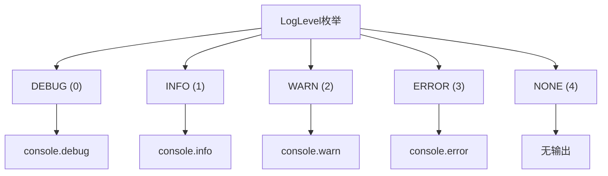
```mermaid
flowchart TD
LogLevel["LogLevel枚举"] --> Debug["DEBUG (0)"]
LogLevel --> Info["INFO (1)"]
LogLevel --> Warn["WARN (2)"]
LogLevel --> Error["ERROR (3)"]
LogLevel --> None["NONE (4)"]
Debug --> ConsoleDebug["console.debug"]
Info --> ConsoleInfo["console.info"]
Warn --> ConsoleWarn["console.warn"]
Error --> ConsoleError["console.error"]
None --> NoOutput["无输出"]
```

**图表来源**
- [packages/common/src/utils/logger.ts](file://packages/common/src/utils/logger.ts#L6-L12)

#### 环境级别控制
日志系统根据NODE_ENV环境变量自动设置日志级别：

- **生产环境**：默认设置为WARN级别，移除DEBUG和INFO级别的日志输出
- **开发环境**：默认设置为DEBUG级别，允许所有级别的日志输出
- **手动控制**：可通过setLevel方法动态调整日志级别

#### 日志方法实现
日志管理系统提供标准化的日志方法：

- **debug()**：用于调试信息输出，生产环境中默认禁用
- **info()**：用于一般信息输出
- **warn()**：用于警告信息输出
- **error()**：用于错误信息输出
- **table()**：用于表格形式的日志输出

### 应用场景

#### 事件日志管理
EventEmitter类集成了统一的日志管理系统：

- **事件发射日志**：在emit方法中使用logger.info记录事件发射
- **回调执行日志**：记录回调函数的执行状态
- **错误处理日志**：记录事件处理过程中的错误信息

#### 扩展开发日志
扩展开发过程中可以使用统一的日志系统：

- **调试信息**：使用logger.debug记录扩展的调试信息
- **状态跟踪**：使用logger.info记录扩展的状态变化
- **错误诊断**：使用logger.error记录扩展的错误信息
- **性能监控**：使用logger.warn记录潜在的性能问题

### 性能优化效果
- **生产环境优化**：移除了25+处console.log调试输出
- **内存使用优化**：减少了日志对象的创建和内存占用
- **网络传输优化**：避免了不必要的日志数据传输
- **渲染性能优化**：减少了控制台输出对渲染性能的影响

**章节来源**
- [packages/common/src/utils/logger.ts](file://packages/common/src/utils/logger.ts#L1-L62)
- [packages/common/src/event/event.ts](file://packages/common/src/event/event.ts#L14-L24)
- [packages/plugin-main/src/utils/event.ts](file://packages/plugin-main/src/utils/event.ts#L15-L23)

## 依赖关系分析
- 组件耦合
  - useEditorExtension 依赖 AppContext 中的插件管理器与内置扩展集合。
  - kit.tsx 依赖内置扩展集合与扩展包装器解析逻辑。
  - collaboration.tsx 依赖协作扩展和用户状态管理。
  - utilities 提供跨扩展复用的工具函数。
  - **新增：externalExtensions参数依赖PluginManager的loadExternalPluginExtensions方法**。
  - **新增：NodeSelectionCursor扩展依赖awareness协议和ProseMirror装饰系统**。
  - **新增：Callout扩展依赖React组件系统和TiPtap框架**。
  - **新增：Bookmark扩展依赖React组件系统和TiPtap框架**。
  - **新增：Title扩展依赖文件服务和React组件系统**。
  - **新增：改进的ToC功能依赖动画效果和滚动监听**。
  - **新增：编辑器效果工具依赖Editor类型和链式命令**。
  - **新增：列管理扩展依赖ProseMirror模型和装饰系统**。
  - **新增：拖拽扩展依赖拖拽事件处理和指示器管理**。
  - **新增：可调整列宽扩展依赖装饰插件和CSS样式**。
  - **新增：AI列工具集依赖Zod验证和Markdown解析**。
  - **新增：统一日志管理系统依赖环境变量进行级别控制**。
- 外部依赖
  - TiPtap 生态（@tiptap/core、@tiptap/react、@tiptap/pm 等）为扩展与编辑器提供基础能力。
  - Yjs 为协作扩展提供实时同步能力。
  - 插件管理器通过动态脚本加载远程插件，实现扩展的热插拔。
  - **协作邀请API提供插件同步的后端支持**。
  - **awareness协议为节点选择状态同步提供基础设施**。
  - **@kn/ui和@kn/icon提供UI组件和图标支持**。
  - **scroll-into-view-if-needed提供平滑滚动效果**.
  - **@tiptap/pm/state提供ProseMirror状态管理**。
  - **文件服务提供统一的文件操作接口**。
  - **EventEmitter提供统一的事件日志管理**。
  - **Zod提供类型安全的输入验证**。
  - **DOMParser提供HTML解析功能**。
- 目录功能依赖
  - TableOfContents 扩展负责从文档中提取标题并生成层级索引。
  - Heading 扩展提供标题节点的属性与键盘快捷键支持。
  - CollaborationEditor 将 ToC 与编辑器内容并排布局，启用粘性定位。
  - **改进的ToC功能依赖动画效果和滚动监听**。
- **节点选择可视化依赖**
  - **NodeSelectionCursor扩展依赖ProseMirror的Decoration系统**。
  - **协作光标扩展依赖awareness协议的状态同步**。
  - **样式系统提供节点选择的视觉反馈**。
- **Callout扩展依赖**
  - **React组件系统用于视图渲染**。
  - **TiPtap框架提供节点视图和命令支持**。
  - **@kn/ui提供UI组件库支持**。
  - **@kn/icon提供图标组件支持**。
  - **主题系统提供深浅色主题适配**。
  - **颜色预设系统提供九种预设颜色方案**。
- **Bookmark扩展依赖**
  - **React组件系统用于视图渲染**。
  - **TiPtap框架提供节点视图和命令支持**。
  - **@kn/ui提供UI组件库支持**。
  - **@kn/icon提供图标组件支持**。
  - **fetch API提供URL元数据抓取**。
  - **DOMParser提供HTML解析功能**。
- **Title扩展依赖**
  - **React组件系统用于视图渲染**。
  - **TiPtap框架提供节点视图和命令支持**。
  - **@kn/ui提供UI组件库支持**。
  - **@kn/icon提供图标组件支持**。
  - **文件服务提供统一的文件操作接口**。
  - **拖拽事件处理提供交互控制**。
- **ToC功能依赖**
  - **scroll-into-view-if-needed提供平滑滚动**。
  - **@tiptap/pm/state提供ProseMirror状态管理**。
  - **@kn/ui提供滚动区域组件**。
  - **动画系统提供高亮闪烁效果**。
- **编辑器效果工具依赖**
  - **Editor类型提供统一的编辑器接口**。
  - **链式命令提供命令执行机制**。
- **列管理扩展依赖**
  - **ProseMirror模型提供节点操作**。
  - **装饰系统提供列宽渲染**。
  - **缓存机制提供性能优化**。
- **拖拽扩展依赖**
  - **拖拽事件处理提供拖拽功能**。
  - **指示器管理提供可视化反馈**。
  - **延迟机制提供用户体验优化**。
- **可调整列宽扩展依赖**
  - **装饰插件提供列宽渲染**。
  - **CSS样式提供视觉反馈**。
  - **缓存机制提供性能优化**.
- **AI列工具集依赖**
  - **Zod验证提供类型安全**。
  - **Markdown解析提供内容转换**。
  - **Editor类型提供编辑器操作**。
  - **scrollToPosition工具提供滚动定位**。
- **日志管理系统依赖**
  - **环境变量控制日志级别**。
  - **EventEmitter提供事件日志记录**。
  - **统一的日志输出格式**。

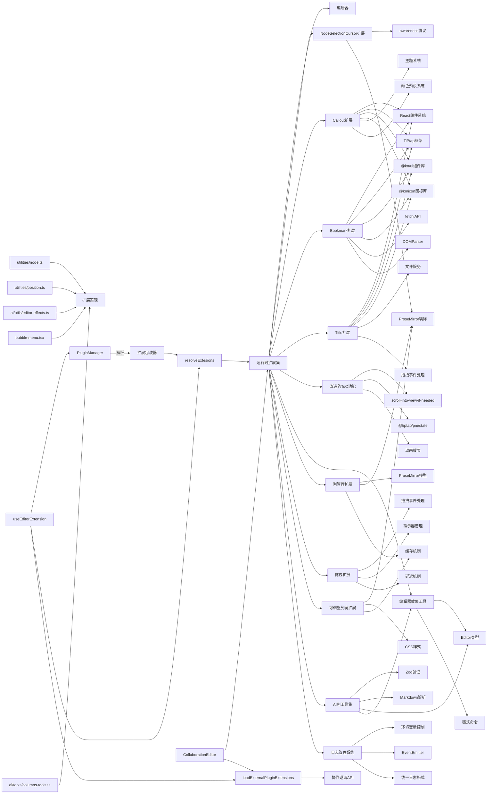
```mermaid
graph LR
PM["PluginManager"] --> |解析| EXTWRAP["扩展包装器"]
EXTWRAP --> KIT["resolveExtesions"]
KIT --> RUNTIME["运行时扩展集"]
USEEXT["useEditorExtension"] --> PM
USEEXT --> KIT
USEEXT --> EXT_PM["loadExternalPluginExtensions"]
COLLAB["CollaborationEditor"] --> RUNTIME
COLLAB --> EXT_PM
EXT_PM --> INVITE_API["协作邀请API"]
RUNTIME --> EDITOR["编辑器"]
RUNTIME --> NSC["NodeSelectionCursor扩展"]
RUNTIME --> CALLOUT["Callout扩展"]
RUNTIME --> BOOKMARK["Bookmark扩展"]
RUNTIME --> TITLE["Title扩展"]
RUNTIME --> TOC["改进的ToC功能"]
RUNTIME --> EFFECTS["编辑器效果工具"]
RUNTIME --> COLUMNS["列管理扩展"]
RUNTIME --> DRAGABLE["拖拽扩展"]
RUNTIME --> RESIZABLE["可调整列宽扩展"]
RUNTIME --> AI["AI列工具集"]
RUNTIME --> LOGGER["日志管理系统"]
NSC --> AWARENESS["awareness协议"]
NSC --> DECORATION["ProseMirror装饰"]
CALLOUT --> REACT["React组件系统"]
CALLOUT --> TIP["TiPtap框架"]
CALLOUT --> UI["@kn/ui组件库"]
CALLOUT --> ICON["@kn/icon图标库"]
CALLOUT --> THEME["主题系统"]
CALLOUT --> PRESET["颜色预设系统"]
BOOKMARK --> REACT
BOOKMARK --> TIP
BOOKMARK --> UI
BOOKMARK --> ICON
BOOKMARK --> FETCH["fetch API"]
BOOKMARK --> PARSER["DOMParser"]
TITLE --> REACT
TITLE --> TIP
TITLE --> UI["@kn/ui组件库"]
TITLE --> ICON["@kn/icon图标库"]
TITLE --> FILE_SERVICE["文件服务"]
TITLE --> DRAG["拖拽事件处理"]
TOC --> SCROLL["scroll-into-view-if-needed"]
TOC --> PMSTATE["@tiptap/pm/state"]
TOC --> ANIMATION["动画效果"]
EFFECTS --> EDITORTYPE["Editor类型"]
EFFECTS --> CHAIN["链式命令"]
COLUMNS --> PMMODEL["ProseMirror模型"]
COLUMNS --> DECORATION
COLUMNS --> CACHE["缓存机制"]
DRAGABLE --> DRAGEVENT["拖拽事件处理"]
DRAGABLE --> INDICATOR["指示器管理"]
DRAGABLE --> DELAY["延迟机制"]
RESIZABLE --> DECORATION
RESIZABLE --> CSS["CSS样式"]
RESIZABLE --> CACHE
AI --> ZOD["Zod验证"]
AI --> MARKDOWN["Markdown解析"]
AI --> EDITORTYPE
AI --> EFFECTS
LOGGER --> ENV["环境变量控制"]
LOGGER --> EVENT["EventEmitter"]
LOGGER --> FORMAT["统一日志格式"]
UTL_NODE["utilities/node.ts"] --> EXTENSIONS["扩展实现"]
UTL_POS["utilities/position.ts"] --> EXTENSIONS
UTL_EFFECTS["ai/utils/editor-effects.ts"] --> EXTENSIONS
BMENU["bubble-menu.tsx"] --> EXTENSIONS
COLUMNS_TOOLS["ai/tools/columns-tools.ts"] --> EXTENSIONS
```

**图表来源**
- [packages/editor/src/editor/use-extension.ts](file://packages/editor/src/editor/use-extension.ts#L1-L64)
- [packages/editor/src/editor/kit.tsx](file://packages/editor/src/editor/kit.tsx#L1-L87)
- [packages/editor/src/editor/collaboration.tsx](file://packages/editor/src/editor/collaboration.tsx#L1-L208)
- [packages/common/src/core/PluginManager.ts](file://packages/common/src/core/PluginManager.ts#L440-L484)
- [packages/plugin-main/docs/COLLABORATION_API.md](file://packages/plugin-main/docs/COLLABORATION_API.md#L663-L731)
- [packages/editor/src/extensions/collaboration-cursor/collaboration-cursor.ts](file://packages/editor/src/extensions/collaboration-cursor/collaboration-cursor.ts#L1-L230)
- [packages/editor/src/extensions/info-panel/index.tsx](file://packages/editor/src/extensions/info-panel/index.tsx#L1-L96)
- [packages/editor/src/extensions/bookmark/index.tsx](file://packages/editor/src/extensions/bookmark/index.tsx#L1-L15)
- [packages/editor/src/extensions/title/index.ts](file://packages/editor/src/extensions/title/index.ts#L1-L10)
- [packages/editor/src/editor/ToC.tsx](file://packages/editor/src/editor/ToC.tsx#L1-L180)
- [packages/core/src/ai/utils/editor-effects.ts](file://packages/core/src/ai/utils/editor-effects.ts#L1-L12)
- [packages/core/src/ai/tools/columns-tools.ts](file://packages/core/src/ai/tools/columns-tools.ts#L1-L616)
- [packages/editor/src/extensions/columns/column.tsx](file://packages/editor/src/extensions/columns/column.tsx#L1-L133)
- [packages/editor/src/extensions/dragable/dragable.ts](file://packages/editor/src/extensions/dragable/dragable.ts#L1-L632)
- [packages/editor/src/extensions/resizable-columns/resizable-columns.ts](file://packages/editor/src/extensions/resizable-columns/resizable-columns.ts#L1-L16)
- [packages/common/src/utils/logger.ts](file://packages/common/src/utils/logger.ts#L1-L62)
- [packages/common/src/event/event.ts](file://packages/common/src/event/event.ts#L1-L44)

**章节来源**
- [packages/editor/src/editor/use-extension.ts](file://packages/editor/src/editor/use-extension.ts#L1-L64)
- [packages/editor/src/editor/kit.tsx](file://packages/editor/src/editor/kit.tsx#L1-L87)
- [packages/editor/src/editor/collaboration.tsx](file://packages/editor/src/editor/collaboration.tsx#L1-L208)
- [packages/common/src/core/PluginManager.ts](file://packages/common/src/core/PluginManager.ts#L440-L484)
- [packages/plugin-main/docs/COLLABORATION_API.md](file://packages/plugin-main/docs/COLLABORATION_API.md#L663-L731)
- [packages/editor/src/extensions/collaboration-cursor/collaboration-cursor.ts](file://packages/editor/src/extensions/collaboration-cursor/collaboration-cursor.ts#L1-L230)
- [packages/editor/src/extensions/info-panel/index.tsx](file://packages/editor/src/extensions/info-panel/index.tsx#L1-L96)
- [packages/editor/src/extensions/bookmark/index.tsx](file://packages/editor/src/extensions/bookmark/index.tsx#L1-L15)
- [packages/editor/src/extensions/title/index.ts](file://packages/editor/src/extensions/title/index.ts#L1-L10)
- [packages/editor/src/editor/ToC.tsx](file://packages/editor/src/editor/ToC.tsx#L1-L180)
- [packages/core/src/ai/utils/editor-effects.ts](file://packages/core/src/ai/utils/editor-effects.ts#L1-L12)
- [packages/core/src/ai/tools/columns-tools.ts](file://packages/core/src/ai/tools/columns-tools.ts#L1-L616)
- [packages/editor/src/extensions/columns/column.tsx](file://packages/editor/src/extensions/columns/column.tsx#L1-L133)
- [packages/editor/src/extensions/dragable/dragable.ts](file://packages/editor/src/extensions/dragable/dragable.ts#L1-L632)
- [packages/editor/src/extensions/resizable-columns/resizable-columns.ts](file://packages/editor/src/extensions/resizable-columns/resizable-columns.ts#L1-L16)
- [packages/common/src/utils/logger.ts](file://packages/common/src/utils/logger.ts#L1-L62)
- [packages/common/src/event/event.ts](file://packages/common/src/event/event.ts#L1-L44)

## 性能考虑
- 扩展解析与合并
  - 在 useEditorExtension 中对扩展进行去重与过滤，避免重复注入导致的性能损耗。
  - 使用 useMemo 对扩展集合进行缓存，减少不必要的重新计算。
  - 仅在必要时重新解析扩展包装器，减少不必要的计算。
  - **externalExtensions参数参与memoization，避免外部扩展的重复计算**。
- 协作扩展优化
  - 通过 userRef 缓存用户信息，避免协作扩展的重复创建。
  - 使用 React.useMemo 优化扩展数组的构建过程。
  - 条件性地添加协作扩展，避免非协作场景的性能开销。
  - **外部扩展的稳定缓存，减少协作场景下的性能损耗**。
  - **NodeSelectionCursor扩展使用独立的插件键，避免与主协作扩展的性能冲突**。
  - **Callout扩展使用useMemo和useCallback进行性能优化**。
  - **Callout扩展的颜色计算使用useMemo优化**。
  - **Callout扩展的气泡菜单使用useMemo优化渲染**。
  - **Bookmark扩展使用memo进行性能优化**。
  - **Title扩展使用useMemo和useCallback进行性能优化**。
  - **ToC组件使用useMemo优化滚动监听和状态更新**。
  - **编辑器效果工具使用安全位置计算优化性能**。
  - **列扩展使用getFlex缓存机制优化渲染性能**。
  - **拖拽扩展使用延迟机制优化用户体验**。
  - **可调整列宽扩展使用装饰插件优化渲染**。
  - **AI列工具集使用递归遍历优化嵌套列处理**。
  - **日志管理系统减少了生产环境的性能开销**。
- 目录滚动检测
  - **改进的ToC组件在滚动时进行DOM查询与位置计算，使用useMemo优化计算结果**。
  - **实现debounce机制避免频繁触发导致的布局抖动**。
- 斜杠菜单
  - 斜杠扩展的 items 由插件与内置扩展共同提供，建议按需收集，避免过多条目影响渲染性能。
- 位置计算与 UI 更新
  - 位置计算函数应结合节流/防抖策略，避免频繁触发导致的布局抖动。
- 协作与事务过滤
  - UniqueID 扩展的事务过滤可减少协作回写带来的无效更新。
  - 使用 isChangeOrigin 函数过滤协作事务，防止无限循环。
  - **节点选择状态同步使用awareness协议，避免频繁的状态更新**。
  - **Callout扩展的协作同步使用Yjs协议，避免状态冲突**。
  - **Bookmark扩展的协作同步使用Yjs协议，避免状态冲突**。
  - **Title扩展的协作同步使用Yjs协议，避免状态冲突**。
  - **ToC扩展的协作同步使用Yjs协议，避免状态冲突**。
  - **列管理扩展的协作同步使用Yjs协议，避免状态冲突**。
  - **拖拽扩展的协作同步使用Yjs协议，避免状态冲突**。
  - **可调整列宽扩展的协作同步使用Yjs协议，避免状态冲突**。
  - **AI列工具集的协作同步使用Yjs协议，避免状态冲突**。
  - **日志管理系统根据环境级别控制日志输出，减少性能开销**。
- **外部扩展加载优化**
  - **loadExternalPluginExtensions方法使用Promise.allSettled并行加载，提高外部插件的加载效率**。
  - **外部扩展的错误处理避免单个插件失败影响整体加载**。
- **节点选择装饰优化**
  - **NodeSelectionCursor扩展使用状态映射而非重新创建，保持装饰的高效更新**。
  - **awareness变化触发的装饰更新经过优化，避免不必要的重计算**。
- **Callout性能优化**
  - **CalloutView组件使用useMemo缓存类型信息，避免重复计算**。
  - **Callout颜色计算使用useMemo，根据主题和自定义属性动态计算**。
  - **Callout事件处理器使用useCallback，避免不必要的重新创建**。
  - **Callout气泡菜单使用useMemo优化按钮渲染**。
  - **Callout颜色选择器使用useMemo优化预设颜色渲染**。
  - **Callout表情选择器使用useMemo优化表情网格渲染**。
  - **移除了调试输出，优化了Callout扩展的整体性能**。
- **Bookmark性能优化**
  - **BookmarkView组件使用memo进行性能优化**。
  - **URL抓取使用AbortController和debounce机制**。
  - **元数据解析使用useMemo缓存结果**。
  - **图像加载使用onError处理失败情况**。
  - **移除了调试输出，优化了Bookmark扩展的整体性能**.
- **Title性能优化**
  - **TitleView组件使用useMemo和useCallback进行性能优化**。
  - **文件服务引用使用useMemo缓存**。
  - **拖拽事件处理使用useCallback优化**。
  - **URL处理使用useMemo缓存结果**。
  - **封面图片渲染使用useMemo优化**。
  - **移除了调试输出，优化了Title扩展的整体性能**。
- **ToC性能优化**
  - **ToC组件使用useMemo优化滚动监听和状态更新**。
  - **目录项渲染使用useMemo优化层级计算**。
  - **动画效果使用CSS而不是JavaScript**。
  - **滚动使用scroll-into-view-if-needed提供硬件加速**。
  - **移除了调试输出，优化了ToC功能的整体性能**。
- **编辑器效果工具性能优化**
  - **scrollToPosition函数使用安全位置计算避免越界**。
  - **链式命令确保命令按顺序执行**。
  - **移除了调试输出，优化了编辑器效果工具的整体性能**。
- **列管理性能优化**
  - **列扩展使用getFlex缓存机制优化列宽计算**。
  - **递归遍历使用深度跟踪和父路径管理**.
  - **列内容检索使用嵌套列标注功能**。
  - **移除了调试输出，优化了列管理功能的整体性能**。
- **拖拽扩展性能优化**
  - **拖拽扩展使用800ms延迟机制避免误触发**.
  - **拖拽指示器使用CSS动画提供流畅体验**.
  - **拖拽事件处理使用防抖机制优化性能**.
  - **移除了调试输出，优化了拖拽扩展的整体性能**.
- **可调整列宽性能优化**
  - **装饰插件使用ProseMirror系统优化渲染**.
  - **CSS过渡动画提供流畅的交互体验**.
  - **缓存机制避免重复的列宽计算**.
  - **移除了调试输出，优化了可调整列宽扩展的整体性能**.
- **AI列工具集性能优化**
  - **递归遍历使用深度跟踪优化嵌套列处理**.
  - **列内容检索使用嵌套列标注功能**.
  - **Zod验证提供类型安全避免运行时错误**.
  - **Markdown解析使用缓存机制优化内容转换**.
  - **移除了调试输出，优化了AI列工具集的整体性能**.
- **日志管理性能优化**
  - **统一的日志管理系统减少了console.log的性能开销**。
  - **环境级别的日志级别控制避免了不必要的日志输出**。
  - **EventEmitter的统一日志处理减少了事件日志的性能开销**。

**章节来源**
- [packages/editor/src/editor/use-extension.ts](file://packages/editor/src/editor/use-extension.ts#L23-L24)
- [packages/editor/src/editor/collaboration.tsx](file://packages/editor/src/editor/collaboration.tsx#L50-L54)
- [packages/editor/src/editor/collaboration.tsx](file://packages/editor/src/editor/collaboration.tsx#L56-L82)
- [packages/common/src/core/PluginManager.ts](file://packages/common/src/core/PluginManager.ts#L440-L484)
- [packages/editor/src/extensions/collaboration-cursor/collaboration-cursor.ts](file://packages/editor/src/extensions/collaboration-cursor/collaboration-cursor.ts#L126-L139)
- [packages/editor/src/extensions/info-panel/info-panel-view.tsx](file://packages/editor/src/extensions/info-panel/info-panel-view.tsx#L13-L16)
- [packages/editor/src/extensions/info-panel/menu/bubble.tsx](file://packages/editor/src/extensions/info-panel/menu/bubble.tsx#L63-L83)
- [packages/editor/src/extensions/bookmark/bookmark-view.tsx](file://packages/editor/src/extensions/bookmark/bookmark-view.tsx#L148-L187)
- [packages/editor/src/extensions/title/title-view.tsx](file://packages/editor/src/extensions/title/title-view.tsx#L1-L377)
- [packages/editor/src/editor/ToC.tsx](file://packages/editor/src/editor/ToC.tsx#L76-L107)
- [packages/core/src/ai/utils/editor-effects.ts](file://packages/core/src/ai/utils/editor-effects.ts#L7-L11)
- [packages/editor/src/extensions/columns/column.tsx](file://packages/editor/src/extensions/columns/column.tsx#L8-L38)
- [packages/editor/src/extensions/dragable/dragable.ts](file://packages/editor/src/extensions/dragable/dragable.ts#L37-L37)
- [packages/editor/src/extensions/resizable-columns/resizable-columns.ts](file://packages/editor/src/extensions/resizable-columns/resizable-columns.ts#L1-L16)
- [packages/core/src/ai/tools/columns-tools.ts](file://packages/core/src/ai/tools/columns-tools.ts#L24-L55)
- [packages/common/src/utils/logger.ts](file://packages/common/src/utils/logger.ts#L1-L62)

## 故障排查指南
- 插件未生效
  - 检查插件管理器是否正确初始化与合并服务。
  - 确认扩展包装器的 editorExtensions 字段已正确提供。
  - **检查externalExtensions参数是否正确传递给useEditorExtension**。
- 扩展冲突
  - 使用 useEditorExtension 过滤掉冲突扩展名称，或调整扩展顺序。
  - **确认externalExtensions与插件管理器扩展的优先级关系**。
- 协作功能异常
  - 检查协作提供者是否正确初始化和连接。
  - 确认用户信息是否正确传递给协作扩展。
  - 验证事务过滤机制是否正常工作。
  - **检查externalExtensions在协作场景下的传递和使用**。
  - **检查externalExtensions与协作扩展的兼容性**。
  - **检查NodeSelectionCursor扩展的awareness状态同步**。
  - **检查Callout扩展的协作同步功能**。
  - **检查Bookmark扩展的协作同步功能**.
  - **检查Title扩展的协作同步功能**.
  - **检查ToC扩展的协作同步功能**.
  - **检查列管理扩展的协作同步功能**.
  - **检查拖拽扩展的协作同步功能**.
  - **检查可调整列宽扩展的协作同步功能**.
  - **检查AI列工具集的协作同步功能**.
  - **检查日志管理系统是否正确配置**.
- 内存泄漏问题
  - 检查事件监听器是否正确清理。
  - 确认协作提供者在组件卸载时被正确销毁。
  - 验证 useMemo 依赖数组是否正确配置。
  - **确认externalExtensions的清理机制**。
  - **确认NodeSelectionCursor扩展的清理机制**。
  - **确认Callout扩展的清理机制**。
  - **确认Callout颜色选择器的清理机制**。
  - **确认Callout表情选择器的清理机制**。
  - **确认Bookmark扩展的清理机制**。
  - **确认Title扩展的清理机制**。
  - **确认ToC扩展的清理机制**。
  - **确认编辑器效果工具的清理机制**。
  - **确认列管理扩展的清理机制**。
  - **确认拖拽扩展的清理机制**。
  - **确认可调整列宽扩展的清理机制**。
  - **确认AI列工具集的清理机制**。
  - **确认EventEmitter的清理机制**。
- 目录不更新
  - 确认 TableOfContents 扩展已注入并配置 onUpdate 回调。
  - 检查 Heading 扩展是否正确渲染标题节点并带有 data-toc-id 属性。
  - **检查改进的ToC组件的滚动监听是否正常工作**。
  - **检查目录项的层级计算是否正确**。
  - **检查日志管理系统是否记录了ToC相关的调试信息**。
- 活动项不变化
  - 检查 ToC 组件的滚动监听是否绑定到正确的滚动容器。
  - 确认 getBoundingClientRect 返回的 top 值在预期范围内。
  - **检查改进的ToC组件的activeId状态管理**。
- 点击跳转异常
  - 检查 posAtDOM 与 TextSelection 的使用是否正确。
  - 确认 window.scrollTo 的偏移量与编辑器头部高度一致。
  - **检查scroll-into-view-if-needed的配置是否正确**。
- 气泡菜单定位异常
  - 检查 getReferenceClientRect 回调与默认定位选项配置。
- 节点查找失败
  - 确认节点属性中包含 blockId 或使用 getCurrentNode/getNodeAtPos 等工具函数。
- **节点选择可视化问题**
  - **检查NodeSelectionCursor扩展是否正确注入到协作编辑器中**。
  - **确认awareness协议的nodeSelection字段是否正确同步**。
  - **验证CSS样式类collaboration-cursor__node-selection是否存在**。
  - **检查节点选择检测逻辑是否正确识别不同类型的节点选择**。
- **Callout扩展问题**
  - **检查Callout扩展是否正确注册到扩展系统中**。
  - **确认CalloutView组件是否正确渲染**。
  - **验证七种类型和颜色预设功能是否正常工作**。
  - **检查自定义颜色和表情符号功能是否正确响应**。
  - **确认气泡菜单的类型切换和颜色选择功能是否正常**。
  - **检查斜杠菜单和静态菜单功能是否正常**。
  - **检查九种预设颜色方案是否正确显示和选择**。
  - **检查日志管理系统是否记录了Callout扩展的调试信息**。
- **Bookmark扩展问题**
  - **检查Bookmark扩展是否正确注册到扩展系统中**。
  - **确认BookmarkView组件是否正确渲染**。
  - **验证URL验证和元数据抓取功能是否正常工作**。
  - **检查编辑模式对话框是否正确显示**。
  - **确认点击打开链接功能是否正常**。
  - **检查favicon和预览图片的加载是否正常**。
  - **检查移除atom属性后的兼容性问题**。
  - **检查日志管理系统是否记录了Bookmark扩展的调试信息**。
- **Title扩展问题**
  - **检查Title扩展是否正确注册到扩展系统中**。
  - **确认TitleView组件是否正确渲染**.
  - **验证封面图片上传和下载功能是否正常工作**.
  - **检查拖拽定位功能是否正常**.
  - **确认文件服务集成是否正常**.
  - **检查封面图片的URL处理是否正确**.
  - **检查日志管理系统是否记录了Title扩展的调试信息**.
- **ToC功能问题**
  - **检查改进的ToC组件是否正确渲染**.
  - **确认粘性定位和滚动监听是否正常工作**.
  - **验证高亮闪烁动画是否正确触发**.
  - **检查目录项的层级缩进是否正确**.
  - **确认工具栏集成是否正常**.
  - **检查日志管理系统是否记录了ToC功能的调试信息**.
- **编辑器效果工具问题**
  - **检查scrollToPosition函数是否正确计算安全位置**.
  - **确认链式命令执行是否正常**.
  - **检查视口滚动功能是否正常**.
  - **检查日志管理系统是否记录了编辑器效果工具的调试信息**.
- **列管理功能问题**
  - **检查列扩展是否正确注册到扩展系统中**.
  - **确认列宽计算是否正确**.
  - **检查嵌套列支持是否正常工作**.
  - **验证深度跟踪和父路径管理功能**.
  - **检查列内容检索功能是否正常**.
  - **确认列装饰渲染是否正常**.
  - **检查日志管理系统是否记录了列管理功能的调试信息**.
- **拖拽扩展问题**
  - **检查拖拽扩展是否正确注册到扩展系统中**.
  - **确认拖拽手柄显示是否正常**.
  - **验证列拖拽指示器功能是否正常**.
  - **检查拖拽延迟机制是否正常**.
  - **确认侧边检测功能是否正常**.
  - **检查拖拽事件处理是否正常**.
  - **检查日志管理系统是否记录了拖拽扩展的调试信息**.
- **可调整列宽功能问题**
  - **检查可调整列宽扩展是否正确注册到扩展系统中**.
  - **确认拖拽手柄显示是否正常**.
  - **验证视觉反馈功能是否正常**.
  - **检查列宽缓存机制是否正常**.
  - **确认装饰插件渲染是否正常**.
  - **检查日志管理系统是否记录了可调整列宽扩展的调试信息**.
- **AI列工具集问题**
  - **检查AI列工具集是否正确注册到扩展系统中**.
  - **确认列操作API是否正常工作**.
  - **验证嵌套列支持是否正常**.
  - **检查输入验证功能是否正常**.
  - **确认Markdown解析功能是否正常**.
  - **检查滚动定位功能是否正常**.
  - **检查日志管理系统是否记录了AI列工具集的调试信息**.
- **外部扩展加载失败**
  - **检查loadExternalPluginExtensions方法的插件元数据格式**.
  - **确认插件URL和pluginKey的有效性**.
  - **验证插件脚本的正确加载和editorExtensions的提取**.
- **协作邀请插件同步问题**
  - **检查协作邀请API的插件获取接口是否正常工作**.
  - **确认前端插件加载逻辑和错误处理**.
  - **验证externalExtensions在CollaborationEditor中的正确传递**.
- **文件服务问题**
  - **检查文件服务是否正确注册到插件管理器中**.
  - **确认文件上传和下载功能是否正常**.
  - **验证文件URL转换是否正确**.
  - **检查文件服务的错误处理机制**.
- **日志系统问题**
  - **检查日志级别是否正确设置**.
  - **确认环境变量NODE_ENV的配置**.
  - **验证EventEmitter的统一日志处理**.
  - **检查日志输出格式是否正确**.
  - **确认生产环境中的日志输出被正确过滤**.

**章节来源**
- [packages/common/src/core/PluginManager.ts](file://packages/common/src/core/PluginManager.ts#L440-L484)
- [packages/editor/src/editor/use-extension.ts](file://packages/editor/src/editor/use-extension.ts#L1-L64)
- [packages/editor/src/editor/collaboration.tsx](file://packages/editor/src/editor/collaboration.tsx#L124-L129)
- [packages/plugin-main/docs/COLLABORATION_API.md](file://packages/plugin-main/docs/COLLABORATION_API.md#L663-L731)
- [packages/plugin-main/src/pages/InviteCollaboration/index.tsx](file://packages/plugin-main/src/pages/InviteCollaboration/index.tsx#L531)
- [packages/editor/src/extensions/collaboration-cursor/collaboration-cursor.ts](file://packages/editor/src/extensions/collaboration-cursor/collaboration-cursor.ts#L1-L230)
- [packages/editor/src/extensions/info-panel/index.tsx](file://packages/editor/src/extensions/info-panel/index.tsx#L1-L96)
- [packages/editor/src/extensions/bookmark/index.tsx](file://packages/editor/src/extensions/bookmark/index.tsx#L1-L15)
- [packages/editor/src/extensions/title/index.ts](file://packages/editor/src/extensions/title/index.ts#L1-L10)
- [packages/editor/src/editor/ToC.tsx](file://packages/editor/src/editor/ToC.tsx#L1-L180)
- [packages/core/src/ai/utils/editor-effects.ts](file://packages/core/src/ai/utils/editor-effects.ts#L1-L12)
- [packages/editor/src/extensions/columns/column.tsx](file://packages/editor/src/extensions/columns/column.tsx#L1-L133)
- [packages/editor/src/extensions/dragable/dragable.ts](file://packages/editor/src/extensions/dragable/dragable.ts#L1-L632)
- [packages/editor/src/extensions/resizable-columns/resizable-columns.ts](file://packages/editor/src/extensions/resizable-columns/resizable-columns.ts#L1-L16)
- [packages/core/src/ai/tools/columns-tools.ts](file://packages/core/src/ai/tools/columns-tools.ts#L1-L616)
- [packages/plugin-file-manager/src/services/FileServiceImpl.ts](file://packages/plugin-file-manager/src/services/FileServiceImpl.ts#L1-L148)
- [packages/core/src/services/file-service.ts](file://packages/core/src/services/file-service.ts#L1-L35)
- [packages/common/src/core/types.ts](file://packages/common/src/core/types.ts#L1-L66)
- [packages/common/src/utils/logger.ts](file://packages/common/src/utils/logger.ts#L1-L62)
- [packages/common/src/event/event.ts](file://packages/common/src/event/event.ts#L1-L44)
- [packages/plugin-main/src/utils/event.ts](file://packages/plugin-main/src/utils/event.ts#L1-L44)

## 结论
编辑器扩展系统通过插件管理器与扩展解析机制，实现了灵活的扩展装配与动态扩展能力。最新的协作扩展集成提供了实时协作编辑功能，包括多用户同步、光标管理和事务过滤。**新增的externalExtensions参数和loadExternalPluginExtensions方法，为协作场景提供了完整的插件同步机制**。**新增的NodeSelectionCursor扩展显著增强了协作体验，提供节点选择状态的可视化同步**。**全新的Callout扩展系统提供了强大的气泡信息面板功能，支持七种类型和丰富的自定义选项，包括九种预设颜色方案**。**全新的Bookmark扩展系统提供了富书签卡片功能，支持URL、标题、描述和预览图片**。**全新的Title扩展系统提供了封面图片功能，支持拖拽定位控制和文件服务集成**。**重大改进的ToC功能提供了现代化的目录导航体验，包括粘性定位、滑出动画和高亮闪烁效果**。**新增的编辑器效果工具增强了编辑器操作的可靠性，提供统一的滚动定位和文本选择功能**。**改进的列管理功能支持嵌套列、深度跟踪和父路径管理，提供完整的列操作API**。**拖拽到列功能提供了可视化的列布局创建，支持精确的列插入位置控制**。**可调整列宽功能提供了专业的列宽调整工具，支持精确的布局控制**。**AI列工具集提供了完整的列操作API，支持AI代理的列管理需求**。扩展memoization优化显著提升了性能，而完善的清理机制确保了内存安全。**实施的统一日志管理系统移除了生产环境中的调试输出，提供了环境级别的日志级别控制**。内置扩展集合确保了基础体验，工具函数与组件增强了扩展的可用性与一致性。**协作邀请API的完善为插件同步提供了完整的后端支持**。**节点选择可视化功能的加入使得协作编辑更加直观和高效**。**Callout扩展的加入为编辑器提供了更丰富的信息展示能力**。**Bookmark扩展的加入为编辑器提供了更丰富的媒体内容展示能力**。**Title扩展的加入为编辑器提供了更丰富的封面图片展示能力**。**改进的ToC功能的加入为编辑器提供了更优质的导航体验**。**编辑器效果工具的加入为编辑器提供了更可靠的编辑器操作能力**。**列管理功能的改进为编辑器提供了更强大的布局控制能力**。**拖拽到列功能的加入为编辑器提供了更直观的布局创建体验**。**可调整列宽功能的加入为编辑器提供了更专业的布局控制工具**。**AI列工具集的加入为编辑器提供了更智能的列管理能力**。**统一日志管理系统的加入为编辑器提供了更好的调试和监控能力**。遵循本文档的开发与集成规范，可高效实现文本格式化、特殊节点插入与交互功能，并保持良好的性能与可维护性。

## 附录：自定义扩展开发指南
- 扩展接口与实现
  - 基于 TiPtap 扩展进行封装或组合，导出扩展实例并在 extensions/index.ts 中统一导出。
  - 示例路径
    - [加粗扩展](file://packages/editor/src/extensions/bold/bold.ts#L1-L4)
    - [链接扩展](file://packages/editor/src/extensions/link/link.ts#L1-L66)
    - [表格扩展组合](file://packages/editor/src/extensions/table/table-kit.ts#L1-L17)
    - **[节点选择光标扩展](file://packages/editor/src/extensions/collaboration-cursor/collaboration-cursor.ts#L1-L230)**
    - **[Callout扩展](file://packages/editor/src/extensions/info-panel/info-panel.ts#L1-L85)**
    - **[Bookmark扩展](file://packages/editor/src/extensions/bookmark/bookmark.ts#L1-L132)**
    - **[Title扩展](file://packages/editor/src/extensions/title/title.ts#L1-L91)**
    - **[ToC扩展](file://packages/editor/src/editor/ToC.tsx#L68-L180)**
    - **[编辑器效果工具](file://packages/core/src/ai/utils/editor-effects.ts#L1-L12)**
    - **[列扩展](file://packages/editor/src/extensions/columns/columns.tsx#L1-L130)**
    - **[列扩展](file://packages/editor/src/extensions/columns/column.tsx#L1-L133)**
    - **[列工具函数](file://packages/editor/src/extensions/columns/utilities.ts#L1-L242)**
    - **[拖拽扩展](file://packages/editor/src/extensions/dragable/dragable.ts#L1-L632)**
    - **[可调整列宽扩展](file://packages/editor/src/extensions/resizable-columns/resizable-columns.ts#L1-L16)**
    - **[可调整列宽扩展](file://packages/editor/src/extensions/resizable-columns/resizable-column.ts#L1-L5)**
    - **[AI列工具集](file://packages/core/src/ai/tools/columns-tools.ts#L1-L616)**
    - **[日志管理扩展](file://packages/common/src/utils/logger.ts#L1-L62)**
- 扩展注册与装配
  - 将扩展包装器加入插件配置的 editorExtensions 字段，或通过 useEditorExtension 动态注入。
  - **使用externalExtensions参数支持外部扩展注入**。
  - **集成NodeSelectionCursor扩展，提供节点选择可视化功能**。
  - **集成Callout扩展，提供气泡信息面板功能**。
  - **集成Bookmark扩展，提供书签卡片功能**。
  - **集成Title扩展，提供封面图片功能**。
  - **集成改进的ToC功能，提供现代化目录导航**。
  - **集成编辑器效果工具，提供滚动定位功能**。
  - **集成列管理扩展，提供列布局功能**。
  - **集成拖拽扩展，提供可视化列创建功能**。
  - **集成可调整列宽扩展，提供专业列宽控制功能**。
  - **集成AI列工具集，提供完整的列操作API**。
  - **集成统一日志管理，提供环境级别的日志级别控制**。
  - 参考路径
    - [useEditorExtension](file://packages/editor/src/editor/use-extension.ts#L1-L64)
    - [扩展解析与构建](file://packages/editor/src/editor/kit.tsx#L1-L87)
    - [NodeSelectionCursor扩展](file://packages/editor/src/extensions/collaboration-cursor/collaboration-cursor.ts#L1-L230)
    - [Callout扩展](file://packages/editor/src/extensions/info-panel/index.tsx#L1-L96)
    - [Bookmark扩展](file://packages/editor/src/extensions/bookmark/index.tsx#L1-L15)
    - [Title扩展](file://packages/editor/src/extensions/title/index.ts#L1-L10)
    - [ToC扩展](file://packages/editor/src/editor/ToC.tsx#L1-L180)
    - [编辑器效果工具](file://packages/core/src/ai/utils/editor-effects.ts#L1-L12)
    - [列扩展](file://packages/editor/src/extensions/columns/columns.tsx#L1-L130)
    - [列扩展](file://packages/editor/src/extensions/columns/column.tsx#L1-L133)
    - [列工具函数](file://packages/editor/src/extensions/columns/utilities.ts#L1-L242)
    - [拖拽扩展](file://packages/editor/src/extensions/dragable/dragable.ts#L1-L632)
    - [可调整列宽扩展](file://packages/editor/src/extensions/resizable-columns/resizable-columns.ts#L1-L16)
    - [可调整列宽扩展](file://packages/editor/src/extensions/resizable-columns/resizable-column.ts#L1-L5)
    - [AI列工具集](file://packages/core/src/ai/tools/columns-tools.ts#L1-L616)
    - [日志管理扩展](file://packages/common/src/utils/logger.ts#L1-L62)
- 协作扩展开发
  - 集成 @tiptap/extension-collaboration 和 @tiptap/extension-collaboration-caret
  - 实现事务过滤和用户状态管理
  - **支持externalExtensions参数，实现协作场景下的插件同步**。
  - **实现节点选择状态同步，使用独立的awareness字段**。
  - **实现Callout扩展的协作同步功能**。
  - **实现Bookmark扩展的协作同步功能**。
  - **实现Title扩展的协作同步功能**。
  - **实现ToC扩展的协作同步功能**。
  - **实现列管理扩展的协作同步功能**。
  - **实现拖拽扩展的协作同步功能**。
  - **实现可调整列宽扩展的协作同步功能**。
  - **实现AI列工具集的协作同步功能**。
  - **实现统一日志管理的协作同步功能**。
  - 参考路径
    - [协作编辑器](file://packages/editor/src/editor/collaboration.tsx#L1-L208)
    - [唯一ID扩展](file://packages/editor/src/extensions/unique-id/unique-id.ts#L1-L259)
    - [NodeSelectionCursor扩展](file://packages/editor/src/extensions/collaboration-cursor/collaboration-cursor.ts#L1-L230)
    - [Callout扩展](file://packages/editor/src/extensions/info-panel/index.tsx#L1-L96)
    - [Bookmark扩展](file://packages/editor/src/extensions/bookmark/index.tsx#L1-L15)
    - [Title扩展](file://packages/editor/src/extensions/title/index.ts#L1-L10)
    - [ToC扩展](file://packages/editor/src/editor/ToC.tsx#L1-L180)
    - [列扩展](file://packages/editor/src/extensions/columns/columns.tsx#L1-L130)
    - [列扩展](file://packages/editor/src/extensions/columns/column.tsx#L1-L133)
    - [拖拽扩展](file://packages/editor/src/extensions/dragable/dragable.ts#L1-L632)
    - [可调整列宽扩展](file://packages/editor/src/extensions/resizable-columns/resizable-columns.ts#L1-L16)
    - [可调整列宽扩展](file://packages/editor/src/extensions/resizable-columns/resizable-column.ts#L1-L5)
    - [AI列工具集](file://packages/core/src/ai/tools/columns-tools.ts#L1-L616)
    - [日志管理扩展](file://packages/common/src/utils/logger.ts#L1-L62)
- **外部扩展加载开发**
  - **实现loadExternalPluginExtensions方法，支持协作场景下的外部插件扩展加载**。
  - **参考PluginManager的实现，确保正确的错误处理和缓存机制**。
  - **实现协作邀请API，提供插件同步功能**。
- **节点选择可视化开发**
  - **实现NodeSelectionCursor扩展，提供节点选择状态同步**。
  - **使用独立的awareness字段避免与yCursorPlugin冲突**。
  - **实现ProseMirror装饰系统，提供视觉反馈**。
  - **参考NodeSelectionCursor扩展的实现**。
- **Callout扩展开发**
  - **实现Callout扩展，提供气泡信息面板功能**。
  - **定义七种类型系统和颜色方案**。
  - **实现视图组件和气泡菜单**。
  - **提供静态菜单和斜杠菜单支持**。
  - **实现自定义功能，包括颜色和表情符号**。
  - **实现九种预设颜色方案**。
  - **参考Callout扩展的实现**。
- **Bookmark扩展开发**
  - **实现Bookmark扩展，提供书签卡片功能**。
  - **定义属性系统和命令**。
  - **实现视图组件和工具栏按钮**。
  - **提供URL验证和元数据抓取功能**。
  - **实现编辑模式和只读模式**。
  - **考虑移除atom属性后的兼容性问题**。
  - **参考Bookmark扩展的实现**。
- **Title扩展开发**
  - **实现Title扩展，提供标题功能和封面图片**。
  - **定义属性系统，包括UUID、图标和封面图片**。
  - **实现视图组件，支持封面图片上传和拖拽定位**。
  - **集成文件服务，支持图片文件的上传和下载**。
  - **实现拖拽定位功能，支持垂直位置控制**。
  - **参考Title扩展的实现**。
- **ToC功能开发**
  - **实现改进的ToC组件，提供现代化目录导航**。
  - **实现粘性定位和滚动监听**。
  - **实现高亮闪烁动画效果**。
  - **提供工具栏集成和响应式设计**。
  - **参考ToC扩展的实现**。
- **编辑器效果工具开发**
  - **实现scrollToPosition函数，提供统一的滚动定位和文本选择功能**。
  - **实现安全位置计算和视口滚动**。
  - **参考编辑器效果工具的实现**。
- **列管理功能开发**
  - **实现列扩展，支持嵌套列布局和深度跟踪**。
  - **实现列宽计算和装饰系统**。
  - **提供列内容检索和嵌套列标注功能**。
  - **实现列装饰插件和缓存机制**。
  - **参考列扩展的实现**。
- **拖拽到列功能开发**
  - **实现拖拽扩展，提供可视化列创建功能**。
  - **实现拖拽手柄和指示器系统**。
  - **提供拖拽延迟和侧边检测功能**.
  - **实现拖拽事件处理和智能隐藏**.
  - **参考拖拽扩展的实现**.
- **可调整列宽功能开发**
  - **实现可调整列宽扩展，提供专业列宽控制**.
  - **实现拖拽手柄和视觉反馈**.
  - **提供列宽缓存和装饰插件**.
  - **实现CSS动画和过渡效果**.
  - **参考可调整列宽扩展的实现**.
- **AI列工具集开发**
  - **实现AI列工具集，提供完整的列操作API**.
  - **实现嵌套列支持和深度跟踪**.
  - **提供类型安全的输入验证**.
  - **实现Markdown解析和滚动定位**.
  - **参考AI列工具集的实现**.
- **文件服务集成开发**
  - **实现文件服务接口，支持文件上传、下载和管理**.
  - **集成文件服务到插件管理系统**.
  - **实现Title扩展的文件服务集成**.
  - **提供统一的文件操作API**.
  - **参考文件服务的实现**.
- **日志管理系统开发**
  - **实现统一的日志管理工具，支持环境级别的日志级别控制**.
  - **实现EventEmitter的统一日志处理**.
  - **提供DEBUG、INFO、WARN、ERROR四个日志级别**.
  - **实现环境变量控制的日志级别设置**.
  - **参考日志管理工具的实现**.
- 性能优化实践
  - 使用 useMemo 和 React.memo 进行性能优化
  - 实现适当的清理机制防止内存泄漏
  - **利用externalExtensions的稳定缓存机制**.
  - **优化节点选择装饰的更新机制**.
  - **优化Callout组件的渲染性能**.
  - **优化Callout颜色计算的性能**.
  - **优化Callout气泡菜单的渲染性能**.
  - **优化Bookmark组件的渲染性能**.
  - **优化Title组件的渲染性能**.
  - **优化ToC组件的渲染性能**.
  - **优化编辑器效果工具的性能**.
  - **优化列扩展的渲染性能**.
  - **优化拖拽扩展的性能**.
  - **优化可调整列宽扩展的性能**.
  - **优化AI列工具集的性能**.
  - **实现URL抓取的debounce和AbortController机制**.
  - **实现滚动监听的useMemo优化**.
  - **使用CSS动画替代JavaScript动画**.
  - **优化文件服务的缓存和错误处理**.
  - **优化拖拽定位的性能和精度**.
  - **实现EventEmitter的统一日志处理**.
  - **实现环境级别的日志级别控制**.
  - **实现列宽计算的缓存机制**.
  - **实现拖拽延迟的优化**.
  - **实现装饰插件的性能优化**.
  - **实现递归遍历的深度跟踪优化**.
  - **实现Zod验证的类型安全优化**.
  - **实现Markdown解析的缓存优化**.
  - **参考各扩展的性能优化实现**.
- 生命周期与钩子
  - 利用 useEditorExtension 返回的扩展列表与包装器快照，进行初始化、状态管理与清理。
  - **确保externalExtensions参数的正确传递和清理**.
  - **确保NodeSelectionCursor扩展的正确生命周期管理**.
  - **确保Callout扩展的正确生命周期管理**.
  - **确保Callout颜色选择器的正确生命周期管理**.
  - **确保Callout表情选择器的正确生命周期管理**.
  - **确保Bookmark扩展的正确生命周期管理**.
  - **确保Title扩展的正确生命周期管理**.
  - **确保ToC扩展的正确生命周期管理**.
  - **确保编辑器效果工具的正确生命周期管理**.
  - **确保列扩展的正确生命周期管理**.
  - **确保拖拽扩展的正确生命周期管理**.
  - **确保可调整列宽扩展的正确生命周期管理**.
  - **确保AI列工具集的正确生命周期管理**.
  - **确保EventEmitter的正确生命周期管理**.
- 工具函数使用
  - 节点与位置工具
    - [节点工具](file://packages/editor/src/utilities/node.ts#L1-L149)
    - [位置计算](file://packages/editor/src/utilities/position.ts#L1-L69)
  - 气泡菜单
    - [气泡菜单组件](file://packages/editor/src/components/bubble-menu.tsx#L1-L84)
  - **节点选择样式**
    - [节点选择装饰](file://packages/editor/src/extensions/selection/selection.ts#L49-L75)
  - **Callout工具函数**
    - [Callout常量](file://packages/editor/src/extensions/info-panel/constants.ts#L1-L102)
    - [Callout视图组件](file://packages/editor/src/extensions/info-panel/info-panel-view.tsx#L1-L110)
    - [Callout气泡菜单](file://packages/editor/src/extensions/info-panel/menu/bubble.tsx#L1-L190)
  - **Bookmark工具函数**
    - [Bookmark视图组件](file://packages/editor/src/extensions/bookmark/bookmark-view.tsx#L1-L496)
    - [Bookmark工具栏组件](file://packages/editor/src/extensions/bookmark/menu/menu.tsx#L1-L32)
  - **Title工具函数**
    - [Title视图组件](file://packages/editor/src/extensions/title/title-view.tsx#L1-L377)
    - [Title扩展](file://packages/editor/src/extensions/title/title.ts#L1-L91)
  - **ToC工具函数**
    - [ToC组件](file://packages/editor/src/editor/ToC.tsx#L1-L180)
    - [ToC样式](file://packages/editor/src/styles/editor.css#L73-L87)
  - **编辑器效果工具函数**
    - [编辑器效果工具](file://packages/core/src/ai/utils/editor-effects.ts#L1-L12)
  - **列管理工具函数**
    - [列扩展](file://packages/editor/src/extensions/columns/columns.tsx#L1-L130)
    - [列扩展](file://packages/editor/src/extensions/columns/column.tsx#L1-L133)
    - [列工具函数](file://packages/editor/src/extensions/columns/utilities.ts#L1-L242)
    - [列样式](file://packages/editor/src/extensions/columns/style/index.css#L1-L191)
  - **拖拽工具函数**
    - [拖拽扩展](file://packages/editor/src/extensions/dragable/dragable.ts#L1-L632)
  - **可调整列宽工具函数**
    - [可调整列宽扩展](file://packages/editor/src/extensions/resizable-columns/resizable-columns.ts#L1-L16)
    - [可调整列宽扩展](file://packages/editor/src/extensions/resizable-columns/resizable-column.ts#L1-L5)
  - **AI列工具函数**
    - [AI列工具集](file://packages/core/src/ai/tools/columns-tools.ts#L1-L616)
  - **文件服务工具函数**
    - [文件服务钩子](file://packages/core/src/services/file-service.ts#L1-L35)
    - [文件服务实现](file://packages/plugin-file-manager/src/services/FileServiceImpl.ts#L1-L148)
    - [文件服务类型定义](file://packages/common/src/core/types.ts#L1-L66)
  - **日志管理工具函数**
    - [日志工具](file://packages/common/src/utils/logger.ts#L1-L62)
    - [事件日志](file://packages/common/src/event/event.ts#L1-L44)
    - [主应用事件日志](file://packages/plugin-main/src/utils/event.ts#L1-L44)
- 目录功能开发要点
  - 使用 TableOfContents 扩展收集标题并生成层级索引。
  - 在 ToC 组件中实现滚动监听与活动项高亮。
  - 在 CollaborationEditor 中启用粘性定位并并排展示目录面板。
  - **实现高亮闪烁动画效果，提供视觉反馈**。
  - **实现统一的日志管理，记录ToC相关的调试信息**。
  - 示例路径
    - [目录扩展入口](file://packages/editor/src/extensions/table-of-content/table-of-content.ts#L1-L1)
    - [目录组件](file://packages/editor/src/editor/ToC.tsx#L72-L161)
    - [协作编辑器集成](file://packages/editor/src/editor/collaboration.tsx#L116-L136)
    - [标题扩展](file://packages/editor/src/extensions/heading/heading.ts#L1-L216)
- 测试方法
  - 单元测试：针对扩展输入规则、属性解析与状态切换进行断言。
  - 集成测试：在编辑器中验证扩展行为与 UI 交互，确保与内置扩展无冲突。
  - 性能测试：评估扩展对渲染与协作的影响，必要时进行优化与节流。
  - 协作测试：验证多用户编辑、光标同步和事务过滤功能。
  - **外部扩展测试**：验证externalExtensions参数的正确传递和使用。
  - **插件同步测试**：验证协作场景下插件扩展的一致性。
  - **节点选择可视化测试**：验证节点选择状态同步和视觉反馈。
  - **Callout功能测试**：验证七种类型、颜色预设和协作同步功能。
  - **Callout颜色预设测试**：验证九种预设颜色方案的正确显示和选择。
  - **Callout气泡菜单测试**：验证类型切换和颜色选择功能。
  - **Bookmark功能测试**：验证书签的URL验证、元数据抓取和协作同步。
  - **Title功能测试**：验证标题的封面图片上传、拖拽定位和文件服务集成。
  - **ToC功能测试**：验证目录的粘性定位、动画效果和协作同步。
  - **编辑器效果工具测试**：验证滚动定位和文本选择功能。
  - **列管理功能测试**：验证嵌套列、深度跟踪和父路径管理功能。
  - **拖拽到列功能测试**：验证拖拽手柄、指示器和延迟机制功能。
  - **可调整列宽功能测试**：验证拖拽手柄、视觉反馈和缓存机制功能。
  - **AI列工具集测试**：验证列操作API、嵌套列支持和协作同步功能。
  - **协作邀请测试**：验证协作邀请API的插件同步功能。
  - **文件服务测试**：验证文件上传、下载和URL处理功能。
  - **兼容性测试**：验证移除atom属性后的扩展兼容性问题。
  - **拖拽定位测试**：验证封面图片的拖拽定位精度和性能。
  - **错误处理测试**：验证文件服务不可用时的降级处理。
  - **日志系统测试**：验证日志级别的正确设置和输出控制。
  - **EventEmitter测试**：验证统一日志处理的正确实现。
  - **环境变量测试**：验证不同NODE_ENV下的日志级别行为。
  - **列宽计算测试**：验证列宽缓存机制和装饰插件性能。
  - **拖拽延迟测试**：验证拖拽指示器的延迟和动画效果。
  - **递归遍历测试**：验证嵌套列的深度跟踪和父路径管理。
  - **类型安全测试**：验证Zod验证的正确性和错误处理。
  - **Markdown解析测试**：验证内容转换的正确性和缓存效果。