# 块操作扩展

<cite>
**本文档中引用的文件**
- [README.md](file://README.md)
- [package.json](file://package.json)
- [turbo.json](file://turbo.json)
- [packages/plugin-block-reference/package.json](file://packages/plugin-block-reference/package.json)
- [packages/plugin-block-reference/src/index.tsx](file://packages/plugin-block-reference/src/index.tsx)
- [packages/plugin-block-reference/src/extension/block-reference/index.tsx](file://packages/plugin-block-reference/src/extension/block-reference/index.tsx)
- [packages/plugin-block-reference/src/extension/block-reference/block-references.ts](file://packages/plugin-block-reference/src/extension/block-reference/block-references.ts)
- [packages/plugin-block-reference/src/extension/block-reference/page-reference.ts](file://packages/plugin-block-reference/src/extension/block-reference/page-reference.ts)
- [packages/plugin-block-reference/src/bidirectional-link/index.ts](file://packages/plugin-block-reference/src/bidirectional-link/index.ts)
- [packages/plugin-block-reference/src/bidirectional-link/components/BacklinksPanel.tsx](file://packages/plugin-block-reference/src/bidirectional-link/components/BacklinksPanel.tsx)
- [packages/plugin-block-reference/src/bidirectional-link/components/BlockLinkNodeView.tsx](file://packages/plugin-block-reference/src/bidirectional-link/components/BlockLinkNodeView.tsx)
- [packages/plugin-block-reference/src/bidirectional-link/components/BlockLinkPicker.tsx](file://packages/plugin-block-reference/src/bidirectional-link/components/BlockLinkPicker.tsx)
- [packages/plugin-block-reference/src/bidirectional-link/components/PageLinkPicker.tsx](file://packages/plugin-block-reference/src/bidirectional-link/components/PageLinkPicker.tsx)
- [packages/plugin-block-reference/src/bidirectional-link/extensions/BlockLink.tsx](file://packages/plugin-block-reference/src/bidirectional-link/extensions/BlockLink.tsx)
- [packages/plugin-block-reference/src/bidirectional-link/extensions/PageLink.ts](file://packages/plugin-block-reference/src/bidirectional-link/extensions/PageLink.ts)
- [packages/plugin-block-reference/src/bidirectional-link/services/linkService.ts](file://packages/plugin-block-reference/src/bidirectional-link/services/linkService.ts)
- [packages/plugin-block-reference/src/hooks/useBlockInfo.ts](file://packages/plugin-block-reference/src/hooks/useBlockInfo.ts)
- [packages/plugin-block-reference/src/hooks/usePageInfo.ts](file://packages/plugin-block-reference/src/hooks/usePageInfo.ts)
- [packages/plugin-block-reference/src/utils/cache.ts](file://packages/plugin-block-reference/src/utils/cache.ts)
- [packages/core/package.json](file://packages/core/package.json)
- [packages/editor/package.json](file://packages/editor/package.json)
- [packages/common/package.json](file://packages/common/package.json)
</cite>

## 目录
1. [简介](#简介)
2. [项目结构](#项目结构)
3. [核心组件](#核心组件)
4. [架构概览](#架构概览)
5. [详细组件分析](#详细组件分析)
6. [依赖关系分析](#依赖关系分析)
7. [性能考虑](#性能考虑)
8. [故障排除指南](#故障排除指南)
9. [结论](#结论)

## 简介

块操作扩展是知识库平台中的一个核心功能模块，专门用于实现文档块之间的双向链接和引用机制。该系统基于 Tiptap 编辑器构建，提供了强大的块引用、页面引用、反向链接面板等功能，支持用户在知识库中创建智能的跨文档连接。

该项目采用现代化的前端技术栈，包括 React 18、TypeScript 5、Vite 构建工具，并通过 Turborepo 实现高效的 monorepo 管理。块操作扩展作为插件生态系统的重要组成部分，为用户提供了一个完整的知识管理解决方案。

## 项目结构

知识库项目采用 monorepo 架构，主要包含以下核心目录：

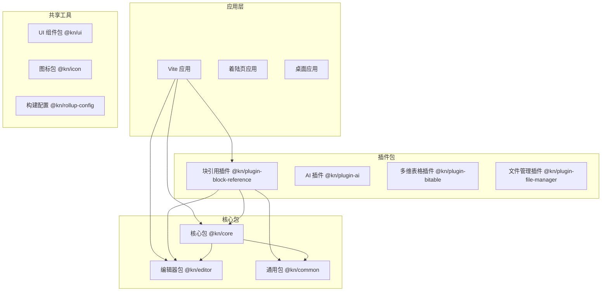

**图表来源**
- [README.md:66-97](file://README.md#L66-L97)
- [package.json:1-125](file://package.json#L1-L125)

项目的核心特点包括：

- **模块化设计**: 每个功能模块都是独立的 npm 包，便于维护和扩展
- **类型安全**: 使用 TypeScript 确保代码质量和开发体验
- **插件架构**: 支持动态加载和卸载插件功能
- **实时协作**: 集成 Hocuspocus 提供多用户实时编辑能力

**章节来源**
- [README.md:66-97](file://README.md#L66-L97)
- [package.json:1-125](file://package.json#L1-L125)

## 核心组件

块操作扩展系统由多个相互协作的组件构成，每个组件都有明确的职责分工：

### 主要组件架构

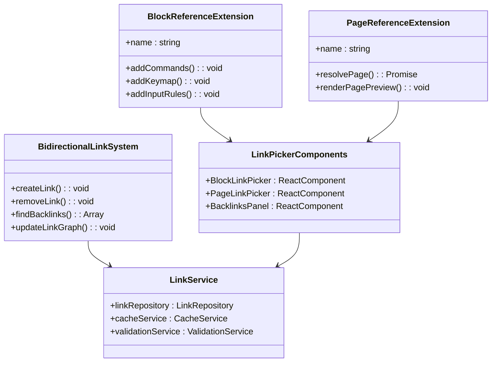

**图表来源**
- [packages/plugin-block-reference/src/extension/block-reference/index.tsx](file://packages/plugin-block-reference/src/extension/block-reference/index.tsx)
- [packages/plugin-block-reference/src/bidirectional-link/index.ts](file://packages/plugin-block-reference/src/bidirectional-link/index.ts)

### 核心功能特性

1. **块引用系统**: 允许用户在文档中引用其他块内容
2. **页面引用系统**: 支持跨页面的链接创建和管理
3. **双向链接**: 自动维护链接的双向关系
4. **反向链接面板**: 提供链接关系的可视化展示
5. **智能链接选择器**: 基于搜索和过滤的链接创建工具

**章节来源**
- [packages/plugin-block-reference/src/index.tsx](file://packages/plugin-block-reference/src/index.tsx)
- [packages/plugin-block-reference/src/extension/block-reference/block-references.ts](file://packages/plugin-block-reference/src/extension/block-reference/block-references.ts)

## 架构概览

块操作扩展采用了分层架构设计，确保了系统的可维护性和扩展性：

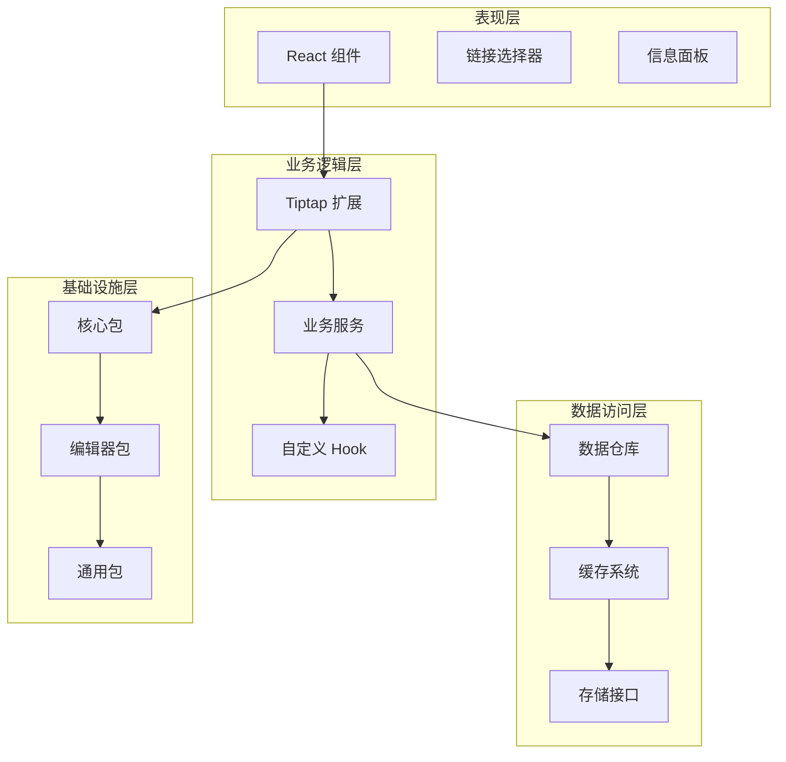

**图表来源**
- [packages/plugin-block-reference/package.json:16-23](file://packages/plugin-block-reference/package.json#L16-L23)
- [packages/core/package.json:17-34](file://packages/core/package.json#L17-L34)

### 数据流处理

系统采用事件驱动的数据流模式，确保数据的一致性和实时性：

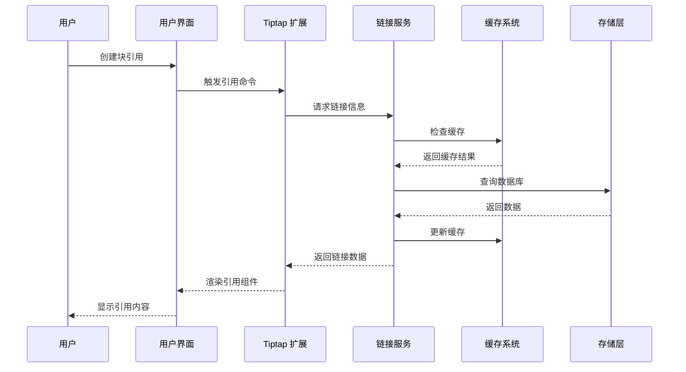

**图表来源**
- [packages/plugin-block-reference/src/bidirectional-link/services/linkService.ts](file://packages/plugin-block-reference/src/bidirectional-link/services/linkService.ts)
- [packages/plugin-block-reference/src/utils/cache.ts](file://packages/plugin-block-reference/src/utils/cache.ts)

**章节来源**
- [packages/plugin-block-reference/src/bidirectional-link/services/linkService.ts](file://packages/plugin-block-reference/src/bidirectional-link/services/linkService.ts)
- [packages/plugin-block-reference/src/utils/cache.ts](file://packages/plugin-block-reference/src/utils/cache.ts)

## 详细组件分析

### 块引用扩展组件

块引用扩展是整个系统的核心组件，负责处理块级别的引用操作：

#### 组件结构分析

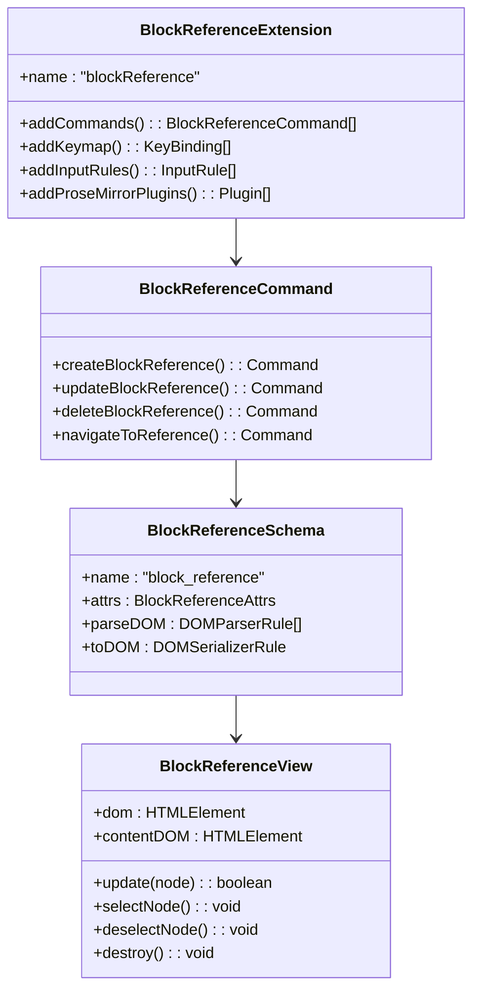

**图表来源**
- [packages/plugin-block-reference/src/extension/block-reference/block-references.ts](file://packages/plugin-block-reference/src/extension/block-reference/block-references.ts)

#### 关键实现特性

1. **命令系统**: 提供完整的块引用 CRUD 操作命令
2. **键盘快捷键**: 支持多种快捷键操作提升用户体验
3. **输入规则**: 自动识别和转换引用语法
4. **视图渲染**: 动态渲染引用内容和预览

**章节来源**
- [packages/plugin-block-reference/src/extension/block-reference/block-references.ts](file://packages/plugin-block-reference/src/extension/block-reference/block-references.ts)

### 页面引用扩展组件

页面引用扩展负责处理跨文档的页面级引用：

#### 页面引用架构

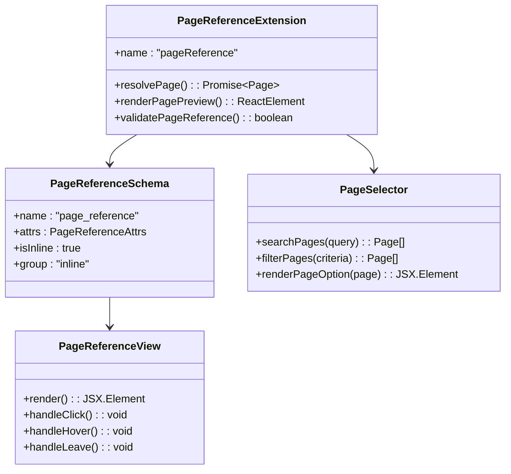

**图表来源**
- [packages/plugin-block-reference/src/extension/block-reference/page-reference.ts](file://packages/plugin-block-reference/src/extension/block-reference/page-reference.ts)

#### 核心功能实现

1. **页面解析**: 将引用语法转换为可导航的页面链接
2. **页面预览**: 提供引用页面的实时预览功能
3. **页面搜索**: 支持全文搜索和智能过滤
4. **引用验证**: 确保引用的有效性和完整性

**章节来源**
- [packages/plugin-block-reference/src/extension/block-reference/page-reference.ts](file://packages/plugin-block-reference/src/extension/block-reference/page-reference.ts)

### 双向链接系统

双向链接系统是块操作扩展的核心创新，实现了真正的知识网络连接：

#### 链接关系管理

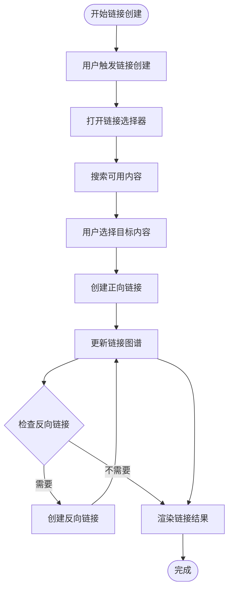

**图表来源**
- [packages/plugin-block-reference/src/bidirectional-link/services/linkService.ts](file://packages/plugin-block-reference/src/bidirectional-link/services/linkService.ts)

#### 链接服务架构

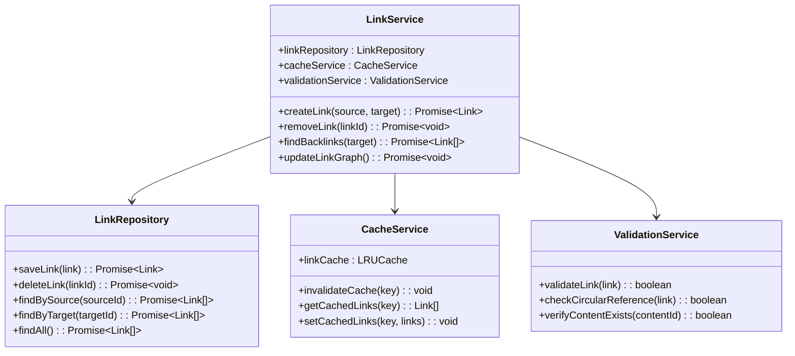

**图表来源**
- [packages/plugin-block-reference/src/bidirectional-link/services/linkService.ts](file://packages/plugin-block-reference/src/bidirectional-link/services/linkService.ts)

**章节来源**
- [packages/plugin-block-reference/src/bidirectional-link/services/linkService.ts](file://packages/plugin-block-reference/src/bidirectional-link/services/linkService.ts)

### 链接选择器组件

链接选择器提供了直观的用户界面来创建和管理链接：

#### 组件层次结构

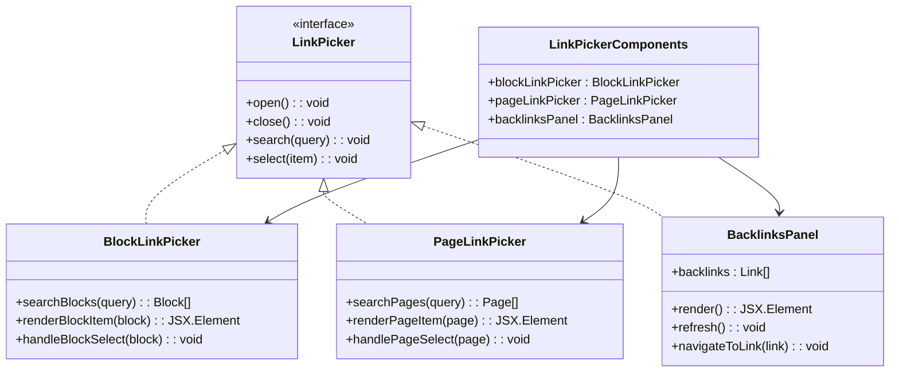

**图表来源**
- [packages/plugin-block-reference/src/bidirectional-link/components/BlockLinkPicker.tsx](file://packages/plugin-block-reference/src/bidirectional-link/components/BlockLinkPicker.tsx)
- [packages/plugin-block-reference/src/bidirectional-link/components/PageLinkPicker.tsx](file://packages/plugin-block-reference/src/bidirectional-link/components/PageLinkPicker.tsx)
- [packages/plugin-block-reference/src/bidirectional-link/components/BacklinksPanel.tsx](file://packages/plugin-block-reference/src/bidirectional-link/components/BacklinksPanel.tsx)

#### 交互流程设计

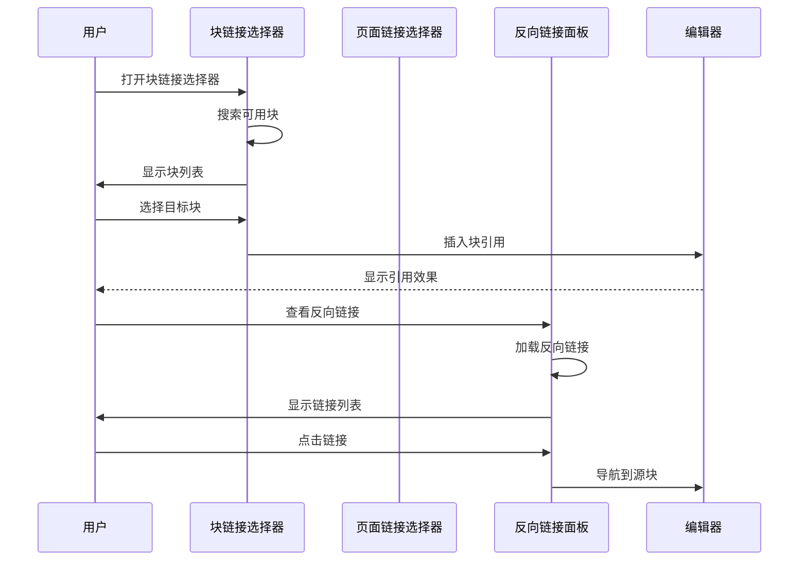

**图表来源**
- [packages/plugin-block-reference/src/bidirectional-link/components/BlockLinkPicker.tsx](file://packages/plugin-block-reference/src/bidirectional-link/components/BlockLinkPicker.tsx)
- [packages/plugin-block-reference/src/bidirectional-link/components/BacklinksPanel.tsx](file://packages/plugin-block-reference/src/bidirectional-link/components/BacklinksPanel.tsx)

**章节来源**
- [packages/plugin-block-reference/src/bidirectional-link/components/BlockLinkPicker.tsx](file://packages/plugin-block-reference/src/bidirectional-link/components/BlockLinkPicker.tsx)
- [packages/plugin-block-reference/src/bidirectional-link/components/PageLinkPicker.tsx](file://packages/plugin-block-reference/src/bidirectional-link/components/PageLinkPicker.tsx)
- [packages/plugin-block-reference/src/bidirectional-link/components/BacklinksPanel.tsx](file://packages/plugin-block-reference/src/bidirectional-link/components/BacklinksPanel.tsx)

### 自定义 Hook 系统

系统提供了丰富的自定义 Hook 来简化状态管理和业务逻辑：

#### Hook 功能矩阵

| Hook 名称 | 功能描述 | 返回值类型 | 使用场景 |
|-----------|----------|------------|----------|
| useBlockInfo | 获取块信息 | BlockInfo | 块引用显示、编辑 |
| usePageInfo | 获取页面信息 | PageInfo | 页面引用处理 |
| useKeyboardNavigation | 键盘导航 | KeyboardActions | 选择器导航 |
| useSpaceService | 空间服务 | SpaceOperations | 空间管理 |

#### Hook 实现示例

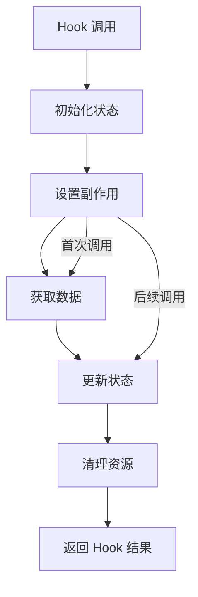

**图表来源**
- [packages/plugin-block-reference/src/hooks/useBlockInfo.ts](file://packages/plugin-block-reference/src/hooks/useBlockInfo.ts)
- [packages/plugin-block-reference/src/hooks/usePageInfo.ts](file://packages/plugin-block-reference/src/hooks/usePageInfo.ts)

**章节来源**
- [packages/plugin-block-reference/src/hooks/useBlockInfo.ts](file://packages/plugin-block-reference/src/hooks/useBlockInfo.ts)
- [packages/plugin-block-reference/src/hooks/usePageInfo.ts](file://packages/plugin-block-reference/src/hooks/usePageInfo.ts)

## 依赖关系分析

块操作扩展系统的依赖关系体现了清晰的分层架构和模块化设计：

### 外部依赖分析

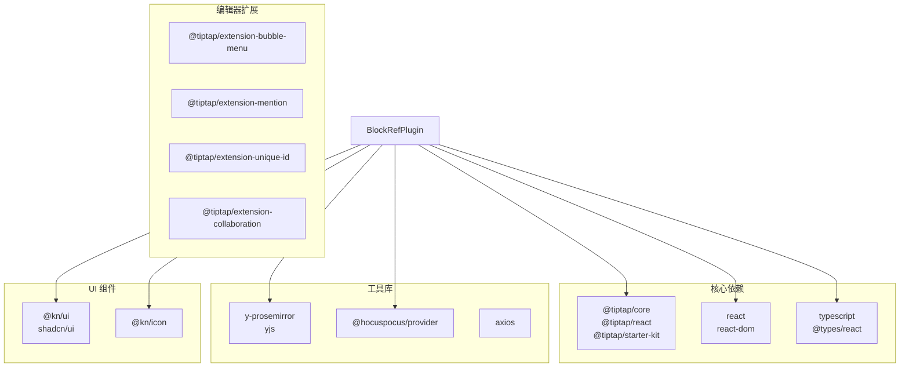

**图表来源**
- [packages/plugin-block-reference/package.json:16-23](file://packages/plugin-block-reference/package.json#L16-L23)
- [packages/editor/package.json:33-92](file://packages/editor/package.json#L33-L92)

### 内部依赖关系

系统内部的包依赖关系遵循严格的层次结构：

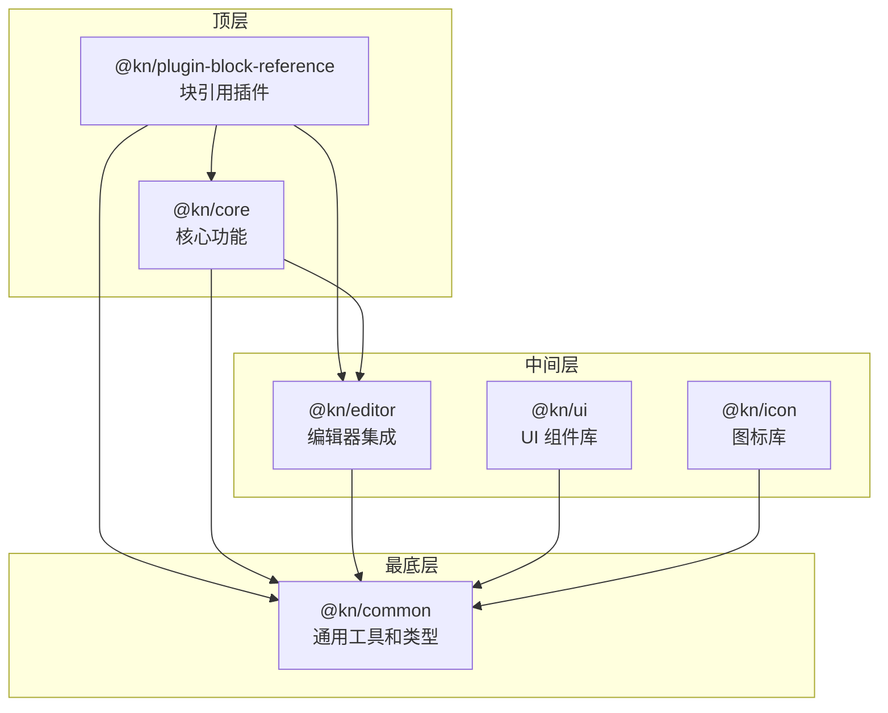

**图表来源**
- [packages/plugin-block-reference/package.json:16-23](file://packages/plugin-block-reference/package.json#L16-L23)
- [packages/core/package.json:17-34](file://packages/core/package.json#L17-L34)
- [packages/editor/package.json:16-93](file://packages/editor/package.json#L16-L93)

### 依赖版本管理

项目使用 pnpm 和 Turborepo 进行依赖管理，确保版本一致性和构建效率：

**章节来源**
- [package.json:1-125](file://package.json#L1-L125)
- [turbo.json:1-27](file://turbo.json#L1-L27)

## 性能考虑

块操作扩展系统在设计时充分考虑了性能优化，采用了多种策略来确保良好的用户体验：

### 缓存策略

系统实现了多层次的缓存机制来提升响应速度：

1. **内存缓存**: 使用 LRU 缓存存储频繁访问的链接数据
2. **持久化缓存**: 将重要数据存储在本地存储中
3. **智能失效**: 基于时间戳和变更检测的缓存失效机制

### 异步处理

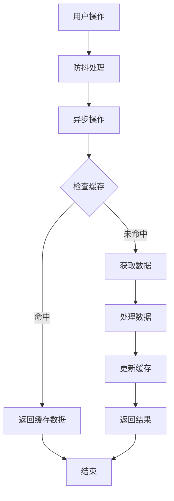

**图表来源**
- [packages/plugin-block-reference/src/utils/cache.ts](file://packages/plugin-block-reference/src/utils/cache.ts)

### 性能优化技术

1. **虚拟滚动**: 对大量链接列表使用虚拟滚动技术
2. **懒加载**: 延迟加载非关键资源
3. **增量更新**: 只更新发生变化的部分
4. **批处理**: 将多个操作合并为批处理

**章节来源**
- [packages/plugin-block-reference/src/utils/cache.ts](file://packages/plugin-block-reference/src/utils/cache.ts)

## 故障排除指南

### 常见问题及解决方案

#### 链接无法创建

**问题症状**: 用户尝试创建链接但无响应或报错

**可能原因**:
1. 编辑器实例未正确初始化
2. 权限不足无法创建链接
3. 网络连接异常

**解决步骤**:
1. 检查编辑器是否已正确挂载
2. 验证用户权限设置
3. 确认网络连接状态

#### 链接显示异常

**问题症状**: 链接显示不完整或格式错误

**可能原因**:
1. 缓存数据过期
2. 样式冲突
3. 内容渲染错误

**解决步骤**:
1. 清除缓存数据
2. 检查样式文件加载
3. 重新渲染内容

#### 反向链接不更新

**问题症状**: 删除链接后反向链接仍然存在

**可能原因**:
1. 链接图谱未及时更新
2. 后台任务执行失败
3. 数据库同步问题

**解决步骤**:
1. 手动触发链接图谱更新
2. 检查后台任务日志
3. 重新同步数据库

### 调试工具

系统提供了多种调试工具来帮助开发者诊断问题：

1. **控制台日志**: 详细的错误信息和状态跟踪
2. **性能监控**: 链接操作的性能指标
3. **网络请求追踪**: API 调用的详细记录

**章节来源**
- [packages/plugin-block-reference/src/bidirectional-link/services/linkService.ts](file://packages/plugin-block-reference/src/bidirectional-link/services/linkService.ts)

## 结论

块操作扩展系统是一个功能完善、架构清晰的知识库增强功能。通过双向链接、智能引用和可视化管理等特性，为用户提供了强大的知识组织和检索能力。

### 主要成就

1. **技术创新**: 实现了真正的双向链接系统
2. **用户体验**: 提供直观易用的链接管理界面
3. **性能优化**: 采用多种技术确保系统响应速度
4. **可扩展性**: 模块化的架构设计便于功能扩展

### 发展方向

未来的发展重点包括：
- 增强 AI 驱动的链接推荐功能
- 优化大规模知识库的性能表现
- 扩展移动端的链接管理能力
- 集成更多第三方知识管理工具

该系统为知识库平台奠定了坚实的技术基础，将继续演进以满足不断增长的知识管理需求。