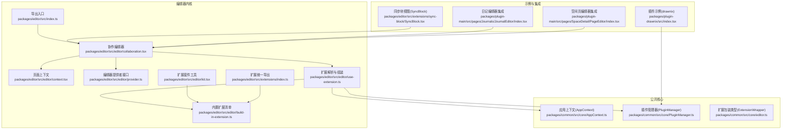
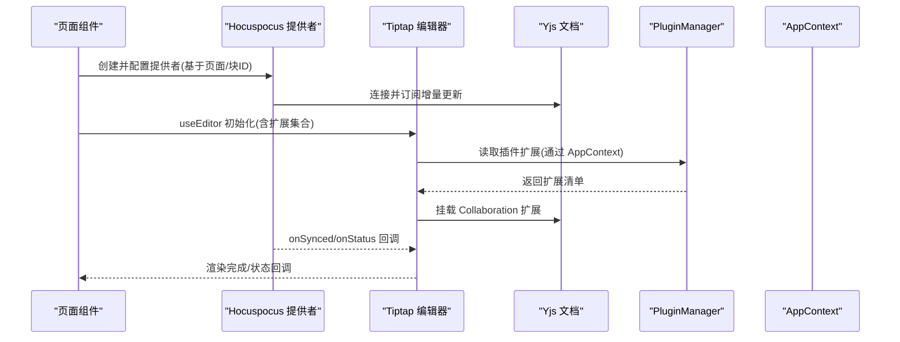
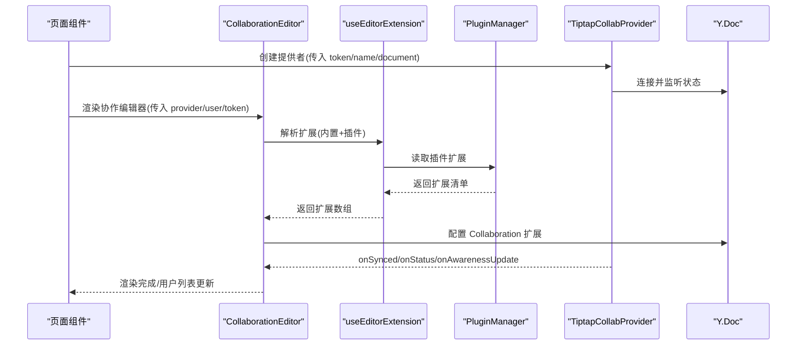
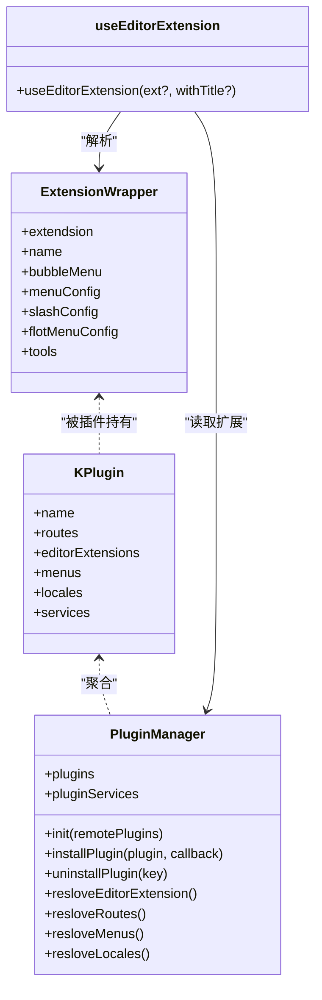
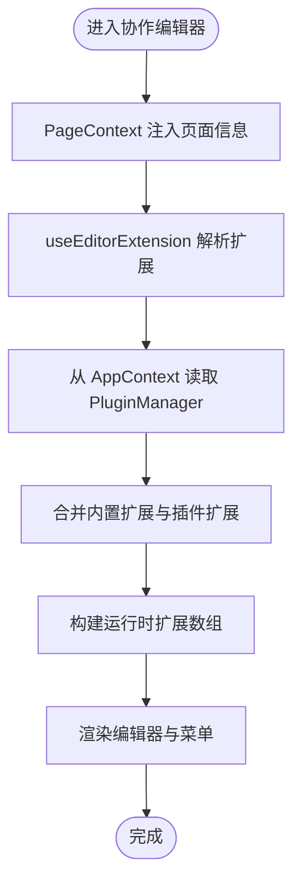
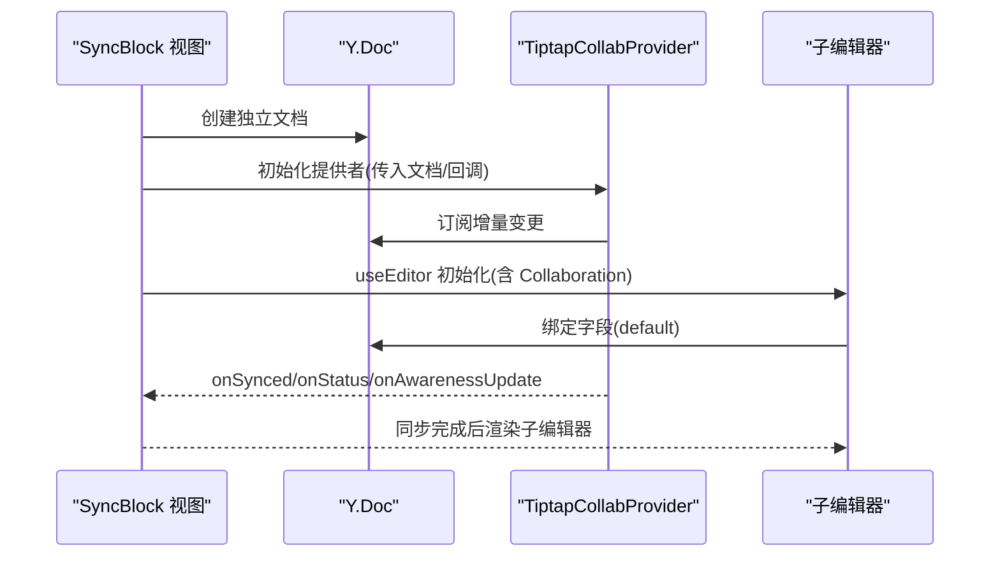
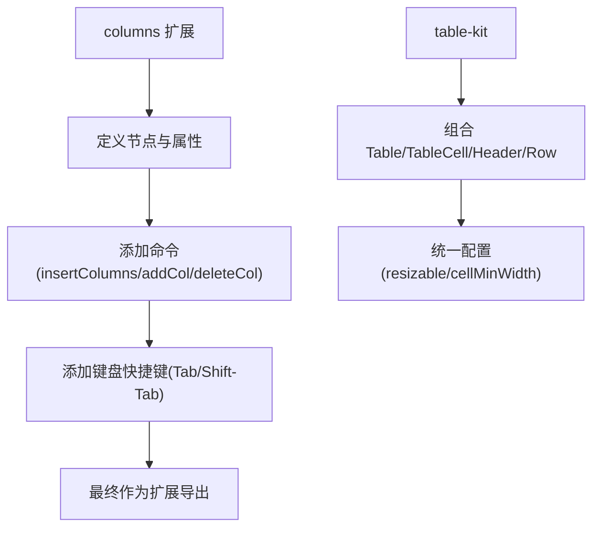
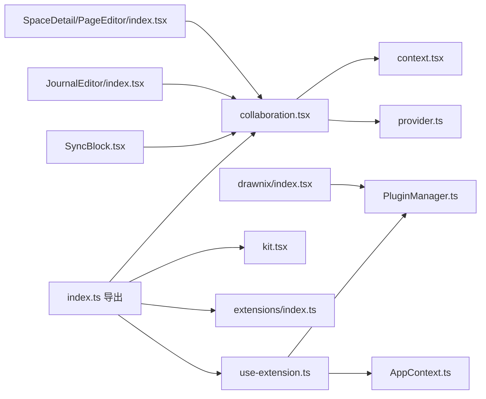

# 编辑器核心内核

<cite>
**本文引用的文件**
- [packages/editor/src/index.ts](file://packages/editor/src/index.ts)
- [packages/editor/src/editor/collaboration.tsx](file://packages/editor/src/editor/collaboration.tsx)
- [packages/editor/src/editor/provider.ts](file://packages/editor/src/editor/provider.ts)
- [packages/editor/src/editor/context.tsx](file://packages/editor/src/editor/context.tsx)
- [packages/editor/src/editor/use-extension.ts](file://packages/editor/src/editor/use-extension.ts)
- [packages/editor/src/editor/kit.tsx](file://packages/editor/src/editor/kit.tsx)
- [packages/editor/src/editor/build-in-extension.ts](file://packages/editor/src/editor/build-in-extension.ts)
- [packages/editor/src/extensions/index.ts](file://packages/editor/src/extensions/index.ts)
- [packages/editor/src/extensions/columns/columns.tsx](file://packages/editor/src/extensions/columns/columns.tsx)
- [packages/editor/src/extensions/table/table-kit.ts](file://packages/editor/src/extensions/table/table-kit.ts)
- [packages/editor/src/extensions/sync-block/SyncBlock.tsx](file://packages/editor/src/extensions/sync-block/SyncBlock.tsx)
- [packages/common/src/core/AppContext.ts](file://packages/common/src/core/AppContext.ts)
- [packages/common/src/core/PluginManager.ts](file://packages/common/src/core/PluginManager.ts)
- [packages/common/src/core/editor.ts](file://packages/common/src/core/editor.ts)
- [packages/plugin-main/src/pages/Journals/JournalEditor/index.tsx](file://packages/plugin-main/src/pages/Journals/JournalEditor/index.tsx)
- [packages/plugin-main/src/pages/SpaceDetail/PageEditor/index.tsx](file://packages/plugin-main/src/pages/SpaceDetail/PageEditor/index.tsx)
- [packages/plugin-drawnix/src/index.tsx](file://packages/plugin-drawnix/src/index.tsx)
</cite>

## 目录
1. [引言](#引言)
2. [项目结构](#项目结构)
3. [核心组件](#核心组件)
4. [架构总览](#架构总览)
5. [详细组件分析](#详细组件分析)
6. [依赖关系分析](#依赖关系分析)
7. [性能考虑](#性能考虑)
8. [故障排查指南](#故障排查指南)
9. [结论](#结论)
10. [附录：扩展开发指南](#附录扩展开发指南)

## 引言
本文件面向知识库管理系统的编辑器核心内核，聚焦于实时协作编辑的实现原理与架构设计。内容涵盖：
- 基于 Yjs 的协作协议与 Hocuspocus 提供者集成
- 冲突解决机制与状态同步策略
- 编辑器内核架构：扩展系统、插件管理、编辑器上下文
- 协作提供者的实现：Hocuspocus 连接、文档同步、用户状态管理
- 编辑器上下文：全局状态、用户信息传递与组件通信
- 扩展开发指南：自定义扩展的创建、注册与配置
- 具体示例路径：如何实现自定义编辑器功能与集成第三方扩展

## 项目结构
编辑器核心位于 packages/editor，围绕 Tiptap/ProseMirror 构建，通过扩展系统与插件体系实现可插拔能力；协作能力由 Hocuspocus 提供者与 Yjs 文档驱动。

图表来源
- [packages/editor/src/index.ts](file://packages/editor/src/index.ts#L1-L23)
- [packages/editor/src/editor/collaboration.tsx](file://packages/editor/src/editor/collaboration.tsx#L1-L142)
- [packages/editor/src/editor/context.tsx](file://packages/editor/src/editor/context.tsx#L1-L14)
- [packages/editor/src/editor/provider.ts](file://packages/editor/src/editor/provider.ts#L1-L53)
- [packages/editor/src/editor/use-extension.ts](file://packages/editor/src/editor/use-extension.ts#L1-L63)
- [packages/editor/src/editor/kit.tsx](file://packages/editor/src/editor/kit.tsx#L1-L87)
- [packages/editor/src/editor/build-in-extension.ts](file://packages/editor/src/editor/build-in-extension.ts#L1-L56)
- [packages/editor/src/extensions/index.ts](file://packages/editor/src/extensions/index.ts#L1-L64)
- [packages/common/src/core/AppContext.ts](file://packages/common/src/core/AppContext.ts#L1-L13)
- [packages/common/src/core/PluginManager.ts](file://packages/common/src/core/PluginManager.ts#L1-L170)
- [packages/common/src/core/editor.ts](file://packages/common/src/core/editor.ts#L1-L31)
- [packages/editor/src/extensions/sync-block/SyncBlock.tsx](file://packages/editor/src/extensions/sync-block/SyncBlock.tsx#L1-L87)
- [packages/plugin-main/src/pages/Journals/JournalEditor/index.tsx](file://packages/plugin-main/src/pages/Journals/JournalEditor/index.tsx#L1-L54)
- [packages/plugin-main/src/pages/SpaceDetail/PageEditor/index.tsx](file://packages/plugin-main/src/pages/SpaceDetail/PageEditor/index.tsx#L133-L159)
- [packages/plugin-drawnix/src/index.tsx](file://packages/plugin-drawnix/src/index.tsx#L1-L14)

章节来源
- [packages/editor/src/index.ts](file://packages/editor/src/index.ts#L1-L23)
- [packages/editor/src/editor/collaboration.tsx](file://packages/editor/src/editor/collaboration.tsx#L1-L142)
- [packages/common/src/core/AppContext.ts](file://packages/common/src/core/AppContext.ts#L1-L13)

## 核心组件
- 协作编辑器：封装 Tiptap 编辑器实例、菜单、目录与上下文，负责渲染与生命周期管理。
- 扩展系统：统一解析 ExtensionWrapper，组装运行时扩展集合，并注入斜杠菜单等能力。
- 插件管理器：动态加载与合并插件提供的编辑器扩展、路由、菜单与服务。
- 编辑器提供者：抽象用户与文件等外部能力，通过编辑器选项注入。
- 页面上下文：向编辑器树传递页面元数据（如 spaceId、pageId 等）。
- 同步块视图：在节点视图中按 blockId 维度创建独立 Y.Doc 与 Hocuspocus 提供者，实现细粒度协作。

章节来源
- [packages/editor/src/editor/collaboration.tsx](file://packages/editor/src/editor/collaboration.tsx#L1-L142)
- [packages/editor/src/editor/use-extension.ts](file://packages/editor/src/editor/use-extension.ts#L1-L63)
- [packages/common/src/core/PluginManager.ts](file://packages/common/src/core/PluginManager.ts#L1-L170)
- [packages/editor/src/editor/provider.ts](file://packages/editor/src/editor/provider.ts#L1-L53)
- [packages/editor/src/editor/context.tsx](file://packages/editor/src/editor/context.tsx#L1-L14)
- [packages/editor/src/extensions/sync-block/SyncBlock.tsx](file://packages/editor/src/extensions/sync-block/SyncBlock.tsx#L1-L87)

## 架构总览
编辑器内核采用“扩展即插件”的理念，通过 AppContext 注入 PluginManager，useEditorExtension 统一解析内置与插件扩展，再交由 Tiptap 初始化编辑器。协作能力通过 Hocuspocus 提供者与 Yjs 文档实现，支持断线重连、感知用户状态与增量同步。

图表来源
- [packages/plugin-main/src/pages/Journals/JournalEditor/index.tsx](file://packages/plugin-main/src/pages/Journals/JournalEditor/index.tsx#L20-L54)
- [packages/editor/src/editor/collaboration.tsx](file://packages/editor/src/editor/collaboration.tsx#L1-L142)
- [packages/editor/src/editor/use-extension.ts](file://packages/editor/src/editor/use-extension.ts#L1-L63)
- [packages/common/src/core/PluginManager.ts](file://packages/common/src/core/PluginManager.ts#L1-L170)

## 详细组件分析

### 协作编辑器与提供者
- 协作编辑器负责：
  - 解析扩展、初始化编辑器、挂载目录与菜单
  - 接收 provider 并在卸载时断开连接
  - 通过 PageContext 传递页面元信息
- 提供者接口：
  - 抽象用户获取与文件上传下载能力，通过编辑器选项注入
- 示例集成：
  - 日记编辑器与空间页编辑器均以 Y.Doc + TiptapCollabProvider 方式接入协作
  - 使用 onAwarenessUpdate 获取在线用户列表，onSynced 标记同步完成

图表来源
- [packages/plugin-main/src/pages/Journals/JournalEditor/index.tsx](file://packages/plugin-main/src/pages/Journals/JournalEditor/index.tsx#L20-L54)
- [packages/editor/src/editor/collaboration.tsx](file://packages/editor/src/editor/collaboration.tsx#L1-L142)
- [packages/editor/src/editor/use-extension.ts](file://packages/editor/src/editor/use-extension.ts#L1-L63)
- [packages/common/src/core/PluginManager.ts](file://packages/common/src/core/PluginManager.ts#L1-L170)

章节来源
- [packages/editor/src/editor/collaboration.tsx](file://packages/editor/src/editor/collaboration.tsx#L1-L142)
- [packages/editor/src/editor/provider.ts](file://packages/editor/src/editor/provider.ts#L1-L53)
- [packages/plugin-main/src/pages/Journals/JournalEditor/index.tsx](file://packages/plugin-main/src/pages/Journals/JournalEditor/index.tsx#L20-L54)
- [packages/plugin-main/src/pages/SpaceDetail/PageEditor/index.tsx](file://packages/plugin-main/src/pages/SpaceDetail/PageEditor/index.tsx#L133-L159)

### 扩展系统与插件管理
- ExtensionWrapper 定义扩展包装，包含扩展对象、名称、菜单配置、气泡菜单、浮动菜单与斜杠菜单项等
- PluginManager 聚合插件的 editorExtension 列表，支持远程插件脚本动态加载与事件通知
- useEditorExtension 将内置扩展与插件扩展合并，解析为 Tiptap 可用的扩展数组，并注入 UniqueID、斜杠菜单等运行时扩展
- kit 工具提供 resolveExtesions 与 resloveSlash，统一扩展与斜杠菜单生成

图表来源
- [packages/common/src/core/editor.ts](file://packages/common/src/core/editor.ts#L1-L31)
- [packages/common/src/core/PluginManager.ts](file://packages/common/src/core/PluginManager.ts#L1-L170)
- [packages/editor/src/editor/use-extension.ts](file://packages/editor/src/editor/use-extension.ts#L1-L63)

章节来源
- [packages/common/src/core/editor.ts](file://packages/common/src/core/editor.ts#L1-L31)
- [packages/common/src/core/PluginManager.ts](file://packages/common/src/core/PluginManager.ts#L1-L170)
- [packages/editor/src/editor/use-extension.ts](file://packages/editor/src/editor/use-extension.ts#L1-L63)
- [packages/editor/src/editor/kit.tsx](file://packages/editor/src/editor/kit.tsx#L1-L87)
- [packages/editor/src/editor/build-in-extension.ts](file://packages/editor/src/editor/build-in-extension.ts#L1-L56)

### 编辑器上下文与组件通信
- PageContext 提供页面级元数据（如 spaceId、id、parentId 等），协作编辑器通过 Provider 注入
- AppContext 持有 PluginManager，useEditorExtension 从其中解析扩展，形成“上下文驱动的扩展装配”
- 编辑器菜单与悬浮菜单根据扩展包装中的配置动态生成

图表来源
- [packages/editor/src/editor/context.tsx](file://packages/editor/src/editor/context.tsx#L1-L14)
- [packages/common/src/core/AppContext.ts](file://packages/common/src/core/AppContext.ts#L1-L13)
- [packages/editor/src/editor/use-extension.ts](file://packages/editor/src/editor/use-extension.ts#L1-L63)

章节来源
- [packages/editor/src/editor/context.tsx](file://packages/editor/src/editor/context.tsx#L1-L14)
- [packages/common/src/core/AppContext.ts](file://packages/common/src/core/AppContext.ts#L1-L13)
- [packages/editor/src/editor/use-extension.ts](file://packages/editor/src/editor/use-extension.ts#L1-L63)

### 协同提供者与状态同步
- Hocuspocus 提供者通过 baseUrl、name、token 与 Y.Doc 建立 WebSocket 连接
- onSynced 标识文档已同步，onStatus 提供连接状态，onAwarenessUpdate 提供用户状态
- 同步块视图按 blockId 为每个节点视图创建独立文档，实现细粒度协作

图表来源
- [packages/editor/src/extensions/sync-block/SyncBlock.tsx](file://packages/editor/src/extensions/sync-block/SyncBlock.tsx#L1-L87)
- [packages/plugin-main/src/pages/Journals/JournalEditor/index.tsx](file://packages/plugin-main/src/pages/Journals/JournalEditor/index.tsx#L20-L54)

章节来源
- [packages/editor/src/extensions/sync-block/SyncBlock.tsx](file://packages/editor/src/extensions/sync-block/SyncBlock.tsx#L1-L87)
- [packages/plugin-main/src/pages/Journals/JournalEditor/index.tsx](file://packages/plugin-main/src/pages/Journals/JournalEditor/index.tsx#L20-L54)

### 典型扩展与复杂逻辑
- 多栏扩展(columns)：定义多栏节点、命令与键盘快捷键，演示扩展命令、属性与交互
- 表格扩展(table-kit)：组合表格相关扩展，体现扩展间的协同与配置

图表来源
- [packages/editor/src/extensions/columns/columns.tsx](file://packages/editor/src/extensions/columns/columns.tsx#L1-L130)
- [packages/editor/src/extensions/table/table-kit.ts](file://packages/editor/src/extensions/table/table-kit.ts#L1-L17)

章节来源
- [packages/editor/src/extensions/columns/columns.tsx](file://packages/editor/src/extensions/columns/columns.tsx#L1-L130)
- [packages/editor/src/extensions/table/table-kit.ts](file://packages/editor/src/extensions/table/table-kit.ts#L1-L17)

## 依赖关系分析
- 导出入口统一导出编辑器相关类型、工具与提供者，便于上层直接使用
- 协作编辑器依赖扩展解析、上下文与样式主题
- useEditorExtension 依赖 AppContext 与 PluginManager，形成“插件驱动”的扩展装配链路
- 同步块视图与页面集成示例展示了提供者与编辑器的组合使用方式

图表来源
- [packages/editor/src/index.ts](file://packages/editor/src/index.ts#L1-L23)
- [packages/editor/src/editor/collaboration.tsx](file://packages/editor/src/editor/collaboration.tsx#L1-L142)
- [packages/editor/src/editor/use-extension.ts](file://packages/editor/src/editor/use-extension.ts#L1-L63)
- [packages/editor/src/editor/kit.tsx](file://packages/editor/src/editor/kit.tsx#L1-L87)
- [packages/editor/src/extensions/index.ts](file://packages/editor/src/extensions/index.ts#L1-L64)
- [packages/editor/src/editor/context.tsx](file://packages/editor/src/editor/context.tsx#L1-L14)
- [packages/editor/src/editor/provider.ts](file://packages/editor/src/editor/provider.ts#L1-L53)
- [packages/common/src/core/AppContext.ts](file://packages/common/src/core/AppContext.ts#L1-L13)
- [packages/common/src/core/PluginManager.ts](file://packages/common/src/core/PluginManager.ts#L1-L170)
- [packages/editor/src/extensions/sync-block/SyncBlock.tsx](file://packages/editor/src/extensions/sync-block/SyncBlock.tsx#L1-L87)
- [packages/plugin-main/src/pages/Journals/JournalEditor/index.tsx](file://packages/plugin-main/src/pages/Journals/JournalEditor/index.tsx#L1-L54)
- [packages/plugin-main/src/pages/SpaceDetail/PageEditor/index.tsx](file://packages/plugin-main/src/pages/SpaceDetail/PageEditor/index.tsx#L133-L159)
- [packages/plugin-drawnix/src/index.tsx](file://packages/plugin-drawnix/src/index.tsx#L1-L14)

章节来源
- [packages/editor/src/index.ts](file://packages/editor/src/index.ts#L1-L23)
- [packages/common/src/core/PluginManager.ts](file://packages/common/src/core/PluginManager.ts#L1-L170)

## 性能考虑
- 延迟渲染与事务重渲染控制：协作编辑器在初始化时设置立即渲染与事务重渲染策略，减少不必要的重绘
- 断线重连与增量同步：Hocuspocus 提供者基于 Yjs 实现 CRDT 增量同步，降低带宽与冲突概率
- 扩展解析缓存：useEditorExtension 对扩展进行去重与过滤，避免重复装配
- 子编辑器隔离：同步块视图为每个节点视图创建独立文档与提供者，避免跨块耦合导致的性能问题

章节来源
- [packages/editor/src/editor/collaboration.tsx](file://packages/editor/src/editor/collaboration.tsx#L1-L142)
- [packages/editor/src/extensions/sync-block/SyncBlock.tsx](file://packages/editor/src/extensions/sync-block/SyncBlock.tsx#L1-L87)
- [packages/editor/src/editor/use-extension.ts](file://packages/editor/src/editor/use-extension.ts#L1-L63)

## 故障排查指南
- 连接失败或状态异常
  - 检查提供者初始化参数（baseUrl、name、token、document）
  - 关注 onStatus 回调与日志输出，确认连接阶段
  - 参考示例路径：[提供者初始化与回调](file://packages/plugin-main/src/pages/Journals/JournalEditor/index.tsx#L20-L54)
- 同步未完成
  - 确认 onSynced 回调是否触发，确保文档已同步
  - 若为同步块视图，检查独立文档与提供者销毁时机
  - 参考示例路径：[同步块视图提供者与清理](file://packages/editor/src/extensions/sync-block/SyncBlock.tsx#L1-L87)
- 用户状态不更新
  - 检查 onAwarenessUpdate 回调是否正确映射 clientId 与 user
  - 参考示例路径：[用户状态处理](file://packages/plugin-main/src/pages/Journals/JournalEditor/index.tsx#L20-L54)
- 扩展未生效
  - 确认 ExtensionWrapper 是否正确注册到插件 editorExtension
  - 检查 useEditorExtension 是否包含对应扩展
  - 参考路径：[扩展包装与解析](file://packages/common/src/core/editor.ts#L1-L31), [扩展解析](file://packages/editor/src/editor/use-extension.ts#L1-L63), [插件管理器](file://packages/common/src/core/PluginManager.ts#L1-L170)

章节来源
- [packages/plugin-main/src/pages/Journals/JournalEditor/index.tsx](file://packages/plugin-main/src/pages/Journals/JournalEditor/index.tsx#L20-L54)
- [packages/editor/src/extensions/sync-block/SyncBlock.tsx](file://packages/editor/src/extensions/sync-block/SyncBlock.tsx#L1-L87)
- [packages/common/src/core/editor.ts](file://packages/common/src/core/editor.ts#L1-L31)
- [packages/editor/src/editor/use-extension.ts](file://packages/editor/src/editor/use-extension.ts#L1-L63)
- [packages/common/src/core/PluginManager.ts](file://packages/common/src/core/PluginManager.ts#L1-L170)

## 结论
本内核以 Tiptap/ProseMirror 为基础，结合 Yjs 与 Hocuspocus 实现高性能、低冲突的实时协作编辑；通过 AppContext 与 PluginManager 构建可插拔扩展生态；通过 PageContext 与 Provider 接口实现上下文与外部能力的解耦。同步块视图进一步细化了协作粒度，满足复杂场景下的文档组织需求。

## 附录：扩展开发指南
- 创建扩展包装
  - 使用 ExtensionWrapper 定义扩展对象、名称与菜单配置
  - 参考路径：[扩展包装类型](file://packages/common/src/core/editor.ts#L1-L31)
- 注册扩展
  - 在插件中通过 editorExtension 字段暴露扩展包装
  - 参考路径：[插件示例(drawnix)](file://packages/plugin-drawnix/src/index.tsx#L1-L14)
- 组装与生效
  - useEditorExtension 会自动解析内置与插件扩展，注入运行时扩展（如 UniqueID、斜杠菜单）
  - 参考路径：[扩展解析与组装](file://packages/editor/src/editor/use-extension.ts#L1-L63), [扩展清单](file://packages/editor/src/editor/build-in-extension.ts#L1-L56)
- 集成第三方扩展
  - 将第三方扩展封装为 ExtensionWrapper，加入插件 editorExtension 列表
  - 在页面中通过 AppContext 注入 PluginManager，即可在协作编辑器中生效
  - 参考路径：[AppContext 注入](file://packages/common/src/core/AppContext.ts#L1-L13), [协作编辑器使用扩展](file://packages/editor/src/editor/collaboration.tsx#L1-L142)

章节来源
- [packages/common/src/core/editor.ts](file://packages/common/src/core/editor.ts#L1-L31)
- [packages/plugin-drawnix/src/index.tsx](file://packages/plugin-drawnix/src/index.tsx#L1-L14)
- [packages/editor/src/editor/use-extension.ts](file://packages/editor/src/editor/use-extension.ts#L1-L63)
- [packages/editor/src/editor/build-in-extension.ts](file://packages/editor/src/editor/build-in-extension.ts#L1-L56)
- [packages/common/src/core/AppContext.ts](file://packages/common/src/core/AppContext.ts#L1-L13)
- [packages/editor/src/editor/collaboration.tsx](file://packages/editor/src/editor/collaboration.tsx#L1-L142)