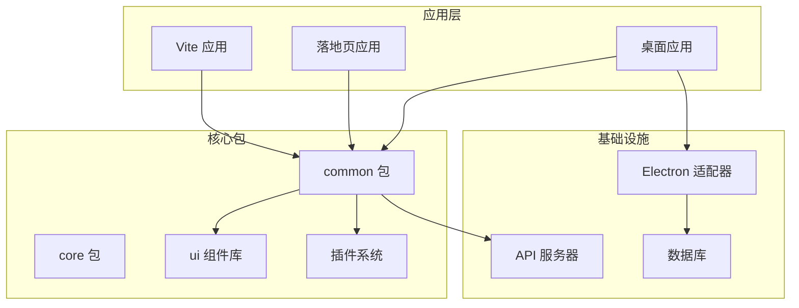
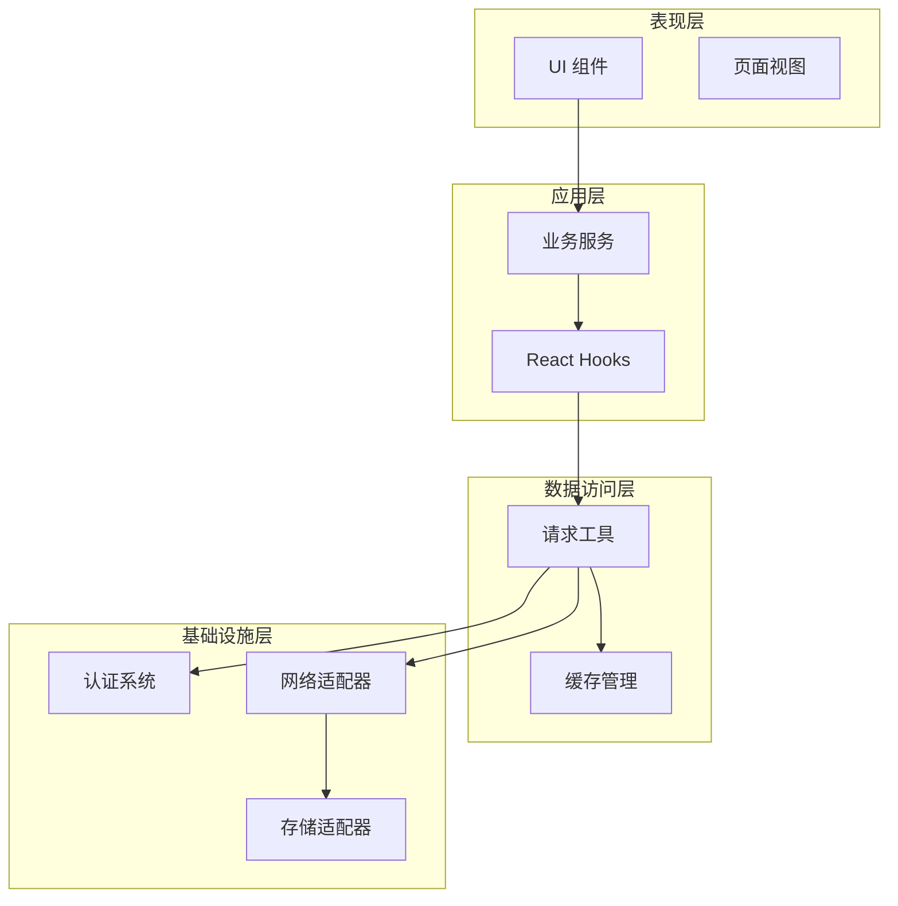
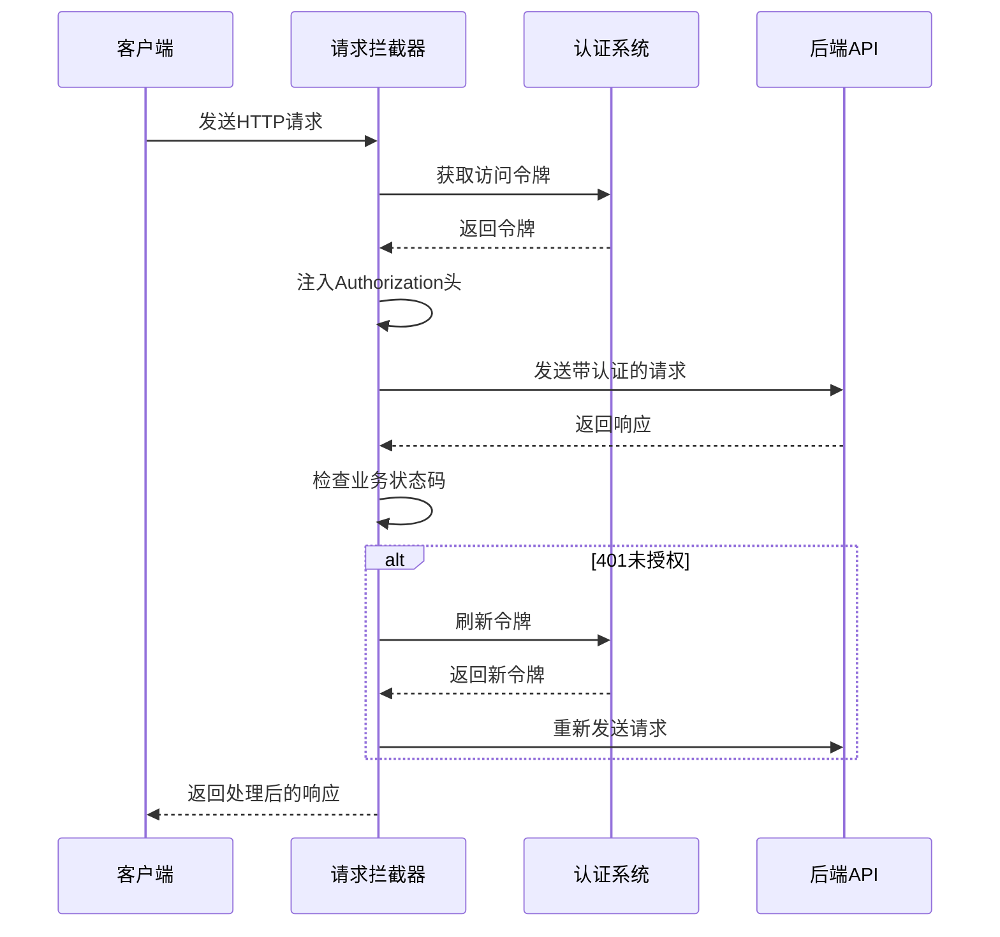
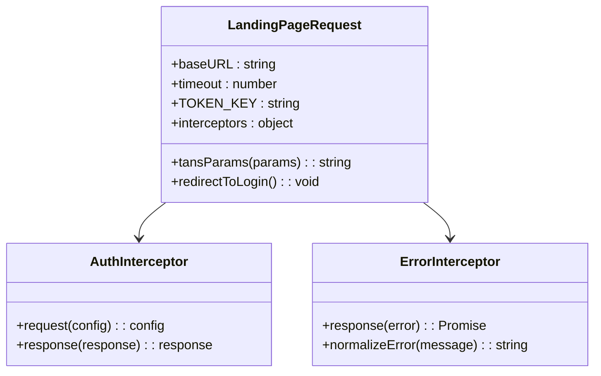
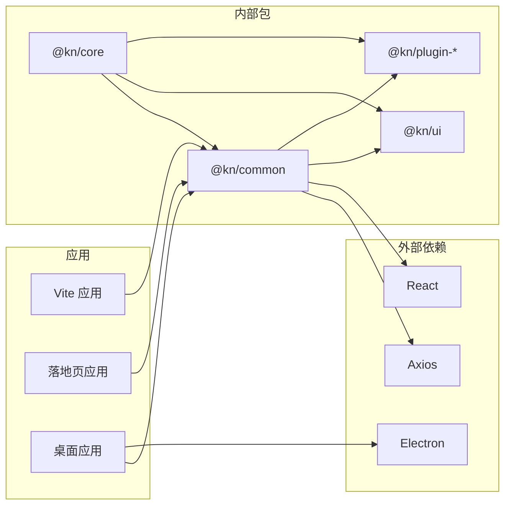

# 请求工具增强

<cite>
**本文档引用的文件**
- [packages/common/src/utils/request.tsx](file://packages/common/src/utils/request.tsx)
- [apps/landing-page-vite/src/utils/request.tsx](file://apps/landing-page-vite/src/utils/request.tsx)
- [packages/common/src/index.ts](file://packages/common/src/index.ts)
- [apps/vite/src/main.tsx](file://apps/vite/src/main.tsx)
- [apps/desktop/src/main/index.ts](file://apps/desktop/src/main/index.ts)
- [apps/desktop/src/preload/index.ts](file://apps/desktop/src/preload/index.ts)
- [apps/desktop/src/main/services.ts](file://apps/desktop/src/main/services.ts)
- [packages/common/package.json](file://packages/common/package.json)
- [packages/core/package.json](file://packages/core/package.json)
</cite>

## 目录
1. [简介](#简介)
2. [项目结构](#项目结构)
3. [核心组件](#核心组件)
4. [架构概览](#架构概览)
5. [详细组件分析](#详细组件分析)
6. [依赖关系分析](#依赖关系分析)
7. [性能考虑](#性能考虑)
8. [故障排除指南](#故障排除指南)
9. [结论](#结论)

## 简介

本项目中的请求工具增强主要体现在两个层面：通用的浏览器端请求封装和桌面应用的网络适配器。项目采用了模块化的设计，通过统一的请求工具为各个应用提供一致的网络通信能力。

浏览器端使用基于 Axios 的请求封装，提供了完整的认证、错误处理和重试机制。桌面应用则通过 Electron 的 HttpClient 提供本地化的网络访问能力，支持自定义协议和本地文件访问。

## 项目结构

项目采用多包架构，主要包含以下关键目录：



**图表来源**
- [packages/common/src/utils/request.tsx:1-197](file://packages/common/src/utils/request.tsx#L1-L197)
- [apps/desktop/src/main/index.ts:1-115](file://apps/desktop/src/main/index.ts#L1-L115)

**章节来源**
- [packages/common/package.json:1-56](file://packages/common/package.json#L1-L56)
- [packages/core/package.json:1-43](file://packages/core/package.json#L1-L43)

## 核心组件

### 通用请求工具 (Common Request Utility)

通用请求工具是整个项目网络通信的核心，基于 Axios 进行了深度封装，提供了以下关键功能：

- **自动认证管理**：自动注入和刷新访问令牌
- **统一错误处理**：标准化的错误消息和用户提示
- **并发控制**：防止重复的令牌刷新请求
- **业务状态码处理**：支持后端自定义的状态码体系

### 桌面应用网络适配器 (Desktop Network Adapter)

桌面应用使用 Electron 的原生网络能力，提供了：

- **自定义协议支持**：通过 app:// 协议加载本地资源
- **本地文件访问**：直接访问用户数据目录
- **IPC 集成**：与主进程进行安全通信
- **离线模式支持**：在网络异常时提供降级方案

**章节来源**
- [packages/common/src/utils/request.tsx:1-197](file://packages/common/src/utils/request.tsx#L1-L197)
- [apps/desktop/src/main/services.ts:1-197](file://apps/desktop/src/main/services.ts#L1-L197)

## 架构概览

项目采用分层架构设计，确保各层职责清晰分离：



**图表来源**
- [packages/common/src/utils/request.tsx:29-41](file://packages/common/src/utils/request.tsx#L29-L41)
- [apps/desktop/src/main/services.ts:62-82](file://apps/desktop/src/main/services.ts#L62-L82)

## 详细组件分析

### 通用请求工具实现

#### 认证拦截器设计



**图表来源**
- [packages/common/src/utils/request.tsx:88-194](file://packages/common/src/utils/request.tsx#L88-L194)

#### 错误处理机制

请求工具实现了多层次的错误处理策略：

1. **HTTP 状态码处理**：区分业务错误和网络错误
2. **令牌刷新机制**：自动处理过期的访问令牌
3. **用户友好提示**：将技术错误转换为用户可理解的消息
4. **重定向处理**：自动跳转到登录页面

**章节来源**
- [packages/common/src/utils/request.tsx:103-194](file://packages/common/src/utils/request.tsx#L103-L194)

### 桌面应用网络适配器

#### 自定义协议处理

桌面应用通过注册自定义协议来实现本地资源访问：

```mermaid
flowchart TD
Start[应用启动] --> RegisterProtocol[注册自定义协议]
RegisterProtocol --> CreateWindow[创建主窗口]
CreateWindow --> LoadURL[加载应用URL]
LoadURL --> ProtocolHandler{协议类型?}
ProtocolHandler --> |app://| LocalResource[本地资源]
ProtocolHandler --> |http(s)://| RemoteResource[远程资源]
LocalResource --> SPAHandling[SPA路由处理]
RemoteResource --> StandardLoad[标准加载]
SPAHandling --> Render[渲染页面]
StandardLoad --> Render
```

**图表来源**
- [apps/desktop/src/main/index.ts:75-86](file://apps/desktop/src/main/index.ts#L75-L86)

#### IPC 通信集成

桌面应用通过 IPC 机制实现前后端通信：

**章节来源**
- [apps/desktop/src/preload/index.ts:1-29](file://apps/desktop/src/preload/index.ts#L1-L29)
- [apps/desktop/src/main/services.ts:77-93](file://apps/desktop/src/main/services.ts#L77-L93)

### 落地页应用请求工具

落地页应用使用了简化的请求工具实现，专注于静态内容展示：



**图表来源**
- [apps/landing-page-vite/src/utils/request.tsx:1-93](file://apps/landing-page-vite/src/utils/request.tsx#L1-L93)

**章节来源**
- [apps/landing-page-vite/src/utils/request.tsx:1-93](file://apps/landing-page-vite/src/utils/request.tsx#L1-L93)

## 依赖关系分析

项目中的依赖关系体现了清晰的模块化设计：



**图表来源**
- [packages/common/package.json:17-43](file://packages/common/package.json#L17-L43)
- [packages/core/package.json:17-34](file://packages/core/package.json#L17-L34)

**章节来源**
- [packages/common/package.json:1-56](file://packages/common/package.json#L1-L56)
- [packages/core/package.json:1-43](file://packages/core/package.json#L1-L43)

## 性能考虑

### 缓存策略

请求工具实现了智能的缓存机制：

- **内存缓存**：短期数据缓存，减少重复请求
- **持久化缓存**：重要数据的本地存储
- **缓存失效**：基于时间戳和版本号的缓存管理

### 并发控制

- **令牌刷新去重**：防止多个并发请求同时触发令牌刷新
- **请求队列**：在令牌刷新期间排队等待的请求
- **超时控制**：合理的请求超时设置避免资源占用

### 优化建议

1. **懒加载策略**：按需加载大型模块
2. **请求合并**：将多个小请求合并为批量请求
3. **预取机制**：基于用户行为预测可能需要的数据

## 故障排除指南

### 常见问题诊断

#### 认证相关问题

**症状**：频繁出现登录状态失效
**排查步骤**：
1. 检查令牌存储是否正常
2. 验证令牌刷新逻辑
3. 确认服务器时间同步

#### 网络连接问题

**症状**：请求超时或连接失败
**排查步骤**：
1. 检查网络配置和代理设置
2. 验证防火墙规则
3. 测试服务器可用性

#### 错误处理问题

**症状**：错误信息不友好或显示异常
**排查步骤**：
1. 检查国际化配置
2. 验证错误消息映射
3. 确认用户界面组件状态

**章节来源**
- [packages/common/src/utils/request.tsx:71-82](file://packages/common/src/utils/request.tsx#L71-L82)
- [apps/landing-page-vite/src/utils/request.tsx:77-83](file://apps/landing-page-vite/src/utils/request.tsx#L77-L83)

## 结论

该项目的请求工具增强展现了现代前端开发的最佳实践：

1. **模块化设计**：清晰的职责分离和依赖管理
2. **统一抽象**：为不同应用场景提供一致的 API 接口
3. **健壮性保障**：完善的错误处理和恢复机制
4. **性能优化**：智能的缓存和并发控制策略

通过这种设计，项目能够在保持代码质量的同时，为用户提供稳定可靠的网络通信体验。无论是浏览器端还是桌面应用，都能享受到统一的请求处理能力和一致的用户体验。