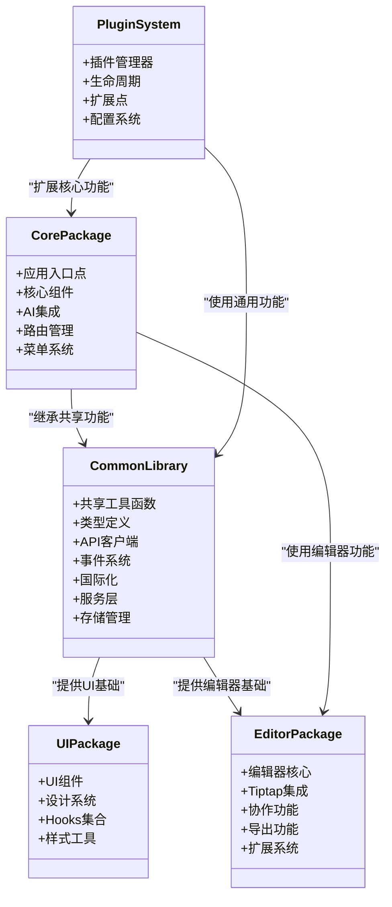
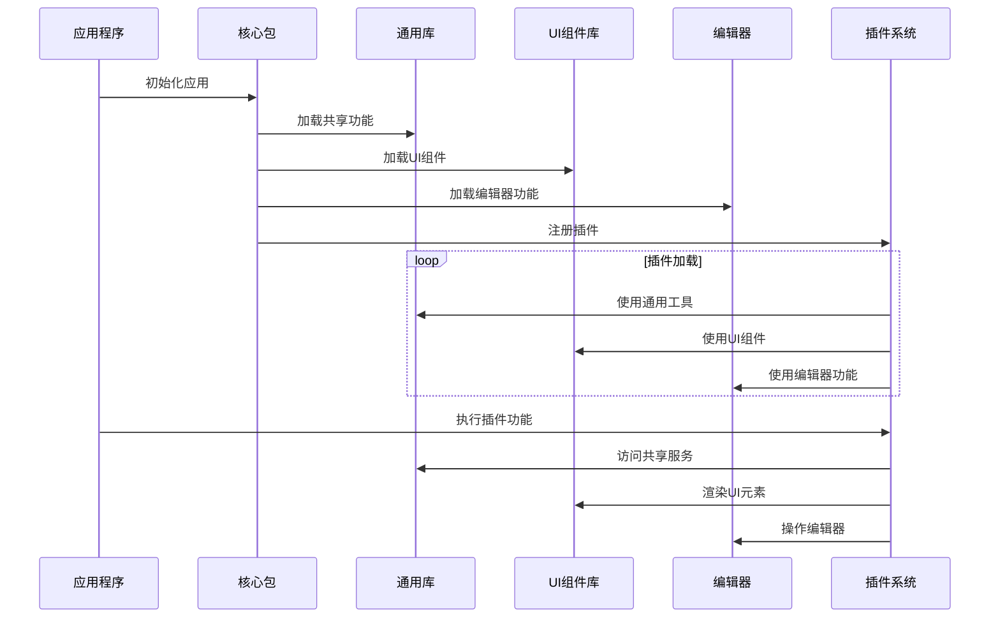
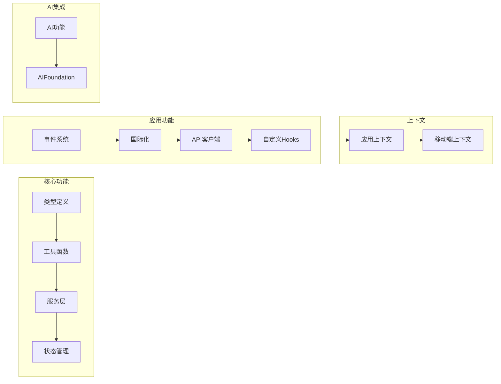
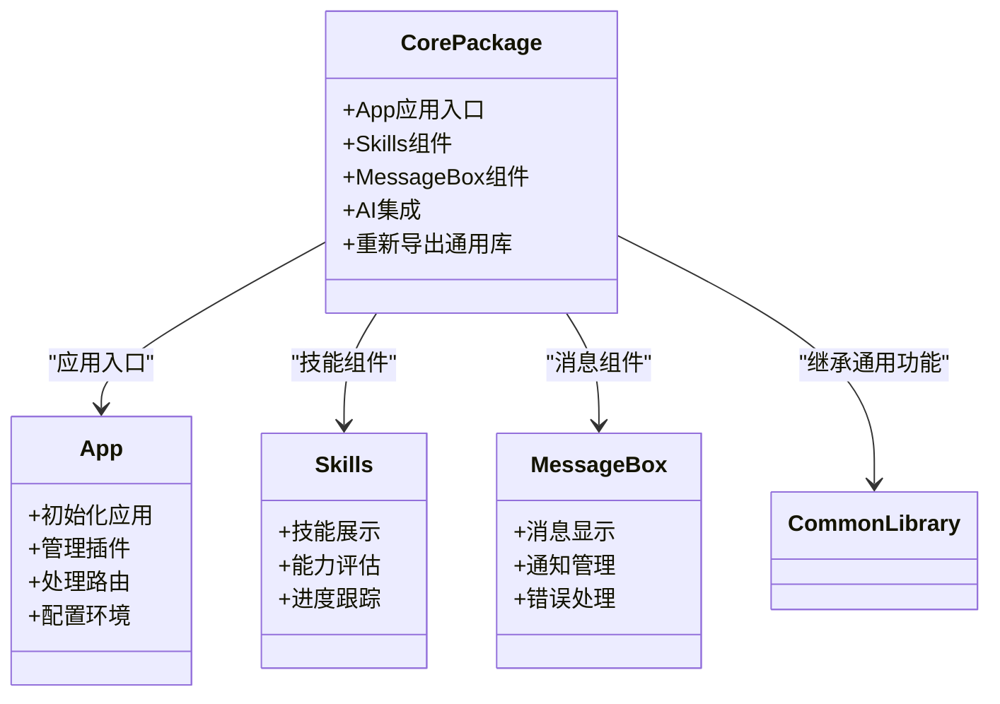
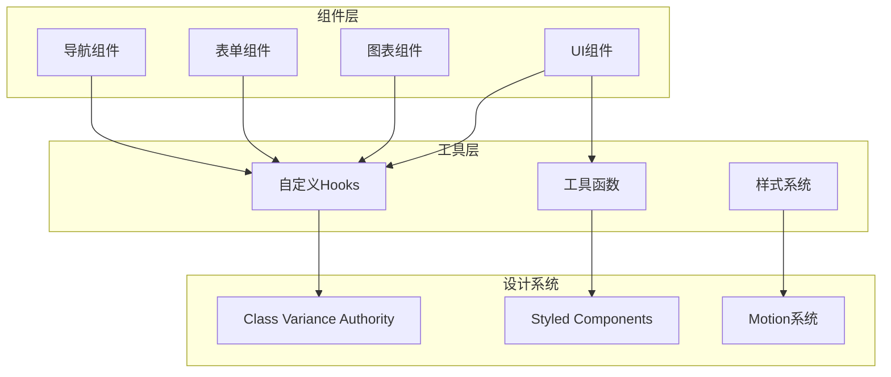
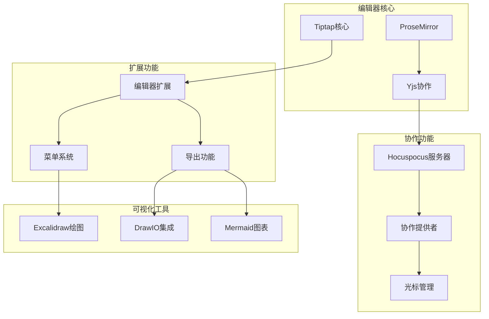
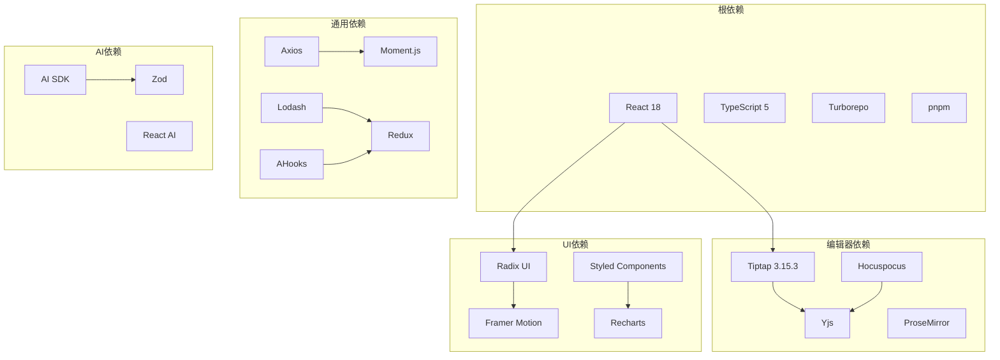

# 通用库重构

<cite>
**本文档引用的文件**
- [README.md](file://README.md)
- [package.json](file://package.json)
- [turbo.json](file://turbo.json)
- [pnpm-workspace.yaml](file://pnpm-workspace.yaml)
- [packages/common/src/index.ts](file://packages/common/src/index.ts)
- [packages/core/src/index.ts](file://packages/core/src/index.ts)
- [packages/ui/src/index.ts](file://packages/ui/src/index.ts)
- [packages/editor/src/index.ts](file://packages/editor/src/index.ts)
- [packages/common/package.json](file://packages/common/package.json)
- [packages/core/package.json](file://packages/core/package.json)
- [packages/ui/package.json](file://packages/ui/package.json)
- [packages/editor/package.json](file://packages/editor/package.json)
</cite>

## 目录
1. [项目概述](#项目概述)
2. [项目结构](#项目结构)
3. [核心组件](#核心组件)
4. [架构概览](#架构概览)
5. [详细组件分析](#详细组件分析)
6. [依赖关系分析](#依赖关系分析)
7. [性能考虑](#性能考虑)
8. [故障排除指南](#故障排除指南)
9. [结论](#结论)

## 项目概述

知识库项目是一个强大的协作式知识管理平台，具备富文本编辑、AI集成和丰富的插件生态系统。该项目采用现代化Web技术栈构建，支持实时协作功能。

### 主要特性
- **富文本编辑器**：基于Tiptap的协作编辑支持
- **实时协作**：多用户编辑的Hocuspocus后端
- **插件架构**：可扩展的插件系统
- **AI集成**：AI驱动的文本生成、图像创建和内容转换
- **多维表格**：支持多种视图类型的电子表格
- **可视化绘图**：支持Excalidraw、DrawIO、Mermaid等工具
- **文件管理**：内置文件管理系统
- **块引用**：跨文档块链接和嵌入
- **国际化**：完整的多语言支持

## 项目结构

该项目采用Monorepo架构，使用Turborepo进行构建管理，通过pnpm工作区组织各个包。

```mermaid
graph TB
subgraph "应用层"
ViteApp[Vite 应用]
LandingPage[着陆页应用]
DesktopApp[桌面应用]
end
subgraph "核心包"
Core[@kn/core 核心包]
Common[@kn/common 通用库]
Editor[@kn/editor 编辑器]
UI[@kn/ui 组件库]
end
subgraph "插件包"
PluginAI[AI 插件]
PluginBitable[多维表格插件]
PluginFileManager[文件管理插件]
PluginExcalidraw[Excalidraw插件]
PluginMermaid[Mermaid插件]
end
subgraph "基础设施"
RoomServer[协作服务器]
RollupConfig[构建配置]
ESLintConfig[Linter配置]
TSConfig[TypeScript配置]
end
ViteApp --> Core
Core --> Common
Core --> Editor
Core --> UI
PluginAI --> Core
PluginBitable --> Core
PluginFileManager --> Core
PluginExcalidraw --> Editor
PluginMermaid --> Editor
Common --> UI
Editor --> UI
```

**图表来源**
- [README.md:66-97](file://README.md#L66-L97)
- [pnpm-workspace.yaml:1-4](file://pnpm-workspace.yaml#L1-L4)

**章节来源**
- [README.md:66-97](file://README.md#L66-L97)
- [pnpm-workspace.yaml:1-4](file://pnpm-workspace.yaml#L1-L4)

## 核心组件

### 通用库重构策略

项目进行了重要的通用库重构，将共享功能从核心包中提取到独立的通用库中：

#### 重构前架构
- 核心包包含所有共享功能
- 插件直接依赖核心包
- 重复的功能在多个包中实现

#### 重构后架构
- 创建独立的@kn/common通用库
- 核心包仅保留特定功能
- 所有包统一依赖通用库

### 包依赖关系

```mermaid
graph TD
subgraph "通用层"
Common[@kn/common<br/>通用库]
UI[@kn/ui<br/>组件库]
Icon[@kn/icon<br/>图标库]
end
subgraph "核心层"
Core[@kn/core<br/>核心应用]
Editor[@kn/editor<br/>编辑器]
end
subgraph "插件层"
PluginAI[AI插件]
PluginBitable[多维表格插件]
PluginFileManager[文件管理插件]
PluginExcalidraw[Excalidraw插件]
PluginMermaid[Mermaid插件]
end
Common --> UI
Common --> Icon
Core --> Common
Core --> Editor
Core --> UI
PluginAI --> Core
PluginBitable --> Core
PluginFileManager --> Core
PluginExcalidraw --> Editor
PluginMermaid --> Editor
```

**图表来源**
- [packages/common/package.json:17-44](file://packages/common/package.json#L17-L44)
- [packages/core/package.json:17-34](file://packages/core/package.json#L17-L34)
- [packages/ui/package.json:23-90](file://packages/ui/package.json#L23-L90)

**章节来源**
- [packages/common/package.json:1-56](file://packages/common/package.json#L1-L56)
- [packages/core/package.json:1-43](file://packages/core/package.json#L1-L43)
- [packages/ui/package.json:1-91](file://packages/ui/package.json#L1-L91)
- [packages/editor/package.json:1-106](file://packages/editor/package.json#L1-L106)

## 架构概览

### 通用库重构架构



**图表来源**
- [packages/common/src/index.ts:1-36](file://packages/common/src/index.ts#L1-L36)
- [packages/core/src/index.ts:1-11](file://packages/core/src/index.ts#L1-L11)
- [packages/ui/src/index.ts:1-26](file://packages/ui/src/index.ts#L1-L26)
- [packages/editor/src/index.ts:1-26](file://packages/editor/src/index.ts#L1-L26)

### 数据流架构



**图表来源**
- [packages/common/src/index.ts:1-36](file://packages/common/src/index.ts#L1-L36)
- [packages/core/src/index.ts:1-11](file://packages/core/src/index.ts#L1-L11)
- [packages/ui/src/index.ts:1-26](file://packages/ui/src/index.ts#L1-L26)
- [packages/editor/src/index.ts:1-26](file://packages/editor/src/index.ts#L1-L26)

## 详细组件分析

### 通用库(@kn/common)

#### 功能模块

通用库作为整个项目的基础，提供了以下核心功能：



**图表来源**
- [packages/common/src/index.ts:1-36](file://packages/common/src/index.ts#L1-L36)

#### 导出结构分析

通用库通过统一的入口文件导出所有功能模块：

| 功能类别 | 导出内容 | 用途 |
|---------|---------|------|
| 核心功能 | editor, route, PluginManager, AppContext, menu | 应用核心功能 |
| 实体模型 | entity | 数据模型定义 |
| 工具函数 | logger, env-utils, auth | 开发工具 |
| API接口 | api | 网络请求封装 |
| 自定义Hook | hooks | React Hook集合 |
| 服务层 | services | 业务逻辑服务 |
| 状态管理 | store | Redux状态管理 |
| AI功能 | ai | 人工智能集成 |
| 上下文 | MobilePageHeaderContext | 移动端上下文 |

**章节来源**
- [packages/common/src/index.ts:1-36](file://packages/common/src/index.ts#L1-L36)

### 核心包(@kn/core)

#### 重构后的职责

核心包经过重构后，主要负责应用的核心功能：



**图表来源**
- [packages/core/src/index.ts:1-11](file://packages/core/src/index.ts#L1-L11)

#### 核心组件职责

| 组件 | 职责 | 依赖关系 |
|------|------|----------|
| App | 应用主入口，插件管理，路由配置 | @kn/common, @kn/ui |
| Skills | 技能展示和评估组件 | @kn/common, @kn/ui |
| MessageBox | 消息提示和通知组件 | @kn/common, @kn/ui |
| AI集成 | AI功能集成和管理 | @kn/common |

**章节来源**
- [packages/core/src/index.ts:1-11](file://packages/core/src/index.ts#L1-L11)

### UI组件库(@kn/ui)

#### 设计系统架构

UI组件库提供了完整的设计系统和组件集合：



**图表来源**
- [packages/ui/src/index.ts:1-26](file://packages/ui/src/index.ts#L1-L26)

#### 组件分类

UI组件库按功能分为多个类别：

| 组件类别 | 主要组件 | 功能描述 |
|---------|---------|----------|
| 基础组件 | Button, Input, Select | 基础UI元素 |
| 布局组件 | Card, Grid, Layout | 页面布局结构 |
| 导航组件 | Menu, Tabs, Breadcrumb | 页面导航 |
| 表单组件 | Form, Field, Validator | 用户输入处理 |
| 反馈组件 | Alert, Modal, Toast | 用户反馈 |
| 图表组件 | BarChart, LineChart, PieChart | 数据可视化 |
| 媒体组件 | Avatar, Image, Video | 媒体内容展示 |

**章节来源**
- [packages/ui/src/index.ts:1-26](file://packages/ui/src/index.ts#L1-L26)

### 编辑器包(@kn/editor)

#### 编辑器架构

编辑器包集成了多种编辑器功能和技术：



**图表来源**
- [packages/editor/src/index.ts:1-26](file://packages/editor/src/index.ts#L1-L26)

**章节来源**
- [packages/editor/src/index.ts:1-26](file://packages/editor/src/index.ts#L1-L26)

## 依赖关系分析

### 依赖层次结构



**图表来源**
- [packages/common/package.json:17-44](file://packages/common/package.json#L17-L44)
- [packages/core/package.json:17-34](file://packages/core/package.json#L17-L34)
- [packages/ui/package.json:23-90](file://packages/ui/package.json#L23-L90)
- [packages/editor/package.json:16-93](file://packages/editor/package.json#L16-L93)

### 依赖优化策略

#### 共享依赖
- 所有包都依赖@kn/common作为共享基础
- 避免重复安装相同依赖
- 统一版本管理

#### 条件依赖
- UI组件库包含大量视觉相关依赖
- 编辑器包专注于协作编辑功能
- 核心包保持最小化依赖

#### 类型安全
- TypeScript严格模式
- 完整的类型定义
- 运行时类型检查

**章节来源**
- [packages/common/package.json:17-44](file://packages/common/package.json#L17-L44)
- [packages/core/package.json:17-34](file://packages/core/package.json#L17-L34)
- [packages/ui/package.json:23-90](file://packages/ui/package.json#L23-L90)
- [packages/editor/package.json:16-93](file://packages/editor/package.json#L16-L93)

## 性能考虑

### 构建优化

项目采用了多种性能优化策略：

#### 按需加载
- 插件系统支持动态加载
- 组件按需导入
- 减少初始包大小

#### 代码分割
- 多个独立的包结构
- 按功能模块分割
- 并行构建支持

#### 缓存策略
- Turborepo缓存机制
- 依赖关系缓存
- 构建结果复用

### 运行时优化

#### 内存管理
- React 18并发特性
- 优化的组件更新
- 事件处理器缓存

#### 网络优化
- Axios拦截器
- 请求缓存
- 错误重试机制

#### UI性能
- 虚拟滚动
- 懒加载组件
- 优化的渲染策略

## 故障排除指南

### 常见问题

#### 构建问题
- **依赖冲突**：确保所有包使用相同的依赖版本
- **类型错误**：检查TypeScript配置和类型定义
- **构建失败**：清理node_modules和dist目录

#### 运行时问题
- **插件加载失败**：检查插件注册和依赖
- **编辑器异常**：验证Yjs和协作配置
- **UI组件错误**：确认组件导入路径

#### 性能问题
- **内存泄漏**：检查事件监听器和定时器
- **渲染卡顿**：优化组件更新和状态管理
- **网络延迟**：实现请求缓存和错误处理

### 调试工具

#### 开发工具
- Chrome DevTools
- React Developer Tools
- Redux DevTools

#### 日志系统
- 结构化日志
- 错误追踪
- 性能监控

**章节来源**
- [README.md:139-173](file://README.md#L139-L173)

## 结论

知识库项目的通用库重构是一个成功的架构优化案例，通过以下方式提升了项目的质量和可维护性：

### 主要成果

1. **模块化架构**：清晰的分层设计，每个包职责明确
2. **代码复用**：共享功能集中管理，避免重复实现
3. **扩展性增强**：插件系统更加灵活，易于扩展新功能
4. **开发体验**：更好的类型安全和开发工具支持

### 最佳实践

1. **渐进式重构**：采用渐进式方式迁移，降低风险
2. **测试覆盖**：确保重构过程中的功能完整性
3. **文档更新**：及时更新相关文档和说明
4. **团队培训**：确保团队成员理解新的架构

### 未来发展方向

1. **性能优化**：继续优化构建和运行时性能
2. **插件生态**：扩展插件系统，支持更多第三方集成
3. **移动端适配**：加强移动端用户体验
4. **AI集成深化**：进一步整合AI功能，提升智能化水平

这次重构为项目的长期发展奠定了坚实的基础，使其能够更好地支持复杂的企业级知识管理需求。