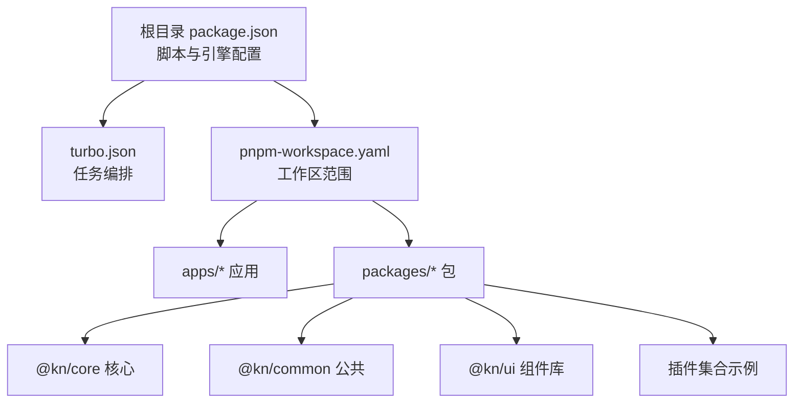
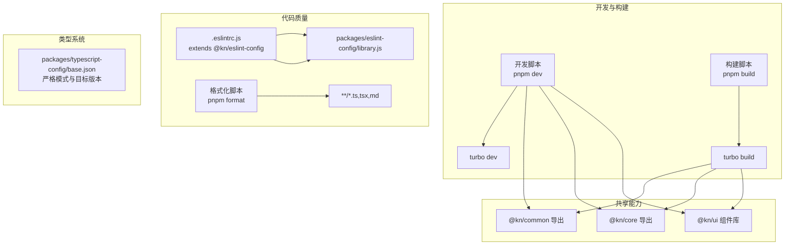
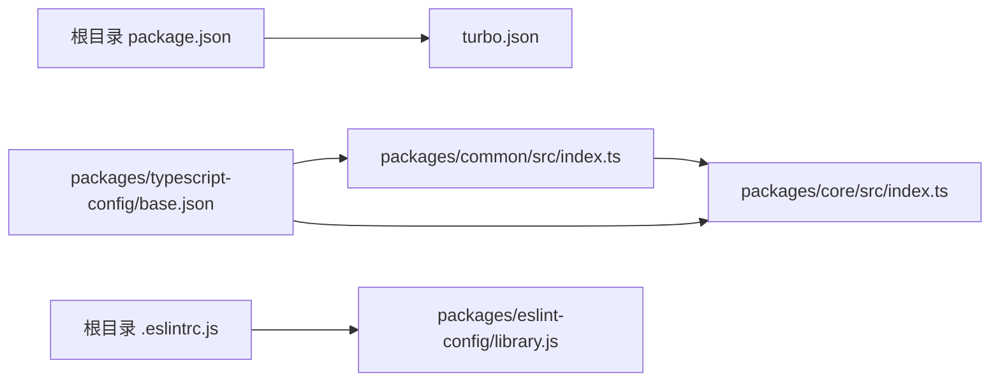

# 贡献指南

<cite>
**本文引用的文件**
- [根目录 README](file://README.md)
- [根目录 package.json](file://package.json)
- [工作区配置 pnpm-workspace.yaml](file://pnpm-workspace.yaml)
- [Turborepo 配置 turbo.json](file://turbo.json)
- [根目录 ESLint 配置 .eslintrc.js](file://.eslintrc.js)
- [ESLint 规则库 library.js](file://packages/eslint-config/library.js)
- [TypeScript 基础配置 base.json](file://packages/typescript-config/base.json)
- [公共包导出 index.ts](file://packages/common/src/index.ts)
- [核心包导出 index.ts](file://packages/core/src/index.ts)
</cite>

## 目录
1. 引言
2. 项目结构
3. 核心组件
4. 架构总览
5. 详细组件分析
6. 依赖关系分析
7. 性能考虑
8. 故障排查指南
9. 结论
10. 附录

## 引言
本贡献指南面向希望参与知识库管理系统的开发者，涵盖从开发环境搭建、代码提交与 PR 流程、代码审查标准，到编码规范、测试策略、插件开发与发布、以及社区行为准则与沟通渠道等全流程内容。目标是帮助贡献者快速上手并在保持高质量与一致性的前提下高效协作。

## 项目结构
本仓库采用 Turborepo 多包（monorepo）结构，通过 pnpm 工作区统一管理多个应用与共享包。根目录提供统一脚本、全局 Lint 与格式化规则，并通过 Turborepo 的任务编排实现跨包构建、缓存与增量构建。

- 工作区范围：apps/* 与 packages/*
- 包管理器：pnpm（版本 9+）
- 运行时：Node.js（建议使用 Volta 指定版本，或满足 engines 要求）
- 应用与包分布概览：
  - apps：包含多个前端应用（如 Vite、Next.js、落地页等）
  - packages：包含共享库与插件生态（如 @kn/ui、@kn/core、@kn/common、各类插件包等）

图表来源
- [根目录 package.json](file://package.json#L1-L103)
- [工作区配置 pnpm-workspace.yaml](file://pnpm-workspace.yaml#L1-L4)
- [Turborepo 配置 turbo.json](file://turbo.json#L1-L27)

章节来源
- [根目录 README](file://README.md#L1-L56)
- [根目录 package.json](file://package.json#L1-L103)
- [工作区配置 pnpm-workspace.yaml](file://pnpm-workspace.yaml#L1-L4)
- [Turborepo 配置 turbo.json](file://turbo.json#L1-L27)

## 核心组件
- 公共能力与上下文：公共包导出统一入口，聚合编辑器、路由、菜单、事件、本地化与实体等模块，便于各应用与插件复用。
- 核心应用层：核心包导出应用入口、Hooks、状态管理、AI 能力与工具集，作为应用层的基础能力来源。
- 插件体系：以插件包形式扩展编辑器能力（如数据库、Mermaid、Drawio、Excalidraw 等），遵循统一的构建与发布流程。

章节来源
- [公共包导出 index.ts](file://packages/common/src/index.ts#L1-L16)
- [核心包导出 index.ts](file://packages/core/src/index.ts#L1-L18)

## 架构总览
系统采用“多应用 + 多包”的架构，通过 Turborepo 实现跨包依赖的构建顺序与缓存；ESLint 与 Prettier 提供统一的代码风格与静态检查；TypeScript 配置确保类型安全与一致的编译选项。

图表来源
- [根目录 package.json](file://package.json#L1-L103)
- [根目录 ESLint 配置 .eslintrc.js](file://.eslintrc.js#L1-L11)
- [ESLint 规则库 library.js](file://packages/eslint-config/library.js#L1-L35)
- [TypeScript 基础配置 base.json](file://packages/typescript-config/base.json#L1-L21)

章节来源
- [根目录 package.json](file://package.json#L1-L103)
- [根目录 ESLint 配置 .eslintrc.js](file://.eslintrc.js#L1-L11)
- [ESLint 规则库 library.js](file://packages/eslint-config/library.js#L1-L35)
- [TypeScript 基础配置 base.json](file://packages/typescript-config/base.json#L1-L21)

## 详细组件分析

### 开发环境设置与 IDE 配置
- 运行时与包管理器
  - Node.js 版本：建议使用 Volta 固定版本，或满足 engines 中的最低版本要求。
  - 包管理器：pnpm（版本 9+），工作区由 pnpm-workspace.yaml 管理。
- 安装与初始化
  - 克隆仓库后，使用 pnpm 安装依赖并执行构建与开发命令。
- IDE 推荐配置
  - 启用 TypeScript 严格模式与路径别名解析（基于 tsconfig.json）。
  - 在 IDE 中启用 ESLint 与 Prettier，确保保存时自动修复与格式化。
  - 使用 ESLint 扩展规则库，避免对 apps 与 packages 下的子包重复配置。

章节来源
- [根目录 README](file://README.md#L1-L56)
- [根目录 package.json](file://package.json#L1-L103)
- [工作区配置 pnpm-workspace.yaml](file://pnpm-workspace.yaml#L1-L4)
- [根目录 ESLint 配置 .eslintrc.js](file://.eslintrc.js#L1-L11)

### 代码提交规范与 Pull Request 流程
- 分支策略
  - 建议采用功能分支（feature/xxx）、修复分支（fix/xxx）与文档分支（docs/xxx）进行隔离。
- 提交信息
  - 类型前缀：feat、fix、docs、style、refactor、perf、test、build、ci、chore、revert
  - 格式：type(scope): subject（小写英文，不超过一行）
- PR 规范
  - 标题清晰，描述问题背景、解决方案与影响范围。
  - 关联 Issue 或需求链接，必要时附带截图或演示视频。
  - 通过所有 CI 检查（构建、LINT、格式化）后再请求审查。
- 代码审查要点
  - 变更最小化、可读性优先、边界条件与错误处理完整。
  - 新增逻辑需补充单元测试或在 PR 中说明原因。
  - 对公共 API 与跨包依赖变更，需评估破坏性与迁移成本。

### 代码格式化与 Lint 规则
- 格式化
  - 使用 Prettier 统一格式化，脚本已内置格式化命令。
- Lint
  - 根目录 ESLint 配置仅作用于仓库根目录，子包使用共享规则库。
  - 规则库继承推荐规则、Prettier 集成与 Turborepo 规则，支持 TypeScript 路径解析。
- 忽略规则
  - 默认忽略点文件、node_modules 与 dist 目录，避免误报。

章节来源
- [根目录 package.json](file://package.json#L1-L103)
- [根目录 ESLint 配置 .eslintrc.js](file://.eslintrc.js#L1-L11)
- [ESLint 规则库 library.js](file://packages/eslint-config/library.js#L1-L35)

### 编码规范与最佳实践
- 命名约定
  - 文件与组件：帕斯卡命名（如 XxxView.tsx），工具函数使用动宾短语（如 formatXxx）。
  - 类型与接口：使用名词短语（如 PluginConfig），常量全大写（如 MAX_RETRY）。
- 文件组织
  - 功能内聚：将相关组件、样式、工具与类型放在同一目录。
  - 跨包共享：通过公共包导出统一入口，避免循环依赖。
- 注释标准
  - 公共 API 与复杂逻辑需提供清晰注释，说明输入输出、边界条件与副作用。
  - TODO/NOTE 使用明确标记，便于后续跟进。

章节来源
- [公共包导出 index.ts](file://packages/common/src/index.ts#L1-L16)
- [核心包导出 index.ts](file://packages/core/src/index.ts#L1-L18)

### 测试策略与质量保证
- 单元测试
  - 优先为核心逻辑与工具函数编写单元测试，覆盖正常与异常分支。
- 集成测试
  - 针对跨包交互（如插件与核心包）进行集成验证，确保导出与运行时行为一致。
- 端到端测试
  - 对关键用户路径（如登录、页面渲染、插件加载）进行 E2E 验证。
- 质量门禁
  - 所有 PR 必须通过 Lint、格式化与构建检查；新增或修改逻辑需补充测试用例。

### 插件开发贡献指南
- 插件模板与结构
  - 参考现有插件包（如 @kn/plugin-xxx）的目录结构与入口导出方式，保持一致性。
- 开发与调试
  - 在本地开发环境中安装依赖并启动应用，通过热重载验证插件功能。
- 发布流程
  - 确保构建产物正确、导出入口完整、类型声明齐全；更新版本号并推送标签。
- 文档要求
  - 每个插件需提供使用说明、配置项说明与常见问题解答；必要时附带示例页面或演示资源。

### 社区行为准则与沟通渠道
- 行为准则
  - 尊重与包容，禁止骚扰与歧视；维护开放、友好的社区氛围。
- 沟通渠道
  - 通过 GitHub Issues/PRs 进行技术讨论与问题反馈；必要时建立讨论组或即时通讯群组。

## 依赖关系分析
- 包依赖与导出
  - 核心包与公共包通过统一导出入口聚合能力，减少外部直接依赖，提升封装性。
- 构建与缓存
  - Turborepo 依据任务依赖图执行构建，支持跨包增量构建与持久化开发进程。
- Lint 与格式化
  - 根目录统一 Lint 配置，子包遵循共享规则库，避免重复与冲突。

图表来源
- [公共包导出 index.ts](file://packages/common/src/index.ts#L1-L16)
- [核心包导出 index.ts](file://packages/core/src/index.ts#L1-L18)
- [根目录 package.json](file://package.json#L1-L103)
- [Turborepo 配置 turbo.json](file://turbo.json#L1-L27)
- [根目录 ESLint 配置 .eslintrc.js](file://.eslintrc.js#L1-L11)
- [ESLint 规则库 library.js](file://packages/eslint-config/library.js#L1-L35)
- [TypeScript 基础配置 base.json](file://packages/typescript-config/base.json#L1-L21)

章节来源
- [公共包导出 index.ts](file://packages/common/src/index.ts#L1-L16)
- [核心包导出 index.ts](file://packages/core/src/index.ts#L1-L18)
- [根目录 package.json](file://package.json#L1-L103)
- [Turborepo 配置 turbo.json](file://turbo.json#L1-L27)
- [根目录 ESLint 配置 .eslintrc.js](file://.eslintrc.js#L1-L11)
- [ESLint 规则库 library.js](file://packages/eslint-config/library.js#L1-L35)
- [TypeScript 基础配置 base.json](file://packages/typescript-config/base.json#L1-L21)

## 性能考虑
- 构建性能
  - 利用 Turborepo 的任务依赖与缓存机制，减少重复构建时间。
  - 控制包间循环依赖，避免不必要的重建链路。
- 运行时性能
  - 严格模式与类型检查有助于提前发现潜在性能问题。
  - 对高频调用的工具函数进行必要的节流/防抖与缓存优化。

## 故障排查指南
- Lint 报错
  - 确认根目录 Lint 配置未对子包生效，子包使用共享规则库；检查 TypeScript 路径解析配置。
- 构建失败
  - 查看 Turborepo 任务依赖是否正确；确认依赖包已先于当前包构建完成。
- 依赖安装问题
  - 确认 pnpm 版本与工作区配置；清理缓存后重试安装。

章节来源
- [根目录 ESLint 配置 .eslintrc.js](file://.eslintrc.js#L1-L11)
- [ESLint 规则库 library.js](file://packages/eslint-config/library.js#L1-L35)
- [Turborepo 配置 turbo.json](file://turbo.json#L1-L27)

## 结论
本贡献指南提供了从环境搭建到代码审查、从编码规范到测试与插件开发的完整流程。遵循上述规范与流程，可以显著提升协作效率与代码质量，保障多包生态的稳定性与可维护性。

## 附录
- 常用脚本
  - 安装依赖：pnpm install
  - 构建：pnpm build
  - 开发：pnpm dev
  - Lint：pnpm lint
  - 格式化：pnpm format
- 关键配置文件定位
  - 根目录：README.md、package.json、turbo.json、.eslintrc.js、pnpm-workspace.yaml
  - 共享配置：packages/eslint-config/library.js、packages/typescript-config/base.json