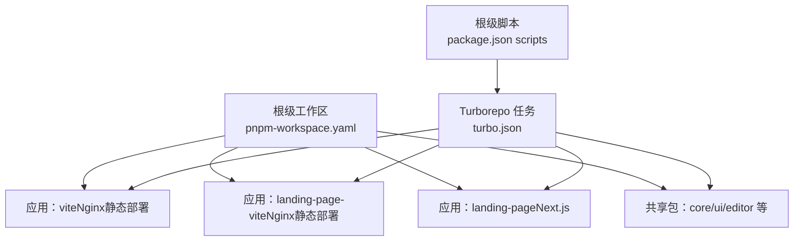
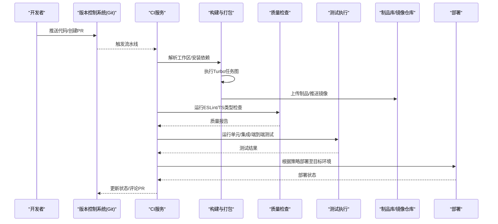
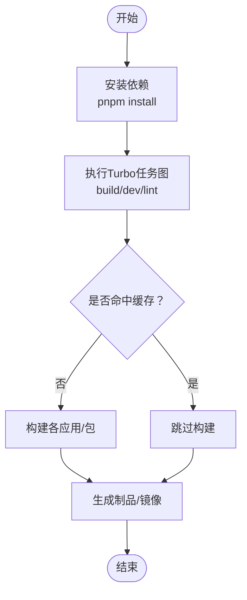
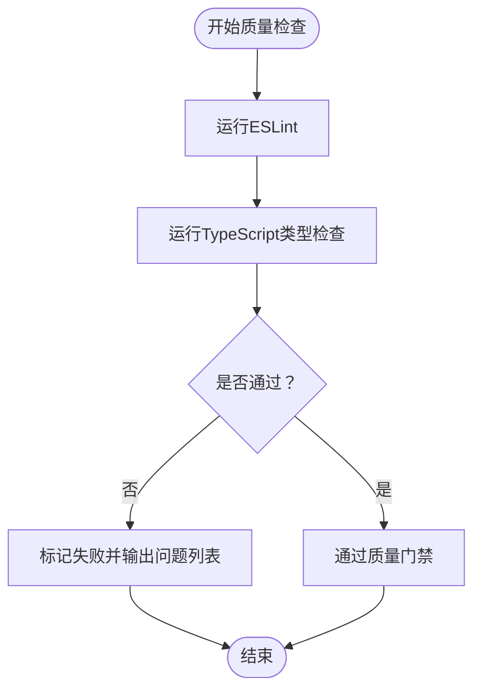
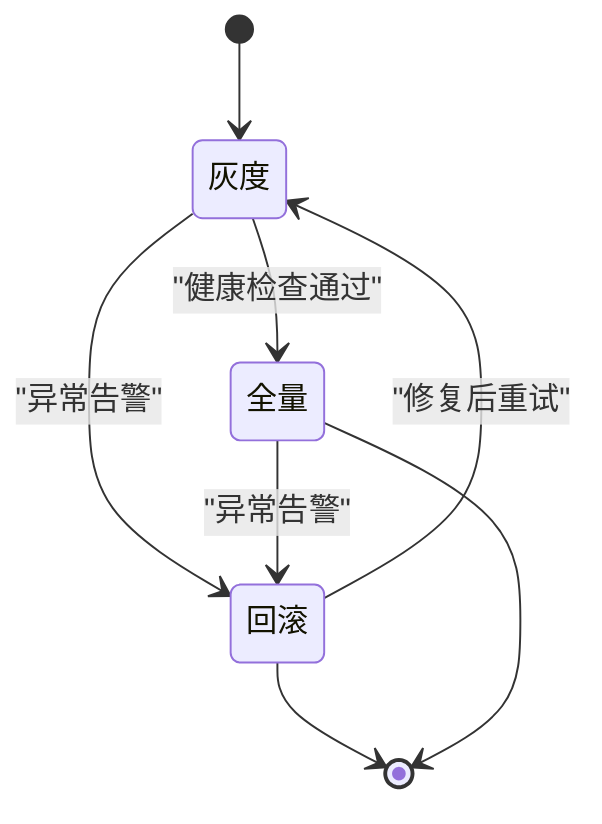
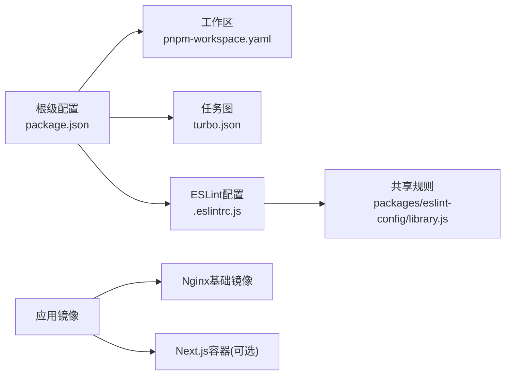

# CI/CD流水线

<cite>
**本文引用的文件**
- [package.json](file://package.json)
- [pnpm-workspace.yaml](file://pnpm-workspace.yaml)
- [turbo.json](file://turbo.json)
- [.eslintrc.js](file://.eslintrc.js)
- [packages/eslint-config/library.js](file://packages/eslint-config/library.js)
- [apps/landing-page/Dockerfile](file://apps/landing-page/Dockerfile)
- [apps/landing-page-vite/Dockerfile](file://apps/landing-page-vite/Dockerfile)
- [apps/vite/Dockerfile](file://apps/vite/Dockerfile)
</cite>

## 目录
1. [简介](#简介)
2. [项目结构](#项目结构)
3. [核心组件](#核心组件)
4. [架构总览](#架构总览)
5. [详细组件分析](#详细组件分析)
6. [依赖分析](#依赖分析)
7. [性能考虑](#性能考虑)
8. [故障排查指南](#故障排查指南)
9. [结论](#结论)
10. [附录](#附录)

## 简介
本文件面向知识库管理系统，提供一套可落地的持续集成与持续部署（CI/CD）流水线配置方案。内容涵盖：
- 触发条件与分支策略
- 构建与打包流程（多应用/多包）
- 自动化测试与代码质量检查（ESLint、TypeScript类型检查、安全扫描）
- 多环境构建与版本管理
- 部署策略（蓝绿、滚动、金丝雀）
- 通知、日志与监控集成建议
- 故障恢复与手动干预流程

## 项目结构
该仓库采用多包工作区（pnpm workspaces）+ Turborepo 的组织方式，包含多个前端应用与共享包。关键特征如下：
- 工作区定义：通过工作区配置声明 apps 与 packages 下的所有子包参与统一管理
- 根级脚本：通过根级脚本统一调度各包的构建、开发、格式化与 Lint
- 构建缓存：Turborepo 任务图与输出缓存提升整体效率
- 应用镜像：部分应用使用 Nginx 镜像进行静态资源部署；Next.js 应用可按需容器化

**图表来源**
- [pnpm-workspace.yaml](file://pnpm-workspace.yaml#L1-L4)
- [package.json](file://package.json#L9-L33)
- [turbo.json](file://turbo.json#L1-L27)

**章节来源**
- [pnpm-workspace.yaml](file://pnpm-workspace.yaml#L1-L4)
- [package.json](file://package.json#L9-L33)
- [turbo.json](file://turbo.json#L1-L27)

## 核心组件
- 工作区与包管理
  - 使用 pnpm 工作区统一管理多包，便于跨包依赖与版本控制
- 构建与任务编排
  - 通过根级脚本与 Turborepo 任务图实现跨包构建、Lint 与缓存
- 质量与规范
  - ESLint 基于共享配置，结合 Prettier 与 TypeScript 类型检查
- 容器化与部署
  - 静态站点使用 Nginx 镜像部署；Next.js 应用可选择容器化或静态导出

**章节来源**
- [pnpm-workspace.yaml](file://pnpm-workspace.yaml#L1-L4)
- [package.json](file://package.json#L9-L33)
- [.eslintrc.js](file://.eslintrc.js#L1-L11)
- [packages/eslint-config/library.js](file://packages/eslint-config/library.js#L1-L35)
- [apps/landing-page-vite/Dockerfile](file://apps/landing-page-vite/Dockerfile#L1-L12)
- [apps/vite/Dockerfile](file://apps/vite/Dockerfile#L1-L12)

## 架构总览
下图展示从代码提交到多环境部署的整体流程，包括触发、构建、测试、质量检查、打包与部署等阶段。

## 详细组件分析

### 触发条件与分支策略
- 主干分支保护：仅允许通过 PR 合并，合并前必须通过质量检查与测试
- PR 触发：每次 PR 更新均运行质量检查与测试
- 版本发布：在主干上打标签触发发布流程，自动识别版本号并生成变更日志
- 环境区分：根据分支或标签前缀区分开发、预发、生产环境

[本节为通用策略说明，不直接分析具体文件，故无“章节来源”]

### 构建与打包流程
- 依赖安装：使用 pnpm 工作区安装所有包依赖
- 任务编排：Turborepo 按任务图顺序执行，支持跨包依赖与缓存
- 输出缓存：针对 Next.js 等应用配置输出目录缓存，加速重复构建
- 多应用打包：
  - vite 应用：Nginx 镜像打包静态产物
  - landing-page-vite 应用：Nginx 镜像打包静态产物
  - landing-page 应用：可选容器化或静态导出（参考其 Dockerfile）

**图表来源**
- [package.json](file://package.json#L9-L33)
- [turbo.json](file://turbo.json#L1-L27)
- [apps/vite/Dockerfile](file://apps/vite/Dockerfile#L1-L12)
- [apps/landing-page-vite/Dockerfile](file://apps/landing-page-vite/Dockerfile#L1-L12)
- [apps/landing-page/Dockerfile](file://apps/landing-page/Dockerfile#L1-L61)

**章节来源**
- [package.json](file://package.json#L9-L33)
- [turbo.json](file://turbo.json#L1-L27)
- [apps/vite/Dockerfile](file://apps/vite/Dockerfile#L1-L12)
- [apps/landing-page-vite/Dockerfile](file://apps/landing-page-vite/Dockerfile#L1-L12)
- [apps/landing-page/Dockerfile](file://apps/landing-page/Dockerfile#L1-L61)

### 自动化测试流程
- 单元测试：在各包内按约定位置编写并执行，确保核心逻辑与工具函数稳定
- 集成测试：验证包间交互与共享模块行为
- 端到端测试：覆盖关键用户路径，建议在独立环境执行
- 测试报告：将覆盖率与结果上传至平台，作为合并门禁指标

[本节为通用测试流程说明，不直接分析具体文件，故无“章节来源”]

### 代码质量检查
- ESLint：根级配置扩展共享规则集，启用 TypeScript 项目解析
- 共享规则：基于推荐规则、Prettier 与 Turborepo 插件，统一风格与最佳实践
- 忽略规则：忽略点文件、node_modules 与 dist 目录，聚焦源码质量
- 类型检查：结合 ESLint 的 TypeScript 解析，确保类型安全

**图表来源**
- [.eslintrc.js](file://.eslintrc.js#L1-L11)
- [packages/eslint-config/library.js](file://packages/eslint-config/library.js#L1-L35)

**章节来源**
- [.eslintrc.js](file://.eslintrc.js#L1-L11)
- [packages/eslint-config/library.js](file://packages/eslint-config/library.js#L1-L35)

### 安全扫描与依赖审计
- 依赖审计：定期执行依赖扫描，识别高危漏洞
- 供应链安全：锁定关键依赖版本，启用只读依赖锁策略
- 配置扫描：对配置文件与密钥进行扫描，避免敏感信息泄露

[本节为通用安全策略说明，不直接分析具体文件，故无“章节来源”]

### 多环境构建与版本管理
- 版本号：根级版本由包管理器维护，建议遵循语义化版本
- 变更日志：基于提交历史自动生成变更日志
- 环境变量：通过环境文件与平台变量注入，避免硬编码
- 发布标签：以 vX.Y.Z 形式打标签触发发布，自动构建并推送制品

**章节来源**
- [package.json](file://package.json#L1-L103)

### 部署策略
- 蓝绿部署：准备两套环境，切换流量实现零停机升级
- 滚动更新：分批替换实例，降低单次变更影响面
- 金丝雀发布：小范围灰度放量，结合健康检查与回滚机制
- 静态站点：Nginx 镜像部署，适合快速上线与低成本托管
- 容器化：Next.js 应用可选择容器化运行或静态导出

**图表来源**
- [apps/landing-page-vite/Dockerfile](file://apps/landing-page-vite/Dockerfile#L1-L12)
- [apps/vite/Dockerfile](file://apps/vite/Dockerfile#L1-L12)
- [apps/landing-page/Dockerfile](file://apps/landing-page/Dockerfile#L1-L61)

**章节来源**
- [apps/landing-page-vite/Dockerfile](file://apps/landing-page-vite/Dockerfile#L1-L12)
- [apps/vite/Dockerfile](file://apps/vite/Dockerfile#L1-L12)
- [apps/landing-page/Dockerfile](file://apps/landing-page/Dockerfile#L1-L61)

### 通知、日志与监控集成
- 通知：在流水线关键节点（成功/失败/回滚）发送通知至 IM 或邮件
- 日志：集中采集流水线与应用日志，保留至少7天
- 监控：对部署成功率、响应时间、错误率建立看板与告警

[本节为通用运维建议，不直接分析具体文件，故无“章节来源”]

### 故障恢复与手动干预
- 回滚：一键回滚至上一个稳定版本或镜像
- 手动干预：在金丝雀阶段失败时，人工介入终止并回滚
- 降级：临时关闭高风险功能，保证系统可用性
- 复盘：记录故障原因、处理过程与改进措施

[本节为通用运维建议，不直接分析具体文件，故无“章节来源”]

## 依赖分析
- 包管理与工作区
  - pnpm 工作区统一管理多包，根脚本与 Turborepo 任务图协调构建顺序
- 质量检查链路
  - 根级 ESLint 配置指向共享规则集，确保风格一致
- 容器化依赖
  - 静态站点使用 Nginx 镜像，简化部署与扩缩容

**图表来源**
- [package.json](file://package.json#L9-L33)
- [pnpm-workspace.yaml](file://pnpm-workspace.yaml#L1-L4)
- [turbo.json](file://turbo.json#L1-L27)
- [.eslintrc.js](file://.eslintrc.js#L1-L11)
- [packages/eslint-config/library.js](file://packages/eslint-config/library.js#L1-L35)
- [apps/landing-page-vite/Dockerfile](file://apps/landing-page-vite/Dockerfile#L1-L12)
- [apps/vite/Dockerfile](file://apps/vite/Dockerfile#L1-L12)
- [apps/landing-page/Dockerfile](file://apps/landing-page/Dockerfile#L1-L61)

**章节来源**
- [package.json](file://package.json#L9-L33)
- [pnpm-workspace.yaml](file://pnpm-workspace.yaml#L1-L4)
- [turbo.json](file://turbo.json#L1-L27)
- [.eslintrc.js](file://.eslintrc.js#L1-L11)
- [packages/eslint-config/library.js](file://packages/eslint-config/library.js#L1-L35)
- [apps/landing-page-vite/Dockerfile](file://apps/landing-page-vite/Dockerfile#L1-L12)
- [apps/vite/Dockerfile](file://apps/vite/Dockerfile#L1-L12)
- [apps/landing-page/Dockerfile](file://apps/landing-page/Dockerfile#L1-L61)

## 性能考虑
- 构建缓存：利用 Turborepo 输出缓存减少重复构建时间
- 并行执行：在满足依赖关系前提下最大化并行度
- 依赖隔离：按包粒度安装与缓存，避免全局污染
- 镜像优化：Nginx 镜像体积小、启动快，适合静态站点部署

[本节提供通用指导，不直接分析具体文件，故无“章节来源”]

## 故障排查指南
- 构建失败
  - 检查依赖安装日志与网络代理配置
  - 校验 Turborepo 任务图与输出缓存配置
- 质量检查失败
  - 查看 ESLint 报告，修复类型与风格问题
- 部署异常
  - 核对镜像版本与环境变量
  - 检查 Nginx 配置与证书文件权限

[本节为通用排查建议，不直接分析具体文件，故无“章节来源”]

## 结论
本方案以 pnpm 工作区与 Turborepo 为核心，结合 ESLint、类型检查与容器化部署，形成可扩展、可观察的 CI/CD 流水线。通过多环境策略与金丝雀发布，可在保障稳定性的同时提升交付频率与质量。

[本节为总结性内容，不直接分析具体文件，故无“章节来源”]

## 附录
- 关键文件清单
  - 根级脚本与版本：[package.json](file://package.json#L9-L33)
  - 工作区定义：[pnpm-workspace.yaml](file://pnpm-workspace.yaml#L1-L4)
  - 任务图与缓存：[turbo.json](file://turbo.json#L1-L27)
  - ESLint 根配置：[.eslintrc.js](file://.eslintrc.js#L1-L11)
  - 共享 ESLint 规则：[packages/eslint-config/library.js](file://packages/eslint-config/library.js#L1-L35)
  - 应用容器化（静态站点）：[apps/landing-page-vite/Dockerfile](file://apps/landing-page-vite/Dockerfile#L1-L12)、[apps/vite/Dockerfile](file://apps/vite/Dockerfile#L1-L12)
  - 应用容器化（Next.js）：[apps/landing-page/Dockerfile](file://apps/landing-page/Dockerfile#L1-L61)

[本节为索引性内容，不直接分析具体文件，故无“章节来源”]