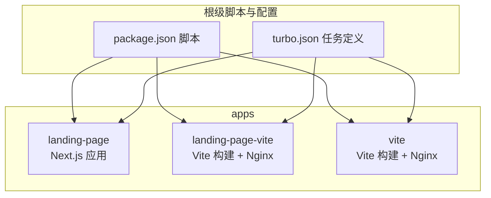
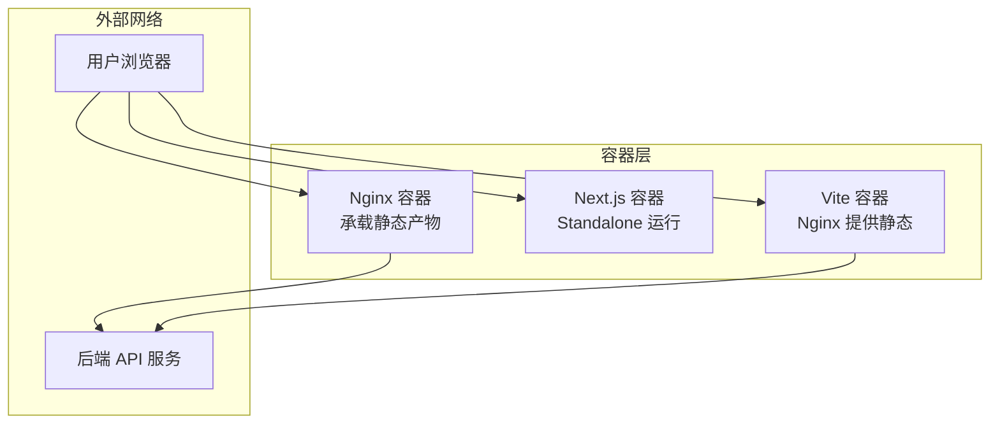
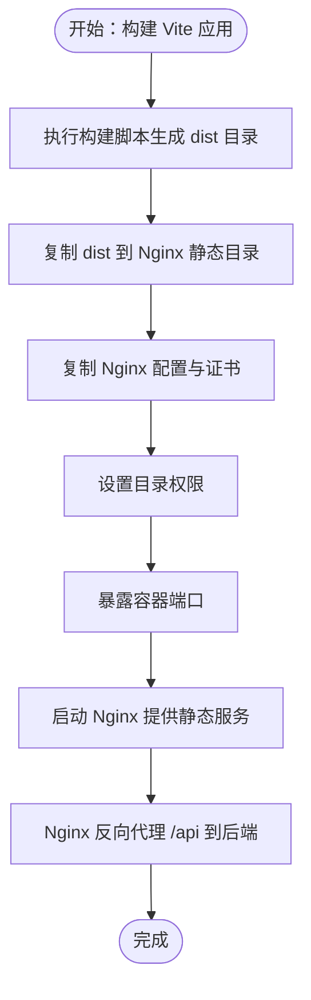
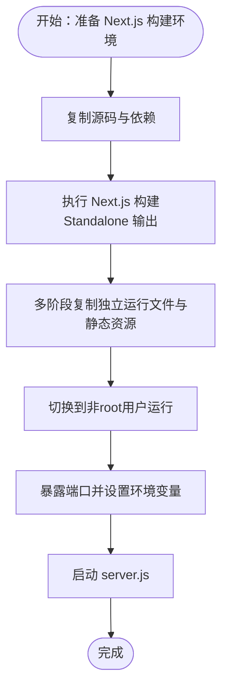
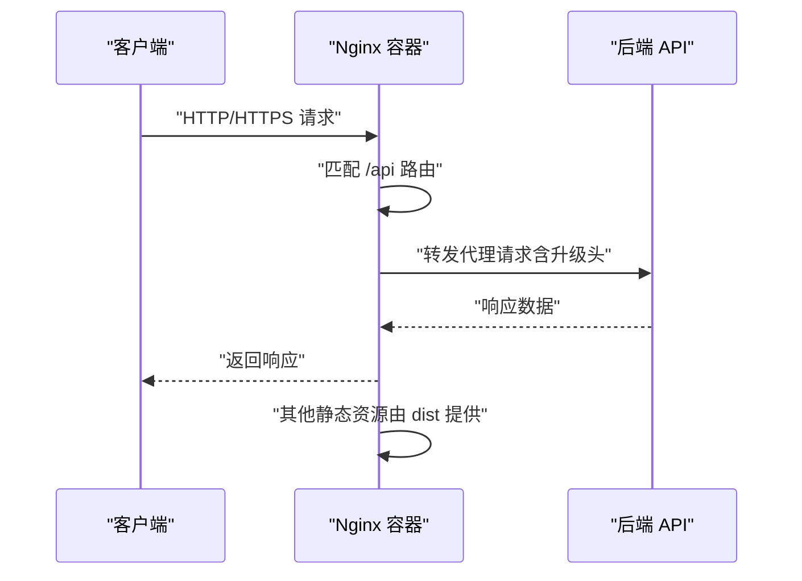
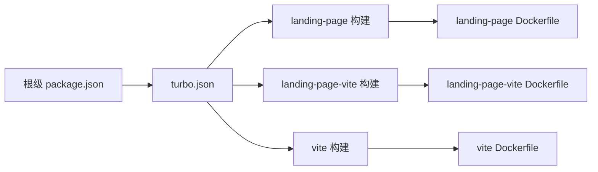

# Docker容器化

<cite>
**本文引用的文件**
- [apps/landing-page/Dockerfile](file://apps/landing-page/Dockerfile)
- [apps/landing-page/.dockerignore](file://apps/landing-page/.dockerignore)
- [apps/landing-page/next.config.mjs](file://apps/landing-page/next.config.mjs)
- [apps/landing-page/package.json](file://apps/landing-page/package.json)
- [apps/landing-page-vite/Dockerfile](file://apps/landing-page-vite/Dockerfile)
- [apps/vite/Dockerfile](file://apps/vite/Dockerfile)
- [apps/landing-page-vite/nginx/nginx.conf](file://apps/landing-page-vite/nginx/nginx.conf)
- [apps/vite/nginx/nginx.conf](file://apps/vite/nginx/nginx.conf)
- [apps/landing-page-vite/vite.config.ts](file://apps/landing-page-vite/vite.config.ts)
- [apps/vite/vite.config.ts](file://apps/vite/vite.config.ts)
- [package.json](file://package.json)
- [turbo.json](file://turbo.json)
</cite>

## 目录
1. [引言](#引言)
2. [项目结构](#项目结构)
3. [核心组件](#核心组件)
4. [架构总览](#架构总览)
5. [详细组件分析](#详细组件分析)
6. [依赖关系分析](#依赖关系分析)
7. [性能考虑](#性能考虑)
8. [故障排查指南](#故障排查指南)
9. [结论](#结论)
10. [附录](#附录)

## 引言
本文件面向知识库管理系统的Docker容器化部署，系统性阐述Dockerfile配置结构与构建流程，覆盖基础镜像选择、文件复制、权限与端口、运行参数、环境变量、卷挂载、健康检查、日志与资源限制等主题。同时提供主应用（Next.js）、着陆页应用（Next.js）与Vite前端应用（Nginx承载静态产物）三类容器化配置的对比与最佳实践，并给出镜像优化与多阶段构建建议。

## 项目结构
仓库采用Monorepo组织方式，使用Turbo进行任务编排。前端应用位于apps目录下，分别包含：
- 主应用：基于Vite的React应用
- 着陆页应用：基于Next.js的页面应用
- 着陆页Vite应用：基于Vite构建后由Nginx提供静态服务

各应用均提供独立的Dockerfile与Nginx配置文件，便于按需容器化部署。

图表来源
- [package.json](file://package.json#L1-L103)
- [turbo.json](file://turbo.json#L1-L27)

章节来源
- [package.json](file://package.json#L1-L103)
- [turbo.json](file://turbo.json#L1-L27)

## 核心组件
本节聚焦三类容器化组件及其差异：
- 主应用容器（Vite + Nginx）
- 着陆页应用容器（Next.js + Standalone）
- 着陆页Vite应用容器（Nginx）

每类容器的Dockerfile、构建产物与运行时行为存在显著差异，详见后续章节。

章节来源
- [apps/landing-page/Dockerfile](file://apps/landing-page/Dockerfile#L1-L61)
- [apps/landing-page/next.config.mjs](file://apps/landing-page/next.config.mjs#L1-L9)
- [apps/landing-page/package.json](file://apps/landing-page/package.json#L1-L26)
- [apps/landing-page-vite/Dockerfile](file://apps/landing-page-vite/Dockerfile#L1-L12)
- [apps/vite/Dockerfile](file://apps/vite/Dockerfile#L1-L12)
- [apps/landing-page-vite/nginx/nginx.conf](file://apps/landing-page-vite/nginx/nginx.conf#L1-L113)
- [apps/vite/nginx/nginx.conf](file://apps/vite/nginx/nginx.conf#L1-L113)
- [apps/landing-page-vite/vite.config.ts](file://apps/landing-page-vite/vite.config.ts#L1-L22)
- [apps/vite/vite.config.ts](file://apps/vite/vite.config.ts#L1-L21)

## 架构总览
下图展示三类应用在容器中的典型部署形态与交互：

图表来源
- [apps/landing-page/Dockerfile](file://apps/landing-page/Dockerfile#L1-L61)
- [apps/landing-page-vite/Dockerfile](file://apps/landing-page-vite/Dockerfile#L1-L12)
- [apps/vite/Dockerfile](file://apps/vite/Dockerfile#L1-L12)
- [apps/landing-page-vite/nginx/nginx.conf](file://apps/landing-page-vite/nginx/nginx.conf#L1-L113)
- [apps/vite/nginx/nginx.conf](file://apps/vite/nginx/nginx.conf#L1-L113)

## 详细组件分析

### 主应用容器（Vite + Nginx）
- 基础镜像与构建流程
  - 使用Nginx作为运行时镜像，直接复制构建产物与Nginx配置文件。
  - 构建产物来自Vite应用的构建脚本，配置中包含代理后端API的规则。
- 文件复制与权限
  - 将dist目录复制至Nginx默认站点目录；证书文件复制到Nginx可读路径；对静态目录设置权限。
- 端口与访问
  - 暴露HTTP端口；通过Nginx配置实现HTTP/HTTPS分流与反向代理。
- 运行参数与环境变量
  - 通过Nginx配置注入上游后端地址与代理头；容器启动后即由Nginx提供静态服务。
- 卷挂载建议
  - 静态资源与证书可通过卷挂载实现热更新或集中管理；避免在镜像内硬编码敏感信息。

图表来源
- [apps/vite/Dockerfile](file://apps/vite/Dockerfile#L1-L12)
- [apps/vite/nginx/nginx.conf](file://apps/vite/nginx/nginx.conf#L1-L113)
- [apps/vite/vite.config.ts](file://apps/vite/vite.config.ts#L1-L21)

章节来源
- [apps/vite/Dockerfile](file://apps/vite/Dockerfile#L1-L12)
- [apps/vite/nginx/nginx.conf](file://apps/vite/nginx/nginx.conf#L1-L113)
- [apps/vite/vite.config.ts](file://apps/vite/vite.config.ts#L1-L21)

### 着陆页应用容器（Next.js + Standalone）
- 基础镜像与多阶段构建
  - 当前Dockerfile未启用多阶段构建，直接以Node镜像为基础，复制源码并执行启动命令。
  - Next.js应用通过配置输出Standalone模式，可在多阶段构建中进一步优化镜像体积。
- 文件复制与权限
  - 复制源码后直接启动；如采用Standalone模式，应复制生成的静态与独立运行文件并切换非root用户。
- 端口与运行
  - 暴露应用端口并设置环境变量；确保监听地址允许外部访问。
- 运行参数与环境变量
  - 设置运行时环境变量（如端口、主机名），并在多阶段构建中禁用遥测以减小镜像与构建时间。

图表来源
- [apps/landing-page/Dockerfile](file://apps/landing-page/Dockerfile#L1-L61)
- [apps/landing-page/next.config.mjs](file://apps/landing-page/next.config.mjs#L1-L9)

章节来源
- [apps/landing-page/Dockerfile](file://apps/landing-page/Dockerfile#L1-L61)
- [apps/landing-page/next.config.mjs](file://apps/landing-page/next.config.mjs#L1-L9)

### 着陆页Vite应用容器（Nginx）
- 构建与运行
  - 与主应用类似，但更强调静态资源与Nginx配置的复用。
- Nginx配置要点
  - 同时监听HTTP与HTTPS端口；对/api路径进行反向代理；支持WebSocket升级；设置连接超时与缓冲区大小。
- 证书与安全
  - 将SSL证书复制到Nginx目录并正确授权；根据域名配置server_name。

图表来源
- [apps/landing-page-vite/Dockerfile](file://apps/landing-page-vite/Dockerfile#L1-L12)
- [apps/landing-page-vite/nginx/nginx.conf](file://apps/landing-page-vite/nginx/nginx.conf#L1-L113)

章节来源
- [apps/landing-page-vite/Dockerfile](file://apps/landing-page-vite/Dockerfile#L1-L12)
- [apps/landing-page-vite/nginx/nginx.conf](file://apps/landing-page-vite/nginx/nginx.conf#L1-L113)

## 依赖关系分析
- Monorepo与任务编排
  - 根级package.json提供统一构建脚本，turbo.json定义构建任务与输出缓存策略。
- 应用间依赖
  - 各应用通过workspace依赖共享包，构建顺序由Turbo自动推导。
- 容器构建链路
  - 先在本地或CI中执行Vite/Next.js构建，再由对应Dockerfile复制产物并打包镜像。

图表来源
- [package.json](file://package.json#L1-L103)
- [turbo.json](file://turbo.json#L1-L27)
- [apps/landing-page/Dockerfile](file://apps/landing-page/Dockerfile#L1-L61)
- [apps/landing-page-vite/Dockerfile](file://apps/landing-page-vite/Dockerfile#L1-L12)
- [apps/vite/Dockerfile](file://apps/vite/Dockerfile#L1-L12)

章节来源
- [package.json](file://package.json#L1-L103)
- [turbo.json](file://turbo.json#L1-L27)

## 性能考虑
- 镜像体积优化
  - 优先采用多阶段构建，仅在最终阶段保留运行所需文件；清理构建缓存与开发依赖。
  - 对Next.js应用启用Standalone输出并结合多阶段复制，减少运行时镜像大小。
- 构建加速
  - 利用包管理器缓存与分层缓存策略；在CI中缓存依赖与构建产物。
- 运行时性能
  - Nginx侧启用压缩与合理的超时设置；合理设置静态资源缓存头。
  - 控制并发连接数与请求体大小，避免资源耗尽。

## 故障排查指南
- 构建失败
  - 检查包管理器与网络配置；确认构建脚本与版本兼容；查看构建日志定位错误。
- 镜像启动异常
  - 确认端口映射与监听地址；检查非root用户权限与文件权限；验证环境变量是否正确注入。
- 访问问题
  - 核对Nginx配置中的server_name、证书路径与权限；检查/api代理目标与重写规则。
- 日志定位
  - 查看Nginx访问与错误日志；在容器内使用标准输出与日志文件进行问题定位。

章节来源
- [apps/landing-page/.dockerignore](file://apps/landing-page/.dockerignore#L1-L34)
- [apps/landing-page-vite/nginx/nginx.conf](file://apps/landing-page-vite/nginx/nginx.conf#L1-L113)
- [apps/vite/nginx/nginx.conf](file://apps/vite/nginx/nginx.conf#L1-L113)

## 结论
本仓库提供了三种容器化方案：Next.js的Standalone运行、Vite+Nginx的静态托管与着陆页Vite+Nginx的混合部署。通过规范的Dockerfile、Nginx配置与构建脚本，可实现稳定、可维护且高性能的容器化交付。建议在生产环境中采用多阶段构建与最小化运行时镜像，并结合健康检查、日志与资源限制策略提升可靠性。

## 附录
- 健康检查与探针
  - 在容器编排中添加健康检查，探测应用端口与关键接口可用性。
- 日志管理
  - 统一输出到标准输出与日志文件；在编排平台中聚合日志并设置轮转策略。
- 资源限制
  - 为容器设置CPU与内存上限，避免资源争用；对Nginx与Node进程进行合理资源配置。
- 多阶段构建建议
  - 对Next.js应用：分离依赖安装、构建与运行阶段；仅复制Standalone与静态资源到最终镜像。
  - 对Vite应用：在构建阶段完成代码压缩与资源优化，仅复制dist与必要配置到Nginx镜像。