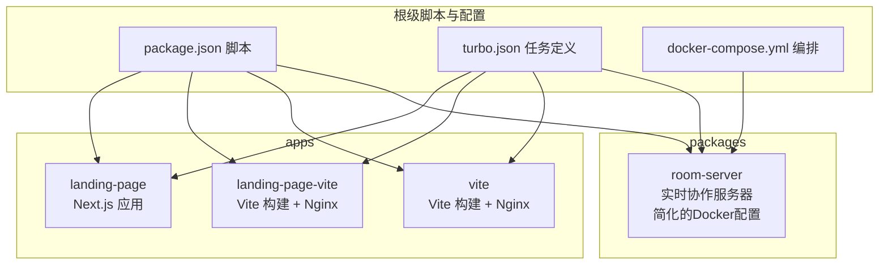
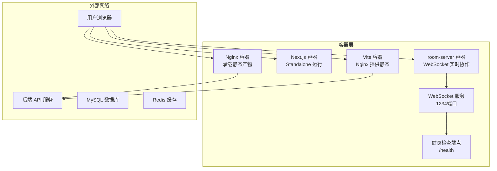
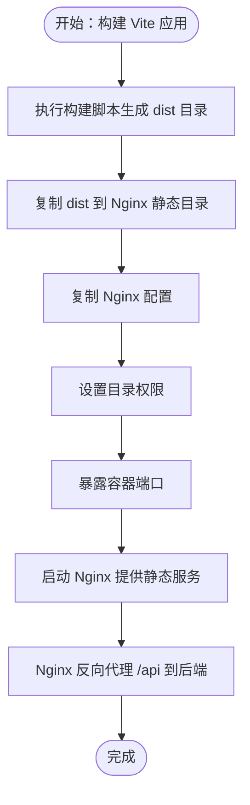
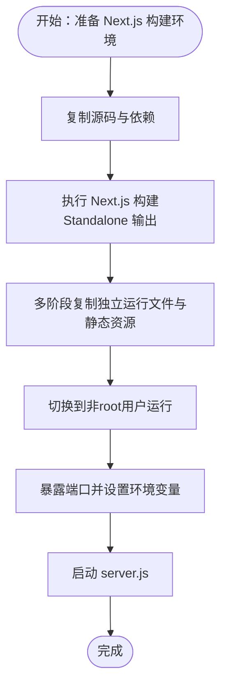
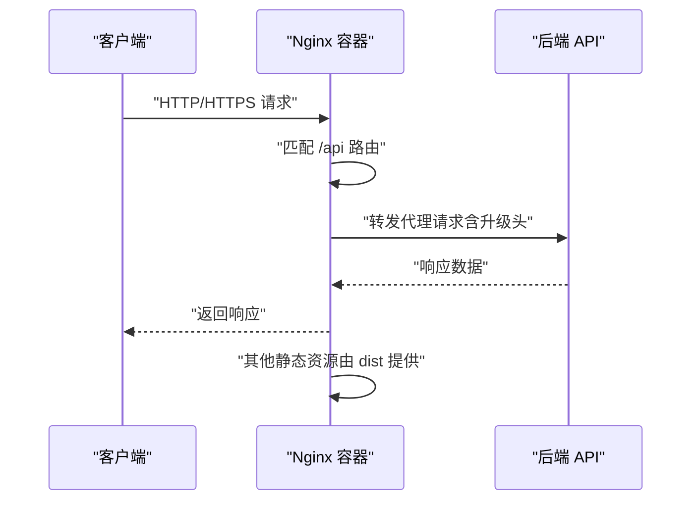
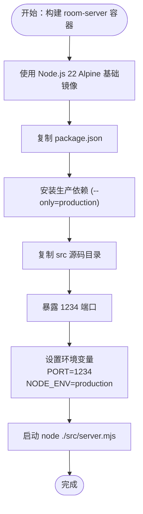
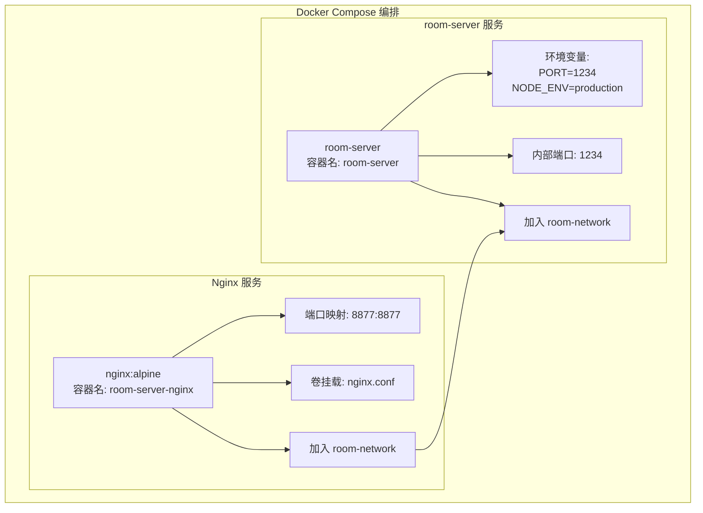
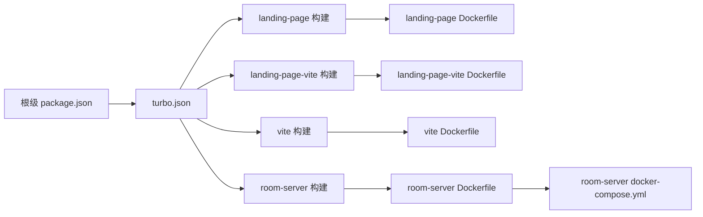

# Docker容器化

<cite>
**本文档引用的文件**
- [apps/landing-page/Dockerfile](file://apps/landing-page/Dockerfile)
- [apps/landing-page/.dockerignore](file://apps/landing-page/.dockerignore)
- [apps/landing-page/next.config.mjs](file://apps/landing-page/next.config.mjs)
- [apps/landing-page/package.json](file://apps/landing-page/package.json)
- [apps/landing-page-vite/Dockerfile](file://apps/landing-page-vite/Dockerfile)
- [apps/vite/Dockerfile](file://apps/vite/Dockerfile)
- [apps/landing-page-vite/nginx/nginx.conf](file://apps/landing-page-vite/nginx/nginx.conf)
- [apps/vite/nginx/nginx.conf](file://apps/vite/nginx/nginx.conf)
- [apps/landing-page-vite/vite.config.ts](file://apps/landing-page-vite/vite.config.ts)
- [apps/vite/vite.config.ts](file://apps/vite/vite.config.ts)
- [packages/room-server/Dockerfile](file://packages/room-server/Dockerfile)
- [packages/room-server/.dockerignore](file://packages/room-server/.dockerignore)
- [packages/room-server/.env.example](file://packages/room-server/.env.example)
- [packages/room-server/package.json](file://packages/room-server/package.json)
- [packages/room-server/src/server.mjs](file://packages/room-server/src/server.mjs)
- [packages/room-server/src/plugin/mysql/MysqlPlugin.mjs](file://packages/room-server/src/plugin/mysql/MysqlPlugin.mjs)
- [packages/room-server/docker-compose.yml](file://packages/room-server/docker-compose.yml)
- [packages/room-server/nginx/nginx.conf](file://packages/room-server/nginx/nginx.conf)
- [packages/room-server/certs/.gitkeep](file://packages/room-server/certs/.gitkeep)
- [package.json](file://package.json)
- [turbo.json](file://turbo.json)
</cite>

## 更新摘要
**所做更改**
- 移除了SSL证书复制操作的相关说明，简化了room-server的部署配置
- 更新了room-server容器的Dockerfile，移除了创建certs目录和环境变量设置
- 更新了Docker Compose配置，移除了SSL证书的卷挂载配置
- 删除了关于SSL证书挂载和环境变量管理的详细说明
- 简化了room-server的健康检查和网络配置描述

## 目录
1. [引言](#引言)
2. [项目结构](#项目结构)
3. [核心组件](#核心组件)
4. [架构总览](#架构总览)
5. [详细组件分析](#详细组件分析)
6. [Docker Compose编排](#docker-compose编排)
7. [依赖关系分析](#依赖关系分析)
8. [性能考虑](#性能考虑)
9. [故障排查指南](#故障排查指南)
10. [结论](#结论)
11. [附录](#附录)

## 引言
本文件面向知识库管理系统的Docker容器化部署，系统性阐述Dockerfile配置结构与构建流程，覆盖基础镜像选择、文件复制、权限与端口、运行参数、环境变量、卷挂载、健康检查、日志与资源限制等主题。同时提供主应用（Next.js）、着陆页应用（Next.js）与Vite前端应用（Nginx承载静态产物）以及实时协作服务器（room-server）四类容器化配置的对比与最佳实践，并给出镜像优化与多阶段构建建议。

**更新** 本次更新反映了Docker配置的简化：移除了SSL证书复制操作，简化了部署配置。room-server现在采用更简洁的容器化方案，不再需要手动管理SSL证书文件。

## 项目结构
仓库采用Monorepo组织方式，使用Turbo进行任务编排。前端应用位于apps目录下，分别包含：
- 主应用：基于Vite的React应用
- 着陆页应用：基于Next.js的页面应用
- 着陆页Vite应用：基于Vite构建后由Nginx提供静态服务
- **更新**：room-server包，提供实时协作功能的WebSocket服务器，采用简化的Docker配置

各应用均提供独立的Dockerfile与Nginx配置文件，便于按需容器化部署。room-server现在提供简化的Docker Compose编排配置，移除了SSL证书管理的复杂性。

```mermaid
graph TB
subgraph "apps"
A["landing-page<br/>Next.js 应用"]
B["landing-page-vite<br/>Vite 构建 + Nginx"]
C["vite<br/>Vite 构建 + Nginx"]
end
subgraph "packages"
RS["room-server<br/>实时协作服务器<br/>简化的Docker配置"]
end
subgraph "根级脚本与配置"
R["package.json 脚本"]
T["turbo.json 任务定义"]
DC["docker-compose.yml 编排"]
end
R --> A
R --> B
R --> C
R --> RS
T --> A
T --> B
T --> C
T --> RS
DC --> RS
```

**图表来源**
- [package.json](file://package.json#L1-L113)
- [turbo.json](file://turbo.json#L1-L27)
- [packages/room-server/package.json](file://packages/room-server/package.json#L1-L32)
- [packages/room-server/docker-compose.yml](file://packages/room-server/docker-compose.yml#L1-L39)

**章节来源**
- [package.json](file://package.json#L1-L113)
- [turbo.json](file://turbo.json#L1-L27)

## 核心组件
本节聚焦四类容器化组件及其差异：
- 主应用容器（Vite + Nginx）
- 着陆页应用容器（Next.js + Standalone）
- 着陆页Vite应用容器（Nginx）
- **更新**：room-server容器（Node.js + Nginx反向代理，简化的SSL配置）

每类容器的Dockerfile、构建产物与运行时行为存在显著差异，详见后续章节。room-server现在提供简化的Docker Compose编排配置，移除了SSL证书的复杂管理。

**章节来源**
- [apps/landing-page/Dockerfile](file://apps/landing-page/Dockerfile#L1-L61)
- [apps/landing-page/next.config.mjs](file://apps/landing-page/next.config.mjs#L1-L9)
- [apps/landing-page/package.json](file://apps/landing-page/package.json#L1-L26)
- [apps/landing-page-vite/Dockerfile](file://apps/landing-page-vite/Dockerfile#L1-L11)
- [apps/vite/Dockerfile](file://apps/vite/Dockerfile#L1-L10)
- [packages/room-server/Dockerfile](file://packages/room-server/Dockerfile#L1-L29)
- [packages/room-server/docker-compose.yml](file://packages/room-server/docker-compose.yml#L1-L39)

## 架构总览
下图展示四类应用在容器中的典型部署形态与交互，特别是room-server的简化编排架构：

```mermaid
graph TB
subgraph "容器层"
LNX["Nginx 容器<br/>承载静态产物"]
NEXT["Next.js 容器<br/>Standalone 运行"]
VITE["Vite 容器<br/>Nginx 提供静态"]
RS["room-server 容器<br/>WebSocket 实时协作"]
WS["WebSocket 服务<br/>1234端口"]
ENDPOINT["健康检查端点<br/>/health"]
end
subgraph "外部网络"
U["用户浏览器"]
API["后端 API 服务"]
DB["MySQL 数据库"]
REDIS["Redis 缓存"]
end
U --> LNX
U --> NEXT
U --> VITE
U --> RS
LNX --> API
VITE --> API
RS --> WS
WS --> ENDPOINT
```

**图表来源**
- [apps/landing-page/Dockerfile](file://apps/landing-page/Dockerfile#L1-L61)
- [apps/landing-page-vite/Dockerfile](file://apps/landing-page-vite/Dockerfile#L1-L11)
- [apps/vite/Dockerfile](file://apps/vite/Dockerfile#L1-L10)
- [packages/room-server/Dockerfile](file://packages/room-server/Dockerfile#L1-L29)
- [packages/room-server/docker-compose.yml](file://packages/room-server/docker-compose.yml#L1-L39)
- [packages/room-server/nginx/nginx.conf](file://packages/room-server/nginx/nginx.conf#L1-L135)

## 详细组件分析

### 主应用容器（Vite + Nginx）
- 基础镜像与构建流程
  - 使用Nginx作为运行时镜像，直接复制构建产物与Nginx配置文件。
  - 构建产物来自Vite应用的构建脚本，配置中包含代理后端API的规则。
- 文件复制与权限
  - 将dist目录复制至Nginx默认站点目录；对静态目录设置权限。
- 端口与访问
  - 暴露HTTP端口；通过Nginx配置实现HTTP/HTTPS分流与反向代理。
- 运行参数与环境变量
  - 通过Nginx配置注入上游后端地址与代理头；容器启动后即由Nginx提供静态服务。
- 卷挂载建议
  - 静态资源可通过卷挂载实现热更新或集中管理；避免在镜像内硬编码敏感信息。

```mermaid
flowchart TD
Start(["开始：构建 Vite 应用"]) --> Build["执行构建脚本生成 dist 目录"]
Build --> CopyDist["复制 dist 到 Nginx 静态目录"]
CopyDist --> CopyConf["复制 Nginx 配置"]
CopyConf --> SetPerm["设置目录权限"]
SetPerm --> ExposePort["暴露容器端口"]
ExposePort --> RunNginx["启动 Nginx 提供静态服务"]
RunNginx --> ProxyAPI["Nginx 反向代理 /api 到后端"]
ProxyAPI --> End(["完成"])
```

**图表来源**
- [apps/vite/Dockerfile](file://apps/vite/Dockerfile#L1-L10)
- [apps/vite/nginx/nginx.conf](file://apps/vite/nginx/nginx.conf#L1-L113)
- [apps/vite/vite.config.ts](file://apps/vite/vite.config.ts#L1-L21)

**章节来源**
- [apps/vite/Dockerfile](file://apps/vite/Dockerfile#L1-L10)
- [apps/vite/nginx/nginx.conf](file://apps/vite/nginx/nginx.conf#L1-L113)
- [apps/vite/vite.config.ts](file://apps/vite/vite.config.ts#L1-L21)

### 着陆页应用容器（Next.js + Standalone）
- 基础镜像与多阶段构建
  - 当前Dockerfile未启用多阶段构建，直接以Node镜像为基础，复制源码并执行启动命令。
  - Next.js应用通过配置输出Standalone模式，可在多阶段构建中进一步优化镜像体积。
- 文件复制与权限
  - 复制源码后直接启动；如采用Standalone模式，应复制生成的静态与独立运行文件并切换非root用户。
- 端口与运行
  - 暴露应用端口并设置环境变量；确保监听地址允许外部访问。
- 运行参数与环境变量
  - 设置运行时环境变量（如端口、主机名），并在多阶段构建中禁用遥测以减小镜像与构建时间。

```mermaid
flowchart TD
Start(["开始：准备 Next.js 构建环境"]) --> CopySrc["复制源码与依赖"]
CopySrc --> BuildNext["执行 Next.js 构建Standalone 输出"]
BuildNext --> StageCopy["多阶段复制独立运行文件与静态资源"]
StageCopy --> SwitchUser["切换到非root用户运行"]
SwitchUser --> ExposePort["暴露端口并设置环境变量"]
ExposePort --> RunServer["启动 server.js"]
RunServer --> End(["完成"])
```

**图表来源**
- [apps/landing-page/Dockerfile](file://apps/landing-page/Dockerfile#L1-L61)
- [apps/landing-page/next.config.mjs](file://apps/landing-page/next.config.mjs#L1-L9)

**章节来源**
- [apps/landing-page/Dockerfile](file://apps/landing-page/Dockerfile#L1-L61)
- [apps/landing-page/next.config.mjs](file://apps/landing-page/next.config.mjs#L1-L9)

### 着陆页Vite应用容器（Nginx）
- 构建与运行
  - 与主应用类似，但更强调静态资源与Nginx配置的复用。
- Nginx配置要点
  - 同时监听HTTP与HTTPS端口；对/api路径进行反向代理；支持WebSocket升级；设置连接超时与缓冲区大小。
- 证书与安全
  - 将SSL证书复制到Nginx目录并正确授权；根据域名配置server_name。

```mermaid
sequenceDiagram
participant C as "客户端"
participant N as "Nginx 容器"
participant API as "后端 API"
C->>N : "HTTP/HTTPS 请求"
N->>N : "匹配 /api 路由"
N->>API : "转发代理请求含升级头"
API-->>N : "响应数据"
N-->>C : "返回响应"
N->>N : "其他静态资源由 dist 提供"
```

**图表来源**
- [apps/landing-page-vite/Dockerfile](file://apps/landing-page-vite/Dockerfile#L1-L11)
- [apps/landing-page-vite/nginx/nginx.conf](file://apps/landing-page-vite/nginx/nginx.conf#L1-L113)

**章节来源**
- [apps/landing-page-vite/Dockerfile](file://apps/landing-page-vite/Dockerfile#L1-L11)
- [apps/landing-page-vite/nginx/nginx.conf](file://apps/landing-page-vite/nginx/nginx.conf#L1-L113)

### room-server容器（实时协作服务器）
**更新** 本节介绍room-server包的Docker容器化配置，展示了简化的部署方案。

- 基础镜像与构建流程
  - 使用Node.js 22 Alpine作为基础镜像，采用轻量级Linux发行版。
  - 仅复制必要的package.json和源码文件，避免不必要的依赖进入镜像。
- 依赖安装与生产环境
  - 使用`--only=production`标志仅安装生产依赖，减少镜像体积。
  - 支持MySQL数据库连接，包含完整的数据库插件集成。
- 文件复制与权限
  - 复制src目录下的所有服务器源码文件。
  - 默认暴露1234端口用于WebSocket连接。
- 环境变量与配置
  - 默认PORT=1234，NODE_ENV=production
  - 支持通过环境变量配置数据库连接参数
  - 集成Redis和SQLite扩展的可选配置
- 运行参数与健康检查
  - 通过package.json提供docker:build和docker:run脚本
  - 支持容器编排中的健康检查配置

```mermaid
flowchart TD
Start(["开始：构建 room-server 容器"]) --> BaseImage["使用 Node.js 22 Alpine 基础镜像"]
BaseImage --> CopyPkg["复制 package.json"]
CopyPkg --> InstallDeps["安装生产依赖 (--only=production)"]
InstallDeps --> CopySrc["复制 src 源码目录"]
CopySrc --> ExposePort["暴露 1234 端口"]
ExposePort --> EnvVars["设置环境变量<br/>PORT=1234<br/>NODE_ENV=production"]
EnvVars --> StartServer["启动 node ./src/server.mjs"]
StartServer --> End(["完成"])
```

**图表来源**
- [packages/room-server/Dockerfile](file://packages/room-server/Dockerfile#L1-L29)
- [packages/room-server/package.json](file://packages/room-server/package.json#L10-L15)

**章节来源**
- [packages/room-server/Dockerfile](file://packages/room-server/Dockerfile#L1-L29)
- [packages/room-server/package.json](file://packages/room-server/package.json#L1-L32)
- [packages/room-server/src/server.mjs](file://packages/room-server/src/server.mjs#L1-L59)
- [packages/room-server/src/plugin/mysql/MysqlPlugin.mjs](file://packages/room-server/src/plugin/mysql/MysqlPlugin.mjs#L1-L124)

## Docker Compose编排
**更新** 本节详细介绍room-server的Docker Compose编排配置，展示简化的容器编排架构。

### 编排架构概述
room-server现在提供简化的Docker Compose配置，包含两个主要服务：Nginx反向代理和room-server WebSocket服务器，通过自定义网络进行通信。移除了SSL证书的复杂管理，采用更简单的部署方案。

```mermaid
graph TB
subgraph "Docker Compose 编排"
subgraph "Nginx 服务"
N1["nginx:alpine<br/>容器名: room-server-nginx"]
N1 --> P8877["端口映射: 8877:8877"]
N1 --> V1["卷挂载: nginx.conf"]
N1 --> NET1["加入 room-network"]
end
subgraph "room-server 服务"
RS1["room-server<br/>容器名: room-server"]
RS1 --> ENV1["环境变量:<br/>PORT=1234<br/>NODE_ENV=production"]
RS1 --> EXPOSE1234["内部端口: 1234"]
RS1 --> NET2["加入 room-network"]
end
NET1 --> NET2
end
```

**图表来源**
- [packages/room-server/docker-compose.yml](file://packages/room-server/docker-compose.yml#L1-L39)

### Nginx反向代理配置
- 服务定义
  - 使用nginx:alpine官方镜像，容器名为room-server-nginx
  - 暴露8877端口到宿主机，实现SSL终止和反向代理
- 卷挂载配置
  - 挂载nginx.conf到/etc/nginx/nginx.conf
- 网络配置
  - 加入自定义bridge网络room-network，实现服务间通信

### room-server服务配置
- 构建配置
  - 从当前目录构建，使用Dockerfile
  - 容器名为room-server
- 环境变量管理
  - PORT=1234：WebSocket服务器端口
  - NODE_ENV=production：生产环境模式
- 网络配置
  - 内部暴露1234端口，不直接映射到宿主机
  - 通过room-network与Nginx通信

### 环境变量管理
- 配置文件支持
  - .env.example文件提供环境变量模板
  - 支持数据库连接、Redis配置等参数
- 运行时配置
  - 通过Docker Compose的environment字段设置
  - 支持动态环境变量注入

**章节来源**
- [packages/room-server/docker-compose.yml](file://packages/room-server/docker-compose.yml#L1-L39)
- [packages/room-server/.env.example](file://packages/room-server/.env.example#L1-L19)

## 依赖关系分析
- Monorepo与任务编排
  - 根级package.json提供统一构建脚本，turbo.json定义构建任务与输出缓存策略。
- 应用间依赖
  - 各应用通过workspace依赖共享包，构建顺序由Turbo自动推导。
- 容器构建链路
  - 先在本地或CI中执行Vite/Next.js构建，再由对应Dockerfile复制产物并打包镜像。
- **更新** room-server集成
  - room-server作为独立的服务组件，提供实时协作功能，与主应用通过WebSocket协议通信。
  - 通过简化的Docker Compose实现容器编排，移除了SSL证书的复杂管理。

```mermaid
graph LR
P["根级 package.json"] --> T["turbo.json"]
T --> L["landing-page 构建"]
T --> LV["landing-page-vite 构建"]
T --> V["vite 构建"]
T --> RS["room-server 构建"]
L --> DL["landing-page Dockerfile"]
LV --> DLV["landing-page-vite Dockerfile"]
V --> DV["vite Dockerfile"]
RS --> DR["room-server Dockerfile"]
DR --> DC["room-server docker-compose.yml"]
```

**图表来源**
- [package.json](file://package.json#L1-L113)
- [turbo.json](file://turbo.json#L1-L27)
- [apps/landing-page/Dockerfile](file://apps/landing-page/Dockerfile#L1-L61)
- [apps/landing-page-vite/Dockerfile](file://apps/landing-page-vite/Dockerfile#L1-L11)
- [apps/vite/Dockerfile](file://apps/vite/Dockerfile#L1-L10)
- [packages/room-server/Dockerfile](file://packages/room-server/Dockerfile#L1-L29)
- [packages/room-server/docker-compose.yml](file://packages/room-server/docker-compose.yml#L1-L39)

**章节来源**
- [package.json](file://package.json#L1-L113)
- [turbo.json](file://turbo.json#L1-L27)

## 性能考虑
- 镜像体积优化
  - 优先采用多阶段构建，仅在最终阶段保留运行所需文件；清理构建缓存与开发依赖。
  - 对Next.js应用启用Standalone输出并结合多阶段复制，减少运行时镜像大小。
  - **更新** room-server使用Alpine Linux基础镜像，显著减少镜像体积，移除了SSL证书管理的额外开销。
- 构建加速
  - 利用包管理器缓存与分层缓存策略；在CI中缓存依赖与构建产物。
- 运行时性能
  - Nginx侧启用压缩与合理的超时设置；合理设置静态资源缓存头。
  - 控制并发连接数与请求体大小，避免资源耗尽。
  - **更新** room-server支持Redis缓存和MySQL数据库连接，需要合理配置连接池参数。
  - **更新** Docker Compose编排中使用自定义bridge网络，提高容器间通信效率。

## 故障排查指南
- 构建失败
  - 检查包管理器与网络配置；确认构建脚本与版本兼容；查看构建日志定位错误。
- 镜像启动异常
  - 确认端口映射与监听地址；检查非root用户权限与文件权限；验证环境变量是否正确注入。
- 访问问题
  - 核对Nginx配置中的server_name、证书路径与权限；检查/api代理目标与重写规则。
- 日志定位
  - 查看Nginx访问与错误日志；在容器内使用标准输出与日志文件进行问题定位。
- **更新** room-server问题排查
  - 检查数据库连接参数和网络连通性
  - 验证Redis缓存服务状态
  - 查看WebSocket连接日志和错误信息
  - 检查Docker Compose网络连接和容器间通信
- **更新** Docker Compose相关问题
  - 确认自定义网络room-network已正确创建
  - 检查卷挂载路径和权限设置
  - 验证SSL证书文件的格式和内容

**章节来源**
- [apps/landing-page/.dockerignore](file://apps/landing-page/.dockerignore#L1-L34)
- [apps/landing-page-vite/nginx/nginx.conf](file://apps/landing-page-vite/nginx/nginx.conf#L1-L113)
- [apps/vite/nginx/nginx.conf](file://apps/vite/nginx/nginx.conf#L1-L113)
- [packages/room-server/.dockerignore](file://packages/room-server/.dockerignore#L1-L9)
- [packages/room-server/.env.example](file://packages/room-server/.env.example#L1-L19)
- [packages/room-server/docker-compose.yml](file://packages/room-server/docker-compose.yml#L1-L39)

## 结论
本仓库提供了四种容器化方案：Next.js的Standalone运行、Vite+Nginx的静态托管、着陆页Vite+Nginx的混合部署以及更新的room-server实时协作服务器。通过规范的Dockerfile、Nginx配置与构建脚本，可实现稳定、可维护且高性能的容器化交付。

**更新** 本次更新展示了Docker配置的简化：移除了SSL证书复制操作，简化了部署配置。新的room-server容器化方案更加简洁高效，移除了复杂的SSL证书管理，通过简化的Docker Compose配置实现了完整的容器编排。建议在生产环境中采用多阶段构建与最小化运行时镜像，并结合健康检查、日志与资源限制策略提升可靠性。

## 附录
- 健康检查与探针
  - 在容器编排中添加健康检查，探测应用端口与关键接口可用性。
  - **更新** room-server可配置WebSocket健康检查端点。
  - **更新** Docker Compose中Nginx提供/health端点用于健康检查。
- 日志管理
  - 统一输出到标准输出与日志文件；在编排平台中聚合日志并设置轮转策略。
- 资源限制
  - 为容器设置CPU与内存上限，避免资源争用；对Nginx与Node进程进行合理资源配置。
  - **更新** room-server需要考虑WebSocket连接数和数据库连接池的资源限制。
- 多阶段构建建议
  - 对Next.js应用：分离依赖安装、构建与运行阶段；仅复制Standalone与静态资源到最终镜像。
  - 对Vite应用：在构建阶段完成代码压缩与资源优化，仅复制dist与必要配置到Nginx镜像。
  - **更新** room-server：使用Alpine基础镜像，仅复制必要源码和生产依赖，避免开发工具进入最终镜像。
- **更新** 环境变量配置
  - room-server支持通过环境变量配置数据库连接参数、Redis缓存配置和端口设置。
  - 建议使用容器编排平台的密钥管理功能存储敏感配置信息。
  - **更新** Docker Compose支持通过environment字段设置环境变量。
- **更新** Docker构建脚本
  - 根级package.json提供了room-server的构建和运行脚本
  - 支持docker:build和docker:run命令快速部署
  - **更新** Docker Compose提供简化的容器编排解决方案
- **更新** SSL证书管理
  - Nginx反向代理支持SSL终止和证书挂载
  - 证书文件通过卷挂载方式管理，支持热更新
  - 建议使用Let's Encrypt或其他CA签发的证书
- **更新** 网络配置
  - 使用自定义bridge网络room-network实现服务间通信
  - Nginx和room-server通过同一网络进行通信
  - 支持容器间的DNS解析和服务发现