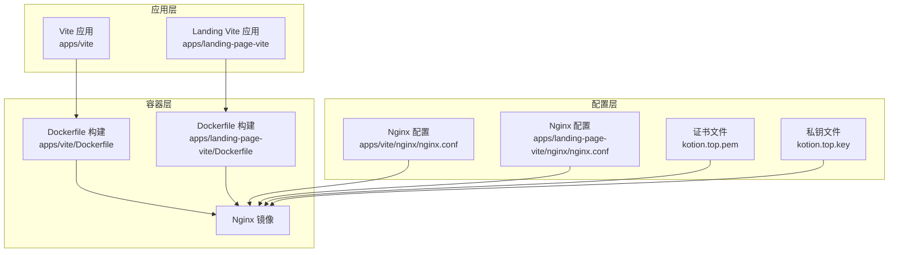
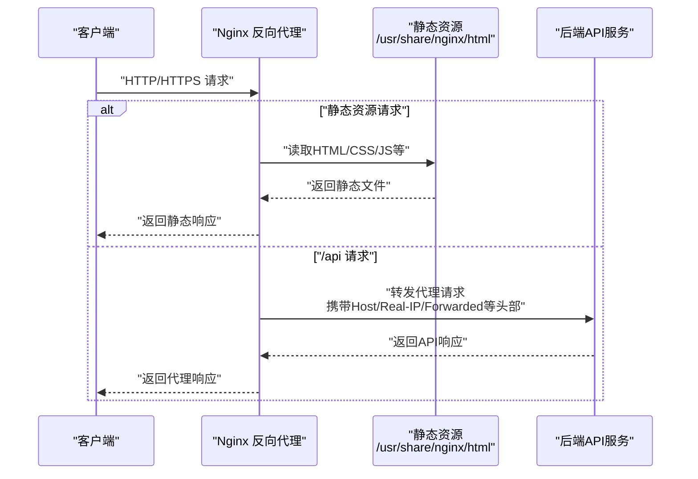
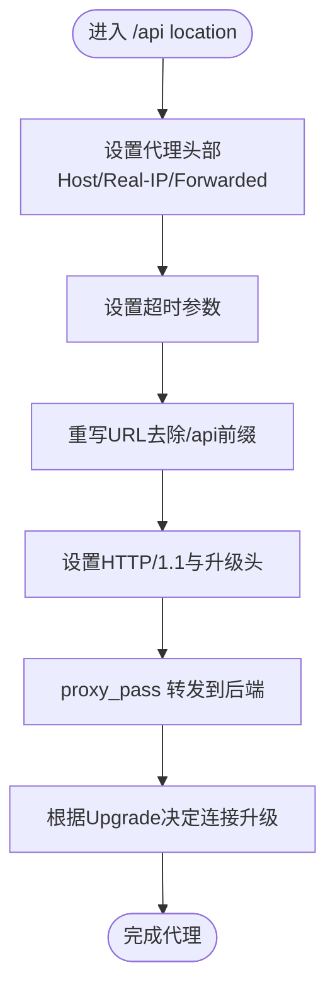
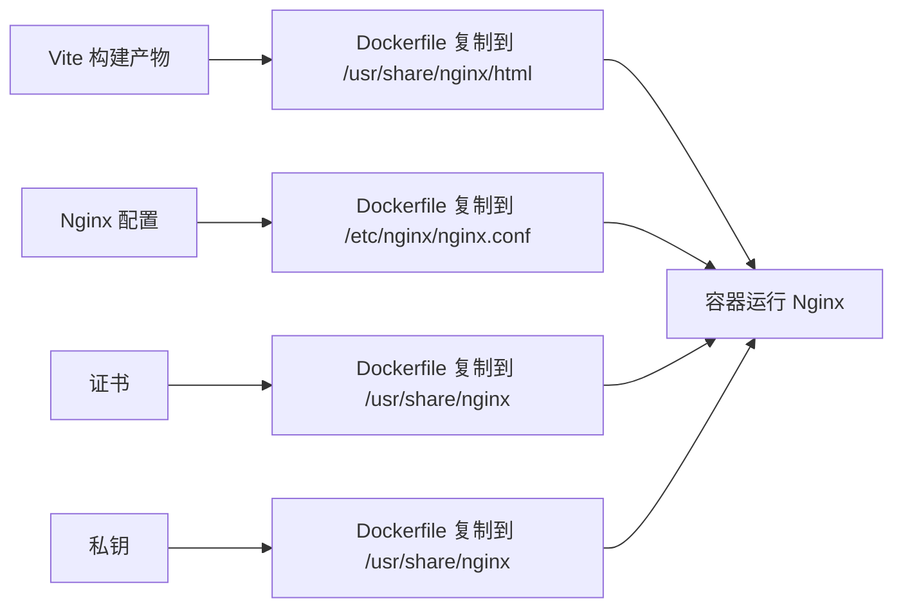

# Nginx配置

<cite>
**本文引用的文件**
- [apps/vite/nginx/nginx.conf](file://apps/vite/nginx/nginx.conf)
- [apps/vite/nginx/kotion.top.pem](file://apps/vite/nginx/kotion.top.pem)
- [apps/vite/nginx/kotion.top.key](file://apps/vite/nginx/kotion.top.key)
- [apps/vite/Dockerfile](file://apps/vite/Dockerfile)
- [apps/vite/vite.config.ts](file://apps/vite/vite.config.ts)
- [apps/landing-page-vite/nginx/nginx.conf](file://apps/landing-page-vite/nginx/nginx.conf)
- [apps/landing-page-vite/Dockerfile](file://apps/landing-page-vite/Dockerfile)
- [apps/landing-page-vite/vite.config.ts](file://apps/landing-page-vite/vite.config.ts)
- [README.md](file://README.md)
- [package.json](file://package.json)
</cite>

## 目录
1. [简介](#简介)
2. [项目结构](#项目结构)
3. [核心组件](#核心组件)
4. [架构总览](#架构总览)
5. [详细组件分析](#详细组件分析)
6. [依赖关系分析](#依赖关系分析)
7. [性能考虑](#性能考虑)
8. [故障排查指南](#故障排查指南)
9. [结论](#结论)
10. [附录](#附录)

## 简介
本文件面向知识库管理系统的Nginx反向代理与Web服务器配置，基于仓库内现有Vite应用的Nginx配置进行系统化整理与扩展说明。内容涵盖：
- nginx.conf的结构与关键指令：server块、location规则、静态文件处理
- HTTPS配置：SSL证书安装、TLS版本与安全加密参数建议
- 反向代理：将前端请求转发至后端API服务（含WebSocket升级）
- 缓存策略：静态资源缓存、浏览器缓存头、压缩配置
- Gzip压缩、HTTP/2支持与安全头部配置
- 性能优化：连接池、超时设置、上游健康与负载均衡策略

## 项目结构
本仓库采用多包管理（Turborepo），其中Vite应用通过Nginx容器化部署。Nginx配置位于各应用的nginx目录，并由对应Dockerfile在构建阶段复制到容器镜像中。

图表来源
- [apps/vite/Dockerfile](file://apps/vite/Dockerfile#L1-L12)
- [apps/landing-page-vite/Dockerfile](file://apps/landing-page-vite/Dockerfile#L1-L12)
- [apps/vite/nginx/nginx.conf](file://apps/vite/nginx/nginx.conf#L1-L113)
- [apps/landing-page-vite/nginx/nginx.conf](file://apps/landing-page-vite/nginx/nginx.conf#L1-L113)
- [apps/vite/nginx/kotion.top.pem](file://apps/vite/nginx/kotion.top.pem#L1-L62)
- [apps/vite/nginx/kotion.top.key](file://apps/vite/nginx/kotion.top.key#L1-L28)

章节来源
- [apps/vite/Dockerfile](file://apps/vite/Dockerfile#L1-L12)
- [apps/landing-page-vite/Dockerfile](file://apps/landing-page-vite/Dockerfile#L1-L12)
- [apps/vite/nginx/nginx.conf](file://apps/vite/nginx/nginx.conf#L1-L113)
- [apps/landing-page-vite/nginx/nginx.conf](file://apps/landing-page-vite/nginx/nginx.conf#L1-L113)

## 核心组件
- Nginx主配置与模块加载：包含mime类型、日志格式、访问日志、sendfile、keepalive超时、客户端上传大小限制、Gzip开关等。
- 两个server块：
  - 80端口：HTTP回退与静态资源处理，包含/api反向代理与WebSocket升级。
  - 888端口：HTTPS监听，使用证书与私钥，其余逻辑同HTTP。
- 通用location规则：
  - 根路径：index.html回退与SPA路由支持（try_files）。
  - /api：代理到后端服务，设置必要的头部，启用HTTP/1.1与升级头。
- WebSocket升级映射：根据请求头动态选择连接升级行为。

章节来源
- [apps/vite/nginx/nginx.conf](file://apps/vite/nginx/nginx.conf#L14-L112)
- [apps/landing-page-vite/nginx/nginx.conf](file://apps/landing-page-vite/nginx/nginx.conf#L14-L112)

## 架构总览
下图展示了从客户端到Nginx再到后端API的典型请求链路，以及静态资源与API的分流策略。

图表来源
- [apps/vite/nginx/nginx.conf](file://apps/vite/nginx/nginx.conf#L31-L95)
- [apps/landing-page-vite/nginx/nginx.conf](file://apps/landing-page-vite/nginx/nginx.conf#L31-L95)

## 详细组件分析

### Nginx主配置与模块加载
- 关键点
  - 日志格式与访问日志路径
  - sendfile开启与keepalive_timeout
  - 客户端上传大小限制
  - Gzip压缩开关
- 建议
  - 在生产环境开启Gzip并结合浏览器缓存策略提升性能
  - 合理设置client_max_body_size以适配业务上传需求

章节来源
- [apps/vite/nginx/nginx.conf](file://apps/vite/nginx/nginx.conf#L14-L30)
- [apps/landing-page-vite/nginx/nginx.conf](file://apps/landing-page-vite/nginx/nginx.conf#L14-L30)

### HTTPS配置与证书安装
- 证书与私钥
  - 证书文件：kotion.top.pem（包含链式证书）
  - 私钥文件：kotion.top.key
- 配置要点
  - HTTPS监听端口与server_name
  - ssl_certificate与ssl_certificate_key路径
- 安全建议
  - 使用强密码学套件与TLS版本控制（见“性能考虑”）
  - 将私钥权限严格限制，避免泄露

章节来源
- [apps/vite/nginx/nginx.conf](file://apps/vite/nginx/nginx.conf#L31-L37)
- [apps/vite/nginx/kotion.top.pem](file://apps/vite/nginx/kotion.top.pem#L1-L62)
- [apps/vite/nginx/kotion.top.key](file://apps/vite/nginx/kotion.top.key#L1-L28)

### 反向代理与WebSocket升级
- /api代理规则
  - 设置Host、X-Real-IP、X-Forwarded-For等头部
  - 超时设置：proxy_connect_timeout、proxy_send_timeout、proxy_read_timeout
  - 重写规则：将/api前缀去除后转发
  - HTTP/1.1与Upgrade/Connection头部用于WebSocket支持
- 升级映射
  - 根据$http_upgrade动态设置$connection_upgrade，区分普通HTTP与WebSocket

图表来源
- [apps/vite/nginx/nginx.conf](file://apps/vite/nginx/nginx.conf#L45-L58)
- [apps/vite/nginx/nginx.conf](file://apps/vite/nginx/nginx.conf#L108-L112)

章节来源
- [apps/vite/nginx/nginx.conf](file://apps/vite/nginx/nginx.conf#L45-L58)
- [apps/vite/nginx/nginx.conf](file://apps/vite/nginx/nginx.conf#L108-L112)

### 静态文件处理与SPA路由
- 根路径location
  - index回退与SPA路由支持（try_files）
- 部署路径
  - root指向/usr/share/nginx/html，由Dockerfile在构建时复制静态产物

章节来源
- [apps/vite/nginx/nginx.conf](file://apps/vite/nginx/nginx.conf#L40-L43)
- [apps/vite/Dockerfile](file://apps/vite/Dockerfile#L1-L12)

### 错误页面与通用错误处理
- 500/502/503/504统一错误页
- 错误页根路径与静态资源位置

章节来源
- [apps/vite/nginx/nginx.conf](file://apps/vite/nginx/nginx.conf#L60-L68)

### 前端开发代理与生产反向代理差异
- 前端开发代理（Vite配置）
  - 本地开发时将/api代理到https://kotion.top:888/api
  - 重写规则去除/api前缀
- 生产环境反向代理（Nginx配置）
  - 将/api转发到后端服务地址
  - 保留/去除前缀策略需与后端保持一致

章节来源
- [apps/vite/vite.config.ts](file://apps/vite/vite.config.ts#L10-L18)
- [apps/landing-page-vite/vite.config.ts](file://apps/landing-page-vite/vite.config.ts#L10-L18)
- [apps/vite/nginx/nginx.conf](file://apps/vite/nginx/nginx.conf#L45-L58)

## 依赖关系分析
- 构建与运行依赖
  - Dockerfile负责将构建产物与Nginx配置复制进镜像
  - Nginx配置依赖证书与私钥文件
  - 前端Vite配置与后端API地址保持一致，确保开发与生产的代理行为一致

图表来源
- [apps/vite/Dockerfile](file://apps/vite/Dockerfile#L1-L12)
- [apps/vite/nginx/nginx.conf](file://apps/vite/nginx/nginx.conf#L14-L30)

章节来源
- [apps/vite/Dockerfile](file://apps/vite/Dockerfile#L1-L12)
- [apps/landing-page-vite/Dockerfile](file://apps/landing-page-vite/Dockerfile#L1-L12)
- [apps/vite/nginx/nginx.conf](file://apps/vite/nginx/nginx.conf#L14-L30)

## 性能考虑
- 连接与超时
  - keepalive_timeout：维持长连接，降低握手开销
  - proxy_connect_timeout/proxy_send_timeout/proxy_read_timeout：合理设置以避免慢连接占用资源
- 压缩与缓存
  - Gzip：在生产环境开启，减少传输体积
  - 浏览器缓存：对静态资源设置合理的Cache-Control与ETag/Last-Modified
- TLS与安全
  - 明确TLS版本与加密套件（建议禁用过时协议与弱算法）
  - 启用HSTS与安全头部（如X-Frame-Options、X-Content-Type-Options、Referrer-Policy）
- 上游健康与负载均衡
  - 使用多个后端实例并配置健康检查
  - 合理设置超时与重试策略，避免单点瓶颈

## 故障排查指南
- 证书相关
  - 检查证书与私钥路径是否正确，权限是否足够
  - 确认证书链完整，避免中间证书缺失导致浏览器警告
- 代理失败
  - 查看Nginx错误日志与访问日志定位问题
  - 确认后端服务可达，代理目标地址与端口正确
- CORS与头部
  - 确保代理头部（Host、X-Real-IP、X-Forwarded-For）按需传递
  - 如涉及跨域，确认后端已正确响应CORS头
- SPA路由
  - 确认根路径location中的try_files配置，避免刷新或直连路由404

章节来源
- [apps/vite/nginx/nginx.conf](file://apps/vite/nginx/nginx.conf#L18-L23)
- [apps/vite/nginx/nginx.conf](file://apps/vite/nginx/nginx.conf#L60-L68)

## 结论
本仓库的Nginx配置提供了清晰的静态资源分发与API反向代理能力，结合HTTPS证书与WebSocket升级映射，满足现代Web应用的部署需求。建议在生产环境中进一步完善TLS安全参数、缓存与压缩策略，并配合健康检查与负载均衡实现高可用与高性能。

## 附录
- 快速对照表（关键指令与用途）
  - events：worker_connections 控制并发连接数
  - http：log_format/access_log/sendfile/keepalive_timeout/client_max_body_size/gzip
  - server（HTTP/HTTPS）：listen、server_name、root、ssl_certificate、ssl_certificate_key
  - location（根路径）：index、try_files
  - location（/api）：proxy_set_header、proxy_pass、rewrite、proxy_http_version、Upgrade/Connection
  - map：$http_upgrade → $connection_upgrade

章节来源
- [apps/vite/nginx/nginx.conf](file://apps/vite/nginx/nginx.conf#L9-L112)
- [apps/landing-page-vite/nginx/nginx.conf](file://apps/landing-page-vite/nginx/nginx.conf#L9-L112)