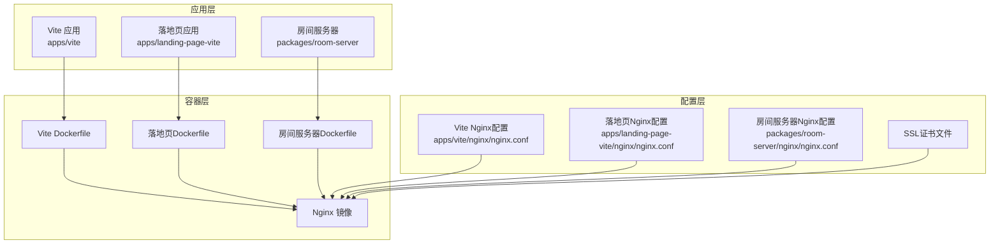
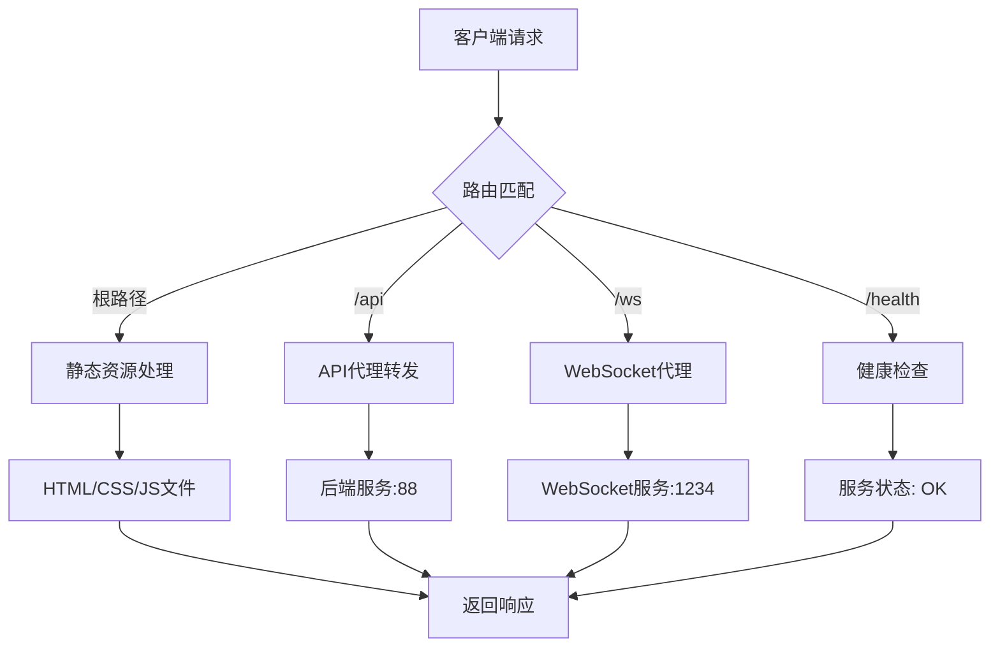
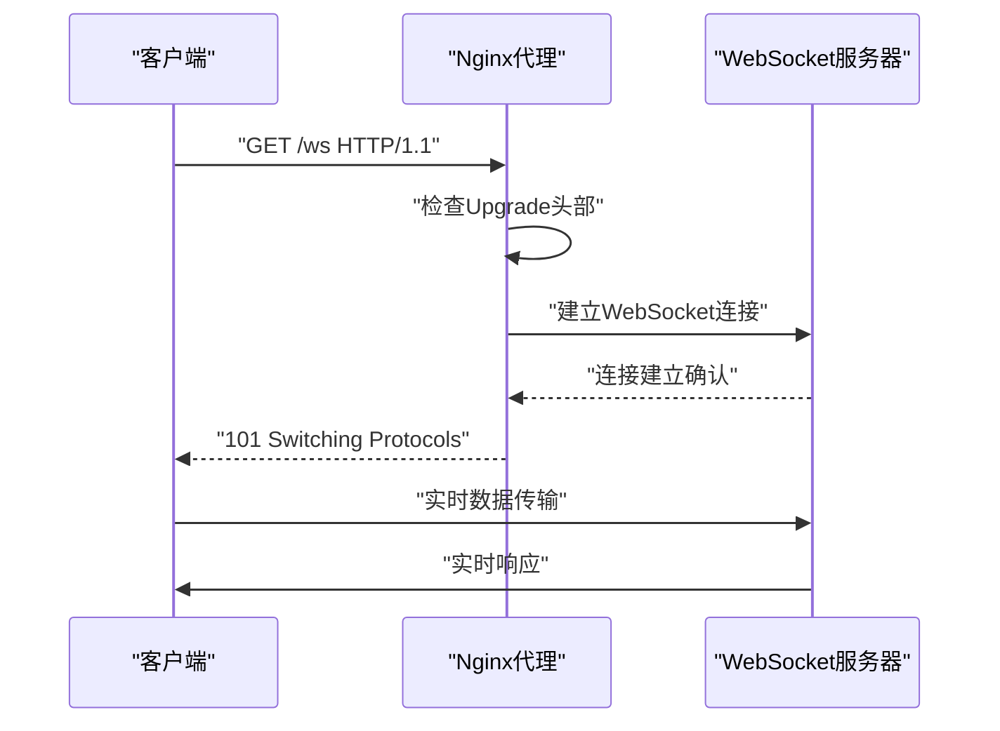
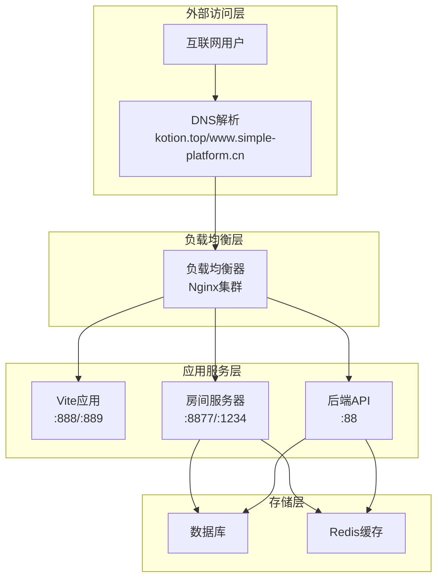

# Nginx配置

<cite>
**本文档引用的文件**
- [apps/vite/nginx/nginx.conf](file://apps/vite/nginx/nginx.conf)
- [apps/landing-page-vite/nginx/nginx.conf](file://apps/landing-page-vite/nginx/nginx.conf)
- [packages/room-server/nginx/nginx.conf](file://packages/room-server/nginx/nginx.conf)
- [apps/vite/Dockerfile](file://apps/vite/Dockerfile)
- [apps/landing-page-vite/Dockerfile](file://apps/landing-page-vite/Dockerfile)
- [apps/vite/vite.config.ts](file://apps/vite/vite.config.ts)
- [apps/landing-page-vite/vite.config.ts](file://apps/landing-page-vite/vite.config.ts)
- [packages/room-server/src/server.mjs](file://packages/room-server/src/server.mjs)
</cite>

## 更新摘要
**所做更改**
- 新增完整的多服务路由配置章节，涵盖Vite应用、落地页应用和房间服务器的Nginx配置
- 更新WebSocket升级机制说明，包含现代SSL/TLS设置和连接升级映射
- 增加房间服务器专用的WebSocket代理配置和健康检查端点
- 完善HTTPS配置章节，包含SSL证书管理和现代TLS参数设置
- 新增多应用部署架构图和流量转发流程图

## 目录
1. [简介](#简介)
2. [项目结构](#项目结构)
3. [核心组件](#核心组件)
4. [多服务路由配置](#多服务路由配置)
5. [HTTPS与SSL配置](#https与ssl配置)
6. [WebSocket升级机制](#websocket升级机制)
7. [反向代理配置详解](#反向代理配置详解)
8. [静态资源与SPA路由](#静态资源与spa路由)
9. [错误处理与健康检查](#错误处理与健康检查)
10. [部署架构与流量转发](#部署架构与流量转发)
11. [性能优化建议](#性能优化建议)
12. [故障排查指南](#故障排查指南)
13. [结论](#结论)
14. [附录](#附录)

## 简介
本文件面向知识库管理系统的Nginx反向代理与Web服务器配置，基于仓库内现有Vite应用、落地页应用和房间服务器的完整Nginx配置进行系统化整理与扩展说明。内容涵盖：
- 多应用路由配置：支持Vite前端应用、落地页应用和房间服务器的统一代理
- 现代SSL/TLS配置：包括证书管理、TLS版本控制和加密套件优化
- WebSocket升级机制：完整的连接升级映射和多服务路由支持
- 反向代理策略：API请求转发、静态资源处理和错误页面管理
- 性能优化：连接池配置、超时设置、缓冲策略和健康检查

## 项目结构
本仓库采用多包管理（Turborepo），包含三个主要应用的Nginx配置，分别服务于不同的业务场景：


```mermaid
graph TB
subgraph "应用层"
ViteApp["Vite 应用<br/>apps/vite"]
LandingApp["落地页应用<br/>apps/landing-page-vite"]
RoomServer["房间服务器<br/>packages/room-server"]
end
subgraph "容器层"
NginxImg["Nginx 镜像"]
ViteDocker["Vite Dockerfile"]
LandingDocker["落地页Dockerfile"]
RoomDocker["房间服务器Dockerfile"]
end
subgraph "配置层"
ViteConf["Vite Nginx配置<br/>apps/vite/nginx/nginx.conf"]
LandingConf["落地页Nginx配置<br/>apps/landing-page-vite/nginx/nginx.conf"]
RoomConf["房间服务器Nginx配置<br/>packages/room-server/nginx/nginx.conf"]
CertFiles["SSL证书文件"]
end
ViteApp --> ViteDocker
LandingApp --> LandingDocker
RoomServer --> RoomDocker
ViteDocker --> NginxImg
LandingDocker --> NginxImg
RoomDocker --> NginxImg
ViteConf --> NginxImg
LandingConf --> NginxImg
RoomConf --> NginxImg
CertFiles --> NginxImg
```

**图表来源**
- [apps/vite/Dockerfile](file://apps/vite/Dockerfile#L1-L10)
- [apps/landing-page-vite/Dockerfile](file://apps/landing-page-vite/Dockerfile#L1-L12)
- [packages/room-server/nginx/nginx.conf](file://packages/room-server/nginx/nginx.conf#L1-L135)

**章节来源**
- [apps/vite/Dockerfile](file://apps/vite/Dockerfile#L1-L10)
- [apps/landing-page-vite/Dockerfile](file://apps/landing-page-vite/Dockerfile#L1-L12)
- [packages/room-server/nginx/nginx.conf](file://packages/room-server/nginx/nginx.conf#L1-L135)

## 核心组件
Nginx配置包含以下核心组件：

### 主配置组件
- **事件模块**：worker_connections设置为1024，支持高并发连接
- **HTTP模块**：包含MIME类型、日志格式、访问日志、sendfile优化、keepalive超时和客户端上传大小限制
- **Gzip压缩**：在Vite应用中启用，在落地页应用中可选

### 服务器配置
- **HTTPS服务器**：监听888端口，使用kotion.top.pem证书和kotion.top.key私钥
- **HTTP服务器**：监听80端口，提供HTTP到HTTPS的重定向
- **映射规则**：定义$connection_upgrade变量，支持WebSocket连接升级

**章节来源**
- [apps/vite/nginx/nginx.conf](file://apps/vite/nginx/nginx.conf#L9-L30)
- [apps/landing-page-vite/nginx/nginx.conf](file://apps/landing-page-vite/nginx/nginx.conf#L9-L30)

## 多服务路由配置
系统支持三种主要服务的路由配置：

### Vite应用路由
- **静态资源**：根路径/指向/usr/share/nginx/html，支持SPA路由回退
- **API代理**：/api路径转发到后端服务192.168.3.43:88
- **开发代理**：Vite开发服务器配置，支持/api路径代理

### 落地页应用路由
- **独立域名**：www.simple-platform.cn，使用相同的证书配置
- **端口分离**：监听889端口，避免与Vite应用冲突
- **相同代理规则**：/api路径转发到同一后端服务

### 房间服务器专用路由
- **WebSocket服务**：/ws路径专门用于WebSocket连接
- **后端API**：/api/路径转发到后端服务，支持Spring Gateway兼容
- **健康检查**：/health端点提供服务状态检查


```mermaid
flowchart TD
Client["客户端请求"] --> Route{"路由匹配"}
Route --> |根路径| Static["静态资源处理"]
Route --> |/api| ApiProxy["API代理转发"]
Route --> |/ws| WsProxy["WebSocket代理"]
Route --> |/health| Health["健康检查"]
Static --> Html["HTML/CSS/JS文件"]
ApiProxy --> Backend["后端服务:88"]
WsProxy --> WsServer["WebSocket服务:1234"]
Health --> Status["服务状态: OK"]
Html --> Response["返回响应"]
Backend --> Response
WsServer --> Response
Status --> Response
```

**图表来源**
- [packages/room-server/nginx/nginx.conf](file://packages/room-server/nginx/nginx.conf#L58-L110)

**章节来源**
- [apps/vite/nginx/nginx.conf](file://apps/vite/nginx/nginx.conf#L40-L58)
- [apps/landing-page-vite/nginx/nginx.conf](file://apps/landing-page-vite/nginx/nginx.conf#L40-L58)
- [packages/room-server/nginx/nginx.conf](file://packages/room-server/nginx/nginx.conf#L58-L110)

## HTTPS与SSL配置
系统采用现代SSL/TLS配置，确保安全通信和最佳性能：

### 证书配置
- **证书文件**：kotion.top.pem（包含完整的证书链）
- **私钥文件**：kotion.top.key（私有密钥）
- **证书路径**：/usr/share/nginx/目录下

### TLS参数优化
- **协议版本**：TLSv1.2和TLSv1.3，禁用过时的SSLv2/SSLv3
- **加密套件**：ECDHE-ECDSA和ECDHE-RSA系列，支持AES-GCM和ChaCha20-Poly1305
- **会话管理**：1天会话超时，共享SSL缓存50MB
- **安全参数**：禁用SSL会话票据，优先使用服务器加密套件

### 证书部署
- **Vite应用**：监听888端口，提供HTTPS服务
- **落地页应用**：监听889端口，使用相同证书
- **房间服务器**：监听8877端口，提供高级WebSocket支持

**章节来源**
- [packages/room-server/nginx/nginx.conf](file://packages/room-server/nginx/nginx.conf#L44-L56)
- [apps/vite/nginx/nginx.conf](file://apps/vite/nginx/nginx.conf#L35-L36)
- [apps/landing-page-vite/nginx/nginx.conf](file://apps/landing-page-vite/nginx/nginx.conf#L35-L36)

## WebSocket升级机制
系统实现了完整的WebSocket连接升级机制，支持实时通信：

### 升级映射配置
```nginx
map $http_upgrade $connection_upgrade {
    default        close;      # 默认关闭连接
    websocket      upgrade;    # WebSocket升级
}
```

### WebSocket代理配置
- **升级头设置**：自动传递Upgrade和Connection头部
- **HTTP版本**：使用proxy_http_version 1.1支持升级
- **超时配置**：7天连接超时，适合长时间WebSocket会话
- **缓冲禁用**：proxy_buffering off，确保实时数据传输

### 多服务支持
- **房间服务器**：专门的/ws路径，端口1234
- **后端API**：/api/路径支持WebSocket，便于Spring Gateway集成
- **连接复用**：同一后端服务支持HTTP和WebSocket协议


```mermaid
sequenceDiagram
participant Client as "客户端"
participant Nginx as "Nginx代理"
participant WS_Server as "WebSocket服务器"
Client->>Nginx : "GET /ws HTTP/1.1"
Nginx->>Nginx : "检查Upgrade头部"
Nginx->>WS_Server : "建立WebSocket连接"
WS_Server-->>Nginx : "连接建立确认"
Nginx-->>Client : "101 Switching Protocols"
Client->>WS_Server : "实时数据传输"
WS_Server->>Client : "实时响应"
```

**图表来源**
- [packages/room-server/nginx/nginx.conf](file://packages/room-server/nginx/nginx.conf#L58-L83)

**章节来源**
- [packages/room-server/nginx/nginx.conf](file://packages/room-server/nginx/nginx.conf#L24-L28)
- [packages/room-server/nginx/nginx.conf](file://packages/room-server/nginx/nginx.conf#L58-L83)

## 反向代理配置详解
系统采用智能反向代理策略，支持多种协议和场景：

### 代理头部配置
- **Host头部**：传递原始主机名
- **X-Real-IP**：传递真实客户端IP
- **X-Forwarded-For**：传递完整的代理链
- **X-Forwarded-Proto**：传递原始协议（http/https）
- **X-Forwarded-Host**：传递原始主机名
- **X-Forwarded-Port**：传递原始端口

### 超时配置优化
- **连接超时**：3秒快速失败
- **发送超时**：3600秒（1小时）适用于长连接
- **读取超时**：3600秒（1小时）适用于WebSocket
- **WebSocket超时**：7天，支持长时间会话

### URL重写规则
- **API路径重写**：^/api/(.*)$ -> /$1，移除/api前缀
- **SPA路由支持**：try_files $uri /index.html，支持前端路由

**章节来源**
- [apps/vite/nginx/nginx.conf](file://apps/vite/nginx/nginx.conf#L45-L58)
- [packages/room-server/nginx/nginx.conf](file://packages/room-server/nginx/nginx.conf#L86-L110)

## 静态资源与SPA路由
系统提供高效的静态资源处理和SPA路由支持：

### 静态资源优化
- **根目录配置**：/usr/share/nginx/html作为静态资源根目录
- **MIME类型**：自动识别HTML、CSS、JavaScript、图片等文件类型
- **缓存策略**：结合浏览器缓存和ETag机制

### SPA路由支持
- **回退机制**：所有未匹配的路径回退到index.html
- **前端路由**：支持React Router等前端路由框架
- **SEO友好**：静态资源直接访问，动态路由通过JavaScript处理

### 开发与生产差异
- **开发环境**：Vite开发服务器提供热重载和代理功能
- **生产环境**：Nginx直接提供静态资源和API代理
- **代理一致性**：开发和生产环境的/api路径代理保持一致

**章节来源**
- [apps/vite/nginx/nginx.conf](file://apps/vite/nginx/nginx.conf#L40-L43)
- [apps/vite/vite.config.ts](file://apps/vite/vite.config.ts#L15-L24)

## 错误处理与健康检查
系统提供完善的错误处理和健康检查机制：

### 统一错误页面
- **错误码覆盖**：500、502、503、504错误统一处理
- **静态页面**：/50x.html作为错误页面模板
- **根目录配置**：错误页面位于/usr/share/nginx/html

### 健康检查端点
- **简单检查**：/health端点返回"OK"文本
- **无日志记录**：健康检查不产生访问日志
- **快速响应**：轻量级检查，不影响服务性能

### HTTP到HTTPS重定向
- **端口监听**：80端口监听HTTP请求
- **域名匹配**：仅对kotion.top域名进行重定向
- **永久重定向**：301状态码，利于SEO优化

**章节来源**
- [apps/vite/nginx/nginx.conf](file://apps/vite/nginx/nginx.conf#L64-L67)
- [packages/room-server/nginx/nginx.conf](file://packages/room-server/nginx/nginx.conf#L112-L122)
- [packages/room-server/nginx/nginx.conf](file://packages/room-server/nginx/nginx.conf#L125-L133)

## 部署架构与流量转发
系统采用多层代理架构，实现灵活的服务路由：


```mermaid
graph TB
subgraph "外部访问层"
Internet["互联网用户"]
DNS["DNS解析<br/>kotion.top/www.simple-platform.cn"]
end
subgraph "负载均衡层"
LB["负载均衡器<br/>Nginx集群"]
end
subgraph "应用服务层"
ViteApp["Vite应用<br/>:888/:889"]
RoomWS["房间服务器<br/>:8877/:1234"]
BackendAPI["后端API<br/>:88"]
end
subgraph "存储层"
DB["数据库"]
Redis["Redis缓存"]
end
Internet --> DNS --> LB
LB --> ViteApp
LB --> RoomWS
LB --> BackendAPI
RoomWS --> DB
RoomWS --> Redis
BackendAPI --> DB
BackendAPI --> Redis
```

**图表来源**
- [packages/room-server/nginx/nginx.conf](file://packages/room-server/nginx/nginx.conf#L30-L37)

### 流量转发流程
1. **域名解析**：用户访问kotion.top或www.simple-platform.cn
2. **负载均衡**：Nginx根据路径和端口转发到相应服务
3. **静态资源**：直接从/usr/share/nginx/html提供
4. **API请求**：转发到后端服务192.168.3.43:88
5. **WebSocket**：转发到房间服务器192.168.3.43:1234

**章节来源**
- [packages/room-server/nginx/nginx.conf](file://packages/room-server/nginx/nginx.conf#L30-L37)

## 性能优化建议
基于现有配置，提出以下性能优化建议：

### 连接优化
- **worker连接数**：当前1024连接数可根据实际负载调整
- **keepalive超时**：65秒的keepalive超时适合大多数场景
- **连接池配置**：后端服务应配置相应的连接池参数

### 缓存策略
- **静态资源缓存**：浏览器端长期缓存HTML、CSS、JS文件
- **API缓存**：针对非实时数据设置适当的缓存头
- **压缩配置**：在Vite应用中启用Gzip压缩，提升传输效率

### 安全增强
- **HSTS配置**：添加Strict-Transport-Security头
- **安全头**：添加X-Frame-Options、X-Content-Type-Options等
- **证书更新**：定期更新SSL证书，监控到期时间

### 监控与日志
- **访问日志**：启用详细的访问日志记录
- **错误日志**：配置合适的错误日志级别
- **性能监控**：监控连接数、响应时间和错误率

## 故障排查指南
针对常见问题提供排查方法：

### 证书相关问题
- **证书路径**：确认证书文件位于/usr/share/nginx/目录
- **文件权限**：确保证书文件具有正确的读取权限
- **证书链**：验证kotion.top.pem包含完整的证书链

### 代理配置问题
- **后端服务**：确认192.168.3.43:88和192.168.3.43:1234服务正常
- **网络连通性**：测试从Nginx服务器到后端服务的网络连通性
- **防火墙规则**：检查防火墙是否允许相关端口通信

### WebSocket连接问题
- **升级头**：确认客户端正确发送Upgrade和Connection头部
- **超时设置**：检查WebSocket超时配置是否合理
- **缓冲设置**：确保proxy_buffering off正确配置

### SPA路由问题
- **try_files配置**：确认根路径location中的try_files设置
- **前端路由**：检查前端应用的路由配置
- **构建产物**：验证静态资源已正确部署到/usr/share/nginx/html

**章节来源**
- [packages/room-server/nginx/nginx.conf](file://packages/room-server/nginx/nginx.conf#L44-L46)
- [apps/vite/nginx/nginx.conf](file://apps/vite/nginx/nginx.conf#L50-L58)

## 结论
本仓库的Nginx配置提供了完整的多服务路由解决方案，支持Vite应用、落地页应用和房间服务器的统一代理。通过现代SSL/TLS配置、WebSocket升级机制和智能反向代理策略，系统能够满足知识库管理系统的高性能、高可用部署需求。建议在生产环境中进一步完善监控告警、安全加固和性能调优，以确保系统的稳定运行。

## 附录

### 快速配置对照表
- **核心指令**：events(worker_connections)、http(log_format、access_log、sendfile、keepalive_timeout、client_max_body_size、gzip)
- **服务器配置**：listen(80/888/889/8877)、server_name、root、ssl_certificate、ssl_certificate_key
- **代理配置**：proxy_set_header、proxy_pass、rewrite、proxy_http_version、Upgrade/Connection
- **映射规则**：map($http_upgrade, $connection_upgrade)
- **上游服务**：upstream(backend_service, websocket_service)

### 部署清单
- **容器镜像**：基于官方nginx镜像，包含配置文件和静态资源
- **证书管理**：SSL证书文件部署到/usr/share/nginx/目录
- **端口开放**：80(HTTP重定向)、888(HTTPS)、889(HTTPS-落地页)、8877(HTTPS-房间服务器)
- **后端服务**：192.168.3.43:88(API服务)、192.168.3.43:1234(WebSocket服务)

**章节来源**
- [apps/vite/nginx/nginx.conf](file://apps/vite/nginx/nginx.conf#L9-L112)
- [apps/landing-page-vite/nginx/nginx.conf](file://apps/landing-page-vite/nginx/nginx.conf#L9-L112)
- [packages/room-server/nginx/nginx.conf](file://packages/room-server/nginx/nginx.conf#L1-L135)