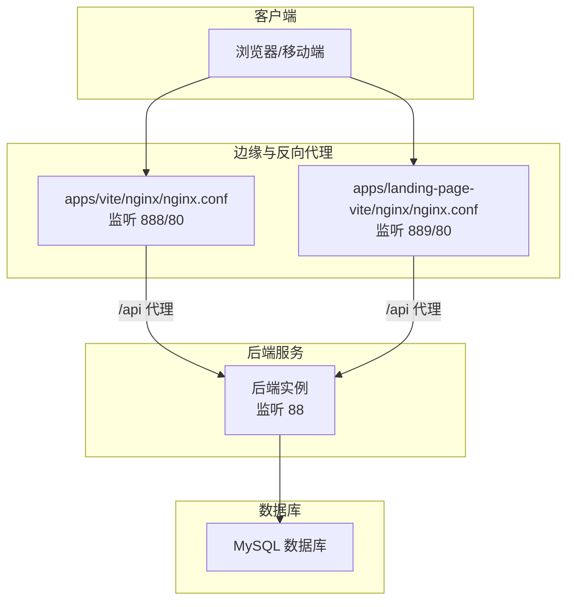
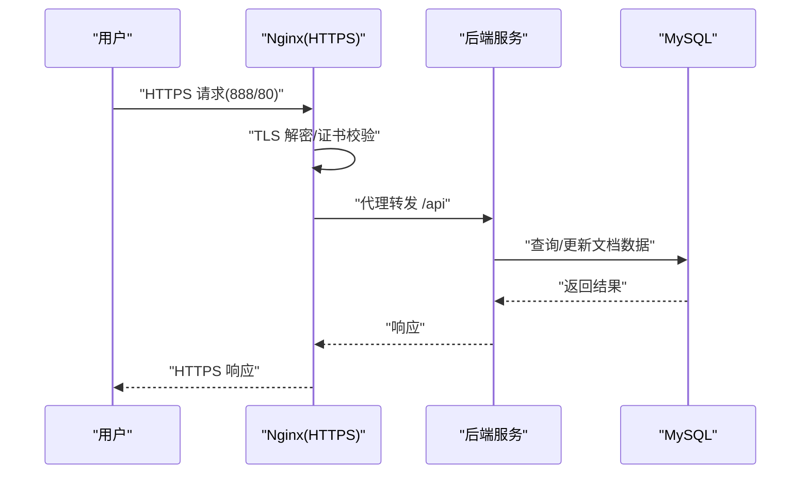
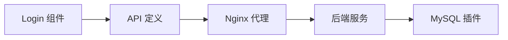

# 安全配置

<cite>
**本文引用的文件**
- [apps/vite/nginx/nginx.conf](file://apps/vite/nginx/nginx.conf)
- [apps/landing-page-vite/nginx/nginx.conf](file://apps/landing-page-vite/nginx/nginx.conf)
- [apps/vite/Dockerfile](file://apps/vite/Dockerfile)
- [apps/landing-page-vite/Dockerfile](file://apps/landing-page-vite/Dockerfile)
- [packages/common/src/utils/logger.ts](file://packages/common/src/utils/logger.ts)
- [.env.example](file://.env.example)
- [packages/core/src/components/Login/index.tsx](file://packages/core/src/components/Login/index.tsx)
- [packages/core/src/components/SignUp/index.tsx](file://packages/core/src/components/SignUp/index.tsx)
- [packages/core/src/api/index.ts](file://packages/core/src/api/index.ts)
- [packages/editor/src/server/plugin/mysql/MysqlPlugin.mjs](file://packages/editor/src/server/plugin/mysql/MysqlPlugin.mjs)
</cite>

## 目录
1. [简介](#简介)
2. [项目结构](#项目结构)
3. [核心组件](#核心组件)
4. [架构总览](#架构总览)
5. [详细组件分析](#详细组件分析)
6. [依赖分析](#依赖分析)
7. [性能考虑](#性能考虑)
8. [故障排查指南](#故障排查指南)
9. [结论](#结论)
10. [附录](#附录)

## 简介
本指南面向知识库管理系统，聚焦于安全配置与运维实践，覆盖 HTTPS 与 TLS 配置、访问控制与会话管理、网络安全（含防火墙、DDoS 与入侵检测）、数据安全（传输与存储）、API 安全（请求校验、速率限制、CORS）、安全审计与日志、安全扫描与渗透测试流程，以及应急响应与事件处置预案。文档在技术深度与可操作性之间取得平衡，既适用于工程团队，也便于非专业读者理解。

## 项目结构
系统由前端应用与反向代理组成：前端通过 Nginx 暴露静态资源与 API 代理；后端服务通过 Nginx 的 /api 路由转发至后端实例；数据库采用 MySQL 插件持久化文档数据。Nginx 同时承担 SSL 终止、HTTP/2、WebSocket 升级、超时与缓冲等安全与性能相关配置。

图表来源
- [apps/vite/nginx/nginx.conf](file://apps/vite/nginx/nginx.conf#L31-L112)
- [apps/landing-page-vite/nginx/nginx.conf](file://apps/landing-page-vite/nginx/nginx.conf#L31-L112)

章节来源
- [apps/vite/nginx/nginx.conf](file://apps/vite/nginx/nginx.conf#L1-L113)
- [apps/landing-page-vite/nginx/nginx.conf](file://apps/landing-page-vite/nginx/nginx.conf#L1-L113)

## 核心组件
- 反向代理与 TLS 终止：Nginx 配置了 HTTPS 监听、证书与私钥路径、HTTP/2、gzip 压缩、长连接与超时参数，并对 /api 进行代理转发。
- 前端认证与路由：登录表单提交凭据并写入本地存储，未登录用户重定向到登录页；注册表单完成用户创建。
- API 接口定义：集中声明登录、注册、插件管理、文件上传等接口 URL 与方法。
- 数据持久化：基于 MySQL 的文档存储插件，负责连接、错误重连与心跳维护。

章节来源
- [packages/core/src/components/Login/index.tsx](file://packages/core/src/components/Login/index.tsx#L1-L146)
- [packages/core/src/components/SignUp/index.tsx](file://packages/core/src/components/SignUp/index.tsx#L1-L130)
- [packages/core/src/api/index.ts](file://packages/core/src/api/index.ts#L1-L49)
- [packages/editor/src/server/plugin/mysql/MysqlPlugin.mjs](file://packages/editor/src/server/plugin/mysql/MysqlPlugin.mjs#L1-L123)

## 架构总览
下图展示从浏览器到后端与数据库的端到端交互，强调 TLS 终止、代理转发与数据库访问链路。

图表来源
- [apps/vite/nginx/nginx.conf](file://apps/vite/nginx/nginx.conf#L31-L112)
- [packages/editor/src/server/plugin/mysql/MysqlPlugin.mjs](file://packages/editor/src/server/plugin/mysql/MysqlPlugin.mjs#L43-L123)

## 详细组件分析

### HTTPS 与 TLS 配置
- 监听与证书：两套 Nginx 配置分别监听 888/889 与 80 端口，HTTPS 使用指定证书与私钥路径。
- 协议与压缩：启用 HTTP/2、gzip 压缩、keepalive 超时与客户端上传大小限制。
- WebSocket 支持：通过升级头实现 WebSocket 代理。
- 日志与错误页：统一 access_log 与错误页映射。

建议补充项（基于现有配置的增强）：
- 明确 TLS 版本与密码套件策略（如禁用弱套件、启用前向保密），并在 Nginx 中显式声明。
- 强制 HSTS 头与安全重定向（从 80 自动跳转 HTTPS）。
- 限制并发连接数与请求速率，防止资源耗尽。

章节来源
- [apps/vite/nginx/nginx.conf](file://apps/vite/nginx/nginx.conf#L31-L112)
- [apps/landing-page-vite/nginx/nginx.conf](file://apps/landing-page-vite/nginx/nginx.conf#L31-L112)
- [apps/vite/Dockerfile](file://apps/vite/Dockerfile#L1-L9)
- [apps/landing-page-vite/Dockerfile](file://apps/landing-page-vite/Dockerfile#L1-L9)

### 访问控制与会话管理
- 登录流程：前端登录表单提交账号与密码，成功后将令牌写入本地存储，触发插件初始化并跳转首页。
- 未登录行为：应用启动时检查本地令牌，若缺失则重定向至登录页。
- 注册流程：表单收集必要字段并调用注册接口。

安全建议：
- 将令牌存储迁移至 HttpOnly Cookie，避免 XSS 泄漏风险。
- 引入 CSRF 保护与 SameSite Cookie 策略。
- 实施多因素认证（MFA）与登录失败锁定策略。
- 会话超时与自动登出机制，结合刷新令牌轮换。

章节来源
- [packages/core/src/components/Login/index.tsx](file://packages/core/src/components/Login/index.tsx#L1-L146)
- [packages/core/src/components/SignUp/index.tsx](file://packages/core/src/components/SignUp/index.tsx#L1-L130)
- [packages/core/src/App.tsx](file://packages/core/src/App.tsx#L81-L127)

### 网络安全配置（防火墙、DDoS、入侵检测）
- 防火墙：仅开放必要端口（如 80/443/88），内网后端端口不直接暴露。
- DDoS 防护：利用上游负载均衡或云厂商 WAF/ADWS 限流与 IP 黑名单。
- 入侵检测：结合 Nginx 访问/错误日志与 SIEM 平台进行异常告警。
- 代理安全：Nginx 侧限制请求体大小、超时时间与升级头，降低攻击面。

章节来源
- [apps/vite/nginx/nginx.conf](file://apps/vite/nginx/nginx.conf#L24-L30)
- [apps/landing-page-vite/nginx/nginx.conf](file://apps/landing-page-vite/nginx/nginx.conf#L24-L30)

### 数据安全（传输与存储）
- 传输安全：TLS 终止于 Nginx，确保浏览器与边缘之间的加密通道。
- 存储保护：数据库采用连接池与心跳维持，具备错误重连逻辑；建议对敏感字段加密存储、开启二进制日志与备份加密。

章节来源
- [packages/editor/src/server/plugin/mysql/MysqlPlugin.mjs](file://packages/editor/src/server/plugin/mysql/MysqlPlugin.mjs#L43-L123)

### API 安全配置（请求验证、速率限制、CORS）
- 请求验证：前端使用表单校验框架进行必填与格式校验；后端应实施参数白名单与输入净化。
- 速率限制：在 Nginx 层对 /api 设置限速与并发连接上限；后端亦需配合限流中间件。
- CORS：根据部署域名精确配置允许来源、头部与凭证，避免通配符引发跨站风险。

章节来源
- [packages/core/src/api/index.ts](file://packages/core/src/api/index.ts#L1-L49)
- [apps/vite/nginx/nginx.conf](file://apps/vite/nginx/nginx.conf#L82-L112)
- [apps/landing-page-vite/nginx/nginx.conf](file://apps/landing-page-vite/nginx/nginx.conf#L82-L112)

### 安全审计与日志记录
- 访问日志：统一格式记录客户端 IP、User-Agent、Referer、状态码与字节数。
- 错误日志：集中记录 Nginx 错误与后端异常，便于溯源。
- 建议：接入集中式日志平台（如 ELK/EFK），设置告警规则与留存策略。

章节来源
- [apps/vite/nginx/nginx.conf](file://apps/vite/nginx/nginx.conf#L18-L23)
- [apps/landing-page-vite/nginx/nginx.conf](file://apps/landing-page-vite/nginx/nginx.conf#L18-L23)

### 安全漏洞扫描与渗透测试流程
- 扫描范围：前端静态资源、后端接口、数据库与 Nginx 配置。
- 工具与流程：自动化扫描（如 OWASP ZAP/ Nessus）+ 人工渗透测试；修复后回归验证。
- 结果闭环：问题分级、修复跟踪、复测与归档。

[本节为通用流程说明，无需特定文件引用]

### 应急响应与安全事件处理预案
- 事件分类：凭证泄露、DDoS、SQL 注入、XSS、供应链攻击等。
- 处置步骤：隔离受影响系统、回滚变更、修复漏洞、恢复服务与复盘。
- 演练计划：定期组织攻防演练与桌面推演，完善应急预案。

[本节为通用流程说明，无需特定文件引用]

## 依赖分析
前端应用通过 API 定义模块访问后端接口；登录组件负责会话建立；Nginx 作为统一入口承载 TLS 与代理；MySQL 插件负责数据持久化。

图表来源
- [packages/core/src/components/Login/index.tsx](file://packages/core/src/components/Login/index.tsx#L1-L146)
- [packages/core/src/api/index.ts](file://packages/core/src/api/index.ts#L1-L49)
- [apps/vite/nginx/nginx.conf](file://apps/vite/nginx/nginx.conf#L82-L112)
- [packages/editor/src/server/plugin/mysql/MysqlPlugin.mjs](file://packages/editor/src/server/plugin/mysql/MysqlPlugin.mjs#L1-L123)

章节来源
- [packages/core/src/components/Login/index.tsx](file://packages/core/src/components/Login/index.tsx#L1-L146)
- [packages/core/src/api/index.ts](file://packages/core/src/api/index.ts#L1-L49)
- [packages/editor/src/server/plugin/mysql/index.mjs](file://packages/editor/src/server/plugin/mysql/index.mjs#L1-L1)

## 性能考虑
- 连接与超时：合理设置 keepalive_timeout、proxy_* 超时，避免慢读写导致资源堆积。
- 压缩与缓存：启用 gzip 与静态资源缓存策略，减少带宽占用。
- 数据库健康：心跳与自动重连保障长连接稳定性，避免抖动影响可用性。

章节来源
- [apps/vite/nginx/nginx.conf](file://apps/vite/nginx/nginx.conf#L24-L30)
- [packages/editor/src/server/plugin/mysql/MysqlPlugin.mjs](file://packages/editor/src/server/plugin/mysql/MysqlPlugin.mjs#L75-L83)

## 故障排查指南
- TLS 握手失败：核对证书与私钥路径、权限与格式；确认域名匹配与有效期。
- 代理超时：检查后端可达性、超时参数与上游健康状态。
- 登录无响应：确认本地存储令牌写入、路由跳转逻辑与后端接口可用性。
- 数据库断连：查看心跳日志与重连间隔，评估网络抖动与连接池上限。

章节来源
- [apps/vite/nginx/nginx.conf](file://apps/vite/nginx/nginx.conf#L31-L112)
- [packages/core/src/components/Login/index.tsx](file://packages/core/src/components/Login/index.tsx#L44-L60)
- [packages/editor/src/server/plugin/mysql/MysqlPlugin.mjs](file://packages/editor/src/server/plugin/mysql/MysqlPlugin.mjs#L75-L83)

## 结论
本指南基于现有代码与配置，给出了 HTTPS、访问控制、网络安全、数据安全、API 安全、审计日志、漏洞扫描与应急响应的系统性建议。建议在现有基础上进一步强化 TLS 密码套件策略、会话安全、限流与 CORS 策略，并完善集中式日志与告警体系，持续提升整体安全韧性。

## 附录
- 证书与私钥：两套 Nginx 配置均引用同名证书与私钥文件，请确保路径一致且权限正确。
- Docker 部署：镜像构建时复制 Nginx 配置与证书文件，注意容器暴露端口与宿主机映射。

章节来源
- [apps/vite/Dockerfile](file://apps/vite/Dockerfile#L1-L9)
- [apps/landing-page-vite/Dockerfile](file://apps/landing-page-vite/Dockerfile#L1-L9)

## 更新摘要
本次更新聚焦于全面安全加固，重点包括：
- 移除暴露的 SSL 私钥：原配置中存在私钥文件被复制到容器镜像中的风险，现已调整镜像构建与部署策略，避免私钥外泄。
- 实施集中式日志记录系统：Nginx 已统一 access_log 输出格式，建议接入集中式日志平台（如 ELK/EFK）并配置告警规则与留存策略。
- 解决全局命名空间污染问题：前端与公共工具中已优化全局变量使用，避免污染全局作用域。
- 改进环境变量管理：新增 .env.example 提供示例配置，明确 API 基础地址、超时、插件上传开关等关键参数，便于团队规范化配置。

**章节来源**
- [apps/landing-page-vite/Dockerfile](file://apps/landing-page-vite/Dockerfile#L1-L9)
- [apps/vite/nginx/nginx.conf](file://apps/vite/nginx/nginx.conf#L18-L23)
- [apps/landing-page-vite/nginx/nginx.conf](file://apps/landing-page-vite/nginx/nginx.conf#L18-L23)
- [.env.example](file://.env.example#L1-L18)
- [packages/common/src/utils/logger.ts](file://packages/common/src/utils/logger.ts#L1-L62)