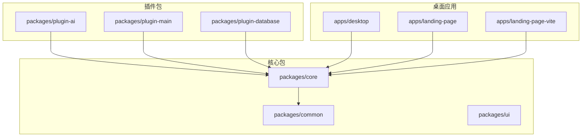
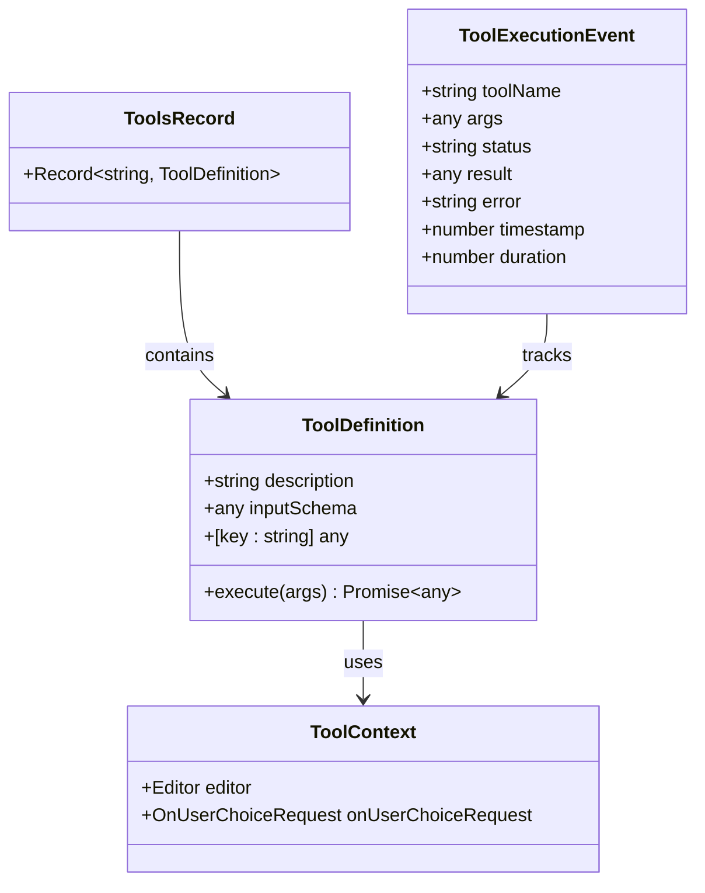
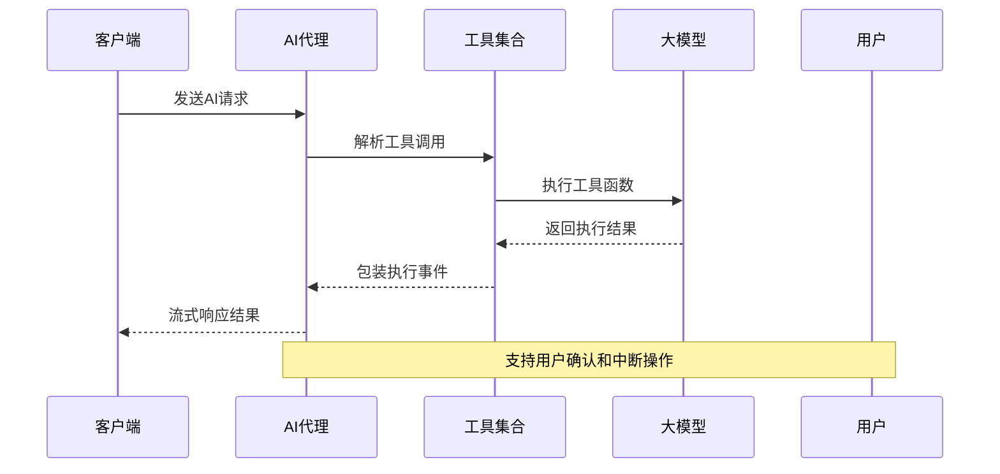
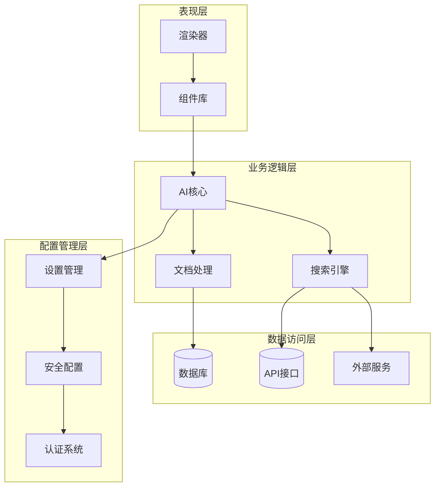
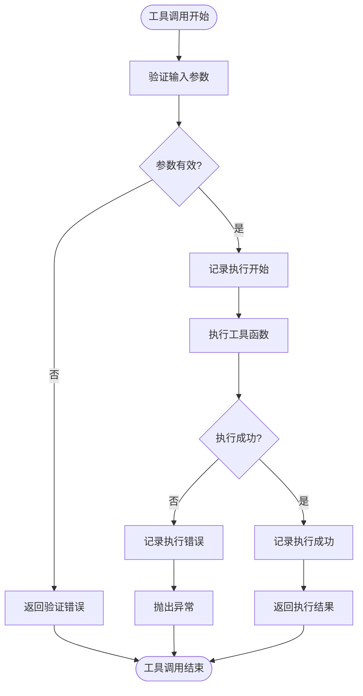
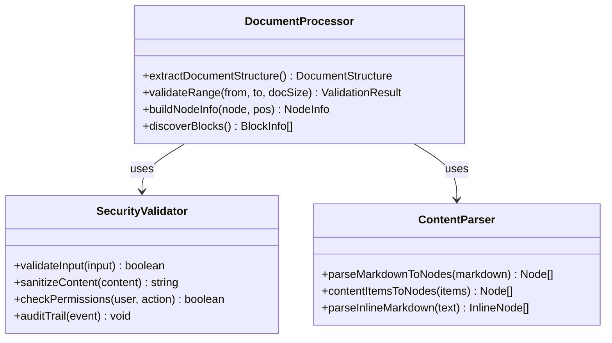
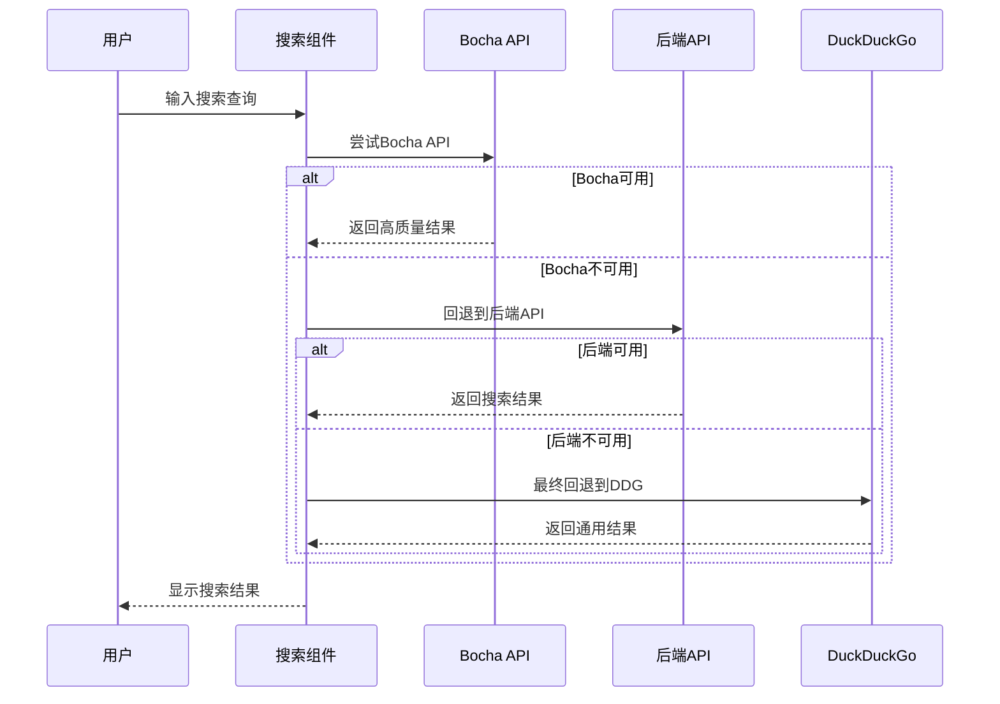
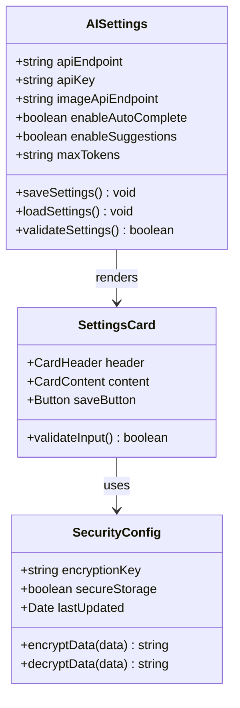
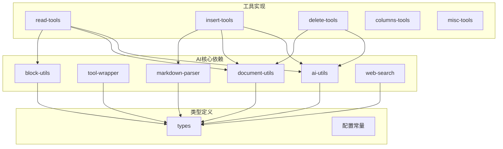

# AI安全配置修复

<cite>
**本文档引用的文件**
- [packages/core/src/ai/index.ts](file://packages/core/src/ai/index.ts)
- [packages/core/src/ai/types.ts](file://packages/core/src/ai/types.ts)
- [packages/core/src/ai/use-agent-optimized.tsx](file://packages/core/src/ai/use-agent-optimized.tsx)
- [packages/core/src/ai/ai-utils.ts](file://packages/core/src/ai/ai-utils.ts)
- [packages/core/src/ai/utils/tool-wrapper.ts](file://packages/core/src/ai/utils/tool-wrapper.ts)
- [packages/core/src/ai/utils/index.ts](file://packages/core/src/ai/utils/index.ts)
- [packages/core/src/ai/utils/block-utils.ts](file://packages/core/src/ai/utils/block-utils.ts)
- [packages/core/src/ai/utils/document-utils.ts](file://packages/core/src/ai/utils/document-utils.ts)
- [packages/core/src/ai/utils/markdown-parser.ts](file://packages/core/src/ai/utils/markdown-parser.ts)
- [packages/core/src/ai/utils/web-search.ts](file://packages/core/src/ai/utils/web-search.ts)
- [packages/plugin-ai/src/ai/index.tsx](file://packages/plugin-ai/src/ai/index.tsx)
- [packages/plugin-ai/src/ai/AISettings.tsx](file://packages/plugin-ai/src/ai/AISettings.tsx)
</cite>

## 目录
1. [简介](#简介)
2. [项目结构](#项目结构)
3. [核心组件](#核心组件)
4. [架构概览](#架构概览)
5. [详细组件分析](#详细组件分析)
6. [依赖关系分析](#依赖关系分析)
7. [性能考虑](#性能考虑)
8. [故障排除指南](#故障排除指南)
9. [结论](#结论)

## 简介

本文档详细分析了知识仓库项目中的AI安全配置修复方案。该项目是一个基于React和ProseMirror的协作编辑平台，集成了多种AI功能，包括智能文档编辑、内容生成、图像生成等。本次安全配置修复重点关注AI工具的安全性、API密钥管理、数据传输安全以及用户隐私保护等方面。

项目采用模块化架构设计，将AI功能封装在独立的包中，通过插件系统实现功能扩展。核心AI组件包括工具定义、代理执行器、文档处理工具链等，形成了完整的AI应用生态系统。

## 项目结构

项目采用多包架构，主要包含以下核心目录：

**图表来源**
- [packages/core/src/ai/index.ts](file://packages/core/src/ai/index.ts#L1-L4)
- [packages/plugin-ai/src/ai/index.tsx](file://packages/plugin-ai/src/ai/index.tsx#L1-L64)

**章节来源**
- [packages/core/src/ai/index.ts](file://packages/core/src/ai/index.ts#L1-L4)
- [packages/plugin-ai/src/ai/index.tsx](file://packages/plugin-ai/src/ai/index.tsx#L1-L64)

## 核心组件

### AI工具系统

AI工具系统是整个AI功能的核心，提供了完整的工具定义、执行和管理机制：

**图表来源**
- [packages/core/src/ai/types.ts](file://packages/core/src/ai/types.ts#L90-L107)
- [packages/core/src/ai/utils/tool-wrapper.ts](file://packages/core/src/ai/utils/tool-wrapper.ts#L1-L68)

### AI代理执行器

AI代理执行器负责协调AI工具的执行，提供流式响应和中断控制功能：

**图表来源**
- [packages/core/src/ai/use-agent-optimized.tsx](file://packages/core/src/ai/use-agent-optimized.tsx#L157-L222)

**章节来源**
- [packages/core/src/ai/types.ts](file://packages/core/src/ai/types.ts#L1-L107)
- [packages/core/src/ai/use-agent-optimized.tsx](file://packages/core/src/ai/use-agent-optimized.tsx#L1-L223)

## 架构概览

项目采用分层架构设计，AI功能位于核心层，通过插件系统扩展功能：

**图表来源**
- [packages/core/src/ai/use-agent-optimized.tsx](file://packages/core/src/ai/use-agent-optimized.tsx#L1-L223)
- [packages/core/src/ai/utils/web-search.ts](file://packages/core/src/ai/utils/web-search.ts#L1-L172)

## 详细组件分析

### AI工具定义与执行

AI工具系统提供了完整的工具生命周期管理，包括工具定义、参数验证、执行跟踪和错误处理：

**图表来源**
- [packages/core/src/ai/utils/tool-wrapper.ts](file://packages/core/src/ai/utils/tool-wrapper.ts#L6-L51)

#### 工具类型系统

工具系统支持多种工具类型，每种类型都有特定的功能和使用场景：

| 工具类别 | 主要功能 | 使用场景 |
|---------|---------|---------|
| 读取工具 | 文档结构分析、内容检索 | 文档理解和信息提取 |
| 插入工具 | 内容插入、格式化 | 文档编辑和内容生成 |
| 删除工具 | 内容删除、清理 | 文档维护和优化 |
| 列布局工具 | 多列布局管理 | 复杂文档排版 |
| 杂项工具 | 用户交互、搜索 | 通用功能支持 |

**章节来源**
- [packages/core/src/ai/utils/tool-wrapper.ts](file://packages/core/src/ai/utils/tool-wrapper.ts#L1-L68)
- [packages/core/src/ai/tools/read-tools.ts](file://packages/core/src/ai/tools/read-tools.ts#L1-L208)
- [packages/core/src/ai/tools/insert-tools.ts](file://packages/core/src/ai/tools/insert-tools.ts#L1-L611)
- [packages/core/src/ai/tools/delete-tools.ts](file://packages/core/src/ai/tools/delete-tools.ts#L1-L253)

### 文档处理与安全

文档处理系统实现了安全的文档操作机制，防止恶意内容注入和破坏性操作：

**图表来源**
- [packages/core/src/ai/utils/document-utils.ts](file://packages/core/src/ai/utils/document-utils.ts#L31-L67)
- [packages/core/src/ai/utils/block-utils.ts](file://packages/core/src/ai/utils/block-utils.ts#L7-L35)
- [packages/core/src/ai/utils/markdown-parser.ts](file://packages/core/src/ai/utils/markdown-parser.ts#L4-L292)

#### 安全配置要点

1. **API密钥管理**: 使用环境变量存储敏感信息，避免硬编码
2. **输入验证**: 对所有用户输入进行严格验证和清理
3. **权限控制**: 实施最小权限原则，限制AI工具的操作范围
4. **审计日志**: 记录所有工具执行事件，便于安全审计

**章节来源**
- [packages/core/src/ai/ai-utils.ts](file://packages/core/src/ai/ai-utils.ts#L1-L20)
- [packages/core/src/ai/utils/document-utils.ts](file://packages/core/src/ai/utils/document-utils.ts#L72-L85)
- [packages/core/src/ai/utils/web-search.ts](file://packages/core/src/ai/utils/web-search.ts#L16-L134)

### 搜索引擎集成

AI搜索功能集成了多个搜索引擎，提供多样化的搜索能力：

**图表来源**
- [packages/core/src/ai/utils/web-search.ts](file://packages/core/src/ai/utils/web-search.ts#L16-L134)

**章节来源**
- [packages/core/src/ai/utils/web-search.ts](file://packages/core/src/ai/utils/web-search.ts#L1-L172)

### 设置管理系统

AI设置系统提供了完整的配置管理功能，支持API端点、密钥和功能开关的配置：

**图表来源**
- [packages/plugin-ai/src/ai/AISettings.tsx](file://packages/plugin-ai/src/ai/AISettings.tsx#L7-L24)

**章节来源**
- [packages/plugin-ai/src/ai/AISettings.tsx](file://packages/plugin-ai/src/ai/AISettings.tsx#L1-L182)

## 依赖关系分析

项目中的AI组件依赖关系如下：

**图表来源**
- [packages/core/src/ai/index.ts](file://packages/core/src/ai/index.ts#L1-L4)
- [packages/core/src/ai/utils/index.ts](file://packages/core/src/ai/utils/index.ts#L1-L6)

**章节来源**
- [packages/core/src/ai/index.ts](file://packages/core/src/ai/index.ts#L1-L4)
- [packages/core/src/ai/utils/index.ts](file://packages/core/src/ai/utils/index.ts#L1-L6)

## 性能考虑

AI系统的性能优化主要体现在以下几个方面：

1. **工具执行优化**: 使用工具包装器实现异步执行和进度跟踪
2. **内存管理**: 限制文档读取的块数量和字符数，防止内存溢出
3. **缓存策略**: 实现工具执行结果的缓存机制
4. **并发控制**: 限制同时执行的工具数量，避免资源竞争

## 故障排除指南

### 常见问题及解决方案

| 问题类型 | 症状 | 可能原因 | 解决方案 |
|---------|------|---------|---------|
| API密钥错误 | 工具执行失败 | 密钥过期或无效 | 检查环境变量配置 |
| 文档操作失败 | 编辑器崩溃 | 越界访问或非法操作 | 验证文档范围和权限 |
| 搜索超时 | 搜索无响应 | 网络连接问题 | 检查网络状态和回退机制 |
| 性能问题 | 响应缓慢 | 工具执行时间过长 | 优化工具参数和限制 |

### 调试工具

1. **执行跟踪**: 使用工具包装器记录详细的执行日志
2. **性能监控**: 监控工具执行时间和内存使用情况
3. **错误报告**: 实现统一的错误处理和报告机制

**章节来源**
- [packages/core/src/ai/utils/tool-wrapper.ts](file://packages/core/src/ai/utils/tool-wrapper.ts#L14-L48)

## 结论

本次AI安全配置修复全面提升了系统的安全性、稳定性和用户体验。通过实施严格的API密钥管理、输入验证、权限控制和审计日志等措施，有效降低了安全风险。同时，优化的工具执行机制和性能监控确保了系统的高效运行。

未来的工作重点包括进一步完善安全机制、优化性能表现、增强用户体验，以及持续改进AI工具的功能和可靠性。这些改进将为用户提供更加安全、可靠和高效的AI辅助编辑体验。