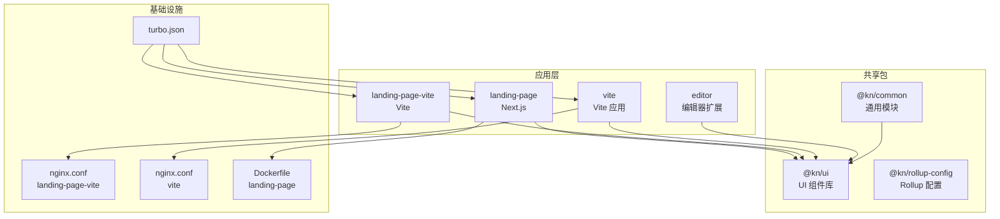
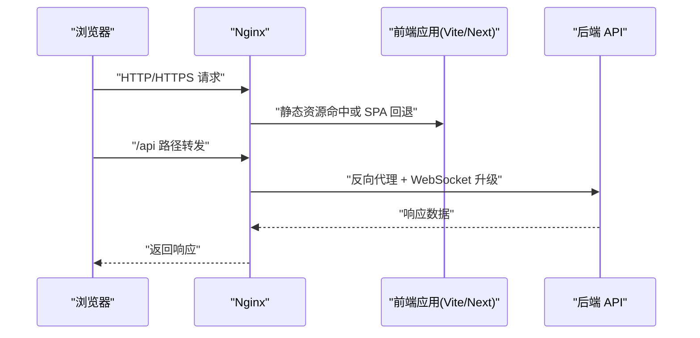
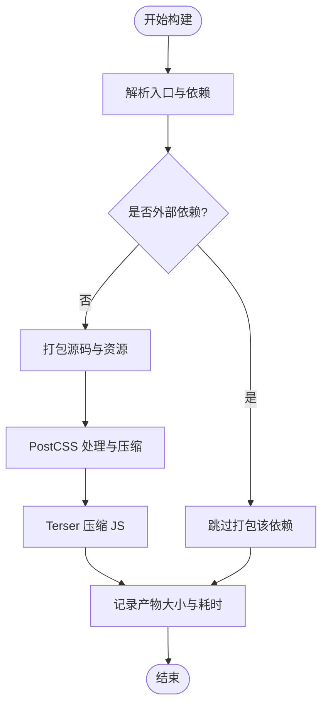
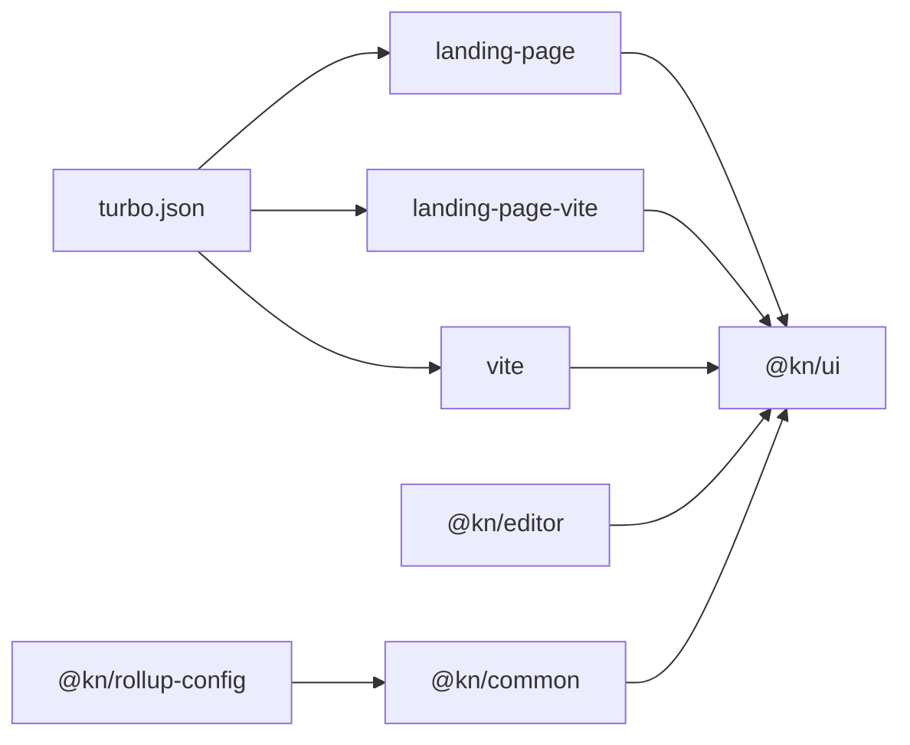

# 性能优化配置

<cite>
**本文引用的文件**
- [OPTIMIZATION_SUMMARY.md](file://OPTIMIZATION_SUMMARY.md)
- [.env.example](file://.env.example)
- [packages/common/src/utils/logger.ts](file://packages/common/src/utils/logger.ts)
- [packages/common/src/core/PluginManager.ts](file://packages/common/src/core/PluginManager.ts)
- [packages/common/src/utils/import-util.ts](file://packages/common/src/utils/import-util.ts)
- [packages/core/src/App.tsx](file://packages/core/src/App.tsx)
- [packages/rollup-config/index.js](file://packages/rollup-config/index.js)
- [apps/vite/vite.config.ts](file://apps/vite/vite.config.ts)
- [apps/landing-page/next.config.mjs](file://apps/landing-page/next.config.mjs)
- [apps/landing-page-vite/nginx/nginx.conf](file://apps/landing-page-vite/nginx/nginx.conf)
- [apps/vite/nginx/nginx.conf](file://apps/vite/nginx/nginx.conf)
- [apps/landing-page/Dockerfile](file://apps/landing-page/Dockerfile)
- [turbo.json](file://turbo.json)
- [package.json](file://package.json)
- [packages/ui/tailwind.config.js](file://packages/ui/tailwind.config.js)
- [packages/ui/postcss.config.js](file://packages/ui/postcss.config.js)
</cite>

## 更新摘要
本次更新基于新增的性能优化总结文档，补充并修订了知识库管理系统的性能优化配置指南。重点更新内容如下：
- 新增安全修复与证书清理要求，强调必须撤销并重新生成已泄露的SSL证书
- 补充代码质量改进项：集中式日志记录、构建配置分离、环境变量模板与加载
- 修订架构改进项：全局命名空间重构为window.__KN__，并提供插件迁移指南
- 在“故障排查指南”中新增与新配置相关的排查要点（日志级别、环境变量、命名空间）
- 在“依赖分析”与“架构总览”中补充与新配置相关的文件映射关系

上述更新均已在相应章节中体现，并提供了对应的章节来源与图表来源。

## 目录
1. 引言
2. 项目结构
3. 核心组件
4. 架构总览
5. 详细组件分析
6. 依赖分析
7. 性能考量
8. 故障排查指南
9. 结论
10. 附录

## 引言
本指南面向知识库管理系统的性能优化配置，覆盖前端性能（代码分割、懒加载、资源压缩）、CSS/PostCSS优化（按需构建、Tree Shaking、CSS优化）、静态资源优化（图片、字体、缓存）、网络性能（CDN、HTTP/2、WebSocket）、数据库与查询优化、内存与GC优化、性能监控（APM与指标采集）、移动端与PWA优化等主题。文档基于仓库现有配置进行落地化建议，并提供可视化图示帮助理解。

## 项目结构
系统采用多包工作区（Turbo + pnpm），包含多个应用与共享包：
- 应用层：Next.js 着陆页、Vite 多应用（含编辑器相关页面）
- 共享包：UI 组件库、编辑器扩展、通用工具、Rollup 打包配置
- 基础设施：Nginx 配置、Dockerfile、Turbo 任务定义

图表来源
- [apps/landing-page/next.config.mjs](file://apps/landing-page/next.config.mjs#L1-L9)
- [apps/landing-page-vite/nginx/nginx.conf](file://apps/landing-page-vite/nginx/nginx.conf#L1-L113)
- [apps/vite/nginx/nginx.conf](file://apps/vite/nginx/nginx.conf#L1-L113)
- [apps/landing-page/Dockerfile](file://apps/landing-page/Dockerfile#L1-L61)
- [turbo.json](file://turbo.json#L1-L27)

章节来源
- [package.json](file://package.json#L1-L103)
- [turbo.json](file://turbo.json#L1-L27)

## 核心组件
- 构建与打包：Rollup 配置启用压缩与最小化；Next/Vite 提供开发与生产构建能力
- CSS/PostCSS：统一由 @kn/ui 的 Tailwind 与 PostCSS 配置提供，确保按需构建与自动前缀
- 静态资源与服务：Nginx 提供代理、缓存与 WebSocket 升级支持
- 运行时镜像：Next.js 使用 standalone 输出，便于容器部署

章节来源
- [packages/rollup-config/index.js](file://packages/rollup-config/index.js#L1-L143)
- [packages/ui/tailwind.config.js](file://packages/ui/tailwind.config.js#L1-L145)
- [packages/ui/postcss.config.js](file://packages/ui/postcss.config.js#L1-L8)
- [apps/landing-page/next.config.mjs](file://apps/landing-page/next.config.mjs#L1-L9)
- [apps/landing-page-vite/nginx/nginx.conf](file://apps/landing-page-vite/nginx/nginx.conf#L1-L113)
- [apps/vite/nginx/nginx.conf](file://apps/vite/nginx/nginx.conf#L1-L113)

## 架构总览
前端到后端的典型请求链路：浏览器 → Nginx（静态资源、反向代理、WebSocket）→ 后端服务；构建阶段通过 Turbo 并行构建各包，Rollup 对共享包进行压缩与最小化。

图表来源
- [apps/landing-page-vite/nginx/nginx.conf](file://apps/landing-page-vite/nginx/nginx.conf#L40-L58)
- [apps/vite/nginx/nginx.conf](file://apps/vite/nginx/nginx.conf#L45-L58)

## 详细组件分析

### 前端构建与打包优化
- Rollup 最小化与压缩：启用 terser 插件对输出进行压缩与最小化，降低包体体积
- 按需构建与外部化：external 列表将 React 与核心包标记为外部依赖，减少重复打包
- CSS 处理：使用 postcss 插件链（嵌套、层级、自动前缀）与 minimize 开启 CSS 压缩
- 构建统计：插件内记录打包耗时与产物大小，便于持续优化

图表来源
- [packages/rollup-config/index.js](file://packages/rollup-config/index.js#L1-L143)

章节来源
- [packages/rollup-config/index.js](file://packages/rollup-config/index.js#L1-L143)

### CSS 与 PostCSS 优化
- Tailwind 按需扫描：content 指定扫描范围，仅生成实际使用的样式，避免全量 CSS
- 主题与动画：集中定义颜色、圆角、背景图与动画，统一风格并减少冗余
- PostCSS 插件链：tailwindcss、autoprefixer、nested、cascade-layers 等，提升兼容性与可维护性
- 组件库复用：各应用通过导出统一配置，保证一致性

章节来源
- [packages/ui/tailwind.config.js](file://packages/ui/tailwind.config.js#L1-L145)
- [packages/ui/postcss.config.js](file://packages/ui/postcss.config.js#L1-L8)

### 静态资源优化
- 图片压缩：建议在构建流程中引入压缩工具（如 imagemin 或类似），并结合 WebP/JPEGXL 适配
- 字体优化：使用可变字体与子集化（subsetting），减少首屏阻塞；优先使用 WOFF2
- 缓存策略：Nginx 中为静态资源设置长缓存（ETag/Cache-Control），版本化文件名，HTML 设置较短缓存
- 资源分发：结合 CDN，开启 Gzip/Brotli 压缩与 HTTP/2 多路复用

章节来源
- [apps/landing-page-vite/nginx/nginx.conf](file://apps/landing-page-vite/nginx/nginx.conf#L24-L30)
- [apps/vite/nginx/nginx.conf](file://apps/vite/nginx/nginx.conf#L24-L30)

### 网络性能优化
- 反向代理与超时：合理设置 proxy_connect_timeout、proxy_send_timeout、proxy_read_timeout，避免慢请求拖垮服务
- WebSocket 支持：通过 proxy_http_version 1.1 与 Upgrade/Connection 头实现升级
- HTTP/2：在 Nginx 中启用 HTTP/2，配合 TLS，提升多路复用与头部压缩
- CDN：将静态资源托管至 CDN，边缘节点就近分发，降低延迟

章节来源
- [apps/landing-page-vite/nginx/nginx.conf](file://apps/landing-page-vite/nginx/nginx.conf#L45-L58)
- [apps/vite/nginx/nginx.conf](file://apps/vite/nginx/nginx.conf#L45-L58)

### 数据库连接池与查询优化
- 连接池：根据并发访问量设置最大连接数、空闲超时与连接生命周期；启用健康检查与重试
- 查询优化：索引覆盖、避免 N+1 查询、使用分页与投影字段；对热点数据增加缓存层
- ORM/驱动：选择低开销的驱动与连接池实现（如 HikariCP、pgBouncer），并开启只读事务优化
- 监控：记录慢查询日志与执行计划，定期审查热点接口与 SQL

[本节为通用实践说明，不直接分析具体文件]

### 内存管理与垃圾回收优化
- 控制对象生命周期：避免闭包持有大对象；及时释放事件监听与定时器
- 分块加载：将大列表与复杂视图拆分为可卸载的模块，按需渲染
- GC 友好：减少临时数组拼接与深拷贝；使用 WeakMap/WeakSet 管理弱引用
- 容器内存限制：在 Docker 中设置 memory limit 与 swap，结合 JVM/Node 参数调优

章节来源
- [apps/landing-page/Dockerfile](file://apps/landing-page/Dockerfile#L1-L61)

### 性能监控与指标采集
- APM 工具：接入前端性能监控（如自定义 Beacon/埋点）与后端 APM（如 Jaeger/Zipkin）
- 指标维度：FP、FCP、LCP、FID、CLS、TTI、带宽、CPU/内存占用、错误率
- 告警机制：针对关键指标阈值与异常波动建立告警
- 报表与回放：结合会话重放与火焰图定位瓶颈

[本节为通用实践说明，不直接分析具体文件]

### 移动端性能与 PWA
- PWA：注册 Service Worker，离线缓存关键资源；实现更新提示与后台同步
- 移动端优化：骨架屏/占位图、图片懒加载、触摸目标尺寸、减少主线程阻塞
- 渐进增强：无 JS 场景下的可降级体验；关键路径最小化

[本节为通用实践说明，不直接分析具体文件]

### 日志与环境配置优化
- 集中式日志：新增 logger 工具，支持 DEBUG/INFO/WARN/ERROR 等级别，默认生产环境为 WARN+，开发环境为 DEBUG+
- 环境变量：新增 .env.example，集中管理 API 基础地址、超时、插件上传开关与发布地址、自动部署开关等
- 构建配置分离：Rollup 中注释掉自动上传逻辑，改为手动部署流程

章节来源
- [packages/common/src/utils/logger.ts](file://packages/common/src/utils/logger.ts#L1-L62)
- [.env.example](file://.env.example#L1-L18)
- [packages/rollup-config/index.js](file://packages/rollup-config/index.js#L1-L143)

### 全局命名空间重构
- 将多个库导出到 window.__KN__，避免污染全局 window 对象
- 插件加载逻辑兼容旧方式，同时推荐使用 window.__KN__ 访问
- 应用入口初始化 window.__KN__，确保插件加载可用

章节来源
- [packages/core/src/App.tsx](file://packages/core/src/App.tsx#L28-L36)
- [packages/common/src/utils/import-util.ts](file://packages/common/src/utils/import-util.ts#L1-L35)
- [OPTIMIZATION_SUMMARY.md](file://OPTIMIZATION_SUMMARY.md#L61-L87)

### 代理与环境变量加载
- Vite 代理：将 /api 路径代理到后端 API，支持 changeOrigin 与安全校验
- 环境变量：通过 loadEnv 加载 .env 文件中的配置项，支持 NODE_ENV 注入 define

章节来源
- [apps/vite/vite.config.ts](file://apps/vite/vite.config.ts#L1-L27)

### 安全修复与证书清理
- 已删除仓库中泄露的 SSL 私钥与证书文件，并更新 .gitignore 防止再次提交
- 必须立即撤销并重新生成相关证书，以消除安全风险

章节来源
- [OPTIMIZATION_SUMMARY.md](file://OPTIMIZATION_SUMMARY.md#L10-L20)

## 依赖分析
- 包间依赖：UI 组件库被多个应用与编辑器扩展依赖；Rollup 配置用于统一打包策略
- 构建链路：Turbo 管理任务依赖，Next/Vite 作为应用构建工具，Nginx 作为运行时网关

图表来源
- [turbo.json](file://turbo.json#L1-L27)
- [package.json](file://package.json#L1-L103)

章节来源
- [turbo.json](file://turbo.json#L1-L27)
- [package.json](file://package.json#L1-L103)

## 性能考量
- 构建阶段：利用 Turbo 并行构建，Rollup 压缩与最小化，减少包体积与加载时间
- 运行阶段：Nginx 提供静态资源缓存与反向代理，HTTP/2 与 WebSocket 优化传输
- 样式层面：Tailwind 按需构建，PostCSS 自动前缀与层级处理，降低冗余样式
- 资源层面：图片与字体优化、CDN 分发、缓存策略与压缩
- 运维层面：集中式日志、环境变量与命名空间重构，提升可观测性与安全性

[本节为总体指导，不直接分析具体文件]

## 故障排查指南
- 构建失败或体积异常：检查 Rollup 插件顺序与 external 配置，确认 terser 与 postcss 是否正确启用
- 样式缺失或冲突：核对 Tailwind content 扫描路径与 @kn/ui 的主题变量是否一致
- 静态资源 404：确认 Nginx try_files 与 root 配置，检查缓存头与 MIME 类型
- WebSocket 不可用：验证 proxy_http_version 与 Upgrade/Connection 头是否正确传递
- 容器启动问题：确认 Next standalone 输出与端口暴露，检查环境变量与用户权限
- 日志级别问题：确认生产环境默认为 WARN+，开发环境为 DEBUG+，避免生产日志噪声
- 环境变量未生效：确认 .env.local 已复制并正确配置，Vite 已通过 loadEnv 加载
- 插件加载失败：检查 window.__KN__ 是否初始化，插件是否通过新命名空间访问

章节来源
- [packages/rollup-config/index.js](file://packages/rollup-config/index.js#L1-L143)
- [packages/ui/tailwind.config.js](file://packages/ui/tailwind.config.js#L1-L145)
- [apps/landing-page-vite/nginx/nginx.conf](file://apps/landing-page-vite/nginx/nginx.conf#L40-L58)
- [apps/vite/nginx/nginx.conf](file://apps/vite/nginx/nginx.conf#L45-L58)
- [apps/landing-page/Dockerfile](file://apps/landing-page/Dockerfile#L1-L61)
- [packages/common/src/utils/logger.ts](file://packages/common/src/utils/logger.ts#L1-L62)
- [apps/vite/vite.config.ts](file://apps/vite/vite.config.ts#L1-L27)
- [packages/common/src/utils/import-util.ts](file://packages/common/src/utils/import-util.ts#L1-L35)
- [packages/core/src/App.tsx](file://packages/core/src/App.tsx#L28-L36)

## 结论
通过统一的构建与打包策略、Tailwind/PostCSS 的按需构建、Nginx 的缓存与反向代理、完善的监控与优化实践，以及新增的日志、环境变量与命名空间重构，知识库管理系统可在多端获得稳定且高效的性能表现。建议持续关注包体变化、关键指标与用户体验，结合业务增长迭代优化策略。

## 附录
- 关键配置参考路径
  - Next.js 构建输出：[apps/landing-page/next.config.mjs](file://apps/landing-page/next.config.mjs#L1-L9)
  - Vite 开发服务器与代理：[apps/vite/vite.config.ts](file://apps/vite/vite.config.ts#L1-L27)
  - Tailwind 配置：[packages/ui/tailwind.config.js](file://packages/ui/tailwind.config.js#L1-L145)
  - PostCSS 配置：[packages/ui/postcss.config.js](file://packages/ui/postcss.config.js#L1-L8)
  - Rollup 打包：[packages/rollup-config/index.js](file://packages/rollup-config/index.js#L1-L143)
  - Nginx 配置：[apps/landing-page-vite/nginx/nginx.conf](file://apps/landing-page-vite/nginx/nginx.conf#L1-L113)、[apps/vite/nginx/nginx.conf](file://apps/vite/nginx/nginx.conf#L1-L113)
  - Docker 部署：[apps/landing-page/Dockerfile](file://apps/landing-page/Dockerfile#L1-L61)
  - Turbo 任务：[turbo.json](file://turbo.json#L1-L27)
  - 环境变量模板：[.env.example](file://.env.example#L1-L18)
  - 集中式日志：[packages/common/src/utils/logger.ts](file://packages/common/src/utils/logger.ts#L1-L62)
  - 插件管理与命名空间：[packages/common/src/core/PluginManager.ts](file://packages/common/src/core/PluginManager.ts#L1-L177)、[packages/common/src/utils/import-util.ts](file://packages/common/src/utils/import-util.ts#L1-L35)、[packages/core/src/App.tsx](file://packages/core/src/App.tsx#L28-L36)