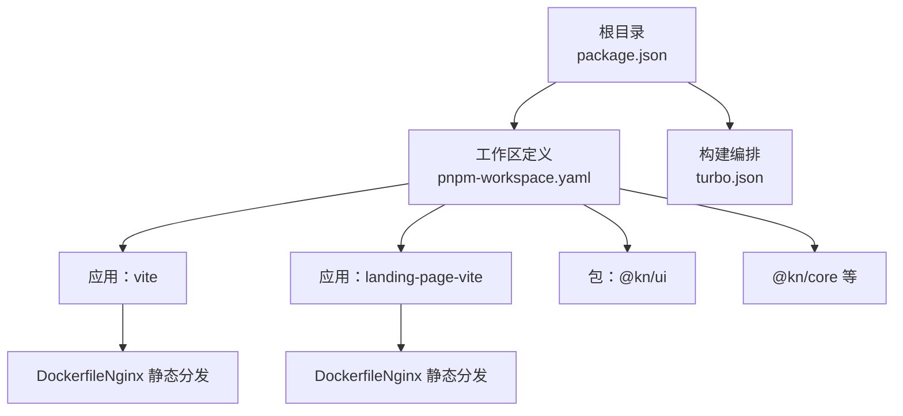
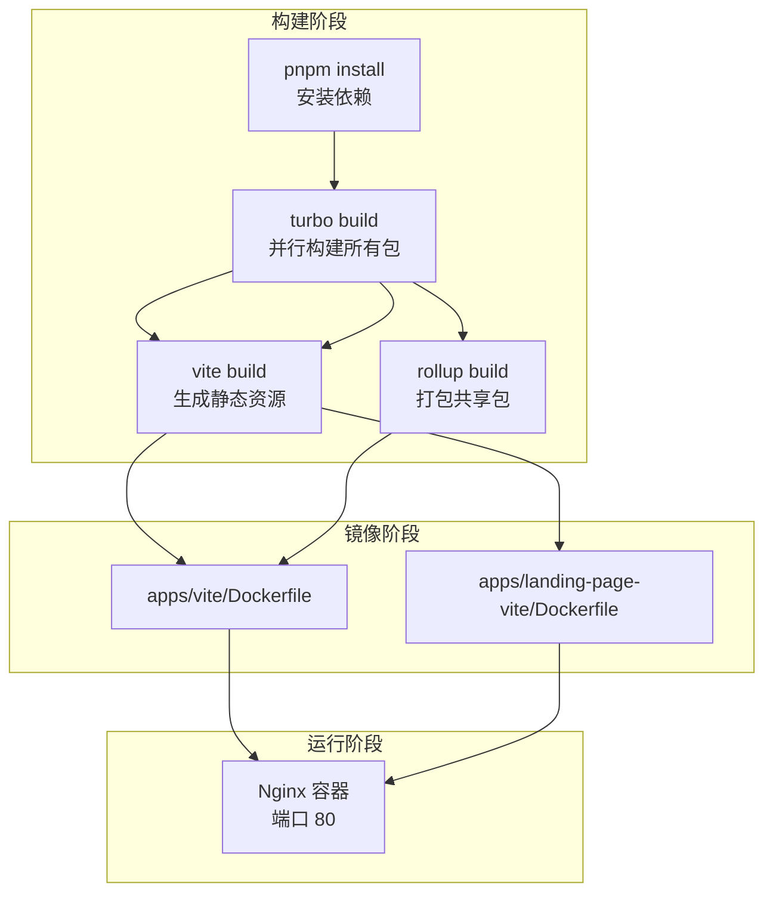
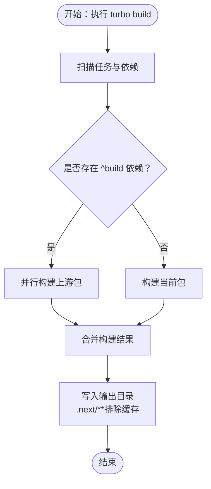
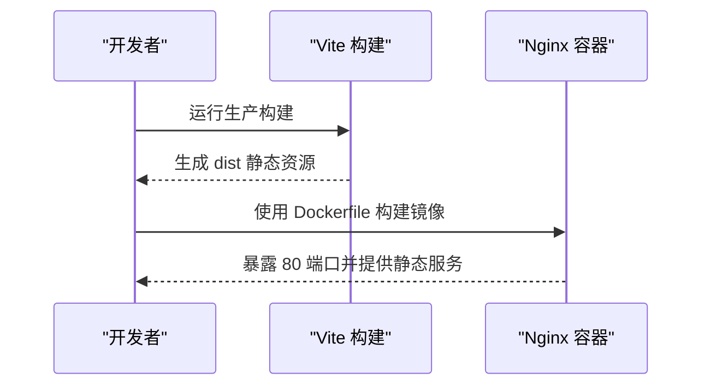
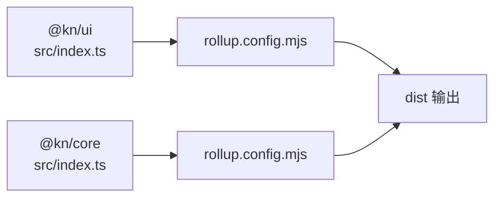
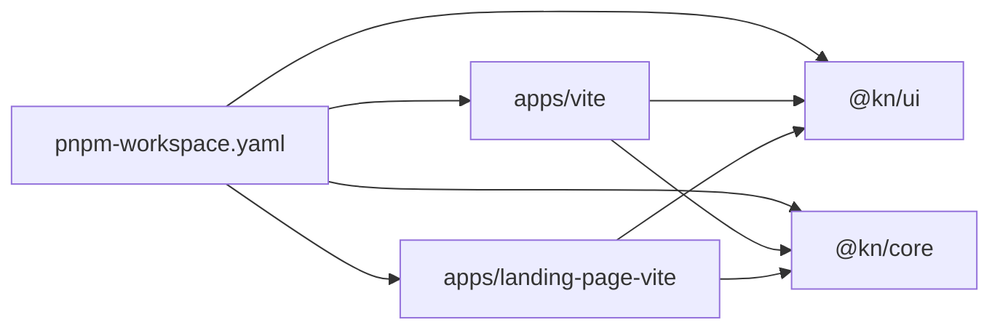

# 生产环境部署

<cite>
**本文引用的文件**
- [package.json](file://package.json)
- [turbo.json](file://turbo.json)
- [pnpm-workspace.yaml](file://pnpm-workspace.yaml)
- [README.md](file://README.md)
- [apps/vite/Dockerfile](file://apps/vite/Dockerfile)
- [apps/landing-page-vite/Dockerfile](file://apps/landing-page-vite/Dockerfile)
- [apps/vite/vite.config.ts](file://apps/vite/vite.config.ts)
- [apps/landing-page-vite/vite.config.ts](file://apps/landing-page-vite/vite.config.ts)
- [apps/vite/package.json](file://apps/vite/package.json)
- [apps/landing-page-vite/package.json](file://apps/landing-page-vite/package.json)
- [packages/core/package.json](file://packages/core/package.json)
- [packages/ui/package.json](file://packages/ui/package.json)
- [packages/core/rollup.config.mjs](file://packages/core/rollup.config.mjs)
- [packages/ui/rollup.config.mjs](file://packages/ui/rollup.config.mjs)
</cite>

## 目录
1. [引言](#引言)
2. [项目结构](#项目结构)
3. [核心组件](#核心组件)
4. [架构总览](#架构总览)
5. [详细组件分析](#详细组件分析)
6. [依赖分析](#依赖分析)
7. [性能考虑](#性能考虑)
8. [故障排查指南](#故障排查指南)
9. [结论](#结论)
10. [附录](#附录)

## 引言
本指南面向知识库管理系统的生产环境部署，覆盖从代码构建、依赖安装到环境准备的完整流程；深入解释 Turbo 构建系统在多包工作区中的任务依赖、并行构建与缓存策略；提供传统服务器部署、容器编排部署与云平台部署三类实施方案；明确环境变量配置要点（数据库连接、API 密钥、第三方服务）；给出部署前预检清单（代码质量、安全扫描、性能测试）；提供一键部署脚本思路与自动化流程建议，并包含回滚策略与紧急修复流程。

## 项目结构
该仓库采用 pnpm 工作区 + Turbo 的多包 Monorepo 结构，包含两个前端应用与多个共享包：
- 应用层：apps/vite（主应用）、apps/landing-page-vite（落地页）
- 包层：packages 下的共享组件与核心能力（如 @kn/ui、@kn/core、编辑器插件等）

图表来源
- [pnpm-workspace.yaml](file://pnpm-workspace.yaml#L1-L4)
- [turbo.json](file://turbo.json#L1-L27)
- [apps/vite/Dockerfile](file://apps/vite/Dockerfile#L1-L12)
- [apps/landing-page-vite/Dockerfile](file://apps/landing-page-vite/Dockerfile#L1-L12)

章节来源
- [pnpm-workspace.yaml](file://pnpm-workspace.yaml#L1-L4)
- [README.md](file://README.md#L1-L56)

## 核心组件
- Turbo 构建系统：通过全局依赖与任务依赖声明，实现跨包并行构建与缓存复用。
- Vite 应用：提供开发代理与生产构建，支持 Nginx 静态分发。
- Docker 镜像：基于 Nginx 镜像，将构建产物复制至 /usr/share/nginx/html 并暴露 80 端口。
- 共享包：@kn/ui、@kn/core 等通过 Rollup 打包，供应用按需引入。

章节来源
- [package.json](file://package.json#L1-L103)
- [turbo.json](file://turbo.json#L1-L27)
- [apps/vite/vite.config.ts](file://apps/vite/vite.config.ts#L1-L21)
- [apps/landing-page-vite/vite.config.ts](file://apps/landing-page-vite/vite.config.ts#L1-L22)
- [apps/vite/Dockerfile](file://apps/vite/Dockerfile#L1-L12)
- [apps/landing-page-vite/Dockerfile](file://apps/landing-page-vite/Dockerfile#L1-L12)
- [packages/ui/rollup.config.mjs](file://packages/ui/rollup.config.mjs#L1-L5)
- [packages/core/rollup.config.mjs](file://packages/core/rollup.config.mjs#L1-L5)

## 架构总览
下图展示生产部署的关键路径：本地构建 → Docker 镜像构建 → 容器运行（Nginx 提供静态服务）。

图表来源
- [package.json](file://package.json#L1-L103)
- [turbo.json](file://turbo.json#L1-L27)
- [apps/vite/vite.config.ts](file://apps/vite/vite.config.ts#L1-L21)
- [apps/landing-page-vite/vite.config.ts](file://apps/landing-page-vite/vite.config.ts#L1-L22)
- [apps/vite/Dockerfile](file://apps/vite/Dockerfile#L1-L12)
- [apps/landing-page-vite/Dockerfile](file://apps/landing-page-vite/Dockerfile#L1-L12)

## 详细组件分析

### Turbo 构建系统与任务依赖
- 全局依赖：监听以 .env.*local 结尾的文件变更，触发相关任务。
- 任务依赖：
  - build 依赖上游包的 build（^build），形成自底向上的构建顺序。
  - lint 同样依赖上游 lint。
  - dev 任务不缓存，且标记为持久任务，适合本地开发。
- 缓存策略：build 任务输出目录包含 .next/**（排除缓存子目录），便于 Turbo 复用缓存。

图表来源
- [turbo.json](file://turbo.json#L1-L27)

章节来源
- [turbo.json](file://turbo.json#L1-L27)

### Vite 应用构建与代理配置
- 开发代理：将 /api 前缀转发至目标后端地址，开启 changeOrigin 与 secure。
- 生产构建：设置 NODE_ENV=production，使用 vite build 生成静态资源。
- Docker 镜像：基于 Nginx，复制 dist 至 /usr/share/nginx/html，暴露 80 端口。

图表来源
- [apps/vite/vite.config.ts](file://apps/vite/vite.config.ts#L1-L21)
- [apps/landing-page-vite/vite.config.ts](file://apps/landing-page-vite/vite.config.ts#L1-L22)
- [apps/vite/Dockerfile](file://apps/vite/Dockerfile#L1-L12)
- [apps/landing-page-vite/Dockerfile](file://apps/landing-page-vite/Dockerfile#L1-L12)

章节来源
- [apps/vite/vite.config.ts](file://apps/vite/vite.config.ts#L1-L21)
- [apps/landing-page-vite/vite.config.ts](file://apps/landing-page-vite/vite.config.ts#L1-L22)
- [apps/vite/Dockerfile](file://apps/vite/Dockerfile#L1-L12)
- [apps/landing-page-vite/Dockerfile](file://apps/landing-page-vite/Dockerfile#L1-L12)

### 共享包构建（Rollup）
- @kn/ui 与 @kn/core 等包通过各自 rollup.config.mjs 调用统一的 baseConfig，输入为 src/index.ts，输出为 dist。
- 依赖关系：应用层通过 workspace:* 引入这些包，确保版本一致与增量构建。

图表来源
- [packages/ui/rollup.config.mjs](file://packages/ui/rollup.config.mjs#L1-L5)
- [packages/core/rollup.config.mjs](file://packages/core/rollup.config.mjs#L1-L5)
- [packages/ui/package.json](file://packages/ui/package.json#L1-L90)
- [packages/core/package.json](file://packages/core/package.json#L1-L41)

章节来源
- [packages/ui/rollup.config.mjs](file://packages/ui/rollup.config.mjs#L1-L5)
- [packages/core/rollup.config.mjs](file://packages/core/rollup.config.mjs#L1-L5)
- [packages/ui/package.json](file://packages/ui/package.json#L1-L90)
- [packages/core/package.json](file://packages/core/package.json#L1-L41)

### 部署场景实施方案

#### 传统服务器部署
- 步骤
  - 在目标服务器安装 Node.js 与 pnpm（满足引擎要求）。
  - 克隆代码并执行 pnpm install 安装依赖。
  - 执行 pnpm build，由 Turbo 并行构建所有包。
  - 进入 apps/vite 或 apps/landing-page-vite 目录，执行生产构建（vite build）。
  - 使用 apps/*/Dockerfile 构建镜像并运行容器，Nginx 提供静态服务。
- 注意事项
  - 确保防火墙开放 80 端口。
  - 如需 HTTPS，可在 Nginx 层配置证书与反代。

章节来源
- [package.json](file://package.json#L1-L103)
- [turbo.json](file://turbo.json#L1-L27)
- [apps/vite/Dockerfile](file://apps/vite/Dockerfile#L1-L12)
- [apps/landing-page-vite/Dockerfile](file://apps/landing-page-vite/Dockerfile#L1-L12)

#### 容器编排部署（Kubernetes/Helm）
- 建议
  - 为每个应用分别构建镜像（apps/vite 与 apps/landing-page-vite）。
  - 使用 Deployment + Service 暴露 80 端口。
  - 使用 Ingress 控制器统一入口与 TLS 终止。
  - 将 Nginx 配置与证书以 ConfigMap/Secret 管理。
- 关键点
  - Dockerfile 中已将 dist 复制到 Nginx 默认站点目录，可直接挂载或内嵌证书。

章节来源
- [apps/vite/Dockerfile](file://apps/vite/Dockerfile#L1-L12)
- [apps/landing-page-vite/Dockerfile](file://apps/landing-page-vite/Dockerfile#L1-L12)

#### 云平台部署（容器服务/托管平台）
- 建议
  - 使用平台的容器构建与发布流水线，直接引用 apps/*/Dockerfile。
  - 在平台侧配置环境变量与存储卷（如 Nginx 证书）。
  - 通过平台的健康检查与滚动更新策略保障发布稳定性。
- 参考
  - apps/*/Dockerfile 已内置 Nginx 与端口暴露逻辑，适配多数云原生平台。

章节来源
- [apps/vite/Dockerfile](file://apps/vite/Dockerfile#L1-L12)
- [apps/landing-page-vite/Dockerfile](file://apps/landing-page-vite/Dockerfile#L1-L12)

### 环境变量配置
- 通用建议
  - 数据库连接：通过环境变量注入连接字符串与凭据，避免硬编码。
  - API 密钥：用于调用第三方服务（如 AI 服务、文件存储等），建议使用只读最小权限。
  - 第三方服务：如 AI 接口、CDN、监控等，集中通过环境变量管理。
- 开发代理参考
  - Vite 配置中对 /api 的代理指向固定后端地址，生产环境应通过反向代理或平台路由替换为实际后端。

章节来源
- [apps/vite/vite.config.ts](file://apps/vite/vite.config.ts#L1-L21)
- [apps/landing-page-vite/vite.config.ts](file://apps/landing-page-vite/vite.config.ts#L1-L22)

### 部署前预检清单
- 代码质量
  - 执行 lint 与格式化检查，确保无严重问题。
- 安全扫描
  - 对依赖进行漏洞扫描（如 npm audit 或第三方 SCA 工具）。
- 性能测试
  - 生成生产包后进行体积分析与首屏加载时间测试。
- 构建验证
  - 在隔离环境中执行 pnpm build，确认各包构建成功且产物完整。
- 运行验证
  - 使用 Docker 镜像启动容器，访问首页与关键页面，验证静态资源与代理配置。

章节来源
- [package.json](file://package.json#L1-L103)
- [turbo.json](file://turbo.json#L1-L27)

### 一键部署脚本示例与自动化流程
- 脚本思路（概念性描述）
  - 安装依赖：pnpm install
  - 清理缓存：pnpm clean（如存在）
  - 构建：pnpm build（由 Turbo 并行处理）
  - 应用构建：进入 apps/*/ 目录执行生产构建
  - 镜像构建：使用 apps/*/Dockerfile 构建镜像
  - 运行：docker run 或通过编排工具部署
- 自动化流水线（CI/CD）
  - 触发条件：分支保护与 PR 审批
  - 步骤：安装 → Lint/测试 → 构建 → 扫描 → 制品归档 → 部署
  - 回滚：保留最近 N 个镜像版本，支持快速回滚

章节来源
- [package.json](file://package.json#L1-L103)
- [turbo.json](file://turbo.json#L1-L27)
- [apps/vite/Dockerfile](file://apps/vite/Dockerfile#L1-L12)
- [apps/landing-page-vite/Dockerfile](file://apps/landing-page-vite/Dockerfile#L1-L12)

### 回滚策略与紧急修复流程
- 回滚策略
  - 保留最近 N 次镜像版本，记录发布标签与构建号。
  - 通过编排工具切换镜像版本或回滚到上一个稳定版本。
- 紧急修复
  - 快速修复分支（hotfix）合并到主干并重新构建发布。
  - 使用蓝绿/金丝雀发布降低风险。
- 日志与可观测性
  - 收集容器日志与 Nginx 访问/错误日志，结合指标监控定位问题。

章节来源
- [apps/vite/Dockerfile](file://apps/vite/Dockerfile#L1-L12)
- [apps/landing-page-vite/Dockerfile](file://apps/landing-page-vite/Dockerfile#L1-L12)

## 依赖分析
- 工作区与包关系
  - pnpm-workspace.yaml 声明 apps/* 与 packages/* 为工作区。
  - 应用层依赖共享包（workspace:*），共享包之间也存在依赖关系。
- 构建链路
  - Turbo 作为顶层编排，按任务依赖顺序并行构建。
  - Vite 应用与共享包分别独立构建，最终由 Dockerfile 统一交付。

图表来源
- [pnpm-workspace.yaml](file://pnpm-workspace.yaml#L1-L4)
- [apps/vite/package.json](file://apps/vite/package.json#L1-L46)
- [apps/landing-page-vite/package.json](file://apps/landing-page-vite/package.json#L1-L39)
- [packages/ui/package.json](file://packages/ui/package.json#L1-L90)
- [packages/core/package.json](file://packages/core/package.json#L1-L41)

章节来源
- [pnpm-workspace.yaml](file://pnpm-workspace.yaml#L1-L4)
- [apps/vite/package.json](file://apps/vite/package.json#L1-L46)
- [apps/landing-page-vite/package.json](file://apps/landing-page-vite/package.json#L1-L39)
- [packages/ui/package.json](file://packages/ui/package.json#L1-L90)
- [packages/core/package.json](file://packages/core/package.json#L1-L41)

## 性能考虑
- 构建性能
  - Turbo 并行构建与缓存复用显著缩短构建时间。
  - 通过排除 .next/cache/**，减少缓存膨胀。
- 运行性能
  - Nginx 提供静态资源高效分发。
  - 生产构建时的 NODE_ENV=production 有助于优化产物体积与运行时行为。
- 依赖体积
  - 共享包按需引入，避免重复打包；定期清理未使用依赖。

章节来源
- [turbo.json](file://turbo.json#L1-L27)
- [apps/vite/vite.config.ts](file://apps/vite/vite.config.ts#L1-L21)
- [apps/landing-page-vite/vite.config.ts](file://apps/landing-page-vite/vite.config.ts#L1-L22)

## 故障排查指南
- 构建失败
  - 检查 Node.js 与 pnpm 版本是否满足要求。
  - 查看 Turbo 任务日志，确认依赖包是否成功构建。
- 代理问题
  - 确认 /api 代理配置正确，目标后端可达且证书有效。
- 静态资源异常
  - 确认 dist 目录已正确复制到 Nginx 路径。
  - 检查 Nginx 配置与证书文件路径。
- 容器无法启动
  - 查看容器日志与端口占用情况，确保 80 端口可用。

章节来源
- [README.md](file://README.md#L1-L56)
- [apps/vite/vite.config.ts](file://apps/vite/vite.config.ts#L1-L21)
- [apps/landing-page-vite/vite.config.ts](file://apps/landing-page-vite/vite.config.ts#L1-L22)
- [apps/vite/Dockerfile](file://apps/vite/Dockerfile#L1-L12)
- [apps/landing-page-vite/Dockerfile](file://apps/landing-page-vite/Dockerfile#L1-L12)

## 结论
本指南基于现有配置，给出了生产环境部署的完整路径：以 Turbo 为核心组织多包构建，配合 Vite 与 Nginx 实现高性能静态分发；提供传统服务器、容器编排与云平台三种部署方案；明确了环境变量配置要点与预检清单；并给出回滚与紧急修复建议。建议在实际落地时结合团队规范与平台特性进一步细化流程与参数。

## 附录
- 快速命令参考（概念性）
  - 安装依赖：pnpm install
  - 构建：pnpm build
  - 应用构建：cd apps/vite && pnpm build
  - 镜像构建：cd apps/vite && docker build -t kn:latest .
  - 运行：docker run -d -p 80:80 kn:latest