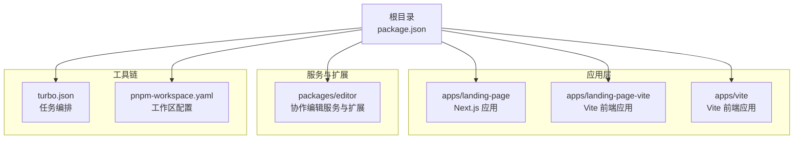
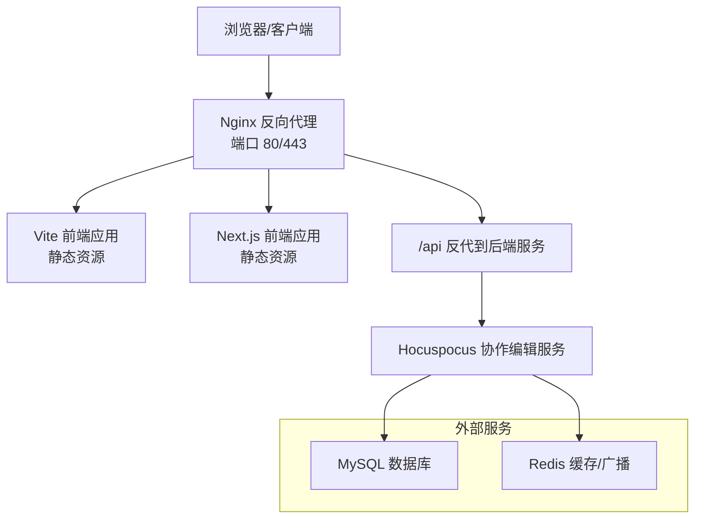
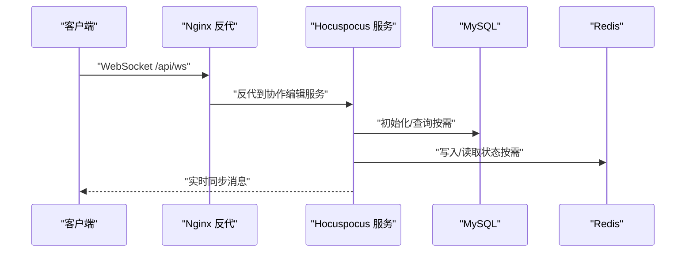
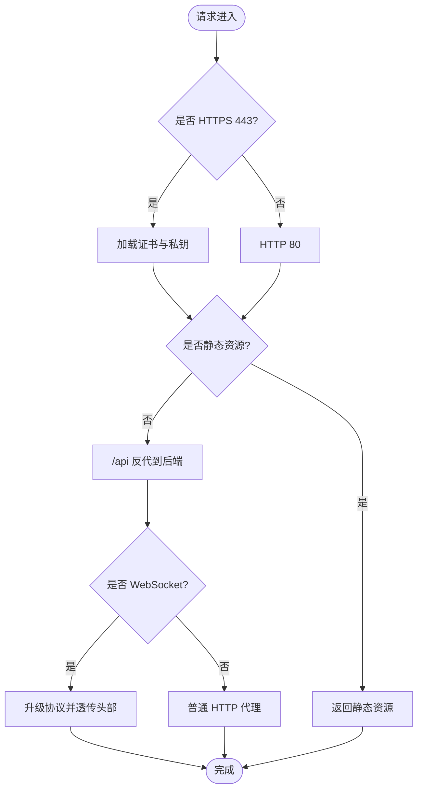
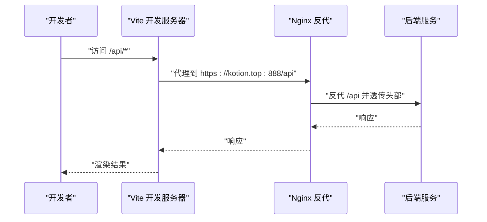
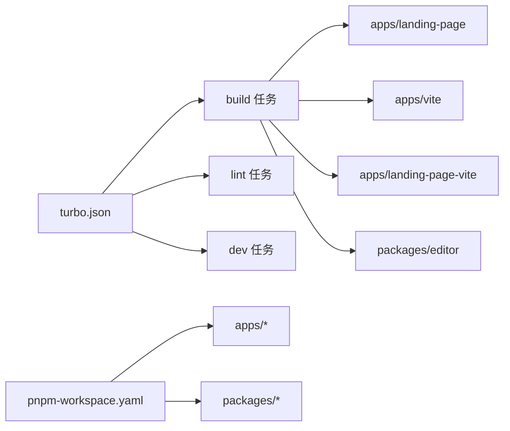

# 部署配置

<cite>
**本文引用的文件**
- [package.json](file://package.json)
- [turbo.json](file://turbo.json)
- [pnpm-workspace.yaml](file://pnpm-workspace.yaml)
- [apps/landing-page/Dockerfile](file://apps/landing-page/Dockerfile)
- [apps/landing-page/.dockerignore](file://apps/landing-page/.dockerignore)
- [apps/landing-page/next.config.mjs](file://apps/landing-page/next.config.mjs)
- [apps/landing-page/README.md](file://apps/landing-page/README.md)
- [apps/landing-page-vite/Dockerfile](file://apps/landing-page-vite/Dockerfile)
- [apps/vite/nginx/nginx.conf](file://apps/vite/nginx/nginx.conf)
- [apps/vite/vite.config.ts](file://apps/vite/vite.config.ts)
- [apps/landing-page-vite/vite.config.ts](file://apps/landing-page-vite/vite.config.ts)
- [packages/editor/src/server/server.mjs](file://packages/editor/src/server/server.mjs)
- [packages/editor/src/server/plugin/mysql/MysqlPlugin.mjs](file://packages/editor/src/server/plugin/mysql/MysqlPlugin.mjs)
</cite>

## 目录
1. [简介](#简介)
2. [项目结构](#项目结构)
3. [核心组件](#核心组件)
4. [架构总览](#架构总览)
5. [详细组件分析](#详细组件分析)
6. [依赖关系分析](#依赖关系分析)
7. [性能考虑](#性能考虑)
8. [故障排除指南](#故障排除指南)
9. [结论](#结论)
10. [附录](#附录)

## 简介
本文件面向知识库管理系统的生产部署与运维，覆盖容器化、反向代理、环境变量、多场景部署（云服务器、容器集群、本地开发）、CI/CD 流程、性能优化（缓存、静态资源、数据库连接池）、安全加固（HTTPS、访问控制、数据加密）以及监控与故障排除建议。内容基于仓库中现有配置文件与脚本进行归纳总结，并提供可操作的落地步骤。

## 项目结构
该仓库采用 monorepo 结构，使用 pnpm workspace 管理多包；应用层包含基于 Next.js 的落地页应用与基于 Vite 的前端应用，服务端包含协作编辑服务与 MySQL 扩展。Turbo 负责任务编排与缓存。

图表来源
- [package.json](file://package.json#L1-L103)
- [turbo.json](file://turbo.json#L1-L27)
- [pnpm-workspace.yaml](file://pnpm-workspace.yaml#L1-L4)

章节来源
- [package.json](file://package.json#L1-L103)
- [turbo.json](file://turbo.json#L1-L27)
- [pnpm-workspace.yaml](file://pnpm-workspace.yaml#L1-L4)

## 核心组件
- 协作编辑服务：基于 Hocuspocus 的服务端，支持 MySQL 与 Redis 扩展，通过环境变量配置数据库与缓存。
- Nginx 反向代理：统一暴露 80/443 端口，转发 /api 到后端服务，支持 WebSocket 升级与静态资源。
- 前端应用：
  - Vite 应用：本地开发时通过代理将 /api 请求转发至 Nginx 暴露的服务。
  - Next.js 应用：生产构建输出独立可运行包，配合 Dockerfile 运行。
- 工具链：Turbo 统一构建、缓存与任务依赖；pnpm workspace 管理多包。

章节来源
- [packages/editor/src/server/server.mjs](file://packages/editor/src/server/server.mjs#L1-L26)
- [apps/vite/nginx/nginx.conf](file://apps/vite/nginx/nginx.conf#L1-L113)
- [apps/vite/vite.config.ts](file://apps/vite/vite.config.ts#L1-L21)
- [apps/landing-page-vite/vite.config.ts](file://apps/landing-page-vite/vite.config.ts#L1-L22)
- [apps/landing-page/Dockerfile](file://apps/landing-page/Dockerfile#L1-L61)
- [turbo.json](file://turbo.json#L1-L27)

## 架构总览
系统由“前端应用 + Nginx 反代 + 协作编辑服务 + 数据库/缓存”构成。Nginx 对外提供 HTTPS 与 HTTP 服务，负责静态资源与 /api 反代；前端应用通过 /api 访问协作编辑服务；协作编辑服务通过 MySQL 与 Redis 扩展持久化与共享状态。

图表来源
- [apps/vite/nginx/nginx.conf](file://apps/vite/nginx/nginx.conf#L1-L113)
- [packages/editor/src/server/server.mjs](file://packages/editor/src/server/server.mjs#L1-L26)
- [packages/editor/src/server/plugin/mysql/MysqlPlugin.mjs](file://packages/editor/src/server/plugin/mysql/MysqlPlugin.mjs#L43-L88)

## 详细组件分析

### 协作编辑服务（Hocuspocus）
- 功能：提供实时协作编辑能力，支持扩展接入数据库与缓存。
- 配置要点：
  - 数据库：通过 MySQL 扩展连接，支持主机、端口、用户名、密码、数据库名等环境变量。
  - 缓存：通过 Redis 扩展连接，支持主机、端口等环境变量。
  - 端口：可通过环境变量设置监听端口。
- 连接池与稳定性：MySQL 扩展在连接断开时自动重连并定期 ping 保持健康。

图表来源
- [packages/editor/src/server/server.mjs](file://packages/editor/src/server/server.mjs#L1-L26)
- [packages/editor/src/server/plugin/mysql/MysqlPlugin.mjs](file://packages/editor/src/server/plugin/mysql/MysqlPlugin.mjs#L43-L88)
- [apps/vite/nginx/nginx.conf](file://apps/vite/nginx/nginx.conf#L45-L58)

章节来源
- [packages/editor/src/server/server.mjs](file://packages/editor/src/server/server.mjs#L1-L26)
- [packages/editor/src/server/plugin/mysql/MysqlPlugin.mjs](file://packages/editor/src/server/plugin/mysql/MysqlPlugin.mjs#L43-L88)

### Nginx 反向代理
- 静态资源：映射前端构建产物目录，支持 index 回退与单页路由。
- API 反代：将 /api 前缀转发至后端服务地址，保留 Host、X-Real-IP、X-Forwarded-For 头，启用 WebSocket 升级。
- 安全与性能：开启 gzip、限制上传大小、设置 keepalive 超时、错误页面映射。
- HTTPS：加载证书与私钥，监听 443 端口；HTTP 监听 80 端口并指向同一站点。

图表来源
- [apps/vite/nginx/nginx.conf](file://apps/vite/nginx/nginx.conf#L1-L113)

章节来源
- [apps/vite/nginx/nginx.conf](file://apps/vite/nginx/nginx.conf#L1-L113)

### 前端应用（Vite 与 Next.js）
- Vite 应用：
  - 开发代理：将 /api 请求代理到指定目标，支持路径重写与安全校验。
  - 本地开发端口：可在配置中查看。
- Next.js 应用：
  - 生产构建：输出独立可运行包，便于容器化部署。
  - Dockerfile：复制源码并以 npm start 启动（当前未启用分层构建与只读用户）。

图表来源
- [apps/vite/vite.config.ts](file://apps/vite/vite.config.ts#L1-L21)
- [apps/landing-page-vite/vite.config.ts](file://apps/landing-page-vite/vite.config.ts#L1-L22)
- [apps/vite/nginx/nginx.conf](file://apps/vite/nginx/nginx.conf#L45-L58)

章节来源
- [apps/vite/vite.config.ts](file://apps/vite/vite.config.ts#L1-L21)
- [apps/landing-page-vite/vite.config.ts](file://apps/landing-page-vite/vite.config.ts#L1-L22)
- [apps/landing-page/next.config.mjs](file://apps/landing-page/next.config.mjs#L1-L9)
- [apps/landing-page/Dockerfile](file://apps/landing-page/Dockerfile#L1-L61)

### 容器化与镜像
- Next.js 应用：
  - 当前 Dockerfile 复制全部源码并执行 npm start，未启用分层构建与只读用户。
  - 建议：在构建阶段生成 dist 并在运行阶段仅复制必要文件，启用只读文件系统与非 root 用户。
- Vite 前端应用：
  - 使用 Nginx 镜像，复制构建产物与 Nginx 配置，暴露 80 端口。
  - 建议：固定镜像版本、最小化权限、启用健康检查。

章节来源
- [apps/landing-page/Dockerfile](file://apps/landing-page/Dockerfile#L1-L61)
- [apps/landing-page/.dockerignore](file://apps/landing-page/.dockerignore#L1-L34)
- [apps/landing-page-vite/Dockerfile](file://apps/landing-page-vite/Dockerfile#L1-L12)

## 依赖关系分析
- 任务编排：Turbo 定义了 build、lint、dev 等任务及其依赖与缓存策略。
- 工作区：pnpm workspace 将 apps 与 packages 纳入统一管理。
- 构建顺序：各包的 build 依赖上游包的 build 输出。

图表来源
- [turbo.json](file://turbo.json#L1-L27)
- [pnpm-workspace.yaml](file://pnpm-workspace.yaml#L1-L4)

章节来源
- [turbo.json](file://turbo.json#L1-L27)
- [pnpm-workspace.yaml](file://pnpm-workspace.yaml#L1-L4)

## 性能考虑
- 静态资源优化
  - Nginx 已启用 gzip，建议结合浏览器缓存策略（ETag/Cache-Control）与 CDN 加速。
  - 前端应用可启用产物哈希命名与长期缓存。
- 反向代理性能
  - 合理设置 keepalive_timeout 与超时参数，避免长连接过多导致资源占用。
  - 限制上传大小与并发连接数，防止突发流量压垮后端。
- 数据库连接池
  - 当前 MySQL 扩展未显式配置连接池参数，建议在生产环境增加连接池大小、超时与重试策略，避免高并发下的连接耗尽。
- 缓存策略
  - Redis 作为缓存/广播介质，建议开启持久化与主从复制，提升可用性与读写分离能力。
- 构建与打包
  - 使用 Turbo 并行构建，减少重复计算；对大体积依赖进行拆分与懒加载。

章节来源
- [apps/vite/nginx/nginx.conf](file://apps/vite/nginx/nginx.conf#L1-L113)
- [packages/editor/src/server/plugin/mysql/MysqlPlugin.mjs](file://packages/editor/src/server/plugin/mysql/MysqlPlugin.mjs#L43-L88)

## 故障排除指南
- 协作编辑服务无法连接数据库
  - 检查数据库主机、端口、用户名、密码与数据库名是否正确。
  - 观察日志中 ping 错误与重连行为，确认网络连通性。
- WebSocket 无法升级
  - 确认 Nginx 中已启用代理头透传与 HTTP/1.1 代理版本。
  - 检查后端服务端口与防火墙策略。
- 前端代理失败
  - 确认 Vite 开发代理的目标地址与路径重写规则。
  - 若使用 HTTPS，确保 secure 选项与证书校验符合预期。
- Docker 镜像启动异常
  - Next.js 应用建议改为构建产物运行，避免复制源码带来的体积与安全风险。
  - Vite 应用建议固定 Nginx 版本并检查配置文件挂载权限。

章节来源
- [packages/editor/src/server/server.mjs](file://packages/editor/src/server/server.mjs#L1-L26)
- [packages/editor/src/server/plugin/mysql/MysqlPlugin.mjs](file://packages/editor/src/server/plugin/mysql/MysqlPlugin.mjs#L43-L88)
- [apps/vite/nginx/nginx.conf](file://apps/vite/nginx/nginx.conf#L45-L58)
- [apps/vite/vite.config.ts](file://apps/vite/vite.config.ts#L1-L21)
- [apps/landing-page-vite/Dockerfile](file://apps/landing-page-vite/Dockerfile#L1-L12)
- [apps/landing-page/Dockerfile](file://apps/landing-page/Dockerfile#L1-L61)

## 结论
本仓库提供了清晰的前端应用与协作编辑服务边界，配合 Nginx 反向代理即可快速搭建生产环境。建议在生产环境中完善容器化最佳实践、数据库连接池配置、缓存与安全策略，并建立完善的 CI/CD 流水线与监控告警体系。

## 附录

### 环境变量清单（服务端）
- 数据库相关
  - DB_HOST：数据库主机
  - DB_PORT：数据库端口
  - DB_USERNAME：数据库用户名
  - DB_PASSWORD：数据库密码
  - DB_DATABASE：数据库名
- 缓存相关
  - REDIS_HOST：Redis 主机
  - REDIS_PORT：Redis 端口
- 服务端口
  - PORT：协作编辑服务监听端口

章节来源
- [packages/editor/src/server/server.mjs](file://packages/editor/src/server/server.mjs#L1-L26)

### 部署场景与配置建议

- 云服务器部署
  - 前端：使用 Nginx 容器承载静态资源与反向代理，挂载证书与配置文件。
  - 后端：以独立容器运行协作编辑服务，连接云数据库与云缓存。
  - 安全：仅开放 80/443，内网访问数据库与缓存；启用 WAF 与 DDOS 防护。
- 容器集群部署（Kubernetes）
  - 前端：Deployment + Ingress，配置 TLS 证书与健康检查。
  - 后端：Deployment + Service，使用 ConfigMap/Secret 注入环境变量。
  - 存储：数据库与缓存使用托管服务或 StatefulSet。
- 本地开发环境
  - 使用 Vite 开发代理将 /api 指向本地或远程 Nginx。
  - Next.js 应用可直接运行，或在本地容器中验证构建产物。

章节来源
- [apps/vite/nginx/nginx.conf](file://apps/vite/nginx/nginx.conf#L1-L113)
- [apps/vite/vite.config.ts](file://apps/vite/vite.config.ts#L1-L21)
- [apps/landing-page-vite/Dockerfile](file://apps/landing-page-vite/Dockerfile#L1-L12)
- [apps/landing-page/Dockerfile](file://apps/landing-page/Dockerfile#L1-L61)

### CI/CD 流程建议
- 构建阶段
  - 使用 Turbo 并行构建所有包，缓存依赖与中间产物。
  - 分别构建前端静态产物与协作编辑服务二进制/运行时包。
- 测试阶段
  - 在构建后执行 lint 与单元测试（如适用），确保质量门禁。
- 部署阶段
  - 生成稳定镜像标签，推送至镜像仓库。
  - 在目标环境拉起新版本，滚动更新并进行健康检查。
- 发布与回滚
  - 记录镜像版本与发布记录，支持一键回滚。

章节来源
- [package.json](file://package.json#L1-L103)
- [turbo.json](file://turbo.json#L1-L27)

### 安全配置指南
- HTTPS 设置
  - 在 Nginx 中加载证书与私钥，强制 HTTPS 访问。
  - 启用安全传输头（HSTS、HPKP 等，视合规要求而定）。
- 访问控制
  - 限制 /api 的来源 IP 或添加鉴权网关。
  - 对敏感接口启用 JWT 或会话校验。
- 数据加密
  - 数据库连接使用 TLS；Redis 连接启用加密通道。
  - 密钥与敏感信息通过密钥管理服务注入。

章节来源
- [apps/vite/nginx/nginx.conf](file://apps/vite/nginx/nginx.conf#L1-L113)
- [packages/editor/src/server/server.mjs](file://packages/editor/src/server/server.mjs#L1-L26)

### 监控与日志
- Nginx：开启 access_log 与 error_log，采集指标（请求数、响应时间、错误率）。
- 应用：记录业务日志与错误堆栈，结合 APM 工具追踪慢调用。
- 基础设施：监控 CPU、内存、磁盘、网络与容器健康状态，设置阈值告警。

[本节为通用建议，无需特定文件引用]