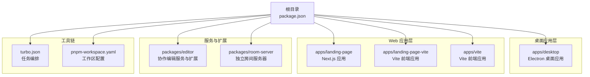
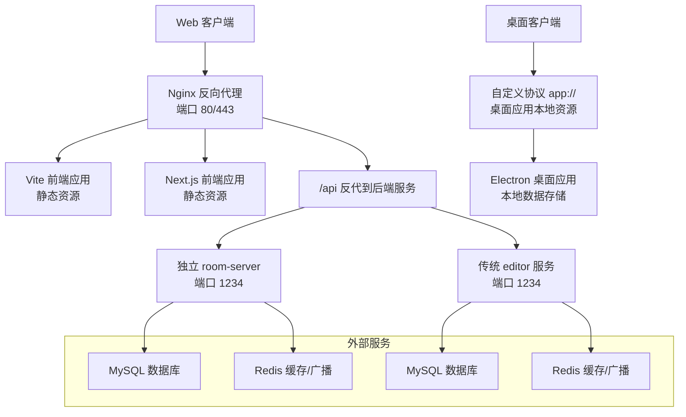
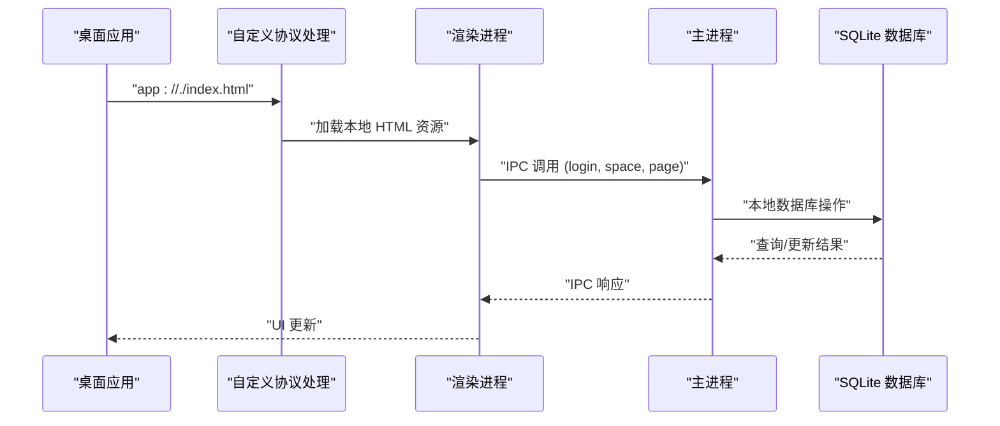
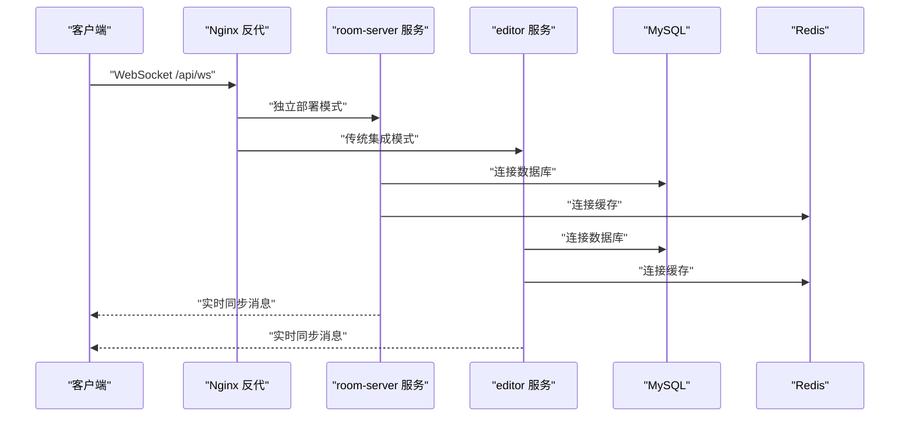
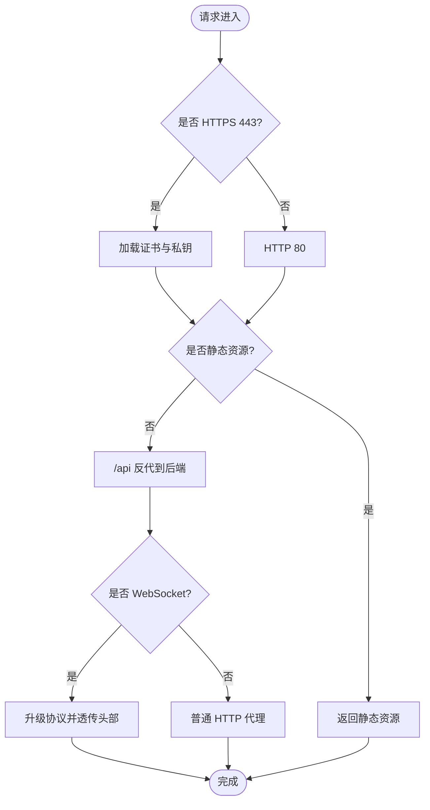
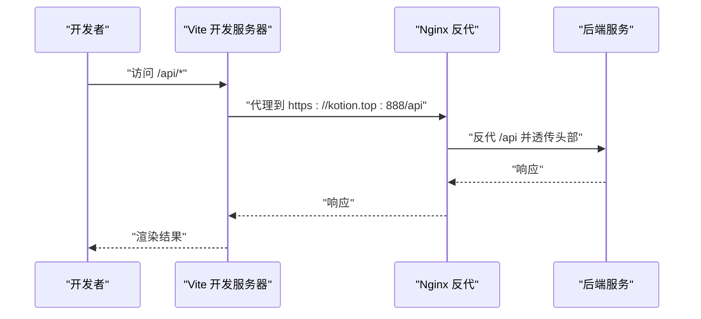
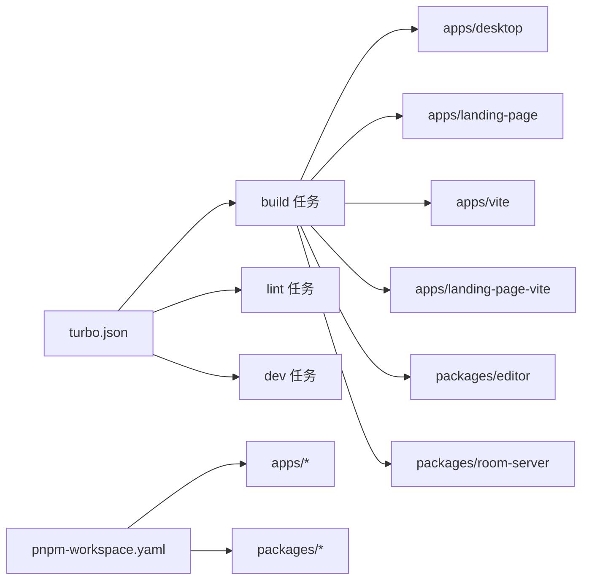

# 部署配置

<cite>
**本文档引用的文件**
- [package.json](file://package.json)
- [turbo.json](file://turbo.json)
- [pnpm-workspace.yaml](file://pnpm-workspace.yaml)
- [apps/desktop/package.json](file://apps/desktop/package.json)
- [apps/desktop/electron-vite.config.ts](file://apps/desktop/electron-vite.config.ts)
- [apps/desktop/electron.vite.config.ts](file://apps/desktop/electron.vite.config.ts)
- [apps/desktop/src/main/index.ts](file://apps/desktop/src/main/index.ts)
- [apps/desktop/src/preload/index.ts](file://apps/desktop/src/preload/index.ts)
- [apps/desktop/src/renderer/index.html](file://apps/desktop/src/renderer/index.html)
- [apps/desktop/tsconfig.json](file://apps/desktop/tsconfig.json)
- [apps/desktop/tsconfig.node.json](file://apps/desktop/tsconfig.node.json)
- [apps/desktop/tsconfig.web.json](file://apps/desktop/tsconfig.web.json)
- [apps/desktop/postcss.config.cjs](file://apps/desktop/postcss.config.cjs)
- [apps/desktop/tailwind.config.js](file://apps/desktop/tailwind.config.js)
- [apps/desktop/README.md](file://apps/desktop/README.md)
- [apps/landing-page/Dockerfile](file://apps/landing-page/Dockerfile)
- [apps/landing-page/.dockerignore](file://apps/landing-page/.dockerignore)
- [apps/landing-page/next.config.mjs](file://apps/landing-page/next.config.mjs)
- [apps/landing-page/README.md](file://apps/landing-page/README.md)
- [apps/landing-page-vite/Dockerfile](file://apps/landing-page-vite/Dockerfile)
- [apps/landing-page-vite/nginx/nginx.conf](file://apps/landing-page-vite/nginx/nginx.conf)
- [apps/vite/nginx/nginx.conf](file://apps/vite/nginx/nginx.conf)
- [apps/vite/vite.config.ts](file://apps/vite/vite.config.ts)
- [apps/landing-page-vite/vite.config.ts](file://apps/landing-page-vite/vite.config.ts)
- [packages/editor/src/server/server.mjs](file://packages/editor/src/server/server.mjs)
- [packages/editor/src/server/plugin/mysql/MysqlPlugin.mjs](file://packages/editor/src/server/plugin/mysql/MysqlPlugin.mjs)
- [packages/room-server/src/server.mjs](file://packages/room-server/src/server.mjs)
- [packages/room-server/src/plugin/mysql/MysqlPlugin.mjs](file://packages/room-server/src/plugin/mysql/MysqlPlugin.mjs)
- [packages/room-server/package.json](file://packages/room-server/package.json)
- [packages/room-server/Dockerfile](file://packages/room-server/Dockerfile)
- [packages/room-server/nginx/nginx.conf](file://packages/room-server/nginx/nginx.conf)
- [.env.example](file://.env.example)
- [apps/vite/.env.production](file://apps/vite/.env.production)
- [apps/vite/.env.development](file://apps/vite/.env.development)
- [packages/core/src/hooks/use-instant-message.ts](file://packages/core/src/hooks/use-instant-message.ts)
</cite>

## 更新摘要
**所做更改**
- 新增独立的 Electron 桌面应用部署配置说明
- 更新应用架构图，包含 Electron 桌面应用与 Web 应用的对比
- 新增 Electron 应用的构建配置、自定义协议处理和打包流程
- 更新部署场景，增加桌面应用部署方案
- 新增 Electron 应用的环境变量配置和存储配置
- 更新故障排除指南，包含桌面应用特有的问题排查
- 完善多应用部署架构，支持桌面应用、Web 应用和独立服务器的协同部署

## 目录
1. [简介](#简介)
2. [项目结构](#项目结构)
3. [核心组件](#核心组件)
4. [架构总览](#架构总览)
5. [详细组件分析](#详细组件分析)
6. [依赖关系分析](#依赖关系分析)
7. [性能考虑](#性能考虑)
8. [故障排除指南](#故障排除指南)
9. [结论](#结论)
10. [附录](#附录)

## 简介
本文件面向知识库管理系统的生产部署与运维，覆盖多种部署形态，包括传统的 Web 应用部署、新增的 Electron 桌面应用部署，以及独立的协作编辑服务部署。内容涵盖容器化、反向代理、环境变量、多场景部署（云服务器、容器集群、本地开发）、CI/CD 流程、性能优化（缓存、静态资源、数据库连接池）、安全加固（HTTPS、访问控制、数据加密）以及监控与故障排除建议。基于仓库中现有的配置文件与脚本进行归纳总结，并提供可操作的落地步骤。

**更新** 新增独立的 Electron 桌面应用部署配置，提供桌面应用特有的构建配置、自定义协议处理和打包流程。更新应用架构图，展示桌面应用与 Web 应用的协同部署模式。

## 项目结构
该仓库采用 monorepo 结构，使用 pnpm workspace 管理多包；应用层包含基于 Electron 的桌面应用、基于 Next.js 的落地页应用与基于 Vite 的前端应用，服务端包含协作编辑服务与 MySQL 扩展。现在新增独立的桌面应用包，提供专门的桌面应用部署选项。Turbo 负责任务编排与缓存。

```mermaid
graph TB
A["根目录<br/>package.json"] --> B["apps/desktop<br/>Electron 桌面应用"]
A --> C["apps/landing-page<br/>Next.js 应用"]
A --> D["apps/landing-page-vite<br/>Vite 前端应用"]
A --> E["apps/vite<br/>Vite 前端应用"]
A --> F["packages/editor<br/>协作编辑服务与扩展"]
A --> G["packages/room-server<br/>独立房间服务器"]
A --> H["turbo.json<br/>任务编排"]
A --> I["pnpm-workspace.yaml<br/>工作区配置"]
subgraph "桌面应用层"
B
end
subgraph "Web 应用层"
C
D
E
end
subgraph "服务与扩展"
F
G
end
subgraph "工具链"
H
I
end
```

**图表来源**
- [package.json](file://package.json#L1-L103)
- [turbo.json](file://turbo.json#L1-L27)
- [pnpm-workspace.yaml](file://pnpm-workspace.yaml#L1-L4)
- [apps/desktop/package.json](file://apps/desktop/package.json#L1-L98)
- [packages/room-server/package.json](file://packages/room-server/package.json#L1-L32)

**章节来源**
- [package.json](file://package.json#L1-L103)
- [turbo.json](file://turbo.json#L1-L27)
- [pnpm-workspace.yaml](file://pnpm-workspace.yaml#L1-L4)
- [apps/desktop/package.json](file://apps/desktop/package.json#L1-L98)
- [packages/room-server/package.json](file://packages/room-server/package.json#L1-L32)

## 核心组件
- **Electron 桌面应用**：基于 Electron 的跨平台桌面应用，支持自定义协议处理、IPC 通信和本地数据存储，提供离线优先的用户体验。
- 协作编辑服务：基于 Hocuspocus 的服务端，支持 MySQL 与 Redis 扩展，通过环境变量配置数据库与缓存。
- **独立 room-server**：全新的独立部署包，提供专门的协作编辑服务，支持 SQLite、Redis 和 MySQL 扩展，端口默认 1234。
- Nginx 反向代理：统一暴露 80/443 端口，转发 /api 到后端服务，支持 WebSocket 升级与静态资源。
- 前端应用：
  - Vite 应用：本地开发时通过代理将 /api 请求转发至 Nginx 暴露的服务。
  - Next.js 应用：生产构建输出独立可运行包，配合 Dockerfile 运行。
- 工具链：Turbo 统一构建、缓存与任务依赖；pnpm workspace 管理多包。

**更新** 新增 Electron 桌面应用的核心组件说明，包括自定义协议处理、IPC 通信和本地数据存储功能。更新协作编辑服务和独立 room-server 的部署选项。

**章节来源**
- [apps/desktop/src/main/index.ts](file://apps/desktop/src/main/index.ts#L1-L95)
- [apps/desktop/src/preload/index.ts](file://apps/desktop/src/preload/index.ts#L1-L24)
- [apps/desktop/package.json](file://apps/desktop/package.json#L1-L98)
- [packages/editor/src/server/server.mjs](file://packages/editor/src/server/server.mjs#L1-L26)
- [packages/room-server/src/server.mjs](file://packages/room-server/src/server.mjs#L1-L26)
- [apps/vite/nginx/nginx.conf](file://apps/vite/nginx/nginx.conf#L1-L113)
- [apps/vite/vite.config.ts](file://apps/vite/vite.config.ts#L1-L21)
- [apps/landing-page-vite/vite.config.ts](file://apps/landing-page-vite/vite.config.ts#L1-L22)
- [apps/landing-page/Dockerfile](file://apps/landing-page/Dockerfile#L1-L61)
- [turbo.json](file://turbo.json#L1-L27)

## 架构总览
系统现在支持三种部署形态：传统的 Web 应用部署、Electron 桌面应用部署和独立的协作编辑服务部署。桌面应用通过自定义协议 app:// 提供本地资源访问，Web 应用通过 Nginx 反向代理提供在线服务。Nginx 对外提供 HTTPS 与 HTTP 服务，负责静态资源与 /api 反代；前端应用通过 /api 访问协作编辑服务；协作编辑服务通过 MySQL 与 Redis 扩展持久化与共享状态。

```mermaid
graph TB
ClientDesktop["桌面客户端"] --> DesktopProtocol["自定义协议 app://<br/>桌面应用本地资源"]
ClientWeb["Web 客户端"] --> Nginx["Nginx 反向代理<br/>端口 80/443"]
Nginx --> FE_Vite["Vite 前端应用<br/>静态资源"]
Nginx --> FE_Next["Next.js 前端应用<br/>静态资源"]
Nginx --> API["/api 反代到后端服务"]
API --> RoomServer["独立 room-server<br/>端口 1234"]
API --> EditorServer["传统 editor 服务<br/>端口 1234"]
DesktopProtocol --> DesktopApp["Electron 桌面应用<br/>本地数据存储"]
RoomServer --> MySQL["MySQL 数据库"]
RoomServer --> Redis["Redis 缓存/广播"]
EditorServer --> MySQL2["MySQL 数据库"]
EditorServer --> Redis2["Redis 缓存/广播"]
subgraph "外部服务"
MySQL
Redis
MySQL2
Redis2
end
```

**图表来源**
- [apps/desktop/src/main/index.ts](file://apps/desktop/src/main/index.ts#L55-L66)
- [apps/vite/nginx/nginx.conf](file://apps/vite/nginx/nginx.conf#L1-L113)
- [packages/editor/src/server/server.mjs](file://packages/editor/src/server/server.mjs#L1-L26)
- [packages/room-server/src/server.mjs](file://packages/room-server/src/server.mjs#L1-L26)
- [packages/editor/src/server/plugin/mysql/MysqlPlugin.mjs](file://packages/editor/src/server/plugin/mysql/MysqlPlugin.mjs#L43-L88)
- [packages/room-server/src/plugin/mysql/MysqlPlugin.mjs](file://packages/room-server/src/plugin/mysql/MysqlPlugin.mjs#L1-L124)

## 详细组件分析

### Electron 桌面应用
- **功能特性**：
  - 自定义协议处理：注册 app:// 协议，支持 SPA 路由和本地资源访问
  - IPC 通信：通过 contextBridge 暴露安全的 API 给渲染进程
  - 本地数据存储：使用 better-sqlite3 和 SQLite 数据库
  - 离线优先：匿名用户无需登录即可使用，数据保存在本地
  - 三层认证：支持匿名用户、注册用户和会员三种身份
- **构建配置**：
  - 使用 electron-vite 进行开发和构建，支持主进程、预加载脚本和渲染进程的独立配置
  - TypeScript 配置分为 node 环境和 web 环境两套配置
  - Tailwind CSS 和 PostCSS 配置继承自 UI 包
- **打包流程**：
  - 支持多平台打包：Windows (NSIS/ZIP)、macOS (DMG/ZIP)、Linux (AppImage/DEB)
  - 使用 electron-builder 进行最终打包，配置应用元数据和安装程序选项

**更新** 新增 Electron 桌面应用的详细配置说明，包括自定义协议处理、IPC 通信和打包流程。

```mermaid
sequenceDiagram
participant Desktop as "桌面应用"
participant Protocol as "自定义协议处理"
participant Renderer as "渲染进程"
participant Main as "主进程"
participant DB as "SQLite 数据库"
Desktop->>Protocol : "app : //./index.html"
Protocol->>Renderer : "加载本地 HTML 资源"
Renderer->>Main : "IPC 调用 (login, space, page)"
Main->>DB : "本地数据库操作"
DB-->>Main : "查询/更新结果"
Main-->>Renderer : "IPC 响应"
Renderer-->>Desktop : "UI 更新"
```

**图表来源**
- [apps/desktop/src/main/index.ts](file://apps/desktop/src/main/index.ts#L55-L66)
- [apps/desktop/src/preload/index.ts](file://apps/desktop/src/preload/index.ts#L9-L23)
- [apps/desktop/src/renderer/index.html](file://apps/desktop/src/renderer/index.html#L1-L22)

**章节来源**
- [apps/desktop/src/main/index.ts](file://apps/desktop/src/main/index.ts#L1-L95)
- [apps/desktop/src/preload/index.ts](file://apps/desktop/src/preload/index.ts#L1-L24)
- [apps/desktop/src/renderer/index.html](file://apps/desktop/src/renderer/index.html#L1-L22)
- [apps/desktop/electron-vite.config.ts](file://apps/desktop/electron-vite.config.ts#L1-L48)
- [apps/desktop/electron.vite.config.ts](file://apps/desktop/electron.vite.config.ts#L1-L30)
- [apps/desktop/tsconfig.node.json](file://apps/desktop/tsconfig.node.json#L1-L20)
- [apps/desktop/tsconfig.web.json](file://apps/desktop/tsconfig.web.json#L1-L27)
- [apps/desktop/package.json](file://apps/desktop/package.json#L59-L97)

### 协作编辑服务（Hocuspocus）
- 功能：提供实时协作编辑能力，支持扩展接入数据库与缓存。
- 配置要点：
  - 数据库：通过 MySQL 扩展连接，支持主机、端口、用户名、密码、数据库名等环境变量。
  - 缓存：通过 Redis 扩展连接，支持主机、端口等环境变量。
  - 端口：可通过环境变量设置监听端口。
  - **SSL配置**：支持通过环境变量启用SSL，配置私钥和证书路径。
- 连接池与稳定性：MySQL 扩展在连接断开时自动重连并定期 ping 保持健康。

**更新** 新增独立 room-server 包，提供专门的协作编辑服务部署选项。更新SSL配置支持，包括环境变量和证书路径配置。

```mermaid
sequenceDiagram
participant Client as "客户端"
participant Nginx as "Nginx 反代"
participant RoomServer as "room-server 服务"
participant EditorServer as "editor 服务"
participant DB as "MySQL"
participant Cache as "Redis"
Client->>Nginx : "WebSocket /api/ws"
Nginx->>RoomServer : "独立部署模式"
Nginx->>EditorServer : "传统集成模式"
RoomServer->>DB : "连接数据库"
RoomServer->>Cache : "连接缓存"
EditorServer->>DB : "连接数据库"
EditorServer->>Cache : "连接缓存"
RoomServer-->>Client : "实时同步消息"
EditorServer-->>Client : "实时同步消息"
```

**图表来源**
- [packages/editor/src/server/server.mjs](file://packages/editor/src/server/server.mjs#L1-L26)
- [packages/room-server/src/server.mjs](file://packages/room-server/src/server.mjs#L1-L26)
- [packages/editor/src/server/plugin/mysql/MysqlPlugin.mjs](file://packages/editor/src/server/plugin/mysql/MysqlPlugin.mjs#L43-L88)
- [packages/room-server/src/plugin/mysql/MysqlPlugin.mjs](file://packages/room-server/src/plugin/mysql/MysqlPlugin.mjs#L1-L124)
- [apps/vite/nginx/nginx.conf](file://apps/vite/nginx/nginx.conf#L45-L58)

**章节来源**
- [packages/editor/src/server/server.mjs](file://packages/editor/src/server/server.mjs#L1-L26)
- [packages/room-server/src/server.mjs](file://packages/room-server/src/server.mjs#L1-L26)
- [packages/editor/src/server/plugin/mysql/MysqlPlugin.mjs](file://packages/editor/src/server/plugin/mysql/MysqlPlugin.mjs#L43-L88)
- [packages/room-server/src/plugin/mysql/MysqlPlugin.mjs](file://packages/room-server/src/plugin/mysql/MysqlPlugin.mjs#L1-L124)

### Nginx 反向代理
- 静态资源：映射前端构建产物目录，支持 index 回退与单页路由。
- API 反代：将 /api 前缀转发至后端服务地址，保留 Host、X-Real-IP、X-Forwarded-For 头，启用 WebSocket 升级。
- 安全与性能：开启 gzip、限制上传大小、设置 keepalive 超时、错误页面映射。
- HTTPS：加载证书与私钥，监听 443 端口；HTTP 监听 80 端口并指向同一站点。

**更新** 完善SSL证书配置，包括kotion.top域名的证书文件路径和端口配置。

```mermaid
flowchart TD
Start(["请求进入"]) --> CheckProto{"是否 HTTPS 443?"}
CheckProto --> |是| SSL["加载证书与私钥"]
CheckProto --> |否| HTTP80["HTTP 80"]
SSL --> StaticCheck{"是否静态资源?"}
HTTP80 --> StaticCheck
StaticCheck --> |是| ServeStatic["返回静态资源"]
StaticCheck --> |否| APIProxy["/api 反代到后端"]
APIProxy --> WSUpgrade{"是否 WebSocket?"}
WSUpgrade --> |是| Upgrade["升级协议并透传头部"]
WSUpgrade --> |否| ProxyPass["普通 HTTP 代理"]
Upgrade --> End(["完成"])
ProxyPass --> End
ServeStatic --> End
```

**图表来源**
- [apps/vite/nginx/nginx.conf](file://apps/vite/nginx/nginx.conf#L1-L113)

**章节来源**
- [apps/vite/nginx/nginx.conf](file://apps/vite/nginx/nginx.conf#L1-L113)
- [apps/landing-page-vite/nginx/nginx.conf](file://apps/landing-page-vite/nginx/nginx.conf#L1-L113)

### 前端应用（Vite 与 Next.js）
- Vite 应用：
  - 开发代理：将 /api 请求代理到指定目标，支持路径重写与安全校验。
  - 本地开发端口：可在配置中查看。
- Next.js 应用：
  - 生产构建：输出独立可运行包，便于容器化部署。
  - Dockerfile：复制源码并以 npm start 启动（当前未启用分层构建与只读用户）。

**更新** 更新WebSocket服务器URL从localhost到kotion.top，端口从3000变更为1234。

```mermaid
sequenceDiagram
participant Dev as "开发者"
participant ViteDev as "Vite 开发服务器"
participant Nginx as "Nginx 反代"
participant BE as "后端服务"
Dev->>ViteDev : "访问 /api/*"
ViteDev->>Nginx : "代理到 https : //kotion.top : 888/api"
Nginx->>BE : "反代 /api 并透传头部"
BE-->>Nginx : "响应"
Nginx-->>ViteDev : "响应"
ViteDev-->>Dev : "渲染结果"
```

**图表来源**
- [apps/vite/vite.config.ts](file://apps/vite/vite.config.ts#L1-L21)
- [apps/landing-page-vite/vite.config.ts](file://apps/landing-page-vite/vite.config.ts#L1-L22)
- [apps/vite/nginx/nginx.conf](file://apps/vite/nginx/nginx.conf#L45-L58)

**章节来源**
- [apps/vite/vite.config.ts](file://apps/vite/vite.config.ts#L1-L21)
- [apps/landing-page-vite/vite.config.ts](file://apps/landing-page-vite/vite.config.ts#L1-L22)
- [apps/landing-page/next.config.mjs](file://apps/landing-page/next.config.mjs#L1-L9)
- [apps/landing-page/Dockerfile](file://apps/landing-page/Dockerfile#L1-L61)

### 容器化与镜像
- Next.js 应用：
  - 当前 Dockerfile 复制全部源码并执行 npm start，未启用分层构建与只读用户。
  - 建议：在构建阶段生成 dist 并在运行阶段仅复制必要文件，启用只读文件系统与非 root 用户。
- Vite 前端应用：
  - 使用 Nginx 镜像，复制构建产物与 Nginx 配置，暴露 80 端口。
  - 建议：固定镜像版本、最小化权限、启用健康检查。
- **独立 room-server**：
  - 使用 Node.js 22 Alpine 基础镜像，安装生产依赖后复制源码。
  - 默认暴露端口 1234，支持环境变量配置。
  - CMD 启动 node ./src/server.mjs。
  - **SSL支持**：内置SSL配置，支持通过环境变量启用并加载证书文件。
- **Electron 桌面应用**：
  - 桌面应用不使用容器化部署，通过 electron-builder 直接打包为原生应用。
  - 支持多平台打包：Windows、macOS、Linux。

**更新** 新增 Electron 桌面应用的部署说明，包括打包流程和多平台支持。

**章节来源**
- [apps/landing-page/Dockerfile](file://apps/landing-page/Dockerfile#L1-L61)
- [apps/landing-page/.dockerignore](file://apps/landing-page/.dockerignore#L1-L34)
- [apps/landing-page-vite/Dockerfile](file://apps/landing-page-vite/Dockerfile#L1-L12)
- [packages/room-server/Dockerfile](file://packages/room-server/Dockerfile#L1-L29)
- [apps/desktop/package.json](file://apps/desktop/package.json#L59-L97)

## 依赖关系分析
- 任务编排：Turbo 定义了 build、lint、dev 等任务及其依赖与缓存策略。
- 工作区：pnpm workspace 将 apps 与 packages 纳入统一管理。
- 构建顺序：各包的 build 依赖上游包的 build 输出。
- **独立部署**：room-server 作为独立包提供专门的协作编辑服务，可单独部署和扩展。
- **多应用架构**：桌面应用、Web 应用和协作编辑服务可以独立部署，形成完整的知识库管理解决方案。

**更新** 新增 Electron 桌面应用的依赖关系分析，展示多应用架构的部署灵活性。

```mermaid
graph LR
Turbo["turbo.json"] --> Build["build 任务"]
Turbo --> Lint["lint 任务"]
Turbo --> Dev["dev 任务"]
Workspace["pnpm-workspace.yaml"] --> Apps["apps/*"]
Workspace --> Packages["packages/*"]
Build --> Desktop["apps/desktop"]
Build --> Next["apps/landing-page"]
Build --> ViteFE["apps/vite"]
Build --> LandingVite["apps/landing-page-vite"]
Build --> Editor["packages/editor"]
Build --> RoomServer["packages/room-server"]
```

**图表来源**
- [turbo.json](file://turbo.json#L1-L27)
- [pnpm-workspace.yaml](file://pnpm-workspace.yaml#L1-L4)
- [apps/desktop/package.json](file://apps/desktop/package.json#L1-L98)
- [packages/room-server/package.json](file://packages/room-server/package.json#L1-L32)

**章节来源**
- [turbo.json](file://turbo.json#L1-L27)
- [pnpm-workspace.yaml](file://pnpm-workspace.yaml#L1-L4)
- [apps/desktop/package.json](file://apps/desktop/package.json#L1-L98)
- [packages/room-server/package.json](file://packages/room-server/package.json#L1-L32)

## 性能考虑
- 静态资源优化
  - Nginx 已启用 gzip，建议结合浏览器缓存策略（ETag/Cache-Control）与 CDN 加速。
  - 前端应用可启用产物哈希命名与长期缓存。
- 反向代理性能
  - 合理设置 keepalive_timeout 与超时参数，避免长连接过多导致资源占用。
  - 限制上传大小与并发连接数，防止突发流量压垮后端。
- 数据库连接池
  - 当前 MySQL 扩展未显式配置连接池参数，建议在生产环境增加连接池大小、超时与重试策略，避免高并发下的连接耗尽。
- 缓存策略
  - Redis 作为缓存/广播介质，建议开启持久化与主从复制，提升可用性与读写分离能力。
- 构建与打包
  - 使用 Turbo 并行构建，减少重复计算；对大体积依赖进行拆分与懒加载。
- **独立 room-server 性能**
  - 独立部署模式下，room-server 可以独立扩展和优化，支持专用的数据库连接池配置。
  - 建议为 room-server 配置专用的负载均衡和监控。
- **Electron 桌面应用性能**
  - 使用 better-sqlite3 提供高性能的本地数据库操作
  - 合理配置内存使用，避免大数据量时的内存泄漏
  - 优化插件加载机制，支持按需加载和缓存

**更新** 新增 Electron 桌面应用的性能优化建议，包括本地数据库优化和内存管理。

**章节来源**
- [apps/vite/nginx/nginx.conf](file://apps/vite/nginx/nginx.conf#L1-L113)
- [packages/editor/src/server/plugin/mysql/MysqlPlugin.mjs](file://packages/editor/src/server/plugin/mysql/MysqlPlugin.mjs#L43-L88)
- [packages/room-server/src/plugin/mysql/MysqlPlugin.mjs](file://packages/room-server/src/plugin/mysql/MysqlPlugin.mjs#L1-L124)
- [apps/desktop/src/main/index.ts](file://apps/desktop/src/main/index.ts#L1-L95)

## 故障排除指南
- 协作编辑服务无法连接数据库
  - 检查数据库主机、端口、用户名、密码与数据库名是否正确。
  - 观察日志中 ping 错误与重连行为，确认网络连通性。
  - **独立 room-server 模式**：检查 room-server 的数据库连接配置，确认端口 1234 是否可达。
- WebSocket 无法升级
  - 确认 Nginx 中已启用代理头透传与 HTTP/1.1 代理版本。
  - 检查后端服务端口与防火墙策略。
  - **部署模式差异**：确认使用的是独立 room-server 还是传统 editor 服务的端口配置。
  - **URL变更**：确认WebSocket服务器URL已从localhost:3000更新为kotion.top:1234。
- 前端代理失败
  - 确认 Vite 开发代理的目标地址与路径重写规则。
  - 若使用 HTTPS，确保 secure 选项与证书校验符合预期。
- Docker 镜像启动异常
  - Next.js 应用建议改为构建产物运行，避免复制源码带来的体积与安全风险。
  - Vite 应用建议固定 Nginx 版本并检查配置文件挂载权限。
  - **独立 room-server**：检查容器端口映射（1234:1234），确认环境变量配置正确。
  - **SSL证书**：确认SSL证书文件已正确挂载到容器中。
- **Electron 桌面应用特有问题**
  - 自定义协议无法加载：检查 app:// 协议注册和文件路径映射
  - IPC 通信失败：确认 contextBridge 配置和 API 暴露
  - 本地数据库连接问题：检查 SQLite 文件权限和路径
  - 打包失败：确认 electron-builder 配置和平台依赖
- **独立 room-server 特有问题**
  - 服务无法启动：检查 NODE_ENV 和 PORT 环境变量配置。
  - 数据库连接失败：确认 MySQL 服务可达，检查连接参数。
  - Redis 连接问题：验证 Redis 服务状态和认证配置。
  - **SSL配置问题**：检查SSL_ENABLED环境变量和证书路径配置。

**更新** 新增 Electron 桌面应用的故障排除指南，包括自定义协议、IPC 通信和本地数据库相关的故障排除。

**章节来源**
- [apps/desktop/src/main/index.ts](file://apps/desktop/src/main/index.ts#L6-L17)
- [apps/desktop/src/preload/index.ts](file://apps/desktop/src/preload/index.ts#L9-L23)
- [apps/desktop/package.json](file://apps/desktop/package.json#L59-L97)
- [packages/editor/src/server/server.mjs](file://packages/editor/src/server/server.mjs#L1-L26)
- [packages/room-server/src/server.mjs](file://packages/room-server/src/server.mjs#L1-L26)
- [packages/editor/src/server/plugin/mysql/MysqlPlugin.mjs](file://packages/editor/src/server/plugin/mysql/MysqlPlugin.mjs#L43-L88)
- [packages/room-server/src/plugin/mysql/MysqlPlugin.mjs](file://packages/room-server/src/plugin/mysql/MysqlPlugin.mjs#L1-L124)
- [apps/vite/nginx/nginx.conf](file://apps/vite/nginx/nginx.conf#L45-L58)
- [apps/vite/vite.config.ts](file://apps/vite/vite.config.ts#L1-L21)
- [apps/landing-page-vite/Dockerfile](file://apps/landing-page-vite/Dockerfile#L1-L12)
- [apps/landing-page/Dockerfile](file://apps/landing-page/Dockerfile#L1-L61)
- [packages/room-server/Dockerfile](file://packages/room-server/Dockerfile#L1-L29)

## 结论
本仓库现在提供了完整的多形态部署解决方案：传统的 Web 应用部署、新增的 Electron 桌面应用部署和独立的协作编辑服务部署。桌面应用通过自定义协议提供本地资源访问，Web 应用通过 Nginx 反向代理提供在线服务，协作编辑服务支持集中式部署。建议在生产环境中完善容器化最佳实践、数据库连接池配置、缓存与安全策略，并建立完善的 CI/CD 流水线与监控告警体系。

**更新** 现在支持三种部署形态的协同部署，桌面应用提供离线优先的本地体验，Web 应用提供在线协作功能，独立的协作编辑服务提供专业的实时编辑能力。

## 附录

### 环境变量清单（服务端）

#### 传统协作编辑服务环境变量
- 数据库相关
  - DB_HOST：数据库主机
  - DB_PORT：数据库端口
  - DB_USERNAME：数据库用户名
  - DB_PASSWORD：数据库密码
  - DB_DATABASE：数据库名
- 缓存相关
  - REDIS_HOST：Redis 主机
  - REDIS_PORT：Redis 端口
- 服务端口
  - PORT：协作编辑服务监听端口（默认 1234）

#### 独立 room-server 环境变量
- 服务配置
  - PORT：room-server 监听端口（默认 1234）
  - NODE_ENV：运行环境（development/production）
  - SSL_ENABLED：是否启用SSL（默认 false）
- 数据库配置
  - DB_HOST：MySQL 主机
  - DB_PORT：MySQL 端口
  - DB_USERNAME：MySQL 用户名
  - DB_PASSWORD：MySQL 密码
  - DB_DATABASE：MySQL 数据库名
- 缓存配置
  - REDIS_HOST：Redis 主机
  - REDIS_PORT：Redis 端口
- **SSL配置**
  - SSL_KEY_PATH：SSL私钥路径（默认 ./certs/server.key）
  - SSL_CERT_PATH：SSL证书路径（默认 ./certs/server.crt）

#### Electron 桌面应用环境变量
- 应用配置
  - NODE_ENV：运行环境（development/production）
  - APP_DATA_PATH：应用数据目录（默认系统用户数据目录）
- 数据库配置
  - SQLITE_DB_PATH：SQLite 数据库文件路径
- 插件配置
  - PLUGIN_CACHE_PATH：插件缓存目录
  - PLUGIN_DOWNLOAD_TIMEOUT：插件下载超时时间

**更新** 新增 Electron 桌面应用的环境变量配置说明。

**章节来源**
- [packages/editor/src/server/server.mjs](file://packages/editor/src/server/server.mjs#L1-L26)
- [packages/room-server/src/server.mjs](file://packages/room-server/src/server.mjs#L1-L26)
- [packages/room-server/src/plugin/mysql/MysqlPlugin.mjs](file://packages/room-server/src/plugin/mysql/MysqlPlugin.mjs#L1-L124)
- [apps/desktop/src/main/index.ts](file://apps/desktop/src/main/index.ts#L1-L95)

### 部署场景与配置建议

#### 云服务器部署
- 前端：使用 Nginx 容器承载静态资源与反向代理，挂载证书与配置文件。
- 后端：以独立容器运行协作编辑服务，连接云数据库与云缓存。
- **独立 room-server 部署**：可选择独立部署模式，将 room-server 作为单独的服务实例运行。
- **桌面应用部署**：桌面应用通过 electron-builder 打包为原生应用，提供离线使用体验。
- 安全：仅开放 80/443，内网访问数据库与缓存；启用 WAF 与 DDOS 防护。

#### 容器集群部署（Kubernetes）
- 前端：Deployment + Ingress，配置 TLS 证书与健康检查。
- 后端：Deployment + Service，使用 ConfigMap/Secret 注入环境变量。
- **独立 room-server 集群**：可为 room-server 创建专用的 Deployment 和 Service，支持水平扩展。
- **桌面应用部署**：桌面应用不适合容器化部署，建议提供原生安装包。
- 存储：数据库与缓存使用托管服务或 StatefulSet。

#### 本地开发环境
- 使用 Vite 开发代理将 /api 指向本地或远程 Nginx。
- Next.js 应用可直接运行，或在本地容器中验证构建产物。
- **独立 room-server 开发**：可单独启动 room-server 进行开发调试，使用不同的端口避免冲突。
- **Electron 桌面应用开发**：使用 electron-vite dev 启动桌面应用，支持热重载和调试。

**更新** 新增 Electron 桌面应用的部署场景说明，包括原生应用打包和开发调试。

**章节来源**
- [apps/vite/nginx/nginx.conf](file://apps/vite/nginx/nginx.conf#L1-L113)
- [apps/vite/vite.config.ts](file://apps/vite/vite.config.ts#L1-L21)
- [apps/landing-page-vite/Dockerfile](file://apps/landing-page-vite/Dockerfile#L1-L12)
- [apps/landing-page/Dockerfile](file://apps/landing-page/Dockerfile#L1-L61)
- [packages/room-server/Dockerfile](file://packages/room-server/Dockerfile#L1-L29)
- [apps/desktop/package.json](file://apps/desktop/package.json#L8-L16)

### CI/CD 流程建议
- 构建阶段
  - 使用 Turbo 并行构建所有包，缓存依赖与中间产物。
  - 分别构建前端静态产物与协作编辑服务二进制/运行时包。
  - **独立 room-server 构建**：为 room-server 单独配置构建和测试流程。
  - **桌面应用构建**：使用 electron-builder 进行多平台打包，生成安装包。
- 测试阶段
  - 在构建后执行 lint 与单元测试（如适用），确保质量门禁。
  - **room-server 测试**：为独立的 room-server 包添加专门的测试用例。
  - **桌面应用测试**：添加 E2E 测试和跨平台兼容性测试。
- 部署阶段
  - 生成稳定镜像标签，推送至镜像仓库。
  - 在目标环境拉起新版本，滚动更新并进行健康检查。
  - **多服务部署**：支持同时部署传统的 editor 服务和独立的 room-server。
  - **桌面应用发布**：提供多平台安装包，支持自动更新机制。
- 发布与回滚
  - 记录镜像版本与发布记录，支持一键回滚。
  - **独立部署优势**：room-server 可以独立回滚，不影响其他服务。
  - **桌面应用更新**：支持增量更新和全量更新两种方式。

**更新** 新增 Electron 桌面应用的 CI/CD 流程建议，包括多平台打包和自动更新。

**章节来源**
- [package.json](file://package.json#L1-L103)
- [turbo.json](file://turbo.json#L1-L27)
- [packages/room-server/package.json](file://packages/room-server/package.json#L1-L32)
- [apps/desktop/package.json](file://apps/desktop/package.json#L12-L16)

### 安全配置指南
- HTTPS 设置
  - 在 Nginx 中加载证书与私钥，强制 HTTPS 访问。
  - 启用安全传输头（HSTS、HPKP 等，视合规要求而定）。
- 访问控制
  - 限制 /api 的来源 IP 或添加鉴权网关。
  - 对敏感接口启用 JWT 或会话校验。
- 数据加密
  - 数据库连接使用 TLS；Redis 连接启用加密通道。
  - 密钥与敏感信息通过密钥管理服务注入。
- **独立 room-server 安全**
  - 为 room-server 配置专用的安全策略和访问控制。
  - 建议使用专用的网络隔离和防火墙规则。
- **SSL证书管理**
  - 确保SSL证书文件正确挂载到容器中。
  - 定期更新SSL证书，避免过期导致服务中断。
- **Electron 桌面应用安全**
  - 启用 Node.js 集成保护，防止代码注入攻击
  - 配置 CSP（内容安全策略），限制外部资源加载
  - 使用安全的 IPC 通信，验证数据来源和格式
  - 本地数据加密存储，保护用户隐私

**更新** 新增 Electron 桌面应用的安全配置建议，包括 Node.js 集成保护和 IPC 通信安全。

**章节来源**
- [apps/vite/nginx/nginx.conf](file://apps/vite/nginx/nginx.conf#L1-L113)
- [packages/editor/src/server/server.mjs](file://packages/editor/src/server/server.mjs#L1-L26)
- [packages/room-server/src/server.mjs](file://packages/room-server/src/server.mjs#L1-L26)
- [apps/desktop/src/main/index.ts](file://apps/desktop/src/main/index.ts#L27-L32)

### 监控与日志
- Nginx：开启 access_log 与 error_log，采集指标（请求数、响应时间、错误率）。
- 应用：记录业务日志与错误堆栈，结合 APM 工具追踪慢调用。
- 基础设施：监控 CPU、内存、磁盘、网络与容器健康状态，设置阈值告警。
- **独立 room-server 监控**
  - 为 room-server 单独配置监控指标和告警规则。
  - 监控 WebSocket 连接数、消息处理延迟和数据库连接状态。
  - 建议使用专门的日志聚合和分析工具。
- **Electron 桌面应用监控**
  - 监控应用启动时间、内存使用和崩溃率
  - 追踪用户行为和功能使用情况
  - 监控插件加载和数据库性能
  - 收集错误报告和用户反馈

**更新** 新增 Electron 桌面应用的监控配置建议，包括应用性能和用户行为监控。

**章节来源**
- [packages/room-server/src/server.mjs](file://packages/room-server/src/server.mjs#L1-L26)
- [packages/room-server/src/plugin/mysql/MysqlPlugin.mjs](file://packages/room-server/src/plugin/mysql/MysqlPlugin.mjs#L1-L124)
- [apps/desktop/src/main/index.ts](file://apps/desktop/src/main/index.ts#L1-L95)

### 前端环境变量配置
- API 基础配置
  - VITE_API_BASE_URL：API 基础 URL（默认 https://kotion.top:888/api）
  - VITE_API_TIMEOUT：API 超时时间
- 协作 WebSocket 服务器
  - VITE_COLLABORATION_WS_URL：WebSocket 服务器地址（默认 ws://kotion.top:1234）
  - **独立 room-server 支持**：可配置指向独立的 room-server 实例
- 插件配置
  - VITE_PLUGIN_UPLOAD_ENABLED：插件上传开关
  - VITE_PLUGIN_UPLOAD_URL：插件上传地址
  - VITE_PLUGIN_PUBLISH_URL：插件发布地址

**更新** 新增前端环境变量配置说明，包含独立 room-server 的支持和kotion.top域名的配置。

**章节来源**
- [.env.example](file://.env.example#L1-L24)
- [apps/vite/.env.production](file://apps/vite/.env.production#L1-L23)
- [apps/vite/.env.development](file://apps/vite/.env.development#L1-L23)
- [packages/core/src/hooks/use-instant-message.ts](file://packages/core/src/hooks/use-instant-message.ts#L74-L81)

### WebSocket 服务器配置变更

**更新** 重要配置变更：WebSocket服务器URL已从localhost迁移到kotion.top

- **旧配置**（开发环境）：ws://localhost:3000
- **新配置**（生产环境）：ws://kotion.top:1234
- **变更影响**：
  - 所有前端应用中的WebSocket连接URL需要更新
  - Nginx反向代理配置需要相应调整
  - Docker容器网络配置需要确保端口可达
- **部署注意事项**：
  - 确保kotion.top域名解析到正确的服务器IP
  - 验证端口1234在防火墙中开放
  - 检查SSL证书配置（如启用SSL）

**章节来源**
- [packages/core/src/hooks/use-instant-message.ts](file://packages/core/src/hooks/use-instant-message.ts#L74-L81)
- [apps/vite/.env.production](file://apps/vite/.env.production#L9)
- [apps/vite/.env.development](file://apps/vite/.env.development#L9)
- [packages/room-server/Dockerfile](file://packages/room-server/Dockerfile#L23-L25)

### Electron 桌面应用构建配置

**更新** 新增 Electron 桌面应用的构建配置说明

- **构建工具**：使用 electron-vite 进行开发和构建
- **配置文件**：
  - electron-vite.config.ts：主进程、预加载脚本和渲染进程的构建配置
  - electron.vite.config.ts：开发环境的插件配置和优化设置
  - tsconfig.json：TypeScript 多配置文件管理
  - tsconfig.node.json：Node.js 环境的 TypeScript 配置
  - tsconfig.web.json：Web 环境的 TypeScript 配置
- **构建输出**：
  - 主进程：dist/main/index.js
  - 预加载脚本：dist/preload/index.js
  - 渲染进程：dist/renderer/（HTML/CSS/JS）
- **开发模式**：支持热重载和调试，使用 ELECTRON_RENDERER_URL 环境变量
- **生产模式**：使用自定义协议 app:// 加载本地资源

**章节来源**
- [apps/desktop/electron-vite.config.ts](file://apps/desktop/electron-vite.config.ts#L1-L48)
- [apps/desktop/electron.vite.config.ts](file://apps/desktop/electron.vite.config.ts#L1-L30)
- [apps/desktop/tsconfig.json](file://apps/desktop/tsconfig.json#L1-L11)
- [apps/desktop/tsconfig.node.json](file://apps/desktop/tsconfig.node.json#L1-L20)
- [apps/desktop/tsconfig.web.json](file://apps/desktop/tsconfig.web.json#L1-L27)
- [apps/desktop/src/main/index.ts](file://apps/desktop/src/main/index.ts#L45-L50)

### Electron 桌面应用打包配置

**更新** 新增 Electron 桌面应用的打包配置说明

- **打包工具**：使用 electron-builder 进行多平台打包
- **支持平台**：
  - Windows：NSIS 安装程序和 ZIP 压缩包
  - macOS：DMG 磁盘映像和 ZIP 压缩包
  - Linux：AppImage 和 DEB 包
- **应用元数据**：
  - appId：com.kn.desktop
  - productName：KN Desktop
  - 目录结构：buildResources、output
- **安装程序配置**：
  - Windows：支持自定义安装目录和一键安装
  - macOS：应用商店分类设置
  - Linux：软件包分类设置
- **构建脚本**：
  - pnpm package：打包所有平台
  - pnpm package:win/mac/linux：分别打包特定平台
  - 支持增量构建和缓存优化

**章节来源**
- [apps/desktop/package.json](file://apps/desktop/package.json#L59-L97)
- [apps/desktop/package.json](file://apps/desktop/package.json#L8-L16)