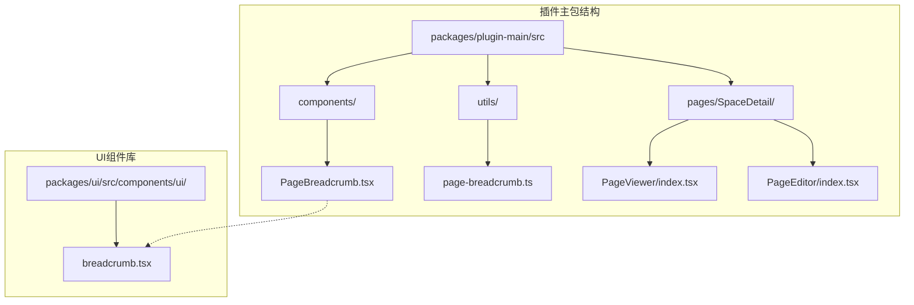
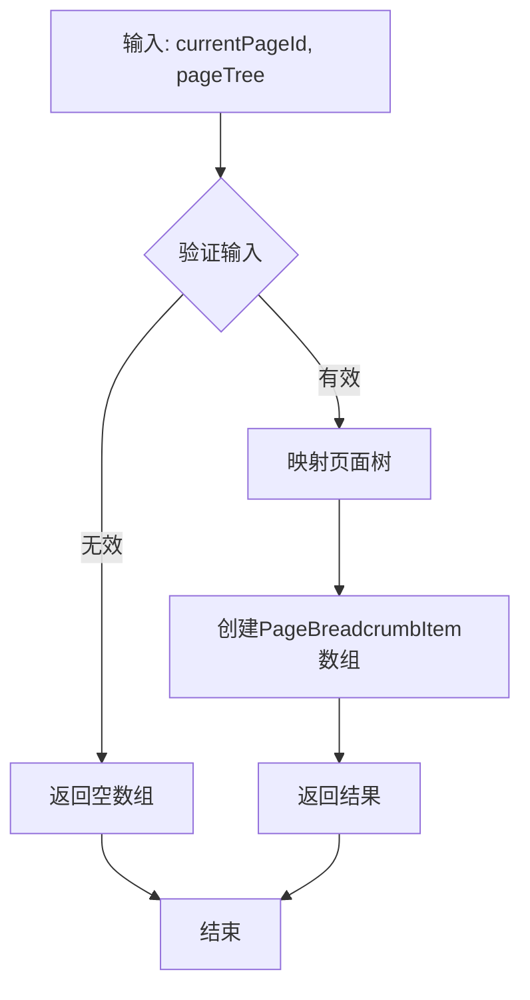
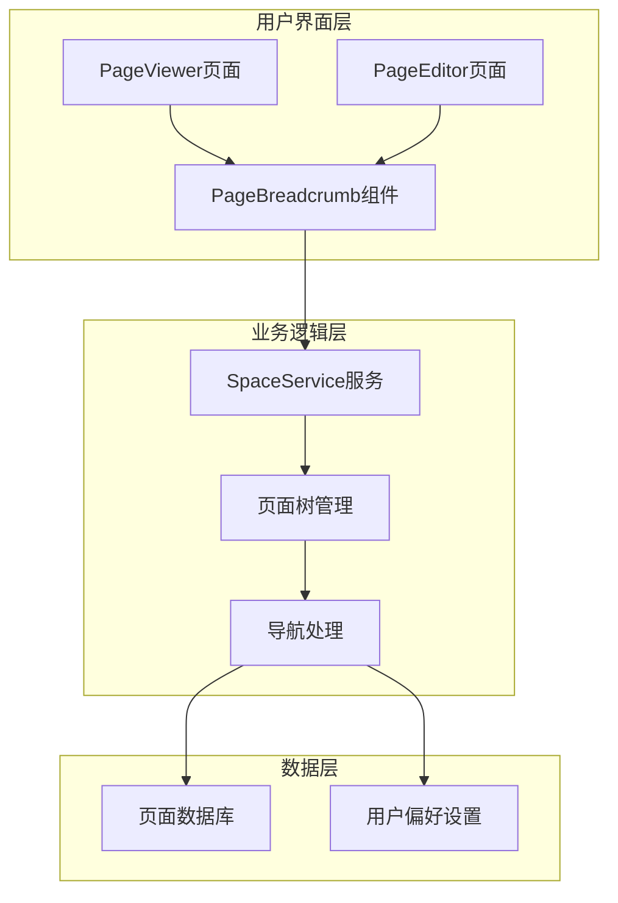
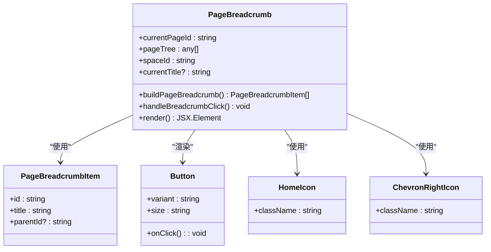
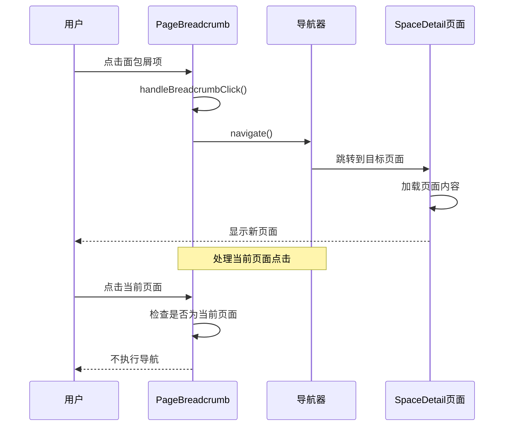
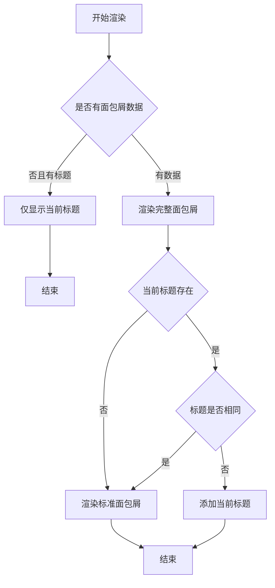
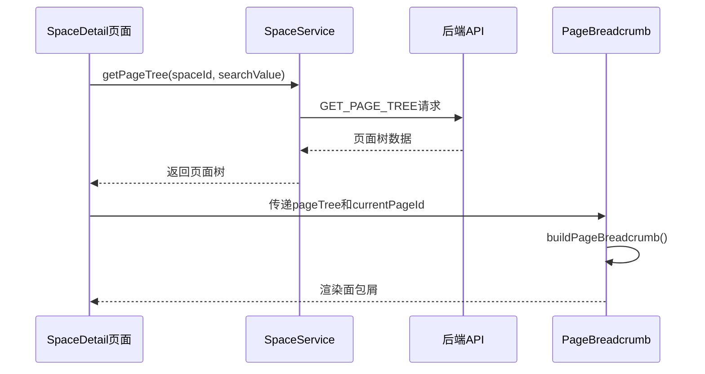

# 页面面包屑组件

<cite>
**本文档引用的文件**
- [PageBreadcrumb.tsx](file://packages/plugin-main/src/components/PageBreadcrumb.tsx)
- [page-breadcrumb.ts](file://packages/plugin-main/src/utils/page-breadcrumb.ts)
- [breadcrumb.tsx](file://packages/ui/src/components/ui/breadcrumb.tsx)
- [SpaceDetail/index.tsx](file://packages/plugin-main/src/pages/SpaceDetail/index.tsx)
- [PageViewer/index.tsx](file://packages/plugin-main/src/pages/SpaceDetail/PageViewer/index.tsx)
- [PageEditor/index.tsx](file://packages/plugin-main/src/pages/SpaceDetail/PageEditor/index.tsx)
- [space-service.ts](file://packages/plugin-main/src/service/space-service.ts)
</cite>

## 目录
1. [简介](#简介)
2. [项目结构](#项目结构)
3. [核心组件](#核心组件)
4. [架构概览](#架构概览)
5. [详细组件分析](#详细组件分析)
6. [依赖关系分析](#依赖关系分析)
7. [性能考虑](#性能考虑)
8. [故障排除指南](#故障排除指南)
9. [结论](#结论)

## 简介

页面面包屑组件是知识库系统中的一个重要导航组件，用于在页面层级结构中提供清晰的导航路径指示。该组件允许用户通过点击不同的层级节点来快速导航到相应的页面，同时提供了直观的层次关系展示。

面包屑组件在整个应用中扮演着关键角色，特别是在空间详情页（SpaceDetail）中，它与页面树结构紧密结合，为用户提供了一个完整的导航体验。

## 项目结构

面包屑组件位于插件主包的组件目录中，采用模块化设计，与其他功能模块保持良好的分离：



**图表来源**
- [PageBreadcrumb.tsx](file://packages/plugin-main/src/components/PageBreadcrumb.tsx#L1-L96)
- [page-breadcrumb.ts](file://packages/plugin-main/src/utils/page-breadcrumb.ts#L1-L20)
- [breadcrumb.tsx](file://packages/ui/src/components/ui/breadcrumb.tsx#L1-L116)

**章节来源**
- [PageBreadcrumb.tsx](file://packages/plugin-main/src/components/PageBreadcrumb.tsx#L1-L96)
- [page-breadcrumb.ts](file://packages/plugin-main/src/utils/page-breadcrumb.ts#L1-L20)

## 核心组件

### PageBreadcrumb 组件

PageBreadcrumb 是一个专门用于页面导航的面包屑组件，具有以下核心特性：

- **类型安全**：使用 TypeScript 接口定义组件属性
- **响应式设计**：支持桌面端和移动端的不同布局
- **可交互性**：提供完整的导航功能
- **错误处理**：优雅处理空状态和异常情况

组件的核心接口定义如下：
- `currentPageId`: 当前页面的唯一标识符
- `pageTree`: 页面树结构数据
- `spaceId`: 空间标识符
- `currentTitle`: 当前页面标题（可选）

**章节来源**
- [PageBreadcrumb.tsx](file://packages/plugin-main/src/components/PageBreadcrumb.tsx#L7-L12)

### 面包屑工具函数

面包屑工具函数提供了数据转换和处理能力：



**图表来源**
- [page-breadcrumb.ts](file://packages/plugin-main/src/utils/page-breadcrumb.ts#L10-L20)

**章节来源**
- [page-breadcrumb.ts](file://packages/plugin-main/src/utils/page-breadcrumb.ts#L1-L20)

## 架构概览

面包屑组件在整个应用架构中处于导航层，与页面树管理和路由系统紧密集成：



**图表来源**
- [SpaceDetail/index.tsx](file://packages/plugin-main/src/pages/SpaceDetail/index.tsx#L60-L80)
- [space-service.ts](file://packages/plugin-main/src/service/space-service.ts#L31-L34)

## 详细组件分析

### PageBreadcrumb 组件实现

PageBreadcrumb 组件采用了现代化的 React 设计模式，结合了多个技术特性：

#### 组件结构分析



**图表来源**
- [PageBreadcrumb.tsx](file://packages/plugin-main/src/components/PageBreadcrumb.tsx#L14-L96)
- [page-breadcrumb.ts](file://packages/plugin-main/src/utils/page-breadcrumb.ts#L1-L5)

#### 导航流程分析



**图表来源**
- [PageBreadcrumb.tsx](file://packages/plugin-main/src/components/PageBreadcrumb.tsx#L25-L30)

#### 渲染逻辑分析

组件的渲染逻辑体现了对不同场景的处理：



**图表来源**
- [PageBreadcrumb.tsx](file://packages/plugin-main/src/components/PageBreadcrumb.tsx#L32-L92)

**章节来源**
- [PageBreadcrumb.tsx](file://packages/plugin-main/src/components/PageBreadcrumb.tsx#L1-L96)

### 页面树集成

面包屑组件与页面树结构的集成体现在以下几个方面：

#### 页面树获取机制



**图表来源**
- [SpaceDetail/index.tsx](file://packages/plugin-main/src/pages/SpaceDetail/index.tsx#L60-L80)
- [space-service.ts](file://packages/plugin-main/src/service/space-service.ts#L31-L34)

#### 数据结构设计

页面树的数据结构设计体现了层次关系的完整性：

| 字段名 | 类型 | 描述 | 必需性 |
|--------|------|------|--------|
| id | string | 页面唯一标识符 | 必需 |
| title | string | 页面标题 | 必需 |
| parentId | string | 父级页面标识符 | 可选 |
| children | PageTreeNode[] | 子页面列表 | 可选 |

**章节来源**
- [SpaceDetail/index.tsx](file://packages/plugin-main/src/pages/SpaceDetail/index.tsx#L60-L80)
- [space-service.ts](file://packages/plugin-main/src/service/space-service.ts#L31-L34)

### UI组件库集成

面包屑组件与通用UI组件库的集成展现了组件复用的最佳实践：

#### 基础面包屑组件

UI组件库提供了基础的面包屑组件，包含以下元素：

- **Breadcrumb**: 容器组件，提供语义化的导航结构
- **BreadcrumbList**: 面包屑列表容器
- **BreadcrumbItem**: 单个面包屑项
- **BreadcrumbLink**: 链接样式组件
- **BreadcrumbPage**: 当前页面样式组件
- **BreadcrumbSeparator**: 分隔符组件
- **BreadcrumbEllipsis**: 省略号组件

#### 自定义样式适配

PageBreadcrumb 组件在使用通用UI组件的基础上，添加了特定的样式定制：

- 使用 `Button` 组件替代默认链接样式
- 实现自定义的分隔符显示
- 添加响应式布局适配
- 集成图标组件

**章节来源**
- [breadcrumb.tsx](file://packages/ui/src/components/ui/breadcrumb.tsx#L1-L116)
- [PageBreadcrumb.tsx](file://packages/plugin-main/src/components/PageBreadcrumb.tsx#L4-L5)

## 依赖关系分析

面包屑组件的依赖关系展现了清晰的模块化架构：

```mermaid
graph TB
subgraph "外部依赖"
A[@kn/common - 导航工具]
B[@kn/icon - 图标库]
C[@kn/ui - UI组件库]
end
subgraph "内部模块"
D[PageBreadcrumb组件]
E[page-breadcrumb工具]
F[SpaceDetail页面]
G[PageViewer页面]
H[PageEditor页面]
end
subgraph "服务层"
I[SpaceService]
J[API服务]
end
D --> A
D --> B
D --> C
D --> E
F --> D
G --> D
H --> D
F --> I
G --> I
H --> I
I --> J
```

**图表来源**
- [PageBreadcrumb.tsx](file://packages/plugin-main/src/components/PageBreadcrumb.tsx#L1-L5)
- [SpaceDetail/index.tsx](file://packages/plugin-main/src/pages/SpaceDetail/index.tsx#L43-L43)

### 组件耦合度分析

面包屑组件展现了良好的低耦合设计：

- **与UI库的松耦合**: 通过接口抽象，便于替换和扩展
- **与业务逻辑的解耦**: 通过服务层抽象，便于测试和维护
- **与路由系统的解耦**: 通过导航工具抽象，便于迁移和升级

### 循环依赖检查

经过分析，面包屑组件没有发现循环依赖问题：

- 组件依赖方向单一（自上而下）
- 工具函数无外部依赖
- 服务层提供稳定的接口抽象

**章节来源**
- [PageBreadcrumb.tsx](file://packages/plugin-main/src/components/PageBreadcrumb.tsx#L1-L5)
- [page-breadcrumb.ts](file://packages/plugin-main/src/utils/page-breadcrumb.ts#L1-L5)

## 性能考虑

面包屑组件在设计时充分考虑了性能优化：

### 渲染优化

- **条件渲染**: 当没有面包屑数据时，直接渲染简化的标题显示
- **记忆化**: 使用 `useMemo` 优化页面树的处理
- **懒加载**: 面包屑数据按需加载，避免不必要的计算

### 内存管理

- **事件清理**: 组件卸载时自动清理导航监听器
- **状态管理**: 合理的状态更新策略，避免重复渲染
- **资源释放**: 及时释放不再使用的资源

### 用户体验优化

- **即时反馈**: 导航操作提供即时的视觉反馈
- **错误处理**: 完善的错误处理机制，提升用户体验
- **无障碍访问**: 支持屏幕阅读器等辅助技术

## 故障排除指南

### 常见问题及解决方案

#### 面包屑不显示

**问题描述**: 页面加载后面包屑组件不显示任何内容

**可能原因**:
1. 页面树数据为空或未正确加载
2. 当前页面ID无效
3. 网络请求失败

**解决步骤**:
1. 检查页面树数据的获取是否成功
2. 验证当前页面ID的有效性
3. 查看网络请求的响应状态

#### 导航功能失效

**问题描述**: 点击面包屑项无法跳转到相应页面

**可能原因**:
1. 导航处理器未正确绑定
2. 页面路由配置错误
3. 权限验证失败

**解决步骤**:
1. 检查 `handleBreadcrumbClick` 方法的实现
2. 验证路由配置的正确性
3. 确认用户权限状态

#### 样式显示异常

**问题描述**: 面包屑组件样式不符合预期

**可能原因**:
1. CSS类名冲突
2. 主题配置问题
3. 响应式断点设置不当

**解决步骤**:
1. 检查CSS类名的正确性
2. 验证主题配置的一致性
3. 调整响应式断点设置

**章节来源**
- [PageBreadcrumb.tsx](file://packages/plugin-main/src/components/PageBreadcrumb.tsx#L25-L30)

## 结论

页面面包屑组件作为知识库系统的重要导航组件，展现了现代前端开发的最佳实践：

### 设计优势

- **模块化设计**: 清晰的组件边界和职责分离
- **类型安全**: 完整的TypeScript类型定义
- **可扩展性**: 良好的接口抽象和扩展点
- **用户体验**: 直观的导航体验和即时反馈

### 技术亮点

- **响应式架构**: 支持桌面端和移动端的不同需求
- **性能优化**: 合理的渲染策略和内存管理
- **错误处理**: 完善的异常处理和降级机制
- **可测试性**: 清晰的接口定义便于单元测试

### 改进建议

1. **国际化支持**: 添加多语言支持以适应全球化需求
2. **缓存机制**: 实现面包屑数据的本地缓存以提升性能
3. **动画效果**: 添加平滑的过渡动画提升用户体验
4. **键盘导航**: 支持键盘快捷键操作提升可访问性

该组件为整个知识库系统的导航提供了坚实的基础，其设计原则和实现模式可以作为其他类似组件开发的参考模板。