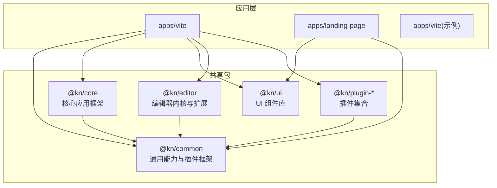
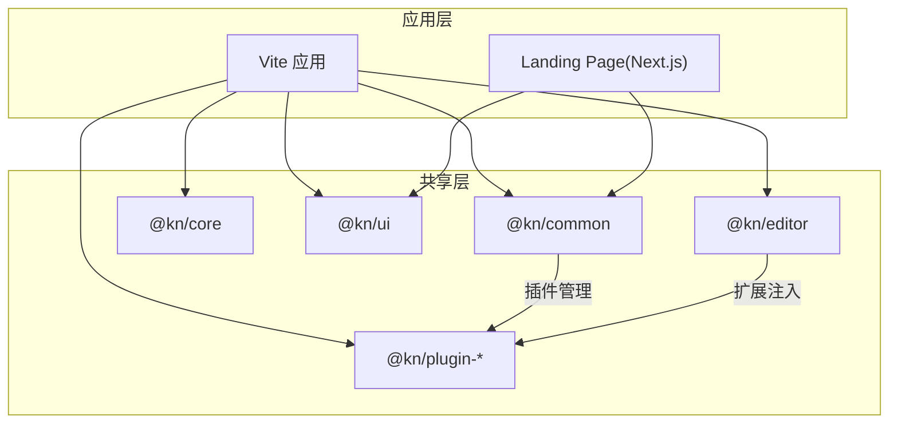
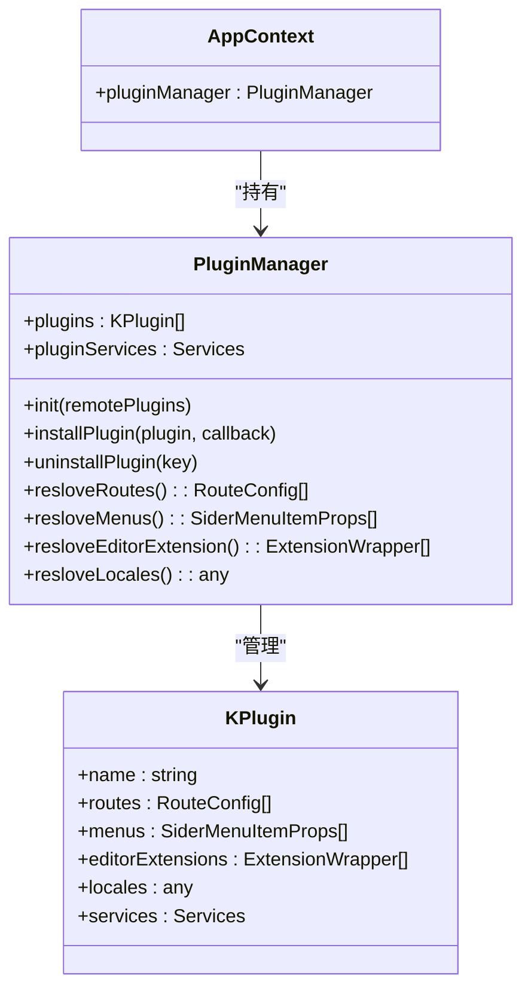
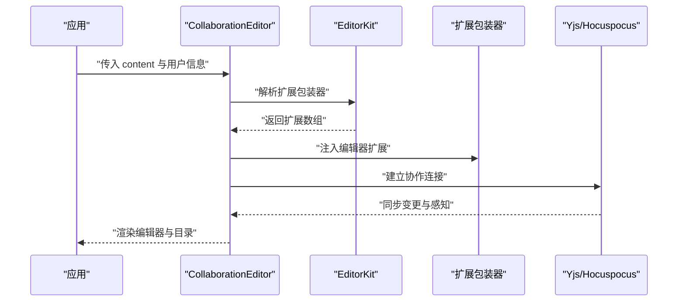
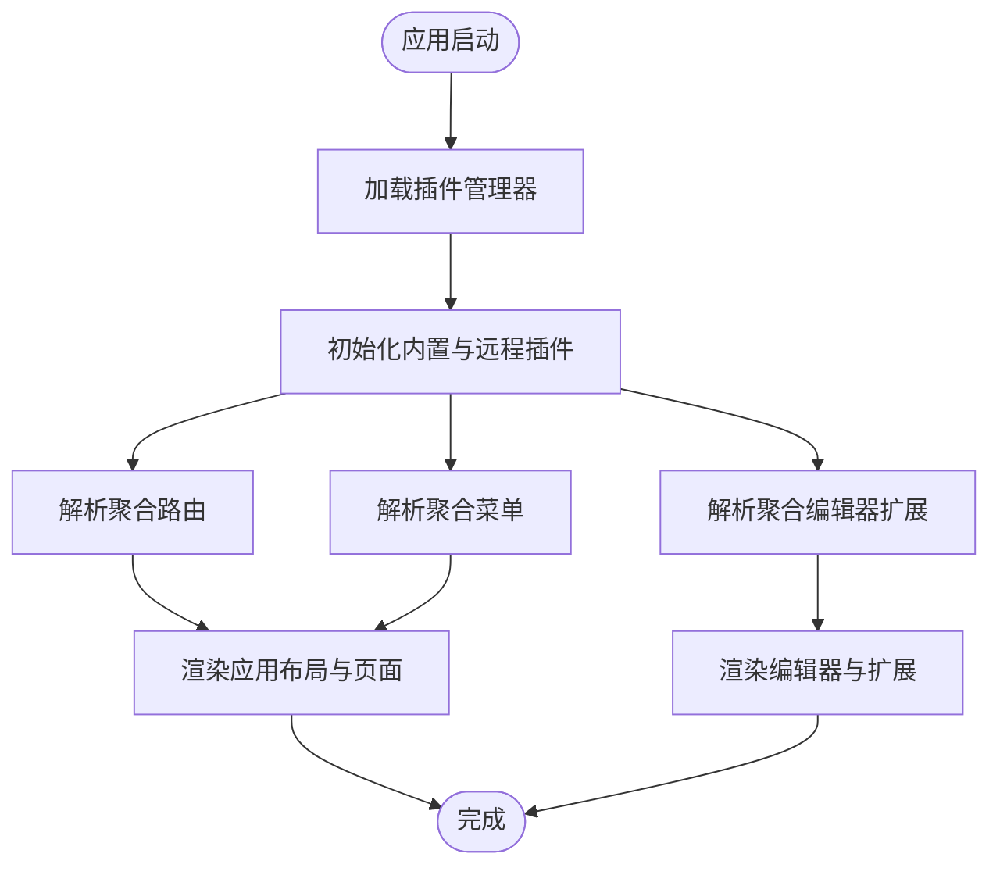
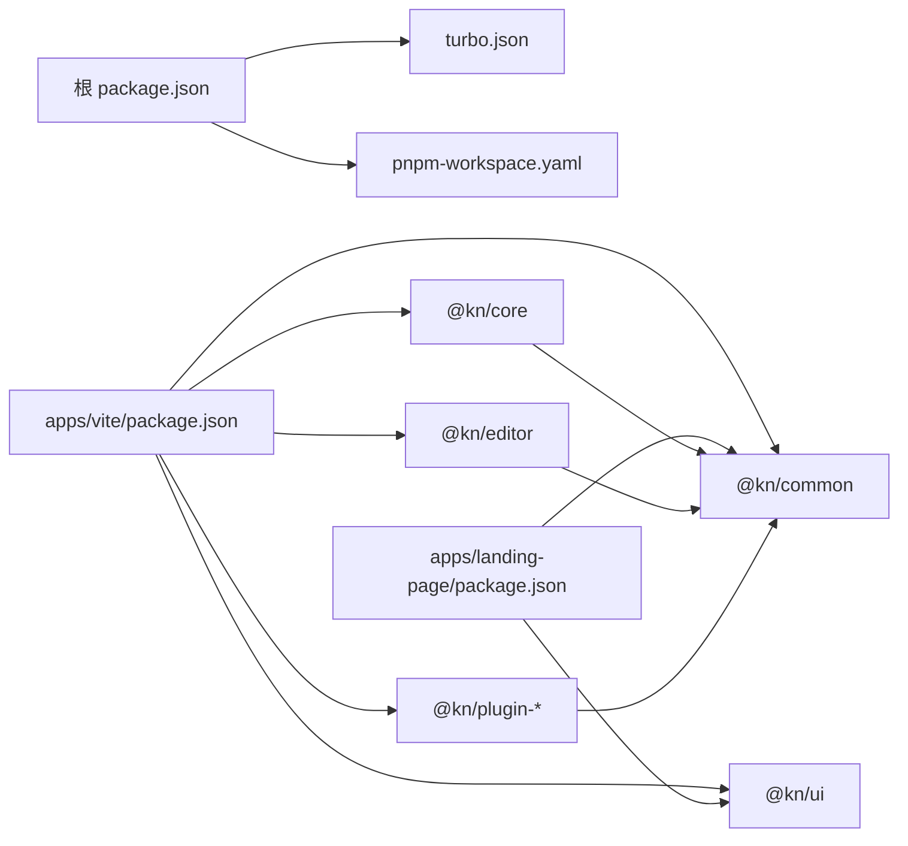

# 项目概述

<cite>
**本文引用的文件**
- [README.md](file://README.md)
- [package.json](file://package.json)
- [turbo.json](file://turbo.json)
- [pnpm-workspace.yaml](file://pnpm-workspace.yaml)
- [packages/common/src/index.ts](file://packages/common/src/index.ts)
- [packages/common/src/core/PluginManager.ts](file://packages/common/src/core/PluginManager.ts)
- [packages/common/src/core/AppContext.ts](file://packages/common/src/core/AppContext.ts)
- [packages/core/src/index.ts](file://packages/core/src/index.ts)
- [packages/ui/src/index.ts](file://packages/ui/src/index.ts)
- [packages/editor/src/index.ts](file://packages/editor/src/index.ts)
- [packages/editor/src/editor/collaboration.tsx](file://packages/editor/src/editor/collaboration.tsx)
- [packages/editor/src/editor/kit.tsx](file://packages/editor/src/editor/kit.tsx)
- [packages/plugin-main/src/index.tsx](file://packages/plugin-main/src/index.tsx)
- [packages/plugin-ai/src/index.tsx](file://packages/plugin-ai/src/index.tsx)
- [apps/vite/package.json](file://apps/vite/package.json)
- [apps/landing-page/package.json](file://apps/landing-page/package.json)
</cite>

## 目录
1. [引言](#引言)
2. [项目结构](#项目结构)
3. [核心组件](#核心组件)
4. [架构总览](#架构总览)
5. [详细组件分析](#详细组件分析)
6. [依赖关系分析](#依赖关系分析)
7. [性能考量](#性能考量)
8. [故障排查指南](#故障排查指南)
9. [结论](#结论)
10. [附录](#附录)

## 引言
本项目是一个基于 Monorepo 的知识库管理系统，旨在通过模块化与插件化架构，构建一个可扩展、可协作、可组合的知识创作与管理平台。项目采用 Turborepo 进行多应用与多包的统一构建与缓存；前端编辑器采用 Tiptap + Yjs 实现实时协作；UI 组件体系基于共享的 @kn/ui 包；插件生态通过 @kn/common 中的 PluginManager 管理，支持动态安装与运行时扩展。

项目目标与价值：
- 提供统一的编辑体验与插件生态，降低二次开发门槛
- 支持多人实时协作编辑，保障内容一致性
- 以 Monorepo 结构实现跨应用共享与复用，提升研发效率
- 通过清晰的架构分层，便于维护与演进

## 项目结构
项目采用 Monorepo 架构，根目录通过 pnpm workspace 管理多个包与应用。核心组织方式如下：
- apps：多实例应用，包含 Vite 前端应用、Next.js Landing Page、以及一个轻量 Vite 示例应用
- packages：共享库与插件集合，包括通用能力（common）、核心应用框架（core）、UI 组件库（ui）、编辑器内核与扩展（editor），以及各类业务插件（plugin-*）

图表来源
- [pnpm-workspace.yaml](file://pnpm-workspace.yaml#L1-L4)
- [apps/vite/package.json](file://apps/vite/package.json#L1-L46)
- [apps/landing-page/package.json](file://apps/landing-page/package.json#L1-L26)
- [packages/common/src/index.ts](file://packages/common/src/index.ts#L1-L16)
- [packages/core/src/index.ts](file://packages/core/src/index.ts#L1-L18)
- [packages/ui/src/index.ts](file://packages/ui/src/index.ts#L1-L18)
- [packages/editor/src/index.ts](file://packages/editor/src/index.ts#L1-L23)

章节来源
- [pnpm-workspace.yaml](file://pnpm-workspace.yaml#L1-L4)
- [README.md](file://README.md#L1-L56)

## 核心组件
本节聚焦于支撑系统运行的关键模块与职责划分：

- 共享能力层（@kn/common）
  - 提供插件基类、插件管理器、路由与菜单抽象、事件系统、国际化资源等
  - 作为插件生态的“胶水层”，统一插件生命周期与装配方式
  - 参考路径：[packages/common/src/core/PluginManager.ts](file://packages/common/src/core/PluginManager.ts#L1-L170)，[packages/common/src/core/AppContext.ts](file://packages/common/src/core/AppContext.ts#L1-L13)，[packages/common/src/index.ts](file://packages/common/src/index.ts#L1-L16)

- 核心应用框架（@kn/core）
  - 暴露应用入口、全局状态、工具函数、AI 能力等
  - 为具体应用提供统一的上下文与基础能力
  - 参考路径：[packages/core/src/index.ts](file://packages/core/src/index.ts#L1-L18)

- UI 组件库（@kn/ui）
  - 暴露通用 UI 组件、样式工具、图表与表单相关能力
  - 保证多应用风格一致与组件复用
  - 参考路径：[packages/ui/src/index.ts](file://packages/ui/src/index.ts#L1-L18)

- 编辑器内核与扩展（@kn/editor）
  - 封装 Tiptap 与 Yjs 协作能力，提供协作编辑器、扩展解析、工具栏、目录等
  - 通过扩展包装器机制，将插件扩展注入编辑器
  - 参考路径：[packages/editor/src/index.ts](file://packages/editor/src/index.ts#L1-L23)，[packages/editor/src/editor/collaboration.tsx](file://packages/editor/src/editor/collaboration.tsx#L1-L142)，[packages/editor/src/editor/kit.tsx](file://packages/editor/src/editor/kit.tsx#L1-L87)

- 插件生态（@kn/plugin-*）
  - 以插件形式提供页面路由、菜单、编辑器扩展、服务与本地化资源
  - 代表性的插件包括主插件（路由与页面）、AI 插件（AI 扩展）等
  - 参考路径：[packages/plugin-main/src/index.tsx](file://packages/plugin-main/src/index.tsx#L1-L118)，[packages/plugin-ai/src/index.tsx](file://packages/plugin-ai/src/index.tsx#L1-L35)

章节来源
- [packages/common/src/core/PluginManager.ts](file://packages/common/src/core/PluginManager.ts#L1-L170)
- [packages/common/src/core/AppContext.ts](file://packages/common/src/core/AppContext.ts#L1-L13)
- [packages/common/src/index.ts](file://packages/common/src/index.ts#L1-L16)
- [packages/core/src/index.ts](file://packages/core/src/index.ts#L1-L18)
- [packages/ui/src/index.ts](file://packages/ui/src/index.ts#L1-L18)
- [packages/editor/src/index.ts](file://packages/editor/src/index.ts#L1-L23)
- [packages/editor/src/editor/collaboration.tsx](file://packages/editor/src/editor/collaboration.tsx#L1-L142)
- [packages/editor/src/editor/kit.tsx](file://packages/editor/src/editor/kit.tsx#L1-L87)
- [packages/plugin-main/src/index.tsx](file://packages/plugin-main/src/index.tsx#L1-L118)
- [packages/plugin-ai/src/index.tsx](file://packages/plugin-ai/src/index.tsx#L1-L35)

## 架构总览
系统采用“Monorepo + 插件化 + 实时协作”的混合架构模式：
- Monorepo：通过 Turborepo 与 pnpm workspace 统一构建、缓存与依赖管理
- 插件化：以 KPlugin 为单位，集中管理路由、菜单、编辑器扩展、服务与本地化
- 实时协作：基于 Tiptap 与 Yjs/Hocuspocus，实现多人在线协同编辑
- 应用层：Vite 应用承载主业务，Next.js Landing Page 提供静态展示

图表来源
- [apps/vite/package.json](file://apps/vite/package.json#L1-L46)
- [apps/landing-page/package.json](file://apps/landing-page/package.json#L1-L26)
- [packages/common/src/core/PluginManager.ts](file://packages/common/src/core/PluginManager.ts#L1-L170)
- [packages/editor/src/index.ts](file://packages/editor/src/index.ts#L1-L23)

## 详细组件分析

### 插件化架构（KPlugin 与 PluginManager）
- 设计要点
  - KPlugin 抽象插件配置（名称、状态、路由、菜单、编辑器扩展、服务、本地化等）
  - PluginManager 负责插件初始化、动态安装/卸载、聚合路由/菜单/扩展/服务
  - 通过 AppContext 注入插件管理器，贯穿应用生命周期
- 关键流程
  - 初始化：合并内置插件与远程插件，加载服务与本地化
  - 运行时：按需安装插件，触发 REFRESH_PLUGINS 事件刷新界面
  - 解析：将各插件的路由/菜单/扩展/本地化进行聚合输出

图表来源
- [packages/common/src/core/PluginManager.ts](file://packages/common/src/core/PluginManager.ts#L1-L170)
- [packages/common/src/core/AppContext.ts](file://packages/common/src/core/AppContext.ts#L1-L13)

章节来源
- [packages/common/src/core/PluginManager.ts](file://packages/common/src/core/PluginManager.ts#L1-L170)
- [packages/common/src/core/AppContext.ts](file://packages/common/src/core/AppContext.ts#L1-L13)
- [packages/plugin-main/src/index.tsx](file://packages/plugin-main/src/index.tsx#L1-L118)
- [packages/plugin-ai/src/index.tsx](file://packages/plugin-ai/src/index.tsx#L1-L35)

### 实时协作架构（Tiptap + Yjs）
- 设计要点
  - 使用 Tiptap 作为富文本内核，提供扩展生态与视图渲染
  - 使用 Yjs 与 Hocuspocus Provider 实现结构化协作与感知（awareness）
  - 通过 CollaborationEditor 封装编辑器生命周期、扩展注入与目录联动
  - 通过 EditorKit 解析扩展包装器，将内置与插件扩展统一注入编辑器
- 关键流程
  - 初始化编辑器：根据扩展列表构建 schema，设置 content 与编辑属性
  - 协作连接：在销毁时断开连接并清理状态
  - 目录联动：监听更新事件，计算层级索引并渲染目录

图表来源
- [packages/editor/src/editor/collaboration.tsx](file://packages/editor/src/editor/collaboration.tsx#L1-L142)
- [packages/editor/src/editor/kit.tsx](file://packages/editor/src/editor/kit.tsx#L1-L87)
- [packages/editor/src/index.ts](file://packages/editor/src/index.ts#L1-L23)

章节来源
- [packages/editor/src/editor/collaboration.tsx](file://packages/editor/src/editor/collaboration.tsx#L1-L142)
- [packages/editor/src/editor/kit.tsx](file://packages/editor/src/editor/kit.tsx#L1-L87)
- [packages/editor/src/index.ts](file://packages/editor/src/index.ts#L1-L23)

### 应用与插件装配流程
- 主应用（Vite）装配
  - 依赖 @kn/core、@kn/ui、@kn/editor、@kn/common 与各 @kn/plugin-* 插件
  - 通过插件管理器聚合路由、菜单与编辑器扩展，驱动页面与编辑器行为
- Landing Page（Next.js）装配
  - 依赖 @kn/ui 与 @kn/icon，用于静态展示与品牌宣传

图表来源
- [apps/vite/package.json](file://apps/vite/package.json#L1-L46)
- [packages/common/src/core/PluginManager.ts](file://packages/common/src/core/PluginManager.ts#L1-L170)
- [packages/plugin-main/src/index.tsx](file://packages/plugin-main/src/index.tsx#L1-L118)

章节来源
- [apps/vite/package.json](file://apps/vite/package.json#L1-L46)
- [packages/plugin-main/src/index.tsx](file://packages/plugin-main/src/index.tsx#L1-L118)

## 依赖关系分析
- 工作区与任务编排
  - pnpm-workspace.yaml 定义工作区范围，包含 apps 与 packages
  - turbo.json 配置构建、lint、dev 等任务的依赖与缓存策略
  - package.json 定义顶层脚本与依赖，统一版本与引擎要求
- 包间依赖
  - @kn/core 依赖 @kn/common 与第三方库
  - @kn/editor 依赖 @kn/common、@kn/ui，并引入 tiptap、yjs、hocuspocus 等
  - @kn/plugin-* 依赖 @kn/common，部分插件依赖 @kn/editor 或 @kn/ui
  - 应用层（vite/landing-page）依赖对应共享包

图表来源
- [pnpm-workspace.yaml](file://pnpm-workspace.yaml#L1-L4)
- [turbo.json](file://turbo.json#L1-L27)
- [package.json](file://package.json#L1-L103)
- [apps/vite/package.json](file://apps/vite/package.json#L1-L46)
- [apps/landing-page/package.json](file://apps/landing-page/package.json#L1-L26)

章节来源
- [pnpm-workspace.yaml](file://pnpm-workspace.yaml#L1-L4)
- [turbo.json](file://turbo.json#L1-L27)
- [package.json](file://package.json#L1-L103)

## 性能考量
- 构建与缓存
  - 利用 Turborepo 的任务依赖与缓存机制，避免重复构建
  - 在 dev 任务中禁用缓存，确保热更新及时性
- 编辑器渲染
  - 使用 useEditor 的立即渲染与事务控制，减少重绘
  - 目录更新采用受控状态，避免不必要的全量更新
- 插件加载
  - 动态导入插件脚本，按需加载，降低首屏体积
  - 合并服务与本地化资源，减少重复请求

[本节为通用指导，不直接分析具体文件]

## 故障排查指南
- 插件未生效或路由缺失
  - 检查插件是否正确注册到 PluginManager，并确认 routes/menus/editorExtensions 是否被聚合
  - 参考路径：[packages/common/src/core/PluginManager.ts](file://packages/common/src/core/PluginManager.ts#L1-L170)
- 协作连接异常
  - 确认 Provider 初始化与销毁逻辑，检查断开与清理流程
  - 参考路径：[packages/editor/src/editor/collaboration.tsx](file://packages/editor/src/editor/collaboration.tsx#L1-L142)
- 编辑器扩展冲突
  - 检查扩展包装器的 extendsion/slashConfig 配置，避免重复或顺序问题
  - 参考路径：[packages/editor/src/editor/kit.tsx](file://packages/editor/src/editor/kit.tsx#L1-L87)
- 应用启动失败
  - 核对 pnpm-workspace.yaml 与 package.json 的依赖声明，确保 workspace:* 正常解析
  - 参考路径：[pnpm-workspace.yaml](file://pnpm-workspace.yaml#L1-L4)，[apps/vite/package.json](file://apps/vite/package.json#L1-L46)

章节来源
- [packages/common/src/core/PluginManager.ts](file://packages/common/src/core/PluginManager.ts#L1-L170)
- [packages/editor/src/editor/collaboration.tsx](file://packages/editor/src/editor/collaboration.tsx#L1-L142)
- [packages/editor/src/editor/kit.tsx](file://packages/editor/src/editor/kit.tsx#L1-L87)
- [pnpm-workspace.yaml](file://pnpm-workspace.yaml#L1-L4)
- [apps/vite/package.json](file://apps/vite/package.json#L1-L46)

## 结论
本项目以 Monorepo 为基础，结合插件化与实时协作两大核心能力，构建了可扩展、可维护的知识库系统。通过共享包与插件生态，实现了编辑器能力的模块化与可组合性；借助 Turborepo 与现代前端技术栈，兼顾了开发效率与运行性能。未来可在插件市场、协作协议优化、多端适配等方面持续演进。

[本节为总结性内容，不直接分析具体文件]

## 附录
- 技术选型说明
  - Turborepo：统一构建、缓存与任务编排
  - Vite/Next.js：多应用开发与部署
  - Tiptap/Yjs：富文本内核与实时协作
  - shadcn/ui：可定制 UI 组件库
  - pnpm workspace：Monorepo 依赖管理
- 发展历程与社区
  - 仓库提供基础模板与脚手架，支持快速迭代与社区贡献
  - 可通过 issue/PR 参与插件生态建设与功能完善
- 未来规划建议
  - 插件市场与版本化发布
  - 协作服务端能力增强与可观测性
  - 多端客户端（移动端/桌面端）接入
  - 国际化与无障碍支持完善

[本节为概念性内容，不直接分析具体文件]