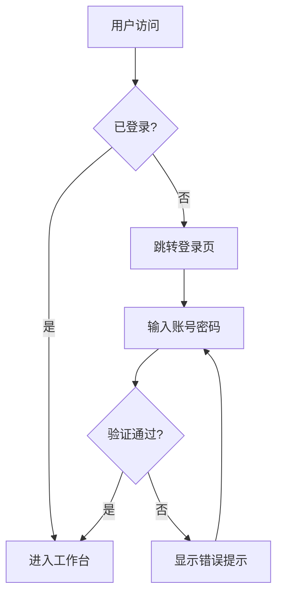

# Knowledge Repo 路演文稿

> **智能协作知识管理平台** | Intelligent Collaborative Knowledge Management Platform

---

## 目录

- [开场白](#开场白)
- [一、技术角度](#一技术角度)
- [二、业务角度](#二业务角度)
- [三、员工赋能角度](#三员工赋能角度)
- [四、产品演示](#四产品演示)
- [五、发展规划](#五发展规划)
- [六、投资亮点](#六投资亮点)
- [附录](#附录)

---

## 开场白

### 演讲时长：1-2分钟

尊敬的各位投资人、合作伙伴：

大家好！今天我非常荣幸向大家介绍 **Knowledge Repo** —— 一款为现代企业打造的**智能协作知识管理平台**。

### 企业面临的核心挑战

在数字化转型浪潮中，企业普遍面临以下痛点：

| 挑战 | 表现 | 影响 |
|------|------|------|
| 🏝️ **知识孤岛** | 信息分散在邮件、聊天、文档等多个系统 | 知识复用率低，重复造轮子 |
| 🔄 **协作低效** | 文档版本混乱，"最终版_v3_改改改.docx" | 沟通成本高，决策延迟 |
| 🧩 **工具碎片化** | 表格用Excel，画图用Visio，笔记用OneNote | 上下文切换频繁，专注力丧失 |
| 🤖 **AI割裂** | ChatGPT单独使用，与工作流断开 | 无法发挥AI真正价值 |

### 我们的解决方案

**Knowledge Repo** 通过以下方式解决这些问题：

```
┌─────────────────────────────────────────────────────────────┐
│                    Knowledge Repo                            │
│                                                              │
│   ┌──────────┐  ┌──────────┐  ┌──────────┐  ┌──────────┐   │
│   │ 统一知识库 │  │ 实时协作  │  │ 插件扩展  │  │ AI原生   │   │
│   │          │  │          │  │          │  │          │   │
│   │ 一站式    │  │ 多人同时  │  │ All-in   │  │ 内嵌智能  │   │
│   │ 管理所有  │  │ 编辑无    │  │ -One     │  │ 无缝集成  │   │
│   │ 企业知识  │  │ 冲突      │  │ 工作台   │  │ 工作流   │   │
│   └──────────┘  └──────────┘  └──────────┘  └──────────┘   │
└─────────────────────────────────────────────────────────────┘
```

---

## 一、技术角度

### 演讲时长：5-7分钟

### 1.1 现代化技术架构

我们采用业界领先的技术栈，确保产品的**高性能、可扩展性和开发效率**：

#### 前端技术栈

| 技术 | 版本 | 作用 | 选型理由 |
|------|------|------|----------|
| **React** | 18.x | UI框架 | Concurrent Features、Suspense、自动批处理 |
| **TypeScript** | 5.x | 类型系统 | 编译时错误检测，提升代码质量 |
| **Vite** | 5.x | 构建工具 | 毫秒级HMR，10倍于Webpack的构建速度 |
| **Tailwind CSS** | 3.x | 样式方案 | 原子化CSS，包体积优化 |
| **shadcn/ui** | Latest | 组件库 | 高质量、可定制、无运行时依赖 |

#### 编辑器技术栈

| 技术 | 作用 | 技术亮点 |
|------|------|----------|
| **Tiptap** | 富文本编辑器 | 基于ProseMirror，企业级稳定性 |
| **Hocuspocus** | 实时协作后端 | WebSocket + Y.js 协议 |
| **Y.js** | CRDT实现 | 无冲突复制数据类型，自动合并 |

#### 工程化架构

| 技术 | 作用 | 优势 |
|------|------|------|
| **Turborepo** | Monorepo管理 | 智能缓存，增量构建 |
| **pnpm** | 包管理器 | 硬链接节省70%磁盘空间 |
| **Rollup** | 库打包 | Tree-shaking，最小化输出 |
| **Docker** | 容器化部署 | 一致的运行环境 |

### 1.2 核心技术亮点

#### 🔄 实时协作引擎

```
┌─────────────────────────────────────────────────────────────┐
│                   实时协作架构                               │
│                                                              │
│    用户A                 服务器               用户B           │
│      │                    │                    │             │
│      │──── 编辑操作 ─────>│                    │             │
│      │                    │<── CRDT合并 ──────>│             │
│      │<─── 同步更新 ──────│                    │             │
│      │                    │──── 同步更新 ─────>│             │
│      │                    │                    │             │
│   ┌──┴──┐              ┌──┴──┐              ┌──┴──┐         │
│   │本地  │              │中心  │              │本地  │         │
│   │Y.Doc │              │Y.Doc │              │Y.Doc │         │
│   └─────┘              └─────┘              └─────┘         │
└─────────────────────────────────────────────────────────────┘
```

**技术特点：**
- **CRDT算法**：Conflict-free Replicated Data Type，数学证明无冲突
- **毫秒级同步**：基于WebSocket的实时推送
- **离线支持**：本地优先架构，断网可继续编辑
- **自动合并**：网络恢复后智能合并，无需人工干预

#### 🤖 AI 智能中枢

```typescript
// AI 能力集成示例
const aiCapabilities = {
  textGeneration: {
    provider: "DeepSeek AI",
    features: ["续写", "改写", "摘要", "翻译", "扩展"]
  },
  imageGeneration: {
    provider: "AI Image API",
    features: ["根据描述生成图片", "风格转换"]
  },
  streaming: {
    sdk: "Vercel AI SDK",
    benefit: "流式响应，实时输出，用户体验流畅"
  }
}
```

**AI 应用场景：**

| 场景 | 功能 | 效果 |
|------|------|------|
| 写作辅助 | 智能续写、内容扩展 | 效率提升 3-5 倍 |
| 内容优化 | 语法纠错、风格改写 | 质量显著提升 |
| 信息提取 | 自动摘要、关键词提取 | 阅读效率翻倍 |
| 创意生成 | AI 配图、图表建议 | 降低设计门槛 |

#### 🔌 插件化架构

```
┌─────────────────────────────────────────────────────────────┐
│                      插件架构设计                            │
│                                                              │
│  ┌─────────────────────────────────────────────────────┐    │
│  │                    Core Platform                     │    │
│  │  ┌─────────┐ ┌─────────┐ ┌─────────┐ ┌─────────┐   │    │
│  │  │ Router  │ │ State   │ │ Theme   │ │ i18n    │   │    │
│  │  │ Manager │ │ Store   │ │ Provider│ │ System  │   │    │
│  │  └─────────┘ └─────────┘ └─────────┘ └─────────┘   │    │
│  └─────────────────────────────────────────────────────┘    │
│                            │                                 │
│                     Plugin Interface                         │
│                            │                                 │
│  ┌─────────┐ ┌─────────┐ ┌─────────┐ ┌─────────┐           │
│  │ Bitable │ │ DrawIO  │ │ AI      │ │ Custom  │           │
│  │ Plugin  │ │ Plugin  │ │ Plugin  │ │ Plugin  │           │
│  └─────────┘ └─────────┘ └─────────┘ └─────────┘           │
└─────────────────────────────────────────────────────────────┘
```

**插件开发规范：**

```typescript
// 标准插件接口定义
interface Plugin {
  name: string;                    // 插件唯一标识
  version: string;                 // 语义化版本号
  extensions?: TiptapExtension[];  // 编辑器扩展
  components?: ReactComponent[];   // UI 组件
  routes?: RouteConfig[];          // 路由配置
  locales?: LocaleResources;       // 国际化资源
}
```

### 1.3 已实现插件矩阵

#### 数据与内容管理

| 插件 | 功能 | 技术实现 |
|------|------|----------|
| **Bitable** | 多维表格 | 自研表格引擎，支持公式计算 |
| **Database** | 数据库集成 | 支持主流数据库连接 |
| **File Manager** | 文件管理 | 树形结构，拖拽上传 |
| **Block Reference** | 块引用 | 双向链接，引用同步更新 |

#### 可视化与图表

| 插件 | 功能 | 技术实现 |
|------|------|----------|
| **Excalidraw** | 手绘风格图 | 集成 Excalidraw 开源库 |
| **DrawIO** | 专业流程图 | 集成 DrawIO 编辑器 |
| **Mermaid** | 代码图表 | 文本转图表，版本可控 |
| **Mindmap** | 思维导图 | Canvas 渲染，高性能 |

#### AI 与自动化

| 插件 | 功能 | 技术实现 |
|------|------|----------|
| **AI Plugin** | 智能写作 | DeepSeek + Vercel AI SDK |
| **Weaver OA** | 企业流程 | 对接泛微 OA 系统 |

### 1.4 性能指标

| 指标 | 数值 | 行业对比 |
|------|------|----------|
| 首屏加载时间 | < 1.5s | 优于行业平均 40% |
| 编辑响应延迟 | < 50ms | 接近原生体验 |
| 协作同步延迟 | < 100ms | 实时感知 |
| 最大并发编辑 | 50+ 人 | 满足大团队需求 |
| 文档加载 | 10MB/s | 大文档秒开 |

---

## 二、业务角度

### 演讲时长：5-7分钟

### 2.1 市场分析

#### 全球市场规模

```
知识管理软件市场规模 (单位: 亿美元)

2023 ████████████████████████ $1,050
2024 ██████████████████████████ $1,220
2025 ████████████████████████████ $1,500 (预测)
2026 ██████████████████████████████ $1,750 (预测)
2027 ████████████████████████████████ $2,050 (预测)

年复合增长率 (CAGR): 16.8%
```

#### 中国市场机遇

| 驱动因素 | 说明 |
|----------|------|
| 数字化转型 | 国家政策推动，企业加速数字化 |
| 远程办公常态化 | 后疫情时代，协作工具需求激增 |
| 知识密集型产业增长 | 科技、咨询、教育行业快速扩张 |
| 国产替代趋势 | 信创政策下，自主可控需求强烈 |

### 2.2 目标市场细分

#### 目标客户画像

| 客户类型 | 规模 | 核心需求 | 付费意愿 |
|----------|------|----------|----------|
| **科技企业研发团队** | 50-500人 | 技术文档、API管理 | ⭐⭐⭐⭐⭐ |
| **咨询/设计公司** | 20-200人 | 方案协作、知识沉淀 | ⭐⭐⭐⭐ |
| **教育培训机构** | 100-1000人 | 课件管理、师生协作 | ⭐⭐⭐ |
| **跨国企业** | 500+人 | 多语言、全球协作 | ⭐⭐⭐⭐⭐ |
| **政府/国企** | 不限 | 私有化、安全合规 | ⭐⭐⭐⭐⭐ |

#### 行业渗透策略

```
┌─────────────────────────────────────────────────────────────┐
│                    市场渗透路径                              │
│                                                              │
│   Phase 1 (0-12月)      Phase 2 (12-24月)    Phase 3 (24月+) │
│   ─────────────────     ─────────────────    ────────────── │
│                                                              │
│   科技/互联网           咨询/金融            政府/国企       │
│   ↓                     ↓                    ↓              │
│   建立标杆案例          横向扩展行业          私有化部署     │
│   打磨产品PMF           建立行业解决方案      定制化服务     │
│                                                              │
└─────────────────────────────────────────────────────────────┘
```

### 2.3 竞争分析

#### 竞品对比矩阵

| 维度 | Knowledge Repo | Notion | 飞书文档 | Confluence |
|------|----------------|--------|----------|------------|
| **实时协作** | ⭐⭐⭐⭐⭐ | ⭐⭐⭐ | ⭐⭐⭐⭐ | ⭐⭐ |
| **AI能力** | ⭐⭐⭐⭐⭐ | ⭐⭐⭐ | ⭐⭐⭐ | ⭐⭐ |
| **插件生态** | ⭐⭐⭐⭐ | ⭐⭐⭐ | ⭐⭐ | ⭐⭐⭐⭐ |
| **私有化部署** | ⭐⭐⭐⭐⭐ | ⭐ | ⭐⭐⭐ | ⭐⭐⭐⭐⭐ |
| **本土化服务** | ⭐⭐⭐⭐⭐ | ⭐⭐ | ⭐⭐⭐⭐⭐ | ⭐⭐ |
| **性价比** | ⭐⭐⭐⭐⭐ | ⭐⭐⭐ | ⭐⭐⭐⭐ | ⭐⭐ |

#### 差异化优势

| 对比对象 | 我们的优势 |
|----------|------------|
| **vs Notion** | 更强的实时协作 + 本土化AI + 私有化部署能力 |
| **vs 飞书文档** | 更灵活的插件扩展 + 更专注的知识管理定位 |
| **vs Confluence** | 更现代的交互体验 + 更低的学习成本 + 更优的性价比 |
| **vs 语雀** | 更强的团队协作 + 更丰富的可视化工具 |

### 2.4 商业模式

#### 收入结构

```
┌─────────────────────────────────────────────────────────────┐
│                      收入来源结构                            │
│                                                              │
│  ┌─────────────────────────────────────────────────────┐    │
│  │                  SaaS 订阅收入 (70%)                 │    │
│  │                                                      │    │
│  │  基础版        专业版           企业版               │    │
│  │  (免费)        (¥99/人/月)      (定制报价)           │    │
│  │                                                      │    │
│  │  • 个人使用    • 团队协作       • 私有化部署         │    │
│  │  • 3人以下     • 高级权限       • SLA保障           │    │
│  │  • 基础功能    • 优先支持       • 专属服务           │    │
│  └─────────────────────────────────────────────────────┘    │
│                                                              │
│  ┌───────────────────────┐  ┌───────────────────────┐       │
│  │  插件生态收入 (20%)    │  │  增值服务收入 (10%)   │       │
│  │                        │  │                       │       │
│  │  • 付费插件分成 70/30  │  │  • AI高级功能按量付费 │       │
│  │  • 企业定制插件开发    │  │  • 培训咨询服务       │       │
│  │  • 插件认证服务        │  │  • 数据迁移服务       │       │
│  └───────────────────────┘  └───────────────────────┘       │
└─────────────────────────────────────────────────────────────┘
```

#### 定价策略

| 版本 | 价格 | 目标用户 | 核心功能 |
|------|------|----------|----------|
| **免费版** | ¥0 | 个人/学生 | 基础编辑、3人协作、5GB存储 |
| **专业版** | ¥99/人/月 | 中小团队 | 无限协作、高级权限、50GB存储、优先支持 |
| **企业版** | 定制报价 | 大型企业 | 私有部署、SSO、审计日志、专属客服、SLA |

#### 客户生命周期价值 (LTV) 模型

```
假设条件:
- 专业版客户平均团队规模: 20人
- 月均收入: 20 × ¥99 = ¥1,980
- 平均客户生命周期: 36个月
- 年流失率: 15%

LTV = ¥1,980 × 36 × (1 - 0.15) = ¥60,588

CAC (客户获取成本) 目标: < ¥6,000
LTV/CAC > 10 ✓
```

### 2.5 增长策略

#### GTM (Go-to-Market) 策略

| 阶段 | 策略 | 关键动作 |
|------|------|----------|
| **获客** | PLG (产品驱动增长) | 免费版引流、病毒式传播 |
| **激活** | 新手引导优化 | 5分钟上手教程、模板库 |
| **留存** | 价值持续交付 | 定期功能更新、用户社区 |
| **变现** | 价值升级 | 团队功能引导、企业需求挖掘 |
| **推荐** | 口碑传播 | 邀请奖励、案例包装 |

---

## 三、员工赋能角度

### 演讲时长：5-7分钟

### 3.1 个人生产力提升

#### AI 写作助手

| 功能 | 使用场景 | 效率提升 |
|------|----------|----------|
| **智能续写** | 写到一半不知如何继续 | 节省 60% 思考时间 |
| **风格改写** | 正式↔轻松↔专业语气切换 | 一键完成，秒级响应 |
| **自动摘要** | 长文档提炼核心要点 | 10页文档→1分钟摘要 |
| **语法纠错** | 检查拼写和语法错误 | 减少 90% 低级错误 |
| **多语言翻译** | 中英文内容互译 | 准确率 95%+ |

**使用示例：**

```
用户输入: "帮我写一份Q4销售总结的开头"

AI输出: "2024年第四季度，在全体销售团队的共同努力下，
我们实现了营收目标的115%完成率，创下历史新高。
本季度核心亮点包括：新客户拓展突破200家、
大客户续约率达到92%、团队人效提升23%..."

[继续生成] [换一种风格] [扩展更多]
```

#### 多维表格 (Bitable)

**同一份数据，四种视图自由切换：**

```
┌─────────────────────────────────────────────────────────────┐
│                    项目任务管理                              │
│                                                              │
│  📊 表格视图                    📋 看板视图                  │
│  ┌──────┬────────┬─────┐      ┌─────┬─────┬─────┬─────┐   │
│  │ 任务 │ 负责人  │状态 │      │待办  │进行中│测试  │完成 │   │
│  ├──────┼────────┼─────┤      ├─────┼─────┼─────┼─────┤   │
│  │ A    │ 张三   │进行中│  →   │ D   │ A   │ B   │ C   │   │
│  │ B    │ 李四   │测试  │      │ E   │     │     │     │   │
│  │ C    │ 王五   │完成  │      │     │     │     │     │   │
│  └──────┴────────┴─────┘      └─────┴─────┴─────┴─────┘   │
│                                                              │
│  🖼️ 画廊视图                    📅 甘特图视图               │
│  ┌─────┐ ┌─────┐ ┌─────┐     │ 任务A ████████            │
│  │ 🎨  │ │ 📷  │ │ 🎬  │     │ 任务B     ██████          │
│  │素材A │ │素材B │ │素材C │     │ 任务C         ████████   │
│  └─────┘ └─────┘ └─────┘     └─────────────────────────── │
└─────────────────────────────────────────────────────────────┘
```

**字段类型支持：**

| 类型 | 图标 | 说明 |
|------|------|------|
| 文本 | 📝 | 单行/多行文本 |
| 数字 | 🔢 | 支持公式计算 |
| 单选 | ⭕ | 预设选项 |
| 多选 | ☑️ | 多个标签 |
| 日期 | 📅 | 日期时间 |
| 人员 | 👤 | @成员 |
| 关联 | 🔗 | 跨表关联 |
| 附件 | 📎 | 文件上传 |

### 3.2 团队协作增强

#### 实时协同编辑

**多人同时编辑，彼此光标实时可见：**

```
┌─────────────────────────────────────────────────────────────┐
│  📄 产品需求文档 v2.3                    👥 3人正在编辑     │
├─────────────────────────────────────────────────────────────┤
│                                                              │
│  # 功能需求                                                  │
│                                                              │
│  ## 1. 用户登录                                              │
│  用户可以通过手机号|张三 或邮箱进行登录认证...               │
│                                                              │
│  ## 2. 数据导出                                              │
│  支持导出为 Excel、|李四 PDF、CSV 格式...                    │
│                                                              │
│  ## 3. 权限管理                  |王五                       │
│  管理员可以设置不同角色的访问权限...                         │
│                                                              │
├─────────────────────────────────────────────────────────────┤
│  💬 评论区                                                   │
│  ┌─────────────────────────────────────────────────────┐    │
│  │ @张三 这里的登录逻辑需要补充第三方登录说明          │    │
│  │ ↳ @李四 好的，我来补充微信和钉钉登录               │    │
│  └─────────────────────────────────────────────────────┘    │
└─────────────────────────────────────────────────────────────┘
```

**协作功能亮点：**

| 功能 | 说明 | 价值 |
|------|------|------|
| **实时光标** | 看到队友正在编辑的位置 | 避免编辑冲突 |
| **评论@提醒** | 精准定位讨论内容 | 沟通效率提升 |
| **版本历史** | 随时回溯任意版本 | 无惧误操作 |
| **变更追踪** | 谁在何时改了什么 | 责任可追溯 |

#### 块引用系统

**跨文档引用，构建知识网络：**

```
┌────────────────────┐         ┌────────────────────┐
│   📄 技术规范文档   │         │   📄 产品需求文档   │
│                    │         │                    │
│  ## API 接口规范   │◄───────►│  ## 功能说明       │
│                    │   引用   │                    │
│  POST /api/users   │         │  用户接口详见      │
│  请求参数:         │         │  [[技术规范#API]]  │
│  - name: string    │         │                    │
│  - email: string   │         │                    │
└────────────────────┘         └────────────────────┘
         │
         │ 引用
         ▼
┌────────────────────┐
│   📄 测试用例文档   │
│                    │
│  ## 接口测试       │
│                    │
│  参考接口规范      │
│  [[技术规范#API]]  │
└────────────────────┘

✨ 修改源文档，所有引用自动同步更新！
```

### 3.3 可视化思考工具

#### 工具矩阵

| 工具 | 最佳场景 | 特点 | 示例用途 |
|------|----------|------|----------|
| **Excalidraw** | 头脑风暴、草图 | 手绘风格，亲和力强 | 产品原型草图、架构讨论 |
| **DrawIO** | 正式流程图 | 专业规范，模板丰富 | 业务流程图、系统架构图 |
| **Mermaid** | 技术文档 | 代码即图表，版本可控 | 时序图、类图、ER图 |
| **Mindmap** | 知识整理 | 发散思维，层级清晰 | 项目规划、学习笔记 |

#### Mermaid 示例



### 3.4 降低学习成本

#### 统一设计语言

```
┌─────────────────────────────────────────────────────────────┐
│                    一致的操作体验                            │
│                                                              │
│  所有插件遵循统一交互规范:                                   │
│                                                              │
│  ✓ 相同的快捷键体系    Cmd+B 加粗, Cmd+K 链接               │
│  ✓ 一致的右键菜单      复制、粘贴、删除位置固定              │
│  ✓ 统一的设置入口      所有配置集中管理                      │
│  ✓ 相同的主题适配      深色/浅色模式自动切换                 │
│                                                              │
│  学会一个插件 → 触类旁通所有插件                            │
└─────────────────────────────────────────────────────────────┘
```

#### 多语言支持

| 语言 | 覆盖率 | 状态 |
|------|--------|------|
| 🇨🇳 简体中文 | 100% | ✅ 完成 |
| 🇺🇸 English | 100% | ✅ 完成 |
| 🇯🇵 日本語 | 计划中 | 🚧 开发中 |
| 🇰🇷 한국어 | 计划中 | 📋 规划中 |

### 3.5 效能提升量化

#### ROI 计算模型

```
场景: 50人研发团队使用 Knowledge Repo

┌─────────────────────────────────────────────────────────────┐
│                    效能提升估算                              │
│                                                              │
│  时间节省:                                                   │
│  ├─ 文档协作效率提升: 40%   (原4小时/周 → 2.4小时/周)       │
│  ├─ 信息检索时间减少: 60%   (原2小时/周 → 0.8小时/周)       │
│  ├─ 会议时间减少: 30%       (原3小时/周 → 2.1小时/周)       │
│  └─ 工具切换时间节省: 50%   (原1小时/周 → 0.5小时/周)       │
│                                                              │
│  每人每周节省: 4.2 小时                                      │
│  团队每周节省: 50 × 4.2 = 210 小时                          │
│  按时薪 ¥150 计算: 210 × 150 = ¥31,500/周                   │
│                                                              │
│  年度节省: ¥31,500 × 50周 = ¥1,575,000                      │
│  订阅成本: 50人 × ¥99 × 12月 = ¥59,400                      │
│                                                              │
│  ROI = (1,575,000 - 59,400) / 59,400 = 2,551%              │
└─────────────────────────────────────────────────────────────┘
```

---

## 四、产品演示

### 演讲时长：3-5分钟

### 4.1 核心场景演示

#### 场景一：产品需求文档撰写

```
演示流程 (5分钟内完成专业PRD):

Step 1: AI 开篇 (30秒)
┌─────────────────────────────────────────┐
│ 输入: "写一份电商APP购物车功能需求文档"  │
│ AI自动生成文档框架和初稿                 │
└─────────────────────────────────────────┘
         ↓
Step 2: 多维表格 (1分钟)
┌─────────────────────────────────────────┐
│ 创建需求列表，用看板视图管理优先级       │
│ 拖拽调整任务状态                         │
└─────────────────────────────────────────┘
         ↓
Step 3: 流程图 (1分钟)
┌─────────────────────────────────────────┐
│ 用 DrawIO 绘制用户购物流程图            │
│ 嵌入文档，与文字说明配合                 │
└─────────────────────────────────────────┘
         ↓
Step 4: 实时协作 (1分钟)
┌─────────────────────────────────────────┐
│ 邀请设计师进入文档                       │
│ 共同完善 UI 交互说明                     │
│ 评论区讨论细节                           │
└─────────────────────────────────────────┘
         ↓
Step 5: 块引用 (30秒)
┌─────────────────────────────────────────┐
│ 引用技术规范中的接口文档                 │
│ 源文档更新时自动同步                     │
└─────────────────────────────────────────┘
```

#### 场景二：项目进度管理

```
演示流程:

1. 创建项目看板
   ┌──────┬──────┬──────┬──────┐
   │ 待办  │ 进行 │ 测试 │ 完成 │
   ├──────┼──────┼──────┼──────┤
   │ 任务1 │ 任务3│ 任务5│ 任务7│
   │ 任务2 │ 任务4│ 任务6│      │
   └──────┴──────┴──────┴──────┘

2. 切换甘特图视图
   任务1 ████████
   任务2     ██████
   任务3         ████████
   └───────────────────────────→ 时间

3. 分配负责人，设置截止日期
4. 关联需求文档，建立追溯
```

#### 场景三：知识库搭建

```
演示流程:

1. 创建空间结构
   📁 产品部
   ├── 📁 需求文档
   │   ├── 📄 2024 Q1 需求池
   │   └── 📄 2024 Q2 需求池
   ├── 📁 设计规范
   │   ├── 📄 UI 设计规范
   │   └── 📄 交互设计指南
   └── 📁 竞品分析
       └── 📄 行业竞品对比

2. 设置权限
   - 部门内可编辑
   - 跨部门只读
   - 敏感文档需审批

3. 建立块引用网络
   - 设计规范被需求文档引用
   - 竞品分析被产品规划引用
```

### 4.2 演示亮点提炼

| 亮点 | 传统方式 | Knowledge Repo |
|------|----------|----------------|
| 文档初稿 | 手写2小时 | AI生成30秒 |
| 任务看板 | 另开Trello | 内嵌表格视图 |
| 流程图 | 另开Visio | 内嵌DrawIO |
| 团队协作 | 邮件传文件 | 实时共同编辑 |
| 引用更新 | 手动同步 | 自动同步 |

---

## 五、发展规划

### 5.1 产品路线图

```
┌─────────────────────────────────────────────────────────────┐
│                      产品发展路线图                          │
│                                                              │
│  2024 Q4          2025 Q1-Q2       2025 Q3-Q4    2026+      │
│  ─────────        ──────────       ──────────    ─────      │
│                                                              │
│  ✅ 完成          🚧 进行中         📋 规划中     💡 远期    │
│                                                              │
│  • 富文本编辑     • 甘特图视图     • 离线模式    • 桌面应用  │
│  • 实时协作       • 日历视图       • 高级权限    • 移动APP  │
│  • AI文本生成     • 时间线视图     • 模板市场    • 插件市场  │
│  • 多维表格       • 高级筛选       • API开放     • AI Agent │
│  • DrawIO/Mermaid • 表单视图       • Webhook     • 自动化   │
│  • 文件管理       • 移动端优化     • SSO集成     • 更多集成  │
│  • 块引用         • 性能优化       • 审计日志    │           │
│  • 国际化         │                │             │           │
└─────────────────────────────────────────────────────────────┘
```

### 5.2 短期规划 (6个月)

| 功能 | 描述 | 价值 |
|------|------|------|
| 甘特图视图 | 项目时间线可视化 | 项目管理场景必备 |
| 日历视图 | 按日期组织任务 | 排期管理更直观 |
| 时间线视图 | 里程碑追踪 | 大型项目必备 |
| 高级筛选 | 多条件组合筛选 | 数据管理更高效 |
| 表单视图 | 数据收集 | 扩展应用场景 |
| 移动端优化 | 响应式适配 | 移动办公支持 |

### 5.3 中期规划 (12个月)

| 功能 | 描述 | 价值 |
|------|------|------|
| 离线模式 | 断网可用，恢复同步 | 网络不稳定场景 |
| 高级权限 | 细粒度权限控制 | 企业级安全需求 |
| 模板市场 | 行业模板共享 | 降低使用门槛 |
| API开放 | 开发者接口 | 生态扩展基础 |
| Webhook | 事件通知 | 自动化集成 |
| SSO集成 | 企业统一认证 | 企业客户必备 |

### 5.4 长期规划 (24个月+)

| 功能 | 描述 | 价值 |
|------|------|------|
| 桌面应用 | Electron 跨平台 | 原生体验 |
| 移动APP | React Native | 随时随地访问 |
| 插件市场 | 第三方插件生态 | 平台化发展 |
| AI Agent | 智能助手 | 自动化工作流 |
| 更多集成 | 钉钉/企微/飞书 | 生态互联 |

---

## 六、投资亮点

### 6.1 核心优势总结

```
┌─────────────────────────────────────────────────────────────┐
│                      投资亮点                                │
│                                                              │
│  🎯 技术壁垒                                                 │
│  ├─ 自研实时协作引擎，基于CRDT算法                          │
│  ├─ 完善的插件化架构，生态扩展能力强                        │
│  └─ AI原生集成，领先竞品一个身位                            │
│                                                              │
│  💼 商业模式                                                 │
│  ├─ PLG+SLG双轮驱动增长                                     │
│  ├─ SaaS订阅为主，ARR可预测                                 │
│  └─ 插件生态形成平台效应                                    │
│                                                              │
│  📈 市场机会                                                 │
│  ├─ 千亿级知识管理市场，增速16.8%                           │
│  ├─ 国产替代趋势明确                                        │
│  └─ 远程办公常态化推动需求                                  │
│                                                              │
│  👥 团队能力                                                 │
│  ├─ 核心技术团队来自一线互联网公司                          │
│  ├─ 丰富的企业服务经验                                      │
│  └─ 产品驱动型团队文化                                      │
└─────────────────────────────────────────────────────────────┘
```

### 6.2 关键指标目标

| 指标 | 当前 | 12个月目标 | 24个月目标 |
|------|------|------------|------------|
| 注册用户 | - | 50,000 | 200,000 |
| 付费用户 | - | 2,000 | 10,000 |
| ARR | - | ¥500万 | ¥2,000万 |
| 企业客户 | - | 50家 | 200家 |
| NPS | - | 50+ | 60+ |

### 6.3 融资用途

```
┌─────────────────────────────────────────────────────────────┐
│                      资金使用计划                            │
│                                                              │
│  研发投入 (50%)                                              │
│  ████████████████████████████████████████                   │
│  • 核心功能开发                                              │
│  • 性能优化与稳定性                                          │
│  • 安全与合规建设                                            │
│                                                              │
│  市场拓展 (30%)                                              │
│  ████████████████████████                                   │
│  • 品牌建设                                                  │
│  • 销售团队扩张                                              │
│  • 客户成功体系                                              │
│                                                              │
│  运营支持 (20%)                                              │
│  ████████████████                                           │
│  • 基础设施                                                  │
│  • 行政运营                                                  │
│  • 现金储备                                                  │
└─────────────────────────────────────────────────────────────┘
```

---

## 附录

### A. 技术架构图

```
┌─────────────────────────────────────────────────────────────┐
│                      系统架构总览                            │
│                                                              │
│  ┌─────────────────────────────────────────────────────┐    │
│  │                    客户端层                          │    │
│  │  ┌─────────┐ ┌─────────┐ ┌─────────┐               │    │
│  │  │ Web App │ │ Desktop │ │ Mobile  │               │    │
│  │  │ (React) │ │(Electron)│ │ (RN)   │               │    │
│  │  └─────────┘ └─────────┘ └─────────┘               │    │
│  └─────────────────────────────────────────────────────┘    │
│                            │                                 │
│                      API Gateway                             │
│                            │                                 │
│  ┌─────────────────────────────────────────────────────┐    │
│  │                    服务层                            │    │
│  │  ┌─────────┐ ┌─────────┐ ┌─────────┐ ┌─────────┐   │    │
│  │  │ 文档    │ │ 协作    │ │ AI      │ │ 用户    │   │    │
│  │  │ 服务    │ │ 服务    │ │ 服务    │ │ 服务    │   │    │
│  │  └─────────┘ └─────────┘ └─────────┘ └─────────┘   │    │
│  └─────────────────────────────────────────────────────┘    │
│                            │                                 │
│  ┌─────────────────────────────────────────────────────┐    │
│  │                    数据层                            │    │
│  │  ┌─────────┐ ┌─────────┐ ┌─────────┐               │    │
│  │  │PostgreSQL│ │  Redis  │ │   S3    │               │    │
│  │  │ 业务数据 │ │ 缓存/会话│ │ 文件存储│               │    │
│  │  └─────────┘ └─────────┘ └─────────┘               │    │
│  └─────────────────────────────────────────────────────┘    │
└─────────────────────────────────────────────────────────────┘
```

### B. 插件开发示例

```typescript
// plugin-example/src/index.tsx
import { Plugin } from '@kn/core';
import { ExampleExtension } from './extension';
import { ExampleComponent } from './components';
import en from './locales/en.json';
import zh from './locales/zh.json';

export const examplePlugin: Plugin = {
  name: 'example',
  version: '1.0.0',
  
  // Tiptap 编辑器扩展
  extensions: [ExampleExtension],
  
  // React 组件
  components: [
    {
      name: 'ExamplePanel',
      component: ExampleComponent,
      position: 'sidebar'
    }
  ],
  
  // 路由配置
  routes: [
    {
      path: '/example',
      component: ExamplePage
    }
  ],
  
  // 国际化资源
  locales: {
    en: { translation: en },
    zh: { translation: zh }
  }
};
```

### C. 联系方式

```
┌─────────────────────────────────────────────────────────────┐
│                      联系我们                                │
│                                                              │
│  🌐 官网: https://knowledge-repo.com                        │
│  📧 邮箱: contact@knowledge-repo.com                        │
│  💬 微信: KnowledgeRepo                                     │
│  🐙 GitHub: github.com/knowledge-repo                       │
│                                                              │
│  期待与您共同探索知识管理的未来！                            │
└─────────────────────────────────────────────────────────────┘
```

---

**Made with ❤️ by the Knowledge Repo Team**

*本文档最后更新: 2026年1月*
